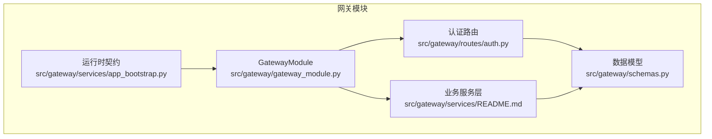
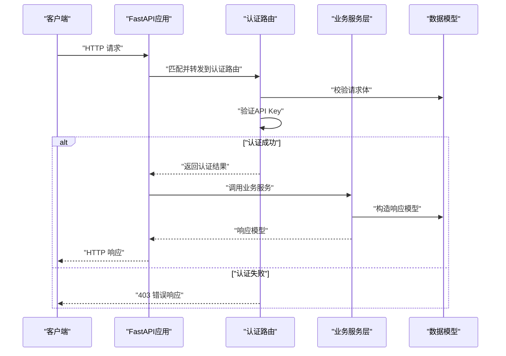
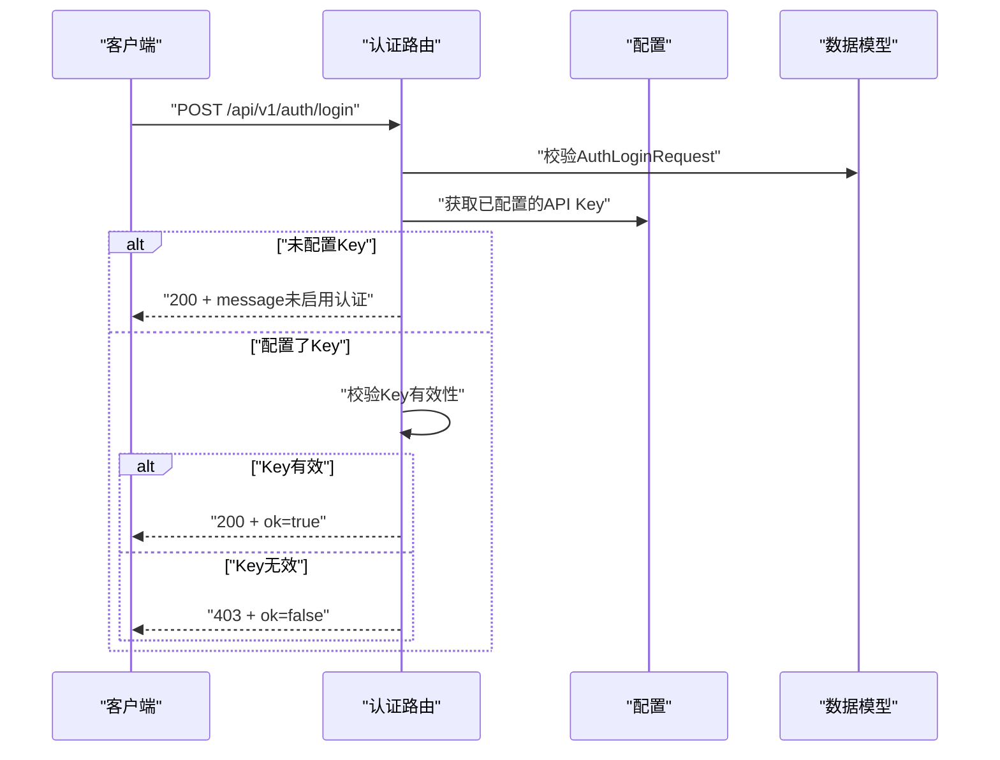
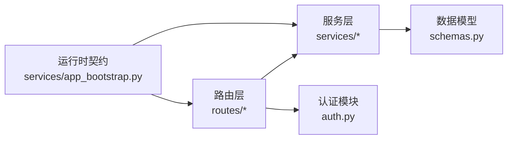

# REST API接口

<cite>
**本文引用的文件**
- [gateway_rest.md](file://docs/api/gateway_rest.md)
- [README.md](file://docs/api/README.md)
- [mcp_tools.md](file://docs/api/mcp_tools.md)
- [auth.py](file://src/gateway/auth.py)
- [routes/auth.py](file://src/gateway/routes/auth.py)
- [schemas.py](file://src/gateway/schemas.py)
- [gateway_module.py](file://src/gateway/gateway_module.py)
- [services/app_bootstrap.py](file://src/gateway/services/app_bootstrap.py)
- [services/README.md](file://src/gateway/services/README.md)
- [test_gateway_session_map_contract.py](file://src/gateway/tests/test_gateway_session_map_contract.py)
</cite>

## 目录
1. [简介](#简介)
2. [项目结构](#项目结构)
3. [核心组件](#核心组件)
4. [架构总览](#架构总览)
5. [详细组件分析](#详细组件分析)
6. [依赖关系分析](#依赖关系分析)
7. [性能考虑](#性能考虑)
8. [故障排查指南](#故障排查指南)
9. [结论](#结论)
10. [附录](#附录)

## 简介
本文件面向LingTu系统的REST API接口，系统性梳理HTTP方法使用规范、URL模式设计、请求/响应模式、认证与授权机制，并结合源码中的路由与服务层实现，给出可操作的端点清单与调用建议。文档同时覆盖状态码约定、错误响应结构、请求头设置、以及Python与JavaScript客户端示例路径指引。

## 项目结构
LingTu的REST API由“网关模块”提供，核心位于src/gateway目录，包含：
- 路由定义：在routes子包中按功能分组注册端点
- 业务服务：在services子包中实现具体业务逻辑，保持路由处理器薄化
- 数据模型与校验：在schemas中定义请求/响应模型
- 认证与授权：在auth与routes/auth中实现
- 运行时能力契约：通过app_bootstrap生成端点契约与响应模型缓存

图表来源
- [gateway_module.py](file://src/gateway/gateway_module.py)
- [routes/auth.py](file://src/gateway/routes/auth.py)
- [schemas.py](file://src/gateway/schemas.py)
- [services/README.md](file://src/gateway/services/README.md)
- [services/app_bootstrap.py](file://src/gateway/services/app_bootstrap.py)

章节来源
- [gateway_module.py](file://src/gateway/gateway_module.py)
- [routes/auth.py](file://src/gateway/routes/auth.py)
- [schemas.py](file://src/gateway/schemas.py)
- [services/README.md](file://src/gateway/services/README.md)
- [services/app_bootstrap.py](file://src/gateway/services/app_bootstrap.py)

## 核心组件
- 网关模块：负责初始化FastAPI应用、注册路由、挂载中间件与认证策略
- 认证路由：提供登录与检查接口，支持基于配置的API Key校验
- 业务服务层：封装具体领域操作，统一输出响应模型
- 数据模型：通过Pydantic模型定义请求/响应结构，自动进行字段校验与序列化
- 运行时契约：预热端点契约与响应模型缓存，提升启动与运行效率

章节来源
- [gateway_module.py](file://src/gateway/gateway_module.py)
- [routes/auth.py](file://src/gateway/routes/auth.py)
- [schemas.py](file://src/gateway/schemas.py)
- [services/README.md](file://src/gateway/services/README.md)
- [services/app_bootstrap.py](file://src/gateway/services/app_bootstrap.py)

## 架构总览
下图展示了从客户端到路由、服务与数据模型的整体交互流程：

图表来源
- [routes/auth.py](file://src/gateway/routes/auth.py)
- [schemas.py](file://src/gateway/schemas.py)
- [gateway_module.py](file://src/gateway/gateway_module.py)

## 详细组件分析

### 认证与授权
- 登录端点
  - 方法与路径：POST /api/v1/auth/login
  - 功能：使用配置的API Key进行认证；若未启用认证，返回提示信息
  - 请求体：包含key字段
  - 响应：成功返回ok与message；失败返回ok=false与message
  - 状态码：200（成功或未启用）、403（无效Key）
- 检查端点
  - 方法与路径：GET /api/v1/auth/check
  - 功能：检查是否需要认证
  - 响应：返回auth_required布尔值
  - 状态码：200

图表来源
- [routes/auth.py](file://src/gateway/routes/auth.py)
- [schemas.py](file://src/gateway/schemas.py)
- [auth.py](file://src/gateway/auth.py)

章节来源
- [routes/auth.py](file://src/gateway/routes/auth.py)
- [auth.py](file://src/gateway/auth.py)
- [schemas.py](file://src/gateway/schemas.py)
- [test_gateway_session_map_contract.py](file://src/gateway/tests/test_gateway_session_map_contract.py)

### URL模式设计与资源命名
- 版本化路径：/api/v1/{resource}/{id?}
- 资源命名：采用小写名词复数形式，如“robots”、“maps”、“tasks”
- 路径参数：使用{id}表示单个资源标识
- 查询参数：用于过滤、排序、分页等场景，如?page=1&limit=20
- 事件流：对于SSE场景，响应类型为text/event-stream

章节来源
- [services/app_bootstrap.py](file://src/gateway/services/app_bootstrap.py)

### 请求/响应模式与数据模型
- 请求体：使用Pydantic模型定义，自动进行字段类型与必填校验
- 响应体：统一以JSON返回，响应模型在schemas中定义
- 错误响应：包含ok、message等通用字段，部分端点返回专用错误模型
- 响应内容类型：application/json；SSE端点为text/event-stream

章节来源
- [schemas.py](file://src/gateway/schemas.py)
- [services/app_bootstrap.py](file://src/gateway/services/app_bootstrap.py)

### 状态码与错误处理
- 200 OK：成功
- 403 Forbidden：认证失败或权限不足
- 其他：根据具体端点定义，参考契约缓存中的status_codes

章节来源
- [services/app_bootstrap.py](file://src/gateway/services/app_bootstrap.py)
- [routes/auth.py](file://src/gateway/routes/auth.py)

### 客户端使用示例
- Python客户端
  - 参考：lingtu_sdk/client.py、lingtu_sdk/async_client.py
  - 示例路径：examples/basic_usage.py、examples/ai_agent.py
- JavaScript客户端
  - 参考：web/src目录下的前端服务与类型定义
  - 示例路径：web/dashboard_server.py（演示后端对接）

章节来源
- [client.py](file://lingtu_sdk/client.py)
- [async_client.py](file://lingtu_sdk/async_client.py)
- [basic_usage.py](file://examples/basic_usage.py)
- [ai_agent.py](file://examples/ai_agent.py)
- [dashboard_server.py](file://web/dashboard_server.py)

## 依赖关系分析
网关模块通过路由层连接到业务服务层，服务层依赖数据模型进行输入输出校验；认证路由依赖配置模块获取API Key；运行时契约通过预热机制缓存端点契约与响应模型。

图表来源
- [routes/auth.py](file://src/gateway/routes/auth.py)
- [schemas.py](file://src/gateway/schemas.py)
- [services/app_bootstrap.py](file://src/gateway/services/app_bootstrap.py)

章节来源
- [routes/auth.py](file://src/gateway/routes/auth.py)
- [schemas.py](file://src/gateway/schemas.py)
- [services/app_bootstrap.py](file://src/gateway/services/app_bootstrap.py)

## 性能考虑
- 预热端点契约与响应模型：通过app_bootstrap预计算并缓存，减少运行时开销
- SSE响应：针对事件流端点，注意客户端缓冲与重连策略
- 请求体校验：在路由层即进行Pydantic校验，避免进入业务层后再报错

章节来源
- [services/app_bootstrap.py](file://src/gateway/services/app_bootstrap.py)

## 故障排查指南
- 认证失败
  - 确认已配置API Key且与请求一致
  - 若未启用认证，登录接口会返回提示信息
- 端点契约不匹配
  - 检查status_codes与response_content_types是否符合预期
- 响应模型校验失败
  - 确认返回数据满足schemas中定义的字段与类型

章节来源
- [routes/auth.py](file://src/gateway/routes/auth.py)
- [services/app_bootstrap.py](file://src/gateway/services/app_bootstrap.py)
- [test_gateway_session_map_contract.py](file://src/gateway/tests/test_gateway_session_map_contract.py)

## 结论
LingTu的REST API以网关模块为核心，通过清晰的路由、薄化的处理器与强类型的响应模型，提供了稳定可靠的接口层。认证机制支持API Key校验，并具备未启用认证时的兼容行为。建议在生产环境中启用认证，并遵循版本化路径与资源命名约定，确保接口的长期可维护性与一致性。

## 附录

### API端点清单与示例路径
- 认证
  - POST /api/v1/auth/login → 参考：[routes/auth.py](file://src/gateway/routes/auth.py)
  - GET /api/v1/auth/check → 参考：[routes/auth.py](file://src/gateway/routes/auth.py)
- 业务端点
  - 参考：docs/api/gateway_rest.md 与 docs/api/mcp_tools.md 获取更全面的端点列表与说明
- 客户端示例
  - Python：lingtu_sdk/client.py、examples/basic_usage.py
  - JavaScript：web/dashboard_server.py

章节来源
- [gateway_rest.md](file://docs/api/gateway_rest.md)
- [mcp_tools.md](file://docs/api/mcp_tools.md)
- [client.py](file://lingtu_sdk/client.py)
- [basic_usage.py](file://examples/basic_usage.py)
- [dashboard_server.py](file://web/dashboard_server.py)