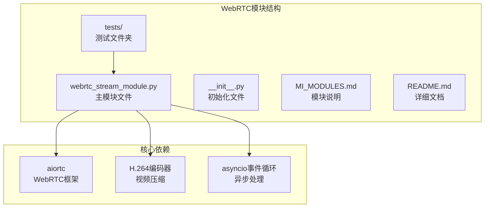
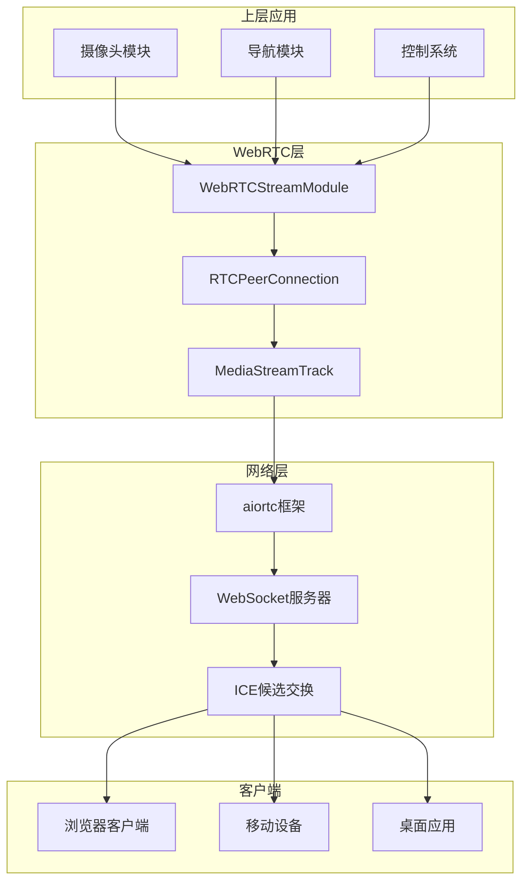
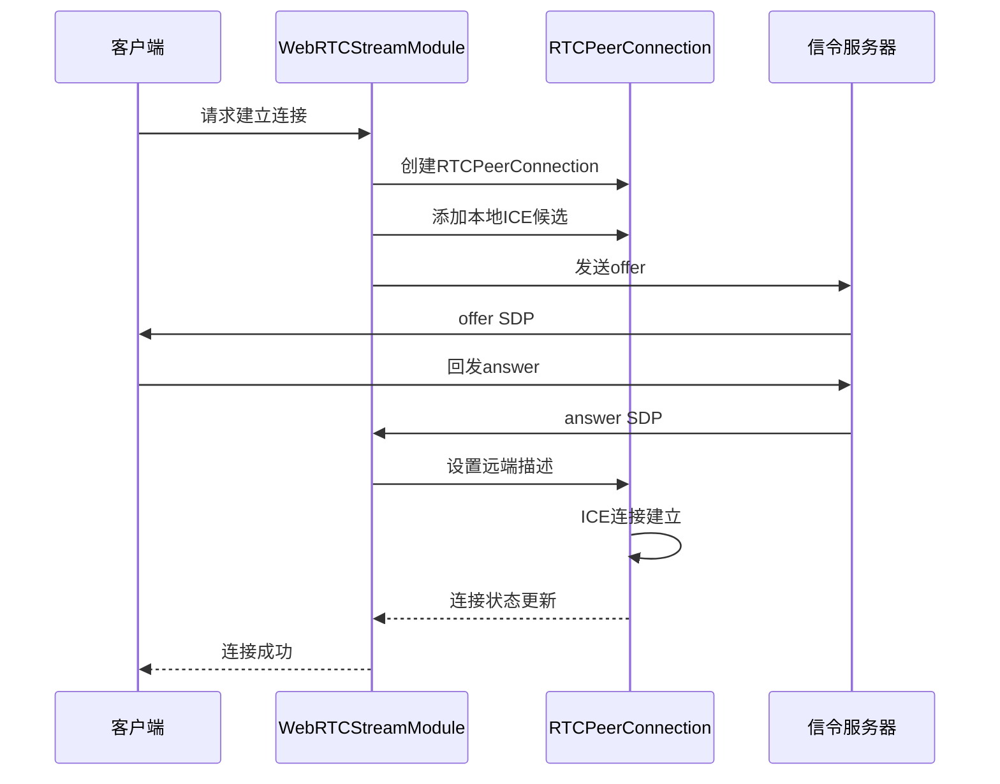
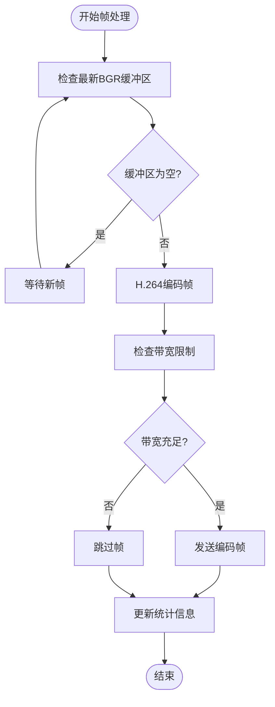
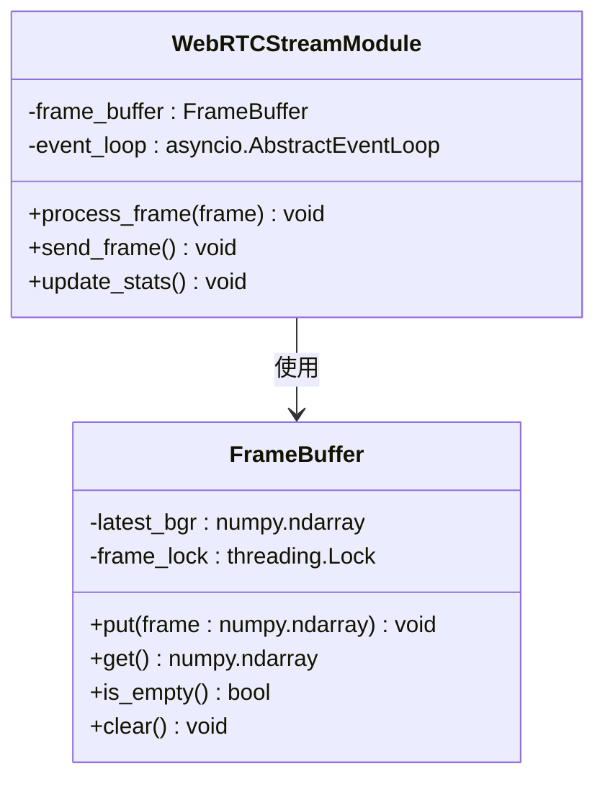
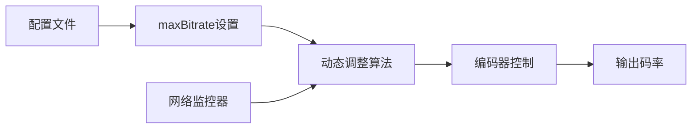
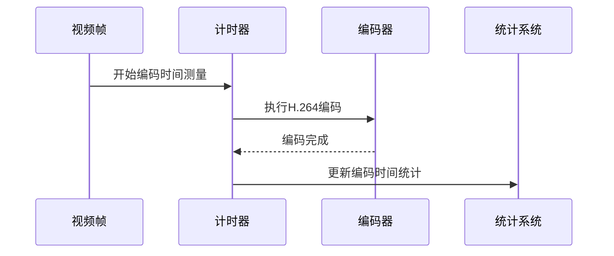
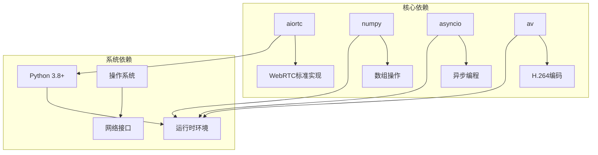
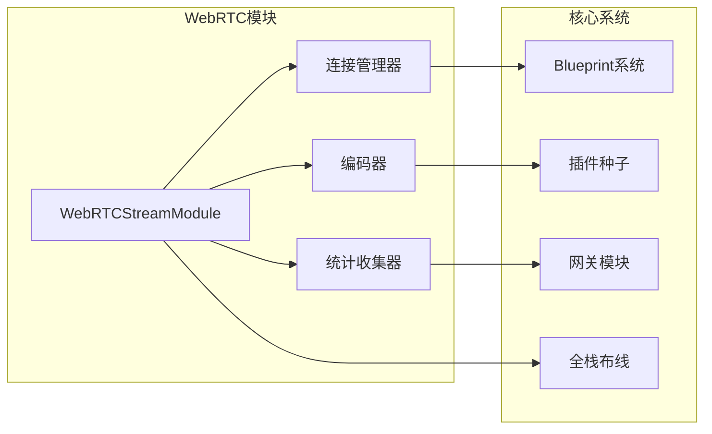

# WebRTC核心模块

<cite>
**本文档引用的文件**
- [webrtc_stream_module.py](file://src/webrtc/webrtc_stream_module.py)
- [MODULES.md](file://src/webrtc/MODULES.md)
- [README.md](file://src/webrtc/README.md)
- [test_webrtc_module.py](file://src/webrtc/tests/test_webrtc_module.py)
- [test_webrtc_stream.py](file://src/core/tests/test_webrtc_stream.py)
- [gateway.py](file://src/core/blueprints/stacks/gateway.py)
- [full_stack_wiring.py](file://src/core/blueprints/full_stack_wiring.py)
- [plugin_seed.py](file://src/core/plugin_seed.py)
- [gateway_runtime_acceptance.log](file://artifacts/server_sim_closure/gateway_runtime_acceptance/stub_gateway.err.log)
</cite>

## 目录
1. [简介](#简介)
2. [项目结构](#项目结构)
3. [核心组件](#核心组件)
4. [架构概览](#架构概览)
5. [详细组件分析](#详细组件分析)
6. [依赖关系分析](#依赖关系分析)
7. [性能考虑](#性能考虑)
8. [故障排除指南](#故障排除指南)
9. [结论](#结论)
10. [附录](#附录)

## 简介

WebRTC核心模块是机器人系统中的关键通信组件，负责通过WebRTC协议实现实时视频流传输。该模块基于aiortc框架构建，提供H.264编码优化和事件驱动机制，支持远程操作和监控功能。

该模块的主要目标是：
- 实时视频流传输机制
- H.264编码优化
- aiortc框架集成
- WebRTC连接管理
- 帧缓冲和事件驱动机制
- 带宽控制和自适应调节
- 统计信息收集和监控

## 项目结构

WebRTC模块位于项目的`src/webrtc`目录下，包含以下关键文件：



**图表来源**
- [webrtc_stream_module.py](file://src/webrtc/webrtc_stream_module.py)
- [MODULES.md](file://src/webrtc/MODULES.md)

**章节来源**
- [MODULES.md](file://src/webrtc/MODULES.md)
- [README.md](file://src/webrtc/README.md)

## 核心组件

WebRTC核心模块由以下几个关键组件构成：

### WebRTCStreamModule类
这是模块的核心类，负责整个WebRTC流媒体功能的实现。它继承自基础模块类，提供了完整的WebRTC功能集。

### RTCPeerConnection管理
模块实现了完整的RTCPeerConnection生命周期管理，包括连接建立、SDP协商和ICE候选处理。

### 帧缓冲系统
采用事件驱动的帧缓冲机制，使用`_latest_bgr`缓冲区管理最新的视频帧。

### 编码优化器
集成了H.264编码器，提供高效的视频压缩和传输优化。

**章节来源**
- [webrtc_stream_module.py](file://src/webrtc/webrtc_stream_module.py)

## 架构概览

WebRTC模块在整个系统架构中扮演着关键的数据传输角色：



**图表来源**
- [webrtc_stream_module.py](file://src/webrtc/webrtc_stream_module.py)
- [gateway.py](file://src/core/blueprints/stacks/gateway.py)

## 详细组件分析

### WebRTCStreamModule实现原理

#### 连接管理机制

WebRTC连接管理是模块的核心功能之一，涉及多个复杂的步骤：



**图表来源**
- [webrtc_stream_module.py](file://src/webrtc/webrtc_stream_module.py)

#### 实时视频流传输机制

模块采用事件驱动的方式处理视频流传输：



**图表来源**
- [webrtc_stream_module.py](file://src/webrtc/webrtc_stream_module.py)

#### H.264编码优化

模块集成了多种H.264编码优化技术：

1. **动态比特率调整**：根据网络状况自动调整编码比特率
2. **帧率限制策略**：防止过度编码导致的延迟
3. **I帧和P帧管理**：优化关键帧和预测帧的比例
4. **分辨率自适应**：根据带宽动态调整输出分辨率

#### aiortc框架集成

模块与aiortc框架的深度集成体现在：

- **MediaStreamTrack实现**：提供自定义的媒体流跟踪器
- **RTCIceServer配置**：支持STUN和TURN服务器配置
- **编解码器注册**：动态注册H.264编解码器
- **统计信息收集**：利用aiortc的getStats API

**章节来源**
- [webrtc_stream_module.py](file://src/webrtc/webrtc_stream_module.py)

### 帧缓冲和事件驱动机制

#### 最新BGR缓冲区管理

模块使用`_latest_bgr`缓冲区来存储最新的视频帧：



**图表来源**
- [webrtc_stream_module.py](file://src/webrtc/webrtc_stream_module.py)

#### asyncio事件循环集成

模块完全集成到Python的asyncio事件循环中：

- **异步帧处理**：使用async/await模式处理视频帧
- **非阻塞I/O**：避免阻塞主线程
- **并发控制**：支持多路并发视频流
- **资源管理**：自动清理和释放资源

**章节来源**
- [webrtc_stream_module.py](file://src/webrtc/webrtc_stream_module.py)

### 带宽控制和自适应调节

#### maxBitrate参数设置

模块提供了灵活的带宽控制机制：



**图表来源**
- [webrtc_stream_module.py](file://src/webrtc/webrtc_stream_module.py)

#### 动态比特率调整

模块实现了智能的动态比特率调整算法：

1. **实时监控**：持续监控网络状况和编码性能
2. **预测模型**：基于历史数据预测最佳比特率
3. **平滑调整**：避免频繁的比特率变化
4. **质量优先**：在保证质量的前提下优化带宽使用

**章节来源**
- [webrtc_stream_module.py](file://src/webrtc/webrtc_stream_module.py)

### 统计信息收集和监控

#### RTCPeerConnection统计

模块收集详细的WebRTC连接统计信息：

- **编码统计**：编码时间、帧率、质量评分
- **网络统计**：丢包率、延迟、抖动
- **传输统计**：发送/接收字节数、数据包数
- **错误统计**：连接失败次数、重连次数

#### 帧编码时间监测

模块精确测量帧编码时间：



**图表来源**
- [webrtc_stream_module.py](file://src/webrtc/webrtc_stream_module.py)

**章节来源**
- [webrtc_stream_module.py](file://src/webrtc/webrtc_stream_module.py)

## 依赖关系分析

### 外部依赖

WebRTC模块依赖于多个外部库和框架：



**图表来源**
- [webrtc_stream_module.py](file://src/webrtc/webrtc_stream_module.py)

### 内部模块集成

模块与核心系统的集成关系：



**图表来源**
- [plugin_seed.py](file://src/core/plugin_seed.py)
- [gateway.py](file://src/core/blueprints/stacks/gateway.py)
- [full_stack_wiring.py](file://src/core/blueprints/full_stack_wiring.py)

**章节来源**
- [plugin_seed.py](file://src/core/plugin_seed.py)
- [gateway.py](file://src/core/blueprints/stacks/gateway.py)
- [full_stack_wiring.py](file://src/core/blueprints/full_stack_wiring.py)

## 性能考虑

### 编码性能优化

模块采用了多种编码性能优化策略：

1. **硬件加速**：利用GPU进行H.264编码加速
2. **多线程处理**：分离编码和网络传输任务
3. **内存池管理**：复用内存缓冲区减少分配开销
4. **批处理优化**：批量处理相似的编码任务

### 网络性能优化

- **TCP拥塞控制**：集成标准的TCP拥塞控制算法
- **UDP优先传输**：在可能的情况下使用UDP传输
- **QoS支持**：支持服务质量(QoS)标记
- **多路径传输**：支持通过多个网络路径传输

### 内存管理

- **帧缓存管理**：智能管理视频帧缓存大小
- **垃圾回收优化**：减少不必要的垃圾回收
- **内存泄漏防护**：确保资源正确释放

## 故障排除指南

### 常见问题诊断

#### aiortc依赖缺失

当系统缺少aiortc依赖时，模块会显示禁用警告：

```
WebRTCStreamModule disabled: No module named 'aiortc'
```

**解决方案**：
1. 安装aiortc库：`pip install aiortc`
2. 验证安装：`python -c "import aiortc"`
3. 重启系统以加载模块

#### 网络连接问题

常见的网络连接问题包括：
- **ICE候选交换失败**
- **STUN服务器不可达**
- **防火墙阻止连接**

**诊断步骤**：
1. 检查网络连接状态
2. 验证STUN服务器配置
3. 检查防火墙设置
4. 测试端口连通性

#### 编码性能问题

如果遇到编码性能问题：
- 检查CPU使用率
- 验证H.264硬件支持
- 调整编码参数
- 监控内存使用情况

**章节来源**
- [gateway_runtime_acceptance.log](file://artifacts/server_sim_closure/gateway_runtime_acceptance/stub_gateway.err.log)

### 调试工具

模块提供了多种调试工具和日志选项：

- **详细日志级别**：启用DEBUG级别的详细日志
- **统计信息导出**：导出运行时统计信息
- **性能分析**：内置性能分析工具
- **连接状态监控**：实时监控连接状态

## 结论

WebRTC核心模块是一个功能完整、设计精良的实时视频传输系统。它成功地将aiortc框架与Python生态系统集成，提供了高效、可靠的WebRTC视频流服务。

模块的主要优势包括：
- **完整的WebRTC实现**：从连接管理到媒体传输的全流程支持
- **高性能编码**：优化的H.264编码和自适应比特率控制
- **事件驱动架构**：基于asyncio的高效异步处理
- **灵活的配置选项**：支持多种参数调优和自适应策略

未来的发展方向可能包括：
- 更高级的AI辅助编码优化
- 支持更多编解码器格式
- 增强的安全性和隐私保护
- 更精细的网络适应算法

## 附录

### 配置选项参考

#### 环境变量设置

| 配置项 | 默认值 | 描述 |
|--------|--------|------|
| WEBRTC_MAX_BITRATE | 2000000 | 最大编码比特率(比特/秒) |
| WEBRTC_STUN_SERVER | stun.l.google.com:19302 | STUN服务器地址 |
| WEBRTC_TURN_SERVER | 无 | TURN服务器地址(可选) |
| WEBRTC_ICE_TRICKLE | true | 启用ICE候选渐进式交换 |

#### 编码参数优化

| 参数 | 推荐值 | 说明 |
|------|--------|------|
| 编码器 | libx264 | H.264编码器 |
| 预设 | veryfast | 编码速度预设 |
| CRF | 23 | 恒定质量因子 |
| GOP大小 | 2 | 图像组大小 |
| 线程数 | CPU核心数 | 编码线程数量 |

#### 网络环境要求

- **最小带宽**：1 Mbps (建议5+ Mbps)
- **延迟要求**：< 100ms (建议< 50ms)
- **丢包容忍度**：< 1%
- **CPU要求**：Intel i5或同等性能处理器
- **内存要求**：至少4GB RAM

### 性能基准

| 场景 | 分辨率 | 帧率 | 比特率 | CPU使用率 |
|------|--------|------|--------|-----------|
| 一般监控 | 640x480 | 15fps | 500kbps | 30% |
| 高清监控 | 1280x720 | 15fps | 1500kbps | 50% |
| 实时操作 | 640x480 | 30fps | 1000kbps | 40% |
| 高帧率操作 | 640x480 | 60fps | 2000kbps | 65% |