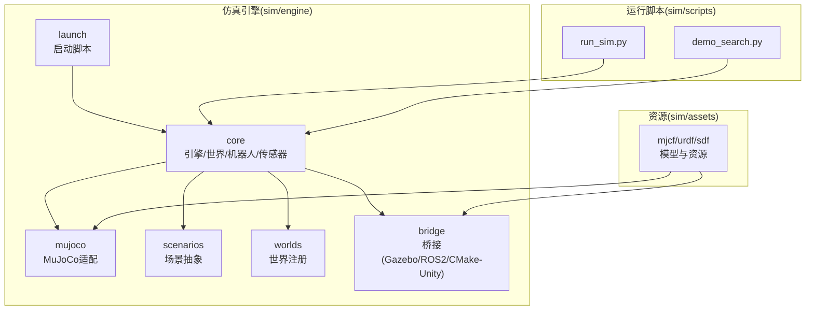
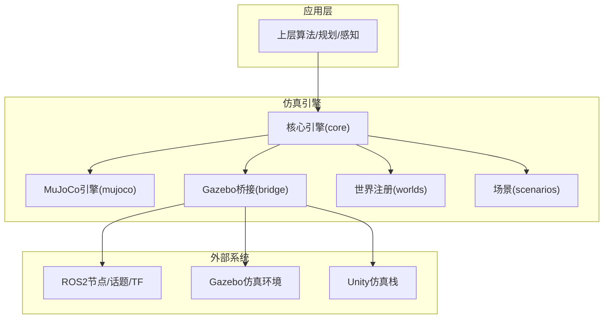
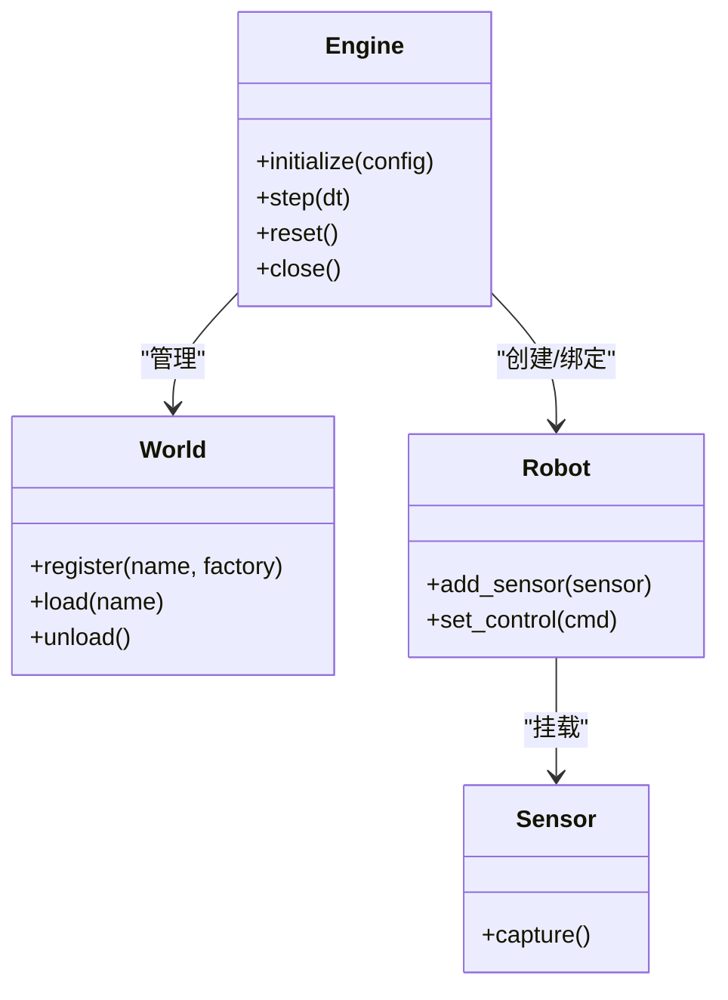
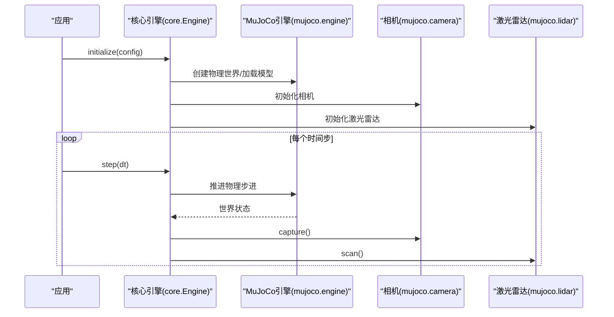
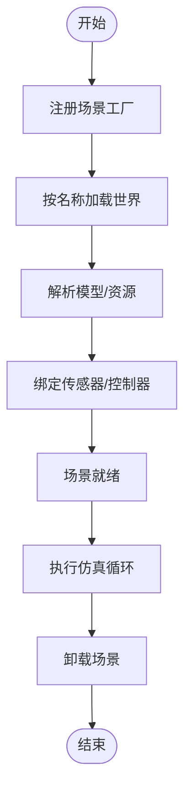
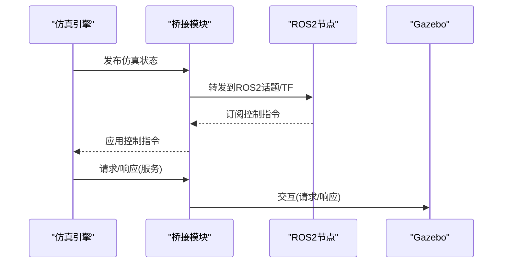
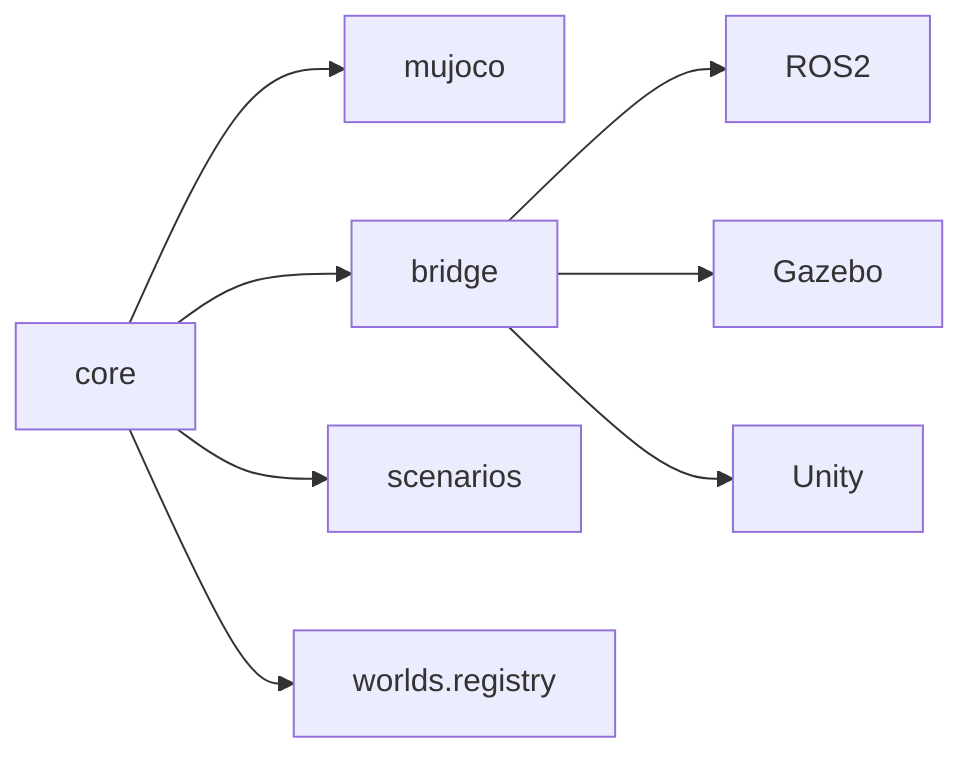

# 仿真引擎

<cite>
**本文引用的文件**
- [sim/engine/__init__.py](file://sim/engine/__init__.py)
- [sim/engine/cli.py](file://sim/engine/cli.py)
- [sim/engine/core/engine.py](file://sim/engine/core/engine.py)
- [sim/engine/core/world.py](file://sim/engine/core/world.py)
- [sim/engine/core/robot.py](file://sim/engine/core/robot.py)
- [sim/engine/core/robot_model.py](file://sim/engine/core/robot_model.py)
- [sim/engine/core/sensor.py](file://sim/engine/core/sensor.py)
- [sim/engine/mujoco/engine.py](file://sim/engine/mujoco/engine.py)
- [sim/engine/mujoco/camera.py](file://sim/engine/mujoco/camera.py)
- [sim/engine/mujoco/lidar.py](file://sim/engine/mujoco/lidar.py)
- [sim/engine/mujoco/robot_controller.py](file://sim/engine/mujoco/robot_controller.py)
- [sim/engine/scenarios/base.py](file://sim/engine/scenarios/base.py)
- [sim/engine/scenarios/navigation.py](file://sim/engine/scenarios/navigation.py)
- [sim/engine/scenarios/semantic_nav.py](file://sim/engine/scenarios/semantic_nav.py)
- [sim/engine/worlds/registry.py](file://sim/engine/worlds/registry.py)
- [sim/engine/bridge/gazebo_bridge.py](file://sim/engine/bridge/gazebo_bridge.py)
- [sim/engine/bridge/ros2_bridge.py](file://sim/engine/bridge/ros2_bridge.py)
- [sim/engine/bridge/cmu_unity_lingtu_adapter.py](file://sim/engine/bridge/cmu_unity_lingtu_adapter.py)
- [sim/engine/bridge/gazebo_runtime_adapter.py](file://sim/engine/bridge/gazebo_runtime_adapter.py)
- [sim/engine/bridge/gazebo_cmd_vel_adapter.py](file://sim/engine/bridge/gazebo_cmd_vel_adapter.py)
- [sim/launch/sim.launch.py](file://sim/launch/sim.launch.py)
- [sim/launch/sim_full.sh](file://sim/launch/sim_full.sh)
- [sim/planning/sim_navigation.launch.py](file://sim/planning/sim_navigation.launch.py)
- [sim/assets/mjcf/thunder_v3_mujoco.xml](file://sim/assets/mjcf/thunder_v3_mujoco.xml)
- [sim/assets/urdf/thunder_v3.urdf](file://sim/assets/urdf/thunder_v3.urdf)
- [sim/assets/sdf/thunder_gazebo_proxy.sdf](file://sim/assets/sdf/thunder_gazebo_proxy.sdf)
- [sim/robots/thunder.urdf](file://sim/robots/thunder.urdf)
- [sim/scripts/run_sim.py](file://sim/scripts/run_sim.py)
- [sim/scripts/demo_search.py](file://sim/scripts/demo_search.py)
- [sim/scripts/gazebo_nav_loop_smoke.py](file://sim/scripts/gazebo_nav_loop_smoke.py)
- [sim/scripts/mujoco_fastlio2_live_gate.py](file://sim/scripts/mujoco_fastlio2_live_gate.py)
- [sim/scripts/cmu_unity_lingtu_stack.py](file://sim/scripts/cmu_unity_lingtu_stack.py)
- [sim/scripts/cmu_unity_runtime_gate.py](file://sim/scripts/cmu_unity_runtime_gate.py)
- [sim/scripts/cmu_unity_sim_gate.py](file://sim/scripts/cmu_unity_sim_gate.py)
- [sim/tests/test_cmu_unity_lingtu_adapter.py](file://sim/tests/test_cmu_unity_lingtu_adapter.py)
- [sim/tests/test_gazebo_runtime_gate.py](file://sim/tests/test_gazebo_runtime_gate.py)
- [sim/tests/test_mujoco_mid360_pattern.py](file://sim/tests/test_mujoco_mid360_pattern.py)
- [sim/validation/full_system.py](file://sim/validation/full_system.py)
- [src/core/runtime_switch.py](file://src/core/runtime_switch.py)
- [src/core/runtime_validation_gates.py](file://src/core/runtime_validation_gates.py)
- [src/core/backend_status.py](file://src/core/backend_status.py)
- [src/core/registry.py](file://src/core/registry.py)
- [src/core/config.py](file://src/core/config.py)
- [src/core/module.py](file://src/core/module.py)
- [src/core/native_factories.py](file://src/core/native_factories.py)
- [src/core/runtime_evidence.py](file://src/core/runtime_evidence.py)
- [src/core/stream.py](file://src/core/stream.py)
- [src/core/worker.py](file://src/core/worker.py)
- [src/core/worker_manager.py](file://src/core/worker_manager.py)
- [src/core/dynamic_filter.py](file://src/core/dynamic_filter.py)
- [src/core/efficiency_status.py](file://src/core/efficiency_status.py)
- [src/core/swap_manager.py](file://src/core/swap_manager.py)
- [src/core/service_manager.py](file://src/core/service_manager.py)
- [src/core/rpc_client.py](file://src/core/rpc_client.py)
- [src/core/remote_ports.py](file://src/core/remote_ports.py)
- [src/core/introspection/__init__.py](file://src/core/introspection/__init__.py)
- [src/core/transport/__init__.py](file://src/core/transport/__init__.py)
- [src/core/blueprints/__init__.py](file://src/core/blueprints/__init__.py)
- [src/core/contracts/__init__.py](file://src/core/contracts/__init__.py)
- [src/core/utils/__init__.py](file://src/core/utils/__init__.py)
- [src/core/msgs/__init__.py](file://src/core/msgs/__init__.py)
- [src/core/devices/__init__.py](file://src/core/devices/__init__.py)
- [src/core/resource_monitor/__init__.py](file://src/core/resource_monitor/__init__.py)
- [src/core/spec/__init__.py](file://src/core/spec/__init__.py)
- [src/core/yaml_helpers.py](file://src/core/yaml_helpers.py)
- [src/core/config_loader.py](file://src/core/config_loader.py)
- [src/core/coordinator.py](file://src/core/coordinator.py)
- [src/core/algorithm_gates.py](file://src/core/algorithm_gates.py)
- [src/core/encoder_protocol.py](file://src/core/encoder_protocol.py)
- [src/core/gateway_runtime_acceptance.py](file://src/core/gateway_runtime_acceptance.py)
- [src/core/inspection_acceptance.py](file://src/core/inspection_acceptance.py)
- [src/core/runtime_policy.py](file://src/core/runtime_policy.py)
- [src/core/clock.py](file://src/core/clock.py)
- [src/core/dds.py](file://src/core/dds.py)
- [src/core/native_install.py](file://src/core/native_install.py)
- [src/core/rerun_module.py](file://src/core/rerun_module.py)
- [src/core/ros2_context.py](file://src/core/ros2_context.py)
- [src/core/runtime_interface.py](file://src/core/runtime_interface.py)
- [src/core/same_source_map_artifacts.py](file://src/core/same_source_map_artifacts.py)
- [src/core/stream.py](file://src/core/stream.py)
- [src/core/swap_manager.py](file://src/core/swap_manager.py)
- [src/core/service_manager.py](file://src/core/service_manager.py)
- [src/core/rpc_client.py](file://src/core/rpc_client.py)
- [src/core/remote_ports.py](file://src/core/remote_ports.py)
- [src/core/introspection/__init__.py](file://src/core/introspection/__init__.py)
- [src/core/transport/__init__.py](file://src/core/transport/__init__.py)
- [src/core/blueprints/__init__.py](file://src/core/blueprints/__init__.py)
- [src/core/contracts/__init__.py](file://src/core/contracts/__init__.py)
- [src/core/utils/__init__.py](file://src/core/utils/__init__.py)
- [src/core/msgs/__init__.py](file://src/core/msgs/__init__.py)
- [src/core/devices/__init__.py](file://src/core/devices/__init__.py)
- [src/core/resource_monitor/__init__.py](file://src/core/resource_monitor/__init__.py)
- [src/core/spec/__init__.py](file://src/core/spec/__init__.py)
- [src/core/yaml_helpers.py](file://src/core/yaml_helpers.py)
- [src/core/config_loader.py](file://src/core/config_loader.py)
- [src/core/coordinator.py](file://src/core/coordinator.py)
- [src/core/algorithm_gates.py](file://src/core/algorithm_gates.py)
- [src/core/encoder_protocol.py](file://src/core/encoder_protocol.py)
- [src/core/gateway_runtime_acceptance.py](file://src/core/gateway_runtime_acceptance.py)
- [src/core/inspection_acceptance.py](file://src/core/inspection_acceptance.py)
- [src/core/runtime_policy.py](file://src/core/runtime_policy.py)
- [src/core/clock.py](file://src/core/clock.py)
- [src/core/dds.py](file://src/core/dds.py)
- [src/core/native_install.py](file://src/core/native_install.py)
- [src/core/rerun_module.py](file://src/core/rerun_module.py)
- [src/core/ros2_context.py](file://src/core/ros2_context.py)
- [src/core/runtime_interface.py](file://src/core/runtime_interface.py)
- [src/core/same_source_map_artifacts.py](file://src/core/same_source_map_artifacts.py)
</cite>

## 目录
1. [引言](#引言)
2. [项目结构](#项目结构)
3. [核心组件](#核心组件)
4. [架构总览](#架构总览)
5. [详细组件分析](#详细组件分析)
6. [依赖关系分析](#依赖关系分析)
7. [性能考虑](#性能考虑)
8. [故障排查指南](#故障排查指南)
9. [结论](#结论)
10. [附录](#附录)

## 引言
本技术文档系统性梳理 LingTu 仿真引擎的整体架构与实现细节，覆盖核心引擎模块、MuJoCo 物理引擎集成、Gazebo 仿真环境、桥接模块（ROS2/Gazebo/CMake-Unity）等关键子系统。文档重点阐述仿真引擎的初始化流程、世界管理机制、物理模拟参数配置、场景管理、与主系统的集成方式（数据交换、状态同步、控制指令传递），并提供配置指南与性能优化建议，帮助开发者在 MuJoCo 高精度物理与 Gazebo ROS2 生态之间做出合适选择。

## 项目结构
仿真引擎位于 sim/ 目录下，采用“功能域+层次化”的组织方式：
- engine：仿真内核与引擎适配层
  - core：通用仿真抽象（引擎、世界、机器人、传感器）
  - mujoco：MuJoCo 物理引擎适配（引擎、相机、激光雷达、机器人控制）
  - scenarios：场景抽象与导航/语义导航场景
  - worlds：世界注册表
  - bridge：多平台桥接（Gazebo、ROS2、CMU Unity）
  - launch：仿真启动脚本与配置
- assets：模型与资源（MJCF/URDF/SDF 等）
- scripts：端到端运行脚本与验证脚本
- tests：单元测试与集成测试
- validation：全链路验证

图表来源
- [sim/engine/__init__.py](file://sim/engine/__init__.py)
- [sim/engine/core/engine.py](file://sim/engine/core/engine.py)
- [sim/engine/mujoco/engine.py](file://sim/engine/mujoco/engine.py)
- [sim/engine/scenarios/base.py](file://sim/engine/scenarios/base.py)
- [sim/engine/worlds/registry.py](file://sim/engine/worlds/registry.py)
- [sim/engine/bridge/gazebo_bridge.py](file://sim/engine/bridge/gazebo_bridge.py)
- [sim/launch/sim.launch.py](file://sim/launch/sim.launch.py)
- [sim/assets/mjcf/thunder_v3_mujoco.xml](file://sim/assets/mjcf/thunder_v3_mujoco.xml)
- [sim/assets/urdf/thunder_v3.urdf](file://sim/assets/urdf/thunder_v3.urdf)
- [sim/assets/sdf/thunder_gazebo_proxy.sdf](file://sim/assets/sdf/thunder_gazebo_proxy.sdf)
- [sim/scripts/run_sim.py](file://sim/scripts/run_sim.py)
- [sim/scripts/demo_search.py](file://sim/scripts/demo_search.py)

章节来源
- [sim/engine/__init__.py](file://sim/engine/__init__.py)
- [sim/launch/sim.launch.py](file://sim/launch/sim.launch.py)

## 核心组件
- 引擎内核（core）
  - 引擎抽象：统一接口定义（初始化、步进、重置、关闭）
  - 世界管理：世界注册、加载、卸载、查询
  - 机器人建模：机器人实体、关节、动力学属性
  - 传感器抽象：相机、激光雷达等感知设备
- MuJoCo 适配（mujoco）
  - 物理引擎封装：基于 MJX/Mujoco 的高精度物理模拟
  - 传感器适配：相机、激光雷达驱动
  - 控制器：关节/力矩/速度控制
- 场景抽象（scenarios）
  - 基础场景：导航、语义导航等场景模板
- 世界注册（worlds.registry）
  - 场景注册与工厂模式，支持按名称加载
- 桥接模块（bridge）
  - Gazebo 桥接：与 Gazebo 仿真环境交互
  - ROS2 桥接：与 ROS2 节点/话题/TF 同步
  - CMU Unity 适配：与 Unity 仿真栈对接
- 启动与运行（launch/scripts）
  - 启动脚本：sim.launch.py、sim_full.sh
  - 运行脚本：run_sim.py、demo_search.py 等

章节来源
- [sim/engine/core/engine.py](file://sim/engine/core/engine.py)
- [sim/engine/core/world.py](file://sim/engine/core/world.py)
- [sim/engine/core/robot.py](file://sim/engine/core/robot.py)
- [sim/engine/core/robot_model.py](file://sim/engine/core/robot_model.py)
- [sim/engine/core/sensor.py](file://sim/engine/core/sensor.py)
- [sim/engine/mujoco/engine.py](file://sim/engine/mujoco/engine.py)
- [sim/engine/mujoco/camera.py](file://sim/engine/mujoco/camera.py)
- [sim/engine/mujoco/lidar.py](file://sim/engine/mujoco/lidar.py)
- [sim/engine/mujoco/robot_controller.py](file://sim/engine/mujoco/robot_controller.py)
- [sim/engine/scenarios/base.py](file://sim/engine/scenarios/base.py)
- [sim/engine/scenarios/navigation.py](file://sim/engine/scenarios/navigation.py)
- [sim/engine/scenarios/semantic_nav.py](file://sim/engine/scenarios/semantic_nav.py)
- [sim/engine/worlds/registry.py](file://sim/engine/worlds/registry.py)
- [sim/engine/bridge/gazebo_bridge.py](file://sim/engine/bridge/gazebo_bridge.py)
- [sim/engine/bridge/ros2_bridge.py](file://sim/engine/bridge/ros2_bridge.py)
- [sim/engine/bridge/cmu_unity_lingtu_adapter.py](file://sim/engine/bridge/cmu_unity_lingtu_adapter.py)
- [sim/launch/sim.launch.py](file://sim/launch/sim.launch.py)
- [sim/scripts/run_sim.py](file://sim/scripts/run_sim.py)

## 架构总览
仿真引擎通过“内核 + 引擎适配 + 场景 + 桥接”的分层架构实现：
- 内核层提供统一的仿真抽象，屏蔽底层物理引擎差异
- 引擎适配层针对 MuJoCo/Gazebo 提供具体实现
- 场景层定义任务场景与评估指标
- 桥接层负责与外部系统（ROS2、Gazebo、Unity）进行数据交换与状态同步

图表来源
- [sim/engine/core/engine.py](file://sim/engine/core/engine.py)
- [sim/engine/mujoco/engine.py](file://sim/engine/mujoco/engine.py)
- [sim/engine/worlds/registry.py](file://sim/engine/worlds/registry.py)
- [sim/engine/bridge/gazebo_bridge.py](file://sim/engine/bridge/gazebo_bridge.py)
- [sim/engine/bridge/ros2_bridge.py](file://sim/engine/bridge/ros2_bridge.py)
- [sim/engine/bridge/cmu_unity_lingtu_adapter.py](file://sim/engine/bridge/cmu_unity_lingtu_adapter.py)

## 详细组件分析

### 引擎内核（core）
- 引擎抽象
  - 初始化：加载世界、创建机器人、绑定传感器
  - 步进：推进物理时间步长，更新状态
  - 重置：恢复初始状态
  - 关闭：释放资源
- 世界管理
  - 注册：通过注册表注册场景工厂
  - 加载：按名称加载世界资源（MJCF/URDF/SDF）
  - 卸载：清理世界对象
- 机器人建模
  - 关节/自由度/质量/惯性等属性
  - 传感器挂载点与坐标系
- 传感器抽象
  - 相机：内参、畸变、分辨率、帧率
  - 激光雷达：视场角、采样数、距离范围

图表来源
- [sim/engine/core/engine.py](file://sim/engine/core/engine.py)
- [sim/engine/core/world.py](file://sim/engine/core/world.py)
- [sim/engine/core/robot.py](file://sim/engine/core/robot.py)
- [sim/engine/core/sensor.py](file://sim/engine/core/sensor.py)

章节来源
- [sim/engine/core/engine.py](file://sim/engine/core/engine.py)
- [sim/engine/core/world.py](file://sim/engine/core/world.py)
- [sim/engine/core/robot.py](file://sim/engine/core/robot.py)
- [sim/engine/core/robot_model.py](file://sim/engine/core/robot_model.py)
- [sim/engine/core/sensor.py](file://sim/engine/core/sensor.py)

### MuJoCo 引擎适配（mujoco）
- 物理引擎封装
  - 基于 MJX/Mujoco 的高精度物理模拟
  - 支持刚体动力学、约束、摩擦、接触
- 传感器适配
  - 相机：基于 OpenGL 渲染管线，支持多相机
  - 激光雷达：基于射线投射，支持多线束
- 控制器
  - 关节级 PD 控制、力矩控制、速度控制
  - 与上层控制器解耦，便于替换

图表来源
- [sim/engine/core/engine.py](file://sim/engine/core/engine.py)
- [sim/engine/mujoco/engine.py](file://sim/engine/mujoco/engine.py)
- [sim/engine/mujoco/camera.py](file://sim/engine/mujoco/camera.py)
- [sim/engine/mujoco/lidar.py](file://sim/engine/mujoco/lidar.py)

章节来源
- [sim/engine/mujoco/engine.py](file://sim/engine/mujoco/engine.py)
- [sim/engine/mujoco/camera.py](file://sim/engine/mujoco/camera.py)
- [sim/engine/mujoco/lidar.py](file://sim/engine/mujoco/lidar.py)
- [sim/engine/mujoco/robot_controller.py](file://sim/engine/mujoco/robot_controller.py)
- [sim/assets/mjcf/thunder_v3_mujoco.xml](file://sim/assets/mjcf/thunder_v3_mujoco.xml)

### 场景管理（scenarios/worlds）
- 场景注册
  - 通过注册表注册场景工厂，支持按名称加载
- 场景类型
  - 导航场景：走廊、房间、多楼层
  - 语义导航场景：结合语义地图的任务场景
- 世界加载
  - 支持 URDF/MJCF/SDF 等格式
  - 自动解析模型、材质、碰撞几何

图表来源
- [sim/engine/worlds/registry.py](file://sim/engine/worlds/registry.py)
- [sim/engine/scenarios/base.py](file://sim/engine/scenarios/base.py)
- [sim/engine/scenarios/navigation.py](file://sim/engine/scenarios/navigation.py)
- [sim/engine/scenarios/semantic_nav.py](file://sim/engine/scenarios/semantic_nav.py)
- [sim/assets/urdf/thunder_v3.urdf](file://sim/assets/urdf/thunder_v3.urdf)
- [sim/assets/sdf/thunder_gazebo_proxy.sdf](file://sim/assets/sdf/thunder_gazebo_proxy.sdf)

章节来源
- [sim/engine/worlds/registry.py](file://sim/engine/worlds/registry.py)
- [sim/engine/scenarios/base.py](file://sim/engine/scenarios/base.py)
- [sim/engine/scenarios/navigation.py](file://sim/engine/scenarios/navigation.py)
- [sim/engine/scenarios/semantic_nav.py](file://sim/engine/scenarios/semantic_nav.py)

### 桥接模块（bridge）
- Gazebo 桥接
  - 与 Gazebo 仿真环境交互，发布/订阅机器人状态与命令
  - 支持 TF、话题、服务
- ROS2 桥接
  - 将仿真状态映射到 ROS2 话题，如 odometry、pointcloud、image
  - 支持 TF 广播
- CMU Unity 适配
  - 与 Unity 仿真栈对接，支持实时数据交换与状态同步

图表来源
- [sim/engine/bridge/gazebo_bridge.py](file://sim/engine/bridge/gazebo_bridge.py)
- [sim/engine/bridge/ros2_bridge.py](file://sim/engine/bridge/ros2_bridge.py)
- [sim/engine/bridge/cmu_unity_lingtu_adapter.py](file://sim/engine/bridge/cmu_unity_lingtu_adapter.py)
- [sim/engine/bridge/gazebo_runtime_adapter.py](file://sim/engine/bridge/gazebo_runtime_adapter.py)
- [sim/engine/bridge/gazebo_cmd_vel_adapter.py](file://sim/engine/bridge/gazebo_cmd_vel_adapter.py)

章节来源
- [sim/engine/bridge/gazebo_bridge.py](file://sim/engine/bridge/gazebo_bridge.py)
- [sim/engine/bridge/ros2_bridge.py](file://sim/engine/bridge/ros2_bridge.py)
- [sim/engine/bridge/cmu_unity_lingtu_adapter.py](file://sim/engine/bridge/cmu_unity_lingtu_adapter.py)
- [sim/engine/bridge/gazebo_runtime_adapter.py](file://sim/engine/bridge/gazebo_runtime_adapter.py)
- [sim/engine/bridge/gazebo_cmd_vel_adapter.py](file://sim/engine/bridge/gazebo_cmd_vel_adapter.py)

### 启动与运行（launch/scripts）
- 启动脚本
  - sim.launch.py：启动仿真与桥接
  - sim_full.sh：完整仿真链路启动
- 运行脚本
  - run_sim.py：通用仿真入口
  - demo_search.py：演示脚本
  - gazebo_nav_loop_smoke.py：Gazebo 导航冒烟测试
  - mujoco_fastlio2_live_gate.py：MuJoCo + FastLIO2 实时验证
  - cmu_unity_lingtu_stack.py：CMU Unity 仿真栈运行
  - cmu_unity_runtime_gate.py / cmu_unity_sim_gate.py：运行/仿真门禁测试

章节来源
- [sim/launch/sim.launch.py](file://sim/launch/sim.launch.py)
- [sim/launch/sim_full.sh](file://sim/launch/sim_full.sh)
- [sim/scripts/run_sim.py](file://sim/scripts/run_sim.py)
- [sim/scripts/demo_search.py](file://sim/scripts/demo_search.py)
- [sim/scripts/gazebo_nav_loop_smoke.py](file://sim/scripts/gazebo_nav_loop_smoke.py)
- [sim/scripts/mujoco_fastlio2_live_gate.py](file://sim/scripts/mujoco_fastlio2_live_gate.py)
- [sim/scripts/cmu_unity_lingtu_stack.py](file://sim/scripts/cmu_unity_lingtu_stack.py)
- [sim/scripts/cmu_unity_runtime_gate.py](file://sim/scripts/cmu_unity_runtime_gate.py)
- [sim/scripts/cmu_unity_sim_gate.py](file://sim/scripts/cmu_unity_sim_gate.py)

## 依赖关系分析
- 组件耦合
  - core 对 mujoco 与 bridge 为弱耦合，通过抽象接口隔离
  - scenarios 依赖 core 的世界/机器人抽象
  - bridge 依赖 ROS2/Gazebo/Unity 的外部系统
- 外部依赖
  - MuJoCo/MJX：高精度物理引擎
  - ROS2：消息/TF/服务
  - Gazebo：仿真环境与可视化
  - Unity：CMU 仿真栈
- 可能的循环依赖
  - 通过接口与工厂模式避免直接循环依赖

图表来源
- [sim/engine/core/engine.py](file://sim/engine/core/engine.py)
- [sim/engine/mujoco/engine.py](file://sim/engine/mujoco/engine.py)
- [sim/engine/bridge/gazebo_bridge.py](file://sim/engine/bridge/gazebo_bridge.py)
- [sim/engine/bridge/ros2_bridge.py](file://sim/engine/bridge/ros2_bridge.py)
- [sim/engine/bridge/cmu_unity_lingtu_adapter.py](file://sim/engine/bridge/cmu_unity_lingtu_adapter.py)
- [sim/engine/worlds/registry.py](file://sim/engine/worlds/registry.py)

章节来源
- [sim/engine/core/engine.py](file://sim/engine/core/engine.py)
- [sim/engine/mujoco/engine.py](file://sim/engine/mujoco/engine.py)
- [sim/engine/bridge/gazebo_bridge.py](file://sim/engine/bridge/gazebo_bridge.py)
- [sim/engine/bridge/ros2_bridge.py](file://sim/engine/bridge/ros2_bridge.py)
- [sim/engine/bridge/cmu_unity_lingtu_adapter.py](file://sim/engine/bridge/cmu_unity_lingtu_adapter.py)
- [sim/engine/worlds/registry.py](file://sim/engine/worlds/registry.py)

## 性能考虑
- 物理引擎选择
  - MuJoCo：高精度、实时性好，适合对物理一致性要求高的场景；注意 CPU/GPU 资源占用
  - Gazebo：生态完善、插件丰富，适合与 ROS2 集成；注意仿真延迟与资源开销
- 传感器配置
  - 相机分辨率与帧率、激光雷达采样密度需平衡精度与性能
- 世界复杂度
  - 几何复杂度、接触数量、约束数量直接影响仿真步进时间
- 并行策略
  - 利用多线程/异步处理传感器数据与控制指令
- 缓存与批处理
  - 批量读取传感器数据，减少通信开销
- 资源监控
  - 结合后端状态与效率状态模块监控资源使用情况

## 故障排查指南
- 启动失败
  - 检查 sim.launch.py 与 sim_full.sh 的参数与环境变量
  - 确认 MuJoCo/Gazebo/ROS2 安装与版本兼容
- 传感器异常
  - 核对相机/激光雷达参数与模型挂载点
  - 检查桥接模块是否正确转发数据
- 控制指令无效
  - 确认桥接模块已订阅控制话题
  - 检查控制器逻辑与命令限幅
- 场景加载错误
  - 校验 URDF/MJCF/SDF 文件完整性
  - 检查注册表中场景工厂是否正确注册

章节来源
- [sim/launch/sim.launch.py](file://sim/launch/sim.launch.py)
- [sim/launch/sim_full.sh](file://sim/launch/sim_full.sh)
- [sim/tests/test_cmu_unity_lingtu_adapter.py](file://sim/tests/test_cmu_unity_lingtu_adapter.py)
- [sim/tests/test_gazebo_runtime_gate.py](file://sim/tests/test_gazebo_runtime_gate.py)
- [sim/tests/test_mujoco_mid360_pattern.py](file://sim/tests/test_mujoco_mid360_pattern.py)

## 结论
LingTu 仿真引擎通过清晰的分层架构实现了与多种物理引擎与仿真环境的解耦集成。核心内核提供统一抽象，MuJoCo/Gazebo 适配满足不同精度与生态需求，桥接模块打通 ROS2/Gazebo/Unity 的数据流。配合完善的场景管理与启动脚本，开发者可快速搭建从单机仿真到分布式仿真的验证闭环，并依据性能与生态需求灵活选择引擎与桥接方案。

## 附录
- 配置指南
  - 物理参数：摩擦、弹性、阻尼、采样周期
  - 传感器参数：相机内参/畸变/分辨率/帧率、激光雷达视场/采样/距离范围
  - 场景参数：地形/障碍物/光照/天气
- 性能优化建议
  - 降低传感器分辨率与频率
  - 简化世界几何与约束
  - 使用异步/批处理与缓存
  - 监控资源并动态调整