# React组件架构

<cite>
**本文档引用的文件**
- [web/src/App.tsx](file://web/src/App.tsx)
- [web/src/main.tsx](file://web/src/main.tsx)
- [web/src/index.css](file://web/src/index.css)
- [web/src/components/CameraFeed.tsx](file://web/src/components/CameraFeed.tsx)
- [web/src/components/CameraFeed.module.css](file://web/src/components/CameraFeed.module.css)
- [web/src/components/CameraHud.tsx](file://web/src/components/CameraHud.tsx)
- [web/src/components/CameraHud.module.css](file://web/src/components/CameraHud.module.css)
- [web/src/components/MapView.tsx](file://web/src/components/MapView.tsx)
- [web/src/components/MapView.module.css](file://web/src/components/MapView.module.css)
- [web/src/components/MiniMap.tsx](file://web/src/components/MiniMap.tsx)
- [web/src/components/MiniMap.module.css](file://web/src/components/MiniMap.module.css)
- [web/src/components/SceneView.tsx](file://web/src/components/SceneView.tsx)
- [web/src/components/SceneView.module.css](file://web/src/components/SceneView.module.css)
- [web/src/components/Scene3D.tsx](file://web/src/components/Scene3D.tsx)
- [web/src/components/PointCloudViewer.tsx](file://web/src/components/PointCloudViewer.tsx)
- [web/src/components/PointCloudViewer.module.css](file://web/src/components/PointCloudViewer.module.css)
- [web/src/components/StatusBar.tsx](file://web/src/components/StatusBar.tsx)
- [web/src/components/StatusBar.module.css](file://web/src/components/StatusBar.module.css)
- [web/src/components/Topbar.tsx](file://web/src/components/Topbar.tsx)
- [web/src/components/Topbar.module.css](file://web/src/components/Topbar.module.css)
- [web/src/components/TabBar.tsx](file://web/src/components/TabBar.tsx)
- [web/src/components/TabBar.module.css](file://web/src/components/TabBar.module.css)
- [web/src/components/SlamPanel.tsx](file://web/src/components/SlamPanel.tsx)
- [web/src/components/SlamPanel.module.css](file://web/src/components/SlamPanel.module.css)
- [web/src/components/LocalizationCard.tsx](file://web/src/components/LocalizationCard.tsx)
- [web/src/components/LocalizationCard.module.css](file://web/src/components/LocalizationCard.module.css)
- [web/src/components/GnssCard.tsx](file://web/src/components/GnssCard.tsx)
- [web/src/components/GnssCard.module.css](file://web/src/components/GnssCard.module.css)
- [web/src/components/GnssFusionCard.tsx](file://web/src/components/GnssFusionCard.tsx)
- [web/src/components/GpsCard.tsx](file://web/src/components/GpsCard.tsx)
- [web/src/components/GpsCard.module.css](file://web/src/components/GpsCard.module.css)
- [web/src/components/ReadinessCard.tsx](file://web/src/components/ReadinessCard.tsx)
- [web/src/components/ReadinessCard.module.css](file://web/src/components/ReadinessCard.module.css)
- [web/src/components/ChatPanel.tsx](file://web/src/components/ChatPanel.tsx)
- [web/src/components/ChatPanel.module.css](file://web/src/components/ChatPanel.module.css)
- [web/src/components/Modal.tsx](file://web/src/components/Modal.tsx)
- [web/src/components/Modal.module.css](file://web/src/components/Modal.module.css)
- [web/src/components/Toast.tsx](file://web/src/components/Toast.tsx)
- [web/src/components/Toast.module.css](file://web/src/components/Toast.module.css)
- [web/src/components/SettingsMenu.tsx](file://web/src/components/SettingsMenu.tsx)
- [web/src/components/SettingsMenu.module.css](file://web/src/components/SettingsMenu.module.css)
- [web/src/components/ThemeToggle.tsx](file://web/src/components/ThemeToggle.tsx)
- [web/src/components/ThemeToggle.module.css](file://web/src/components/ThemeToggle.module.css)
- [web/src/components/FloatingWidget.tsx](file://web/src/components/FloatingWidget.tsx)
- [web/src/components/FloatingWidget.module.css](file://web/src/components/FloatingWidget.module.css)
- [web/src/components/floatingWidgetLayout.ts](file://web/src/components/floatingWidgetLayout.ts)
- [web/src/hooks/useCamera.ts](file://web/src/hooks/useCamera.ts)
- [web/src/hooks/useSSE.ts](file://web/src/hooks/useSSE.ts)
- [web/src/hooks/useWebRTC.ts](file://web/src/hooks/useWebRTC.ts)
- [web/src/hooks/useWHEP.ts](file://web/src/hooks/useWHEP.ts)
- [web/src/hooks/useToast.ts](file://web/src/hooks/useToast.ts)
- [web/src/services/api.ts](file://web/src/services/api.ts)
- [web/src/types/index.ts](file://web/src/types/index.ts)
- [web/vite.config.ts](file://web/vite.config.ts)
- [web/package.json](file://web/package.json)
- [web/tsconfig.app.json](file://web/tsconfig.app.json)
- [web/DESIGN.md](file://web/DESIGN.md)
- [web/README.md](file://web/README.md)
</cite>

## 目录
1. [简介](#简介)
2. [项目结构](#项目结构)
3. [核心组件](#核心组件)
4. [架构总览](#架构总览)
5. [详细组件分析](#详细组件分析)
6. [依赖关系分析](#依赖关系分析)
7. [性能考虑](#性能考虑)
8. [故障排查指南](#故障排查指南)
9. [结论](#结论)
10. [附录](#附录)

## 简介
本文件系统化梳理 LingTu React 前端组件架构，聚焦于18个核心UI组件的设计模式与实现原理，涵盖组件分类、属性定义、事件处理、组件间通信、生命周期管理与性能优化策略，并总结可复用性与扩展性设计及最佳实践规范。目标是帮助开发者快速理解并高效扩展前端可视化界面。

## 项目结构
前端采用 React + TypeScript + Vite 构建，组件按功能域划分在 `web/src/components` 下，配合独立样式模块（CSS Modules）与自定义 Hook，形成清晰的分层与职责边界。

```mermaid
graph TB
subgraph "入口与配置"
MAIN["main.tsx"]
APP["App.tsx"]
VITE["vite.config.ts"]
PKG["package.json"]
TSC["tsconfig.app.json"]
end
subgraph "组件层"
CAMFEED["CameraFeed.tsx"]
CAMHUD["CameraHud.tsx"]
MAPVIEW["MapView.tsx"]
MINIMAP["MiniMap.tsx"]
SCENE3D["Scene3D.tsx"]
SCENEVIEW["SceneView.tsx"]
PCVIEW["PointCloudViewer.tsx"]
STATUSBAR["StatusBar.tsx"]
TOPBAR["Topbar.tsx"]
TABBAR["TabBar.tsx"]
SLAM["SlamPanel.tsx"]
LOC["LocalizationCard.tsx"]
GNSS["GnssCard.tsx"]
GNSSF["GnssFusionCard.tsx"]
GPS["GpsCard.tsx"]
READY["ReadinessCard.tsx"]
CHAT["ChatPanel.tsx"]
MODAL["Modal.tsx"]
TOAST["Toast.tsx"]
SETMENU["SettingsMenu.tsx"]
THEME["ThemeToggle.tsx"]
FLOAT["FloatingWidget.tsx"]
end
subgraph "工具与服务"
API["services/api.ts"]
TYPES["types/index.ts"]
HOOKS["hooks/*"]
end
MAIN --> APP
APP --> TOPBAR
APP --> TABBAR
APP --> MAPVIEW
APP --> MINIMAP
APP --> SCENEVIEW
APP --> SCENE3D
APP --> PCVIEW
APP --> STATUSBAR
APP --> SLAM
APP --> LOC
APP --> GNSS
APP --> GNSSF
APP --> GPS
APP --> READY
APP --> CHAT
APP --> MODAL
APP --> TOAST
APP --> SETMENU
APP --> THEME
APP --> FLOAT
CAMFEED --> HOOKS
CAMHUD --> HOOKS
MAPVIEW --> HOOKS
MINIMAP --> HOOKS
SCENEVIEW --> HOOKS
SCENE3D --> HOOKS
PCVIEW --> HOOKS
LOC --> HOOKS
GNSS --> HOOKS
GNSSF --> HOOKS
GPS --> HOOKS
READY --> HOOKS
CHAT --> HOOKS
MODAL --> HOOKS
TOAST --> HOOKS
SETMENU --> HOOKS
THEME --> HOOKS
FLOAT --> HOOKS
CAMFEED --> API
MAPVIEW --> API
SCENEVIEW --> API
PCVIEW --> API
LOC --> API
GNSS --> API
GNSSF --> API
GPS --> API
READY --> API
CHAT --> API
MODAL --> API
TOAST --> API
SETMENU --> API
THEME --> API
FLOAT --> API
```

图表来源
- [web/src/main.tsx:1-50](file://web/src/main.tsx#L1-L50)
- [web/src/App.tsx:1-120](file://web/src/App.tsx#L1-L120)
- [web/src/components/MapView.tsx:1-120](file://web/src/components/MapView.tsx#L1-L120)
- [web/src/components/MiniMap.tsx:1-120](file://web/src/components/MiniMap.tsx#L1-L120)
- [web/src/components/SceneView.tsx:1-120](file://web/src/components/SceneView.tsx#L1-L120)
- [web/src/components/Scene3D.tsx:1-120](file://web/src/components/Scene3D.tsx#L1-L120)
- [web/src/components/PointCloudViewer.tsx:1-120](file://web/src/components/PointCloudViewer.tsx#L1-L120)
- [web/src/components/StatusBar.tsx:1-120](file://web/src/components/StatusBar.tsx#L1-L120)
- [web/src/components/Topbar.tsx:1-120](file://web/src/components/Topbar.tsx#L1-L120)
- [web/src/components/TabBar.tsx:1-120](file://web/src/components/TabBar.tsx#L1-L120)
- [web/src/components/SlamPanel.tsx:1-120](file://web/src/components/SlamPanel.tsx#L1-L120)
- [web/src/components/LocalizationCard.tsx:1-120](file://web/src/components/LocalizationCard.tsx#L1-L120)
- [web/src/components/GnssCard.tsx:1-120](file://web/src/components/GnssCard.tsx#L1-L120)
- [web/src/components/GnssFusionCard.tsx:1-120](file://web/src/components/GnssFusionCard.tsx#L1-L120)
- [web/src/components/GpsCard.tsx:1-120](file://web/src/components/GpsCard.tsx#L1-L120)
- [web/src/components/ReadinessCard.tsx:1-120](file://web/src/components/ReadinessCard.tsx#L1-L120)
- [web/src/components/ChatPanel.tsx:1-120](file://web/src/components/ChatPanel.tsx#L1-L120)
- [web/src/components/Modal.tsx:1-120](file://web/src/components/Modal.tsx#L1-L120)
- [web/src/components/Toast.tsx:1-120](file://web/src/components/Toast.tsx#L1-L120)
- [web/src/components/SettingsMenu.tsx:1-120](file://web/src/components/SettingsMenu.tsx#L1-L120)
- [web/src/components/ThemeToggle.tsx:1-120](file://web/src/components/ThemeToggle.tsx#L1-L120)
- [web/src/components/FloatingWidget.tsx:1-120](file://web/src/components/FloatingWidget.tsx#L1-L120)

章节来源
- [web/src/main.tsx:1-50](file://web/src/main.tsx#L1-L50)
- [web/src/App.tsx:1-120](file://web/src/App.tsx#L1-L120)
- [web/vite.config.ts:1-100](file://web/vite.config.ts#L1-L100)
- [web/package.json:1-100](file://web/package.json#L1-L100)
- [web/tsconfig.app.json:1-100](file://web/tsconfig.app.json#L1-L100)

## 核心组件
本节对18个核心UI组件进行分类与职责说明，便于快速定位与复用。

- 视觉显示类
  - 相机视图：CameraFeed、CameraHud
  - 地图视图：MapView、MiniMap
  - 三维场景：SceneView、Scene3D
  - 点云查看器：PointCloudViewer
- 控制与状态类
  - 状态栏：StatusBar
  - 顶部栏：Topbar
  - 标签页：TabBar
  - SLAM面板：SlamPanel
- 传感器与导航卡片
  - 定位卡片：LocalizationCard
  - GNSS相关：GnssCard、GnssFusionCard、GpsCard
  - 就绪度卡片：ReadinessCard
- 交互与反馈
  - 聊天面板：ChatPanel
  - 模态框：Modal
  - 提示框：Toast
- 设置与主题
  - 设置菜单：SettingsMenu
  - 主题切换：ThemeToggle
- 浮动控件
  - 浮动小部件：FloatingWidget 及布局配置

章节来源
- [web/src/components/CameraFeed.tsx:1-120](file://web/src/components/CameraFeed.tsx#L1-L120)
- [web/src/components/MapView.tsx:1-120](file://web/src/components/MapView.tsx#L1-L120)
- [web/src/components/MiniMap.tsx:1-120](file://web/src/components/MiniMap.tsx#L1-L120)
- [web/src/components/SceneView.tsx:1-120](file://web/src/components/SceneView.tsx#L1-L120)
- [web/src/components/Scene3D.tsx:1-120](file://web/src/components/Scene3D.tsx#L1-L120)
- [web/src/components/PointCloudViewer.tsx:1-120](file://web/src/components/PointCloudViewer.tsx#L1-L120)
- [web/src/components/StatusBar.tsx:1-120](file://web/src/components/StatusBar.tsx#L1-L120)
- [web/src/components/Topbar.tsx:1-120](file://web/src/components/Topbar.tsx#L1-L120)
- [web/src/components/TabBar.tsx:1-120](file://web/src/components/TabBar.tsx#L1-L120)
- [web/src/components/SlamPanel.tsx:1-120](file://web/src/components/SlamPanel.tsx#L1-L120)
- [web/src/components/LocalizationCard.tsx:1-120](file://web/src/components/LocalizationCard.tsx#L1-L120)
- [web/src/components/GnssCard.tsx:1-120](file://web/src/components/GnssCard.tsx#L1-L120)
- [web/src/components/GnssFusionCard.tsx:1-120](file://web/src/components/GnssFusionCard.tsx#L1-L120)
- [web/src/components/GpsCard.tsx:1-120](file://web/src/components/GpsCard.tsx#L1-L120)
- [web/src/components/ReadinessCard.tsx:1-120](file://web/src/components/ReadinessCard.tsx#L1-L120)
- [web/src/components/ChatPanel.tsx:1-120](file://web/src/components/ChatPanel.tsx#L1-L120)
- [web/src/components/Modal.tsx:1-120](file://web/src/components/Modal.tsx#L1-L120)
- [web/src/components/Toast.tsx:1-120](file://web/src/components/Toast.tsx#L1-L120)
- [web/src/components/SettingsMenu.tsx:1-120](file://web/src/components/SettingsMenu.tsx#L1-L120)
- [web/src/components/ThemeToggle.tsx:1-120](file://web/src/components/ThemeToggle.tsx#L1-L120)
- [web/src/components/FloatingWidget.tsx:1-120](file://web/src/components/FloatingWidget.tsx#L1-L120)

## 架构总览
前端采用“容器组件 + 展示组件”分层，通过自定义Hook抽象数据获取与订阅，通过服务层统一API访问，通过类型系统约束数据契约，通过CSS Modules实现样式隔离与主题化。

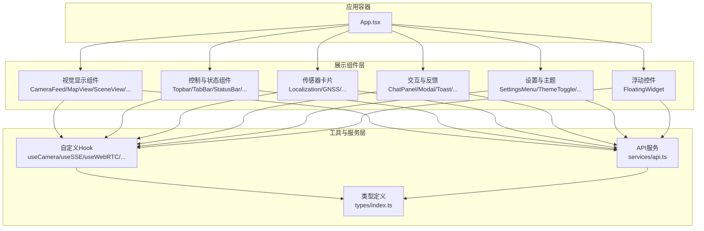

图表来源
- [web/src/App.tsx:1-120](file://web/src/App.tsx#L1-L120)
- [web/src/hooks/useCamera.ts:1-120](file://web/src/hooks/useCamera.ts#L1-L120)
- [web/src/hooks/useSSE.ts:1-120](file://web/src/hooks/useSSE.ts#L1-L120)
- [web/src/hooks/useWebRTC.ts:1-120](file://web/src/hooks/useWebRTC.ts#L1-L120)
- [web/src/hooks/useWHEP.ts:1-120](file://web/src/hooks/useWHEP.ts#L1-L120)
- [web/src/hooks/useToast.ts:1-120](file://web/src/hooks/useToast.ts#L1-L120)
- [web/src/services/api.ts:1-120](file://web/src/services/api.ts#L1-L120)
- [web/src/types/index.ts:1-120](file://web/src/types/index.ts#L1-L120)

## 详细组件分析

### 相机视图组件
- CameraFeed：负责实时相机画面渲染与控制，支持流式播放、暂停/恢复、帧率控制等。
- CameraHud：叠加相机信息（时间戳、分辨率、曝光等）与操作按钮。

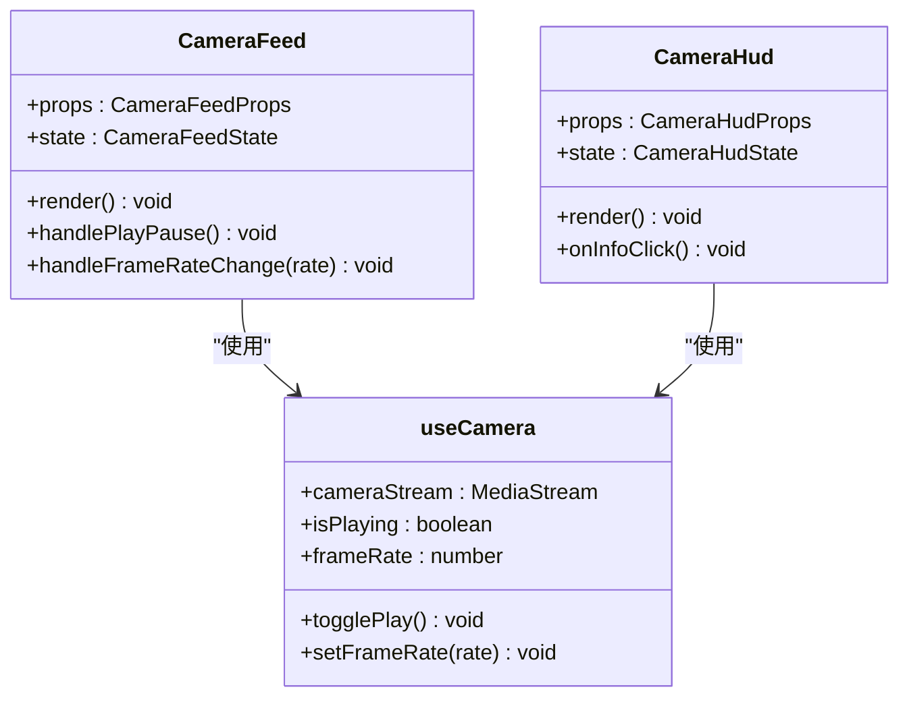

图表来源
- [web/src/components/CameraFeed.tsx:1-120](file://web/src/components/CameraFeed.tsx#L1-L120)
- [web/src/components/CameraHud.tsx:1-120](file://web/src/components/CameraHud.tsx#L1-L120)
- [web/src/hooks/useCamera.ts:1-120](file://web/src/hooks/useCamera.ts#L1-L120)

章节来源
- [web/src/components/CameraFeed.tsx:1-120](file://web/src/components/CameraFeed.tsx#L1-L120)
- [web/src/components/CameraHud.tsx:1-120](file://web/src/components/CameraHud.tsx#L1-L120)
- [web/src/hooks/useCamera.ts:1-120](file://web/src/hooks/useCamera.ts#L1-L120)

### 地图视图组件
- MapView：主地图视图，支持缩放、平移、图层切换、覆盖物绘制。
- MiniMap：小地图，用于全局定位与航向指示。

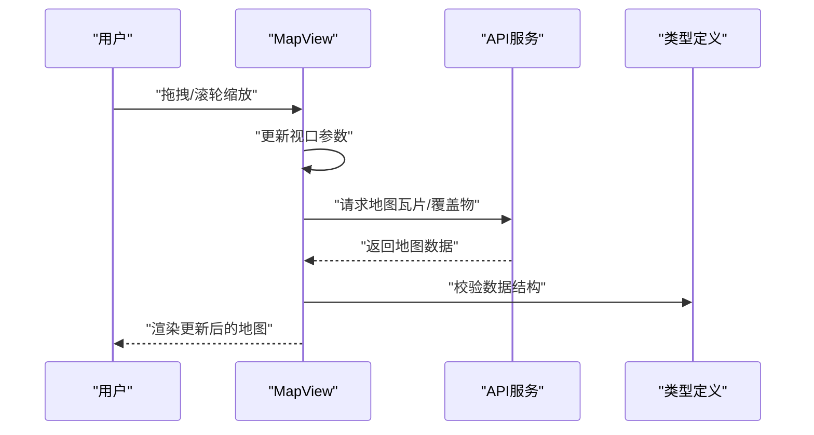

图表来源
- [web/src/components/MapView.tsx:1-120](file://web/src/components/MapView.tsx#L1-L120)
- [web/src/components/MiniMap.tsx:1-120](file://web/src/components/MiniMap.tsx#L1-L120)
- [web/src/services/api.ts:1-120](file://web/src/services/api.ts#L1-L120)
- [web/src/types/index.ts:1-120](file://web/src/types/index.ts#L1-L120)

章节来源
- [web/src/components/MapView.tsx:1-120](file://web/src/components/MapView.tsx#L1-L120)
- [web/src/components/MiniMap.tsx:1-120](file://web/src/components/MiniMap.tsx#L1-L120)
- [web/src/services/api.ts:1-120](file://web/src/services/api.ts#L1-L120)
- [web/src/types/index.ts:1-120](file://web/src/types/index.ts#L1-L120)

### 三维场景组件
- SceneView：二维场景视图，支持轨迹、目标、障碍物等元素叠加。
- Scene3D：三维场景视图，集成点云与网格渲染。

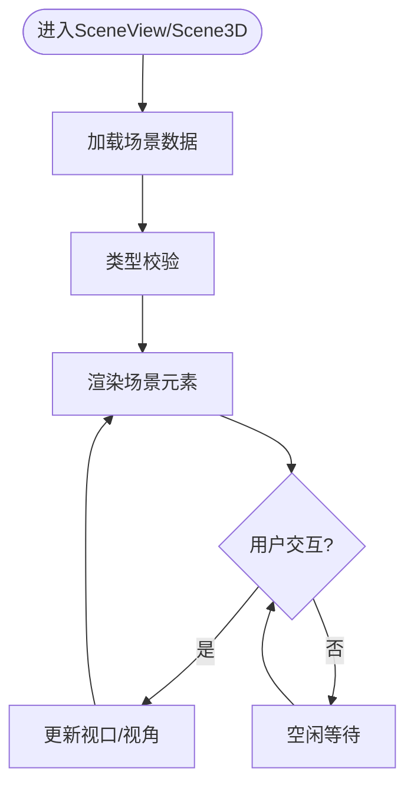

图表来源
- [web/src/components/SceneView.tsx:1-120](file://web/src/components/SceneView.tsx#L1-L120)
- [web/src/components/Scene3D.tsx:1-120](file://web/src/components/Scene3D.tsx#L1-L120)
- [web/src/types/index.ts:1-120](file://web/src/types/index.ts#L1-L120)

章节来源
- [web/src/components/SceneView.tsx:1-120](file://web/src/components/SceneView.tsx#L1-L120)
- [web/src/components/Scene3D.tsx:1-120](file://web/src/components/Scene3D.tsx#L1-L120)
- [web/src/types/index.ts:1-120](file://web/src/types/index.ts#L1-L120)

### 点云查看器
- PointCloudViewer：支持点云加载、着色、裁剪、旋转与导出。

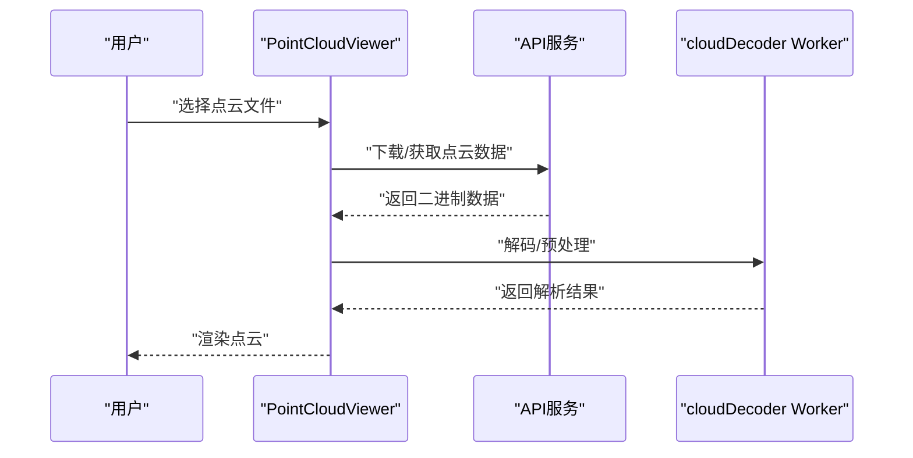

图表来源
- [web/src/components/PointCloudViewer.tsx:1-120](file://web/src/components/PointCloudViewer.tsx#L1-L120)
- [web/src/services/api.ts:1-120](file://web/src/services/api.ts#L1-L120)
- [web/src/workers/cloudDecoder.ts:1-120](file://web/src/workers/cloudDecoder.ts#L1-L120)

章节来源
- [web/src/components/PointCloudViewer.tsx:1-120](file://web/src/components/PointCloudViewer.tsx#L1-L120)
- [web/src/services/api.ts:1-120](file://web/src/services/api.ts#L1-L120)
- [web/src/workers/cloudDecoder.ts:1-120](file://web/src/workers/cloudDecoder.ts#L1-L120)

### 状态与控制面板
- StatusBar：显示系统状态、资源占用、任务进度等。
- Topbar：顶部导航与快捷操作。
- TabBar：页面标签切换。
- SlamPanel：SLAM运行参数与状态面板。

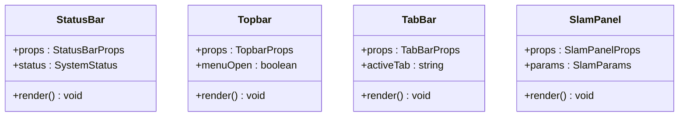

图表来源
- [web/src/components/StatusBar.tsx:1-120](file://web/src/components/StatusBar.tsx#L1-L120)
- [web/src/components/Topbar.tsx:1-120](file://web/src/components/Topbar.tsx#L1-L120)
- [web/src/components/TabBar.tsx:1-120](file://web/src/components/TabBar.tsx#L1-L120)
- [web/src/components/SlamPanel.tsx:1-120](file://web/src/components/SlamPanel.tsx#L1-L120)

章节来源
- [web/src/components/StatusBar.tsx:1-120](file://web/src/components/StatusBar.tsx#L1-L120)
- [web/src/components/Topbar.tsx:1-120](file://web/src/components/Topbar.tsx#L1-L120)
- [web/src/components/TabBar.tsx:1-120](file://web/src/components/TabBar.tsx#L1-L120)
- [web/src/components/SlamPanel.tsx:1-120](file://web/src/components/SlamPanel.tsx#L1-L120)

### 传感器与导航卡片
- LocalizationCard：定位状态与误差指标。
- GnssCard/GnssFusionCard/GpsCard：GNSS相关数据与融合状态。
- ReadinessCard：系统就绪度与健康检查。

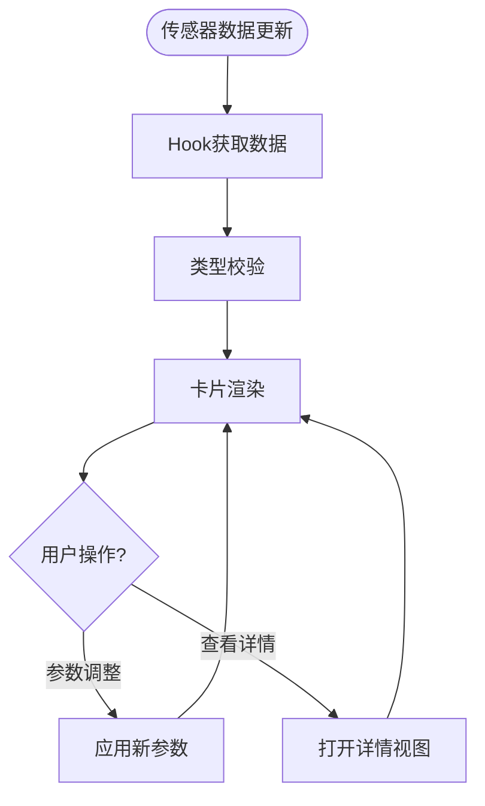

图表来源
- [web/src/components/LocalizationCard.tsx:1-120](file://web/src/components/LocalizationCard.tsx#L1-L120)
- [web/src/components/GnssCard.tsx:1-120](file://web/src/components/GnssCard.tsx#L1-L120)
- [web/src/components/GnssFusionCard.tsx:1-120](file://web/src/components/GnssFusionCard.tsx#L1-L120)
- [web/src/components/GpsCard.tsx:1-120](file://web/src/components/GpsCard.tsx#L1-L120)
- [web/src/components/ReadinessCard.tsx:1-120](file://web/src/components/ReadinessCard.tsx#L1-L120)
- [web/src/hooks/useSSE.ts:1-120](file://web/src/hooks/useSSE.ts#L1-L120)
- [web/src/types/index.ts:1-120](file://web/src/types/index.ts#L1-L120)

章节来源
- [web/src/components/LocalizationCard.tsx:1-120](file://web/src/components/LocalizationCard.tsx#L1-L120)
- [web/src/components/GnssCard.tsx:1-120](file://web/src/components/GnssCard.tsx#L1-L120)
- [web/src/components/GnssFusionCard.tsx:1-120](file://web/src/components/GnssFusionCard.tsx#L1-L120)
- [web/src/components/GpsCard.tsx:1-120](file://web/src/components/GpsCard.tsx#L1-L120)
- [web/src/components/ReadinessCard.tsx:1-120](file://web/src/components/ReadinessCard.tsx#L1-L120)
- [web/src/hooks/useSSE.ts:1-120](file://web/src/hooks/useSSE.ts#L1-L120)
- [web/src/types/index.ts:1-120](file://web/src/types/index.ts#L1-L120)

### 交互与反馈组件
- ChatPanel：消息面板与发送。
- Modal：通用模态对话框。
- Toast：轻提示组件。

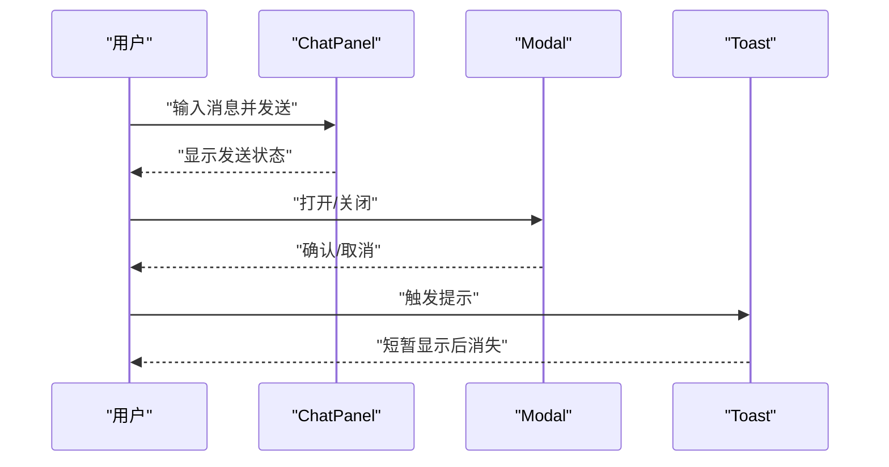

图表来源
- [web/src/components/ChatPanel.tsx:1-120](file://web/src/components/ChatPanel.tsx#L1-L120)
- [web/src/components/Modal.tsx:1-120](file://web/src/components/Modal.tsx#L1-L120)
- [web/src/components/Toast.tsx:1-120](file://web/src/components/Toast.tsx#L1-L120)

章节来源
- [web/src/components/ChatPanel.tsx:1-120](file://web/src/components/ChatPanel.tsx#L1-L120)
- [web/src/components/Modal.tsx:1-120](file://web/src/components/Modal.tsx#L1-L120)
- [web/src/components/Toast.tsx:1-120](file://web/src/components/Toast.tsx#L1-L120)

### 设置与主题组件
- SettingsMenu：系统设置项集合。
- ThemeToggle：明暗主题切换。

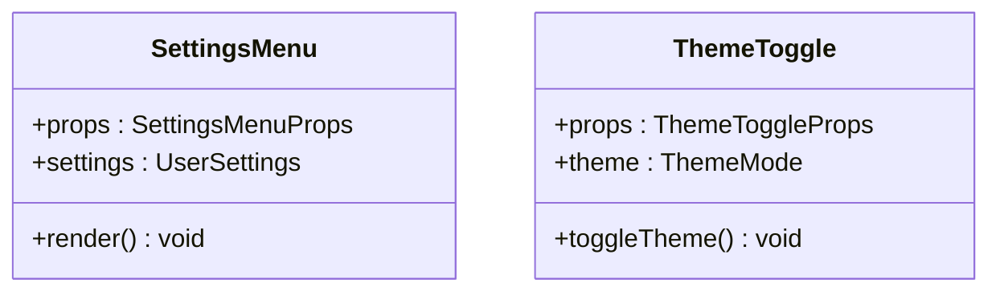

图表来源
- [web/src/components/SettingsMenu.tsx:1-120](file://web/src/components/SettingsMenu.tsx#L1-L120)
- [web/src/components/ThemeToggle.tsx:1-120](file://web/src/components/ThemeToggle.tsx#L1-L120)

章节来源
- [web/src/components/SettingsMenu.tsx:1-120](file://web/src/components/SettingsMenu.tsx#L1-L120)
- [web/src/components/ThemeToggle.tsx:1-120](file://web/src/components/ThemeToggle.tsx#L1-L120)

### 浮动控件
- FloatingWidget：可拖拽浮动控件，支持多实例与布局配置。

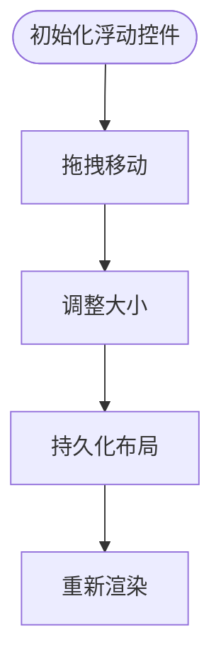

图表来源
- [web/src/components/FloatingWidget.tsx:1-120](file://web/src/components/FloatingWidget.tsx#L1-L120)
- [web/src/components/floatingWidgetLayout.ts:1-120](file://web/src/components/floatingWidgetLayout.ts#L1-L120)

章节来源
- [web/src/components/FloatingWidget.tsx:1-120](file://web/src/components/FloatingWidget.tsx#L1-L120)
- [web/src/components/floatingWidgetLayout.ts:1-120](file://web/src/components/floatingWidgetLayout.ts#L1-L120)

## 依赖关系分析
- 组件到Hook：各展示组件通过自定义Hook抽象数据获取与订阅，降低耦合度。
- Hook到服务：Hook统一调用API服务，集中错误处理与重试逻辑。
- 类型到组件：类型定义贯穿数据流，确保组件间契约一致。
- 样式到组件：CSS Modules提供作用域样式，避免冲突。

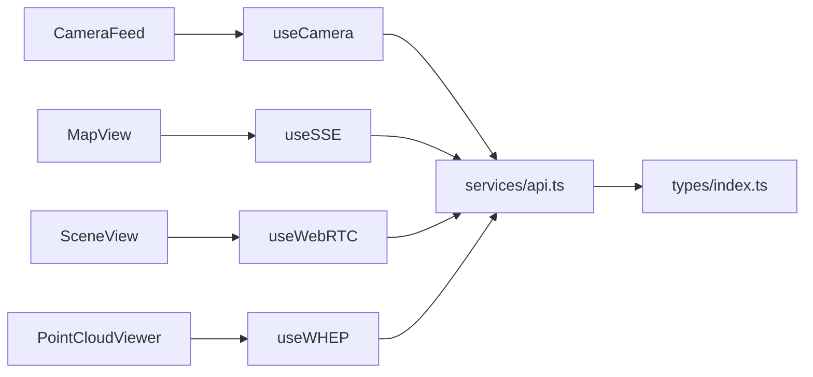

图表来源
- [web/src/components/CameraFeed.tsx:1-120](file://web/src/components/CameraFeed.tsx#L1-L120)
- [web/src/components/MapView.tsx:1-120](file://web/src/components/MapView.tsx#L1-L120)
- [web/src/components/SceneView.tsx:1-120](file://web/src/components/SceneView.tsx#L1-L120)
- [web/src/components/PointCloudViewer.tsx:1-120](file://web/src/components/PointCloudViewer.tsx#L1-L120)
- [web/src/hooks/useCamera.ts:1-120](file://web/src/hooks/useCamera.ts#L1-L120)
- [web/src/hooks/useSSE.ts:1-120](file://web/src/hooks/useSSE.ts#L1-L120)
- [web/src/hooks/useWebRTC.ts:1-120](file://web/src/hooks/useWebRTC.ts#L1-L120)
- [web/src/hooks/useWHEP.ts:1-120](file://web/src/hooks/useWHEP.ts#L1-L120)
- [web/src/services/api.ts:1-120](file://web/src/services/api.ts#L1-L120)
- [web/src/types/index.ts:1-120](file://web/src/types/index.ts#L1-L120)

章节来源
- [web/src/hooks/useCamera.ts:1-120](file://web/src/hooks/useCamera.ts#L1-L120)
- [web/src/hooks/useSSE.ts:1-120](file://web/src/hooks/useSSE.ts#L1-L120)
- [web/src/hooks/useWebRTC.ts:1-120](file://web/src/hooks/useWebRTC.ts#L1-L120)
- [web/src/hooks/useWHEP.ts:1-120](file://web/src/hooks/useWHEP.ts#L1-L120)
- [web/src/services/api.ts:1-120](file://web/src/services/api.ts#L1-L120)
- [web/src/types/index.ts:1-120](file://web/src/types/index.ts#L1-L120)

## 性能考虑
- 渲染优化
  - 使用CSS Modules与内联样式的组合，减少全局样式污染，提升渲染效率。
  - 对高频更新的数据（如相机帧、传感器数据）采用防抖/节流策略，降低重绘频率。
- 数据流优化
  - Hook内部缓存最近一次有效数据，避免重复请求与无效渲染。
  - 对长列表（如日志、消息）采用虚拟滚动或分页加载。
- 计算分离
  - 复杂计算（点云解码、轨迹计算）放入Web Worker，避免阻塞主线程。
- 资源管理
  - 监听组件卸载时清理订阅与定时器，防止内存泄漏。
- 图形性能
  - 三维场景按需加载纹理与几何体，启用LOD与遮挡剔除。
- 缓存策略
  - 对静态资源与API响应设置合理的缓存头，结合版本号避免陈旧缓存。

## 故障排查指南
- 相机流异常
  - 检查浏览器权限与媒体设备可用性；确认useCamera状态与错误信息。
- 地图加载失败
  - 校验API地址与鉴权；检查网络连通性与代理设置。
- 三维渲染卡顿
  - 降低渲染质量参数（阴影、抗锯齿），减少同时渲染对象数量。
- WebSocket/WebRTC连接问题
  - 使用useSSE/useWebRTC调试连接状态与错误码，必要时切换信令服务器。
- 内存泄漏
  - 确认所有订阅在组件卸载时被清理；避免闭包持有过期引用。

章节来源
- [web/src/hooks/useCamera.ts:1-120](file://web/src/hooks/useCamera.ts#L1-L120)
- [web/src/hooks/useSSE.ts:1-120](file://web/src/hooks/useSSE.ts#L1-L120)
- [web/src/hooks/useWebRTC.ts:1-120](file://web/src/hooks/useWebRTC.ts#L1-L120)
- [web/src/hooks/useWHEP.ts:1-120](file://web/src/hooks/useWHEP.ts#L1-L120)

## 结论
LingTu React组件架构以清晰的分层与职责边界为基础，通过自定义Hook抽象数据与订阅，通过类型系统保障契约一致性，通过CSS Modules实现样式隔离，通过Worker与缓存策略提升性能。该架构既保证了组件的高内聚低耦合，又为后续扩展与维护提供了良好基础。

## 附录
- 设计规范与API端点请参考项目内的设计文档与README。
- 开发与构建配置位于Vite与TypeScript配置文件中，遵循现代前端工程化实践。