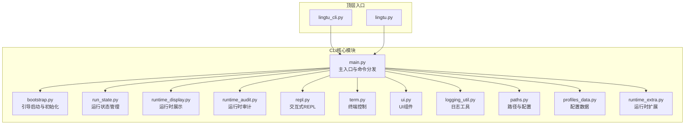
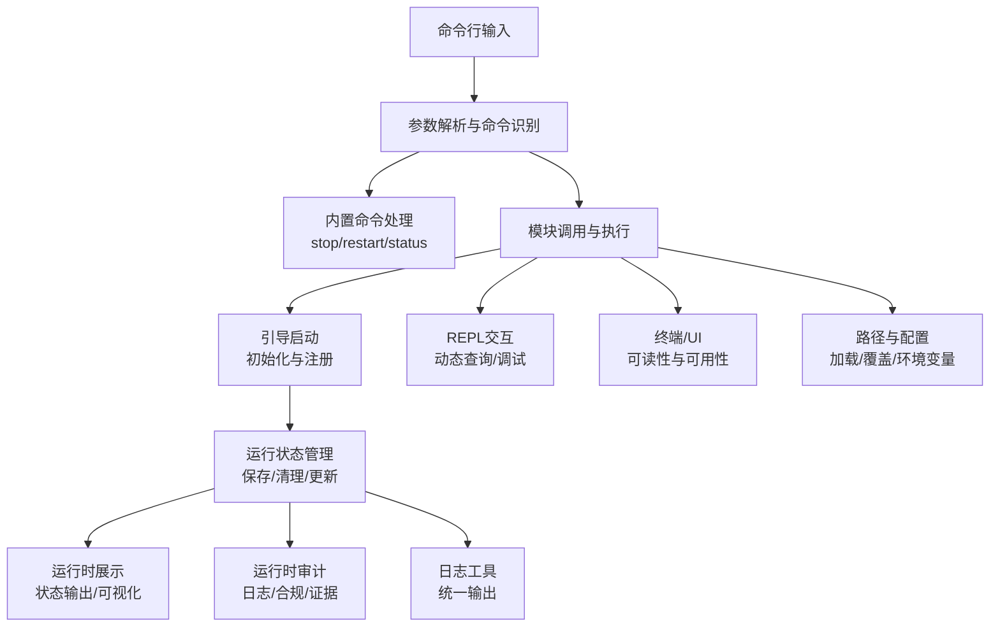
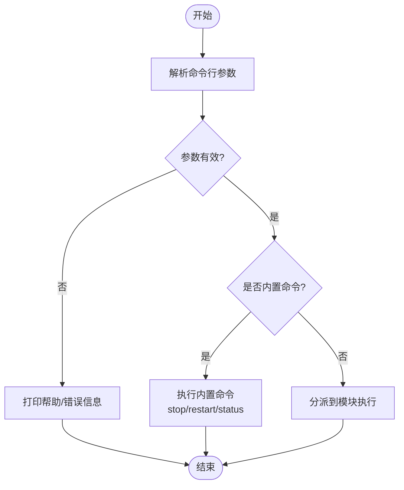
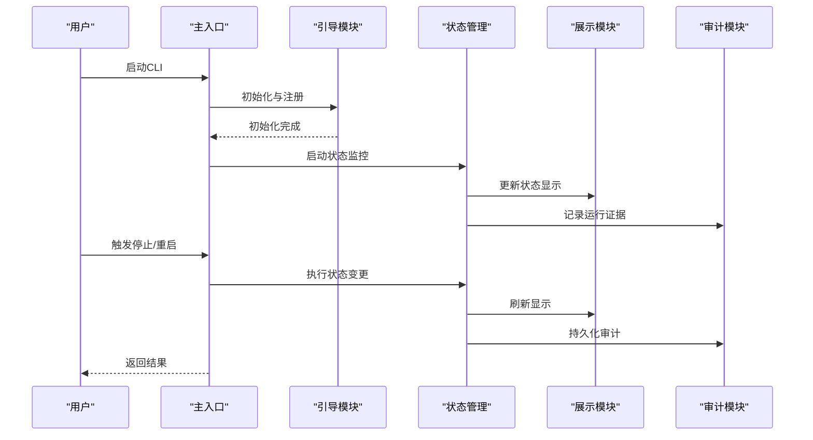
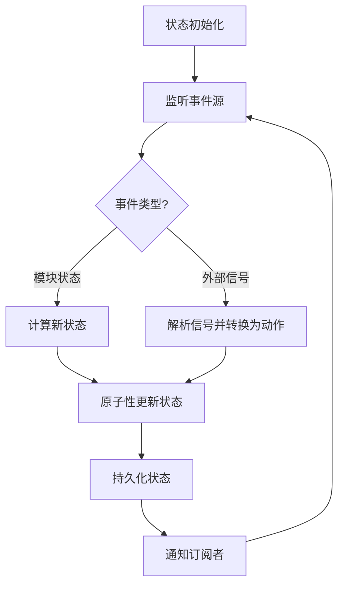
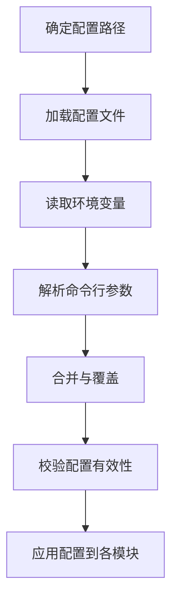
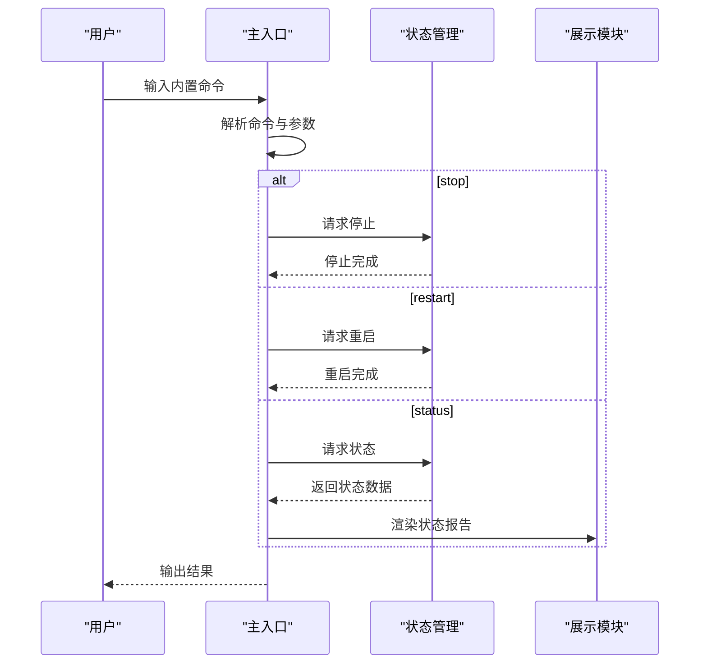
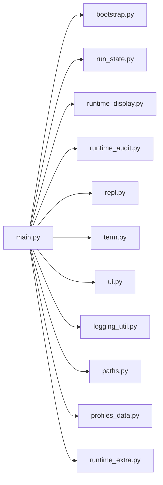

# CLI核心模块

<cite>
**本文档引用的文件**
- [cli/main.py](file://cli/main.py)
- [cli/bootstrap.py](file://cli/bootstrap.py)
- [cli/run_state.py](file://cli/run_state.py)
- [cli/runtime_display.py](file://cli/runtime_display.py)
- [cli/runtime_audit.py](file://cli/runtime_audit.py)
- [cli/repl.py](file://cli/repl.py)
- [cli/term.py](file://cli/term.py)
- [cli/ui.py](file://cli/ui.py)
- [cli/logging_util.py](file://cli/logging_util.py)
- [cli/paths.py](file://cli/paths.py)
- [cli/profiles_data.py](file://cli/profiles_data.py)
- [cli/runtime_extra.py](file://cli/runtime_extra.py)
- [lingtu_cli.py](file://lingtu_cli.py)
- [lingtu.py](file://lingtu.py)
</cite>

## 目录
1. [简介](#简介)
2. [项目结构](#项目结构)
3. [核心组件](#核心组件)
4. [架构总览](#架构总览)
5. [详细组件分析](#详细组件分析)
6. [依赖关系分析](#依赖关系分析)
7. [性能考虑](#性能考虑)
8. [故障排除指南](#故障排除指南)
9. [结论](#结论)
10. [附录](#附录)

## 简介
本文件面向LingTu CLI核心模块，系统性阐述命令行参数解析与执行流程、进程生命周期管理、运行状态管理、配置解析与应用机制，以及内置命令（如stop、restart、status）的处理逻辑。文档同时提供使用示例与最佳实践，帮助开发者快速理解CLI整体架构与工作原理。

## 项目结构
CLI核心模块位于cli目录，围绕主入口、引导启动、运行状态管理、运行时展示与审计、REPL交互、终端与UI组件、日志工具、路径与配置数据等子模块协同工作。顶层入口脚本lingtu_cli.py与lingtu.py分别提供不同场景下的CLI入口。

**图表来源**
- [cli/main.py](file://cli/main.py)
- [cli/bootstrap.py](file://cli/bootstrap.py)
- [cli/run_state.py](file://cli/run_state.py)
- [cli/runtime_display.py](file://cli/runtime_display.py)
- [cli/runtime_audit.py](file://cli/runtime_audit.py)
- [cli/repl.py](file://cli/repl.py)
- [cli/term.py](file://cli/term.py)
- [cli/ui.py](file://cli/ui.py)
- [cli/logging_util.py](file://cli/logging_util.py)
- [cli/paths.py](file://cli/paths.py)
- [cli/profiles_data.py](file://cli/profiles_data.py)
- [cli/runtime_extra.py](file://cli/runtime_extra.py)
- [lingtu_cli.py](file://lingtu_cli.py)
- [lingtu.py](file://lingtu.py)

**章节来源**
- [cli/main.py](file://cli/main.py)
- [cli/bootstrap.py](file://cli/bootstrap.py)
- [cli/run_state.py](file://cli/run_state.py)
- [cli/runtime_display.py](file://cli/runtime_display.py)
- [cli/runtime_audit.py](file://cli/runtime_audit.py)
- [cli/repl.py](file://cli/repl.py)
- [cli/term.py](file://cli/term.py)
- [cli/ui.py](file://cli/ui.py)
- [cli/logging_util.py](file://cli/logging_util.py)
- [cli/paths.py](file://cli/paths.py)
- [cli/profiles_data.py](file://cli/profiles_data.py)
- [cli/runtime_extra.py](file://cli/runtime_extra.py)
- [lingtu_cli.py](file://lingtu_cli.py)
- [lingtu.py](file://lingtu.py)

## 核心组件
- 主入口与命令分发：负责解析命令行参数、识别内置命令、分派到相应处理器或模块。
- 引导启动：完成环境初始化、配置加载、服务注册与启动准备。
- 运行状态管理：维护运行时状态、持久化状态文件、状态变更事件通知。
- 运行时展示与审计：提供状态可视化、日志输出、审计记录与合规检查。
- REPL交互：提供交互式命令行界面，支持动态查询与调试。
- 终端与UI：封装终端控制与用户界面组件，提升可读性与可用性。
- 日志工具：统一日志格式、级别与输出目标，支持多通道输出。
- 路径与配置：集中管理配置文件路径、默认值与覆盖策略。
- 配置数据：抽象配置模型与数据结构，支持动态更新与校验。
- 运行时扩展：提供扩展点以接入额外功能或插件。

**章节来源**
- [cli/main.py](file://cli/main.py)
- [cli/bootstrap.py](file://cli/bootstrap.py)
- [cli/run_state.py](file://cli/run_state.py)
- [cli/runtime_display.py](file://cli/runtime_display.py)
- [cli/runtime_audit.py](file://cli/runtime_audit.py)
- [cli/repl.py](file://cli/repl.py)
- [cli/term.py](file://cli/term.py)
- [cli/ui.py](file://cli/ui.py)
- [cli/logging_util.py](file://cli/logging_util.py)
- [cli/paths.py](file://cli/paths.py)
- [cli/profiles_data.py](file://cli/profiles_data.py)
- [cli/runtime_extra.py](file://cli/runtime_extra.py)

## 架构总览
CLI核心模块采用“入口-引导-状态-展示-审计-交互”的分层架构。入口负责参数解析与命令识别；引导负责初始化与资源准备；状态管理负责运行期状态的持久化与一致性；展示与审计提供可观测性；REPL与UI增强交互体验；日志与路径配置保障可维护性与可移植性。

**图表来源**
- [cli/main.py](file://cli/main.py)
- [cli/bootstrap.py](file://cli/bootstrap.py)
- [cli/run_state.py](file://cli/run_state.py)
- [cli/runtime_display.py](file://cli/runtime_display.py)
- [cli/runtime_audit.py](file://cli/runtime_audit.py)
- [cli/repl.py](file://cli/repl.py)
- [cli/term.py](file://cli/term.py)
- [cli/ui.py](file://cli/ui.py)
- [cli/logging_util.py](file://cli/logging_util.py)
- [cli/paths.py](file://cli/paths.py)
- [cli/profiles_data.py](file://cli/profiles_data.py)

## 详细组件分析

### 命令行参数解析与内置命令处理
- 参数解析：通过标准库argparse实现，定义位置参数、可选参数、子命令与互斥组，确保参数合法性与默认值设置。
- 内置命令：stop、restart、status等内置命令在入口处被优先识别并短路执行，不进入常规模块流程。
- 参数验证：对关键参数进行类型与范围校验，必要时结合配置文件与环境变量进行覆盖与合并。
- 默认值处理：优先级遵循“命令行参数 > 环境变量 > 配置文件 > 内置默认值”。

**图表来源**
- [cli/main.py](file://cli/main.py)

**章节来源**
- [cli/main.py](file://cli/main.py)

### 进程生命周期管理
- 启动阶段：引导模块完成环境检测、配置加载、服务注册与资源初始化。
- 运行阶段：状态管理器持续监控与更新运行状态，展示模块提供实时输出，审计模块记录运行证据。
- 优雅关闭：捕获终止信号，触发清理流程（释放资源、保存状态、关闭连接），确保系统一致性。

**图表来源**
- [cli/main.py](file://cli/main.py)
- [cli/bootstrap.py](file://cli/bootstrap.py)
- [cli/run_state.py](file://cli/run_state.py)
- [cli/runtime_display.py](file://cli/runtime_display.py)
- [cli/runtime_audit.py](file://cli/runtime_audit.py)

**章节来源**
- [cli/main.py](file://cli/main.py)
- [cli/bootstrap.py](file://cli/bootstrap.py)
- [cli/run_state.py](file://cli/run_state.py)
- [cli/runtime_display.py](file://cli/runtime_display.py)
- [cli/runtime_audit.py](file://cli/runtime_audit.py)

### 运行状态管理系统
- 状态保存：将当前运行状态写入持久化存储，支持崩溃恢复与历史追踪。
- 清理策略：在启动前清理过期或损坏的状态文件，在停止时回收临时资源。
- 状态更新：监听事件源（如模块状态变化、外部信号），原子性地更新状态并广播变更。
- 并发安全：使用锁或原子操作保证多线程/多进程下的状态一致性。

**图表来源**
- [cli/run_state.py](file://cli/run_state.py)

**章节来源**
- [cli/run_state.py](file://cli/run_state.py)

### 配置解析与应用机制
- 配置文件加载：按约定路径搜索配置文件，支持多种格式（如YAML/TOML），解析为内部数据结构。
- 参数覆盖：命令行参数优先于配置文件，环境变量作为中间层，最终形成应用配置。
- 环境变量处理：统一前缀与命名规范，自动映射到对应配置项，支持敏感信息注入。
- 动态应用：在运行时允许部分配置热更新，确保最小化停机时间。

**图表来源**
- [cli/paths.py](file://cli/paths.py)
- [cli/profiles_data.py](file://cli/profiles_data.py)

**章节来源**
- [cli/paths.py](file://cli/paths.py)
- [cli/profiles_data.py](file://cli/profiles_data.py)

### 内置命令处理逻辑（stop、restart、status）
- stop：停止所有运行中的模块与服务，触发优雅关闭流程，返回成功或失败状态。
- restart：先执行stop，再重新初始化并启动，支持状态恢复与配置重载。
- status：读取当前运行状态文件，汇总模块健康度、资源占用与最近事件，输出人类可读报告。

**图表来源**
- [cli/main.py](file://cli/main.py)
- [cli/run_state.py](file://cli/run_state.py)
- [cli/runtime_display.py](file://cli/runtime_display.py)

**章节来源**
- [cli/main.py](file://cli/main.py)
- [cli/run_state.py](file://cli/run_state.py)
- [cli/runtime_display.py](file://cli/runtime_display.py)

### REPL交互与终端/UI组件
- REPL：提供交互式命令行，支持历史命令、自动补全与上下文感知提示，便于调试与动态查询。
- 终端控制：封装颜色、光标、清屏等终端能力，提升输出可读性。
- UI组件：在需要图形化或富文本输出时，提供轻量UI组件以改善用户体验。

**章节来源**
- [cli/repl.py](file://cli/repl.py)
- [cli/term.py](file://cli/term.py)
- [cli/ui.py](file://cli/ui.py)

### 日志工具与运行时审计
- 日志工具：统一日志格式与级别，支持多通道输出（控制台、文件、远程），并提供上下文信息。
- 运行时审计：记录关键事件、状态变更与异常，生成审计证据，满足合规与排障需求。

**章节来源**
- [cli/logging_util.py](file://cli/logging_util.py)
- [cli/runtime_audit.py](file://cli/runtime_audit.py)

## 依赖关系分析
CLI核心模块内部依赖清晰，入口模块聚合其他子模块；引导模块为系统提供初始化能力；状态管理模块贯穿运行期；展示与审计模块提供可观测性；REPL与UI模块增强交互体验；日志与路径配置模块保障可维护性。

**图表来源**
- [cli/main.py](file://cli/main.py)
- [cli/bootstrap.py](file://cli/bootstrap.py)
- [cli/run_state.py](file://cli/run_state.py)
- [cli/runtime_display.py](file://cli/runtime_display.py)
- [cli/runtime_audit.py](file://cli/runtime_audit.py)
- [cli/repl.py](file://cli/repl.py)
- [cli/term.py](file://cli/term.py)
- [cli/ui.py](file://cli/ui.py)
- [cli/logging_util.py](file://cli/logging_util.py)
- [cli/paths.py](file://cli/paths.py)
- [cli/profiles_data.py](file://cli/profiles_data.py)
- [cli/runtime_extra.py](file://cli/runtime_extra.py)

**章节来源**
- [cli/main.py](file://cli/main.py)
- [cli/bootstrap.py](file://cli/bootstrap.py)
- [cli/run_state.py](file://cli/run_state.py)
- [cli/runtime_display.py](file://cli/runtime_display.py)
- [cli/runtime_audit.py](file://cli/runtime_audit.py)
- [cli/repl.py](file://cli/repl.py)
- [cli/term.py](file://cli/term.py)
- [cli/ui.py](file://cli/ui.py)
- [cli/logging_util.py](file://cli/logging_util.py)
- [cli/paths.py](file://cli/paths.py)
- [cli/profiles_data.py](file://cli/profiles_data.py)
- [cli/runtime_extra.py](file://cli/runtime_extra.py)

## 性能考虑
- 参数解析优化：避免重复解析与冗余校验，尽量在入口一次性完成。
- 状态持久化：批量写入与异步落盘，减少I/O阻塞；对热点状态采用内存缓存。
- 展示与审计：按需渲染与增量输出，避免全量刷新；审计日志分级输出。
- REPL与UI：延迟渲染与虚拟滚动，降低终端压力。
- 配置应用：增量更新与白名单校验，避免全量重建。

## 故障排除指南
- 参数解析错误：检查参数类型、必填项与互斥组冲突；查看帮助信息定位问题。
- 状态异常：核对状态文件权限与磁盘空间；确认并发访问一致性。
- 配置加载失败：检查配置路径与格式；验证环境变量映射。
- 内置命令无效：确认命令拼写与参数；查看状态文件是否正确更新。
- 日志缺失：检查日志级别与输出目标；确认通道初始化顺序。

**章节来源**
- [cli/main.py](file://cli/main.py)
- [cli/run_state.py](file://cli/run_state.py)
- [cli/paths.py](file://cli/paths.py)
- [cli/logging_util.py](file://cli/logging_util.py)

## 结论
CLI核心模块通过清晰的分层设计与模块化组织，实现了从参数解析到运行时管理的完整闭环。内置命令、状态管理、配置应用与可观测性组件共同构成了稳定可靠的命令行工具体系。遵循本文档的最佳实践，可显著提升开发效率与系统可靠性。

## 附录
- 使用示例与最佳实践
  - 启动与停止：使用内置命令进行生命周期管理，配合状态命令检查运行情况。
  - 配置覆盖：优先使用命令行参数覆盖配置文件，必要时通过环境变量注入。
  - 调试与排障：利用REPL与审计日志定位问题，结合展示模块观察实时状态。
  - 可移植性：统一路径与配置规范，确保跨平台一致性。