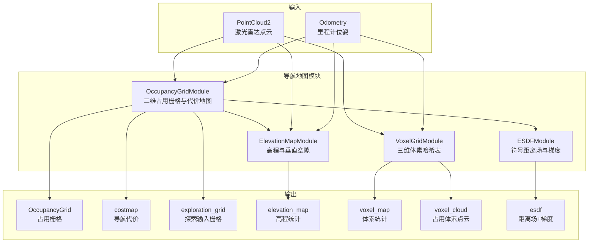
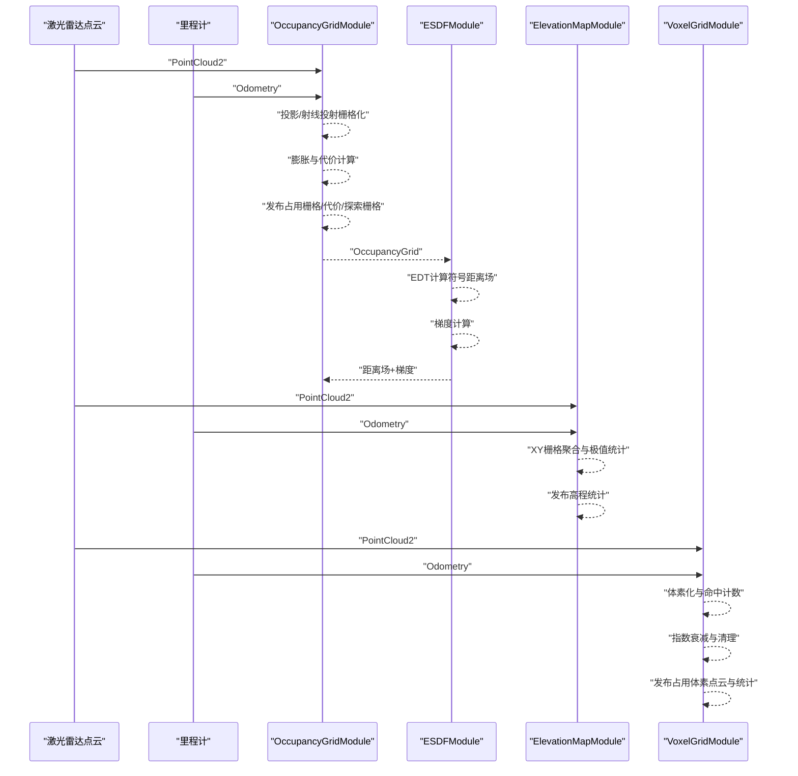
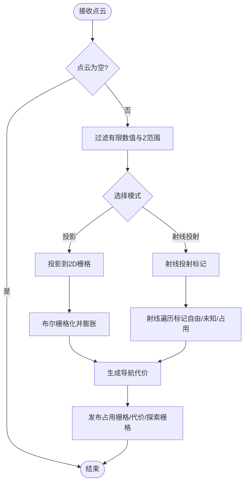
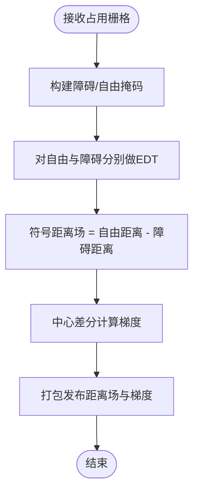
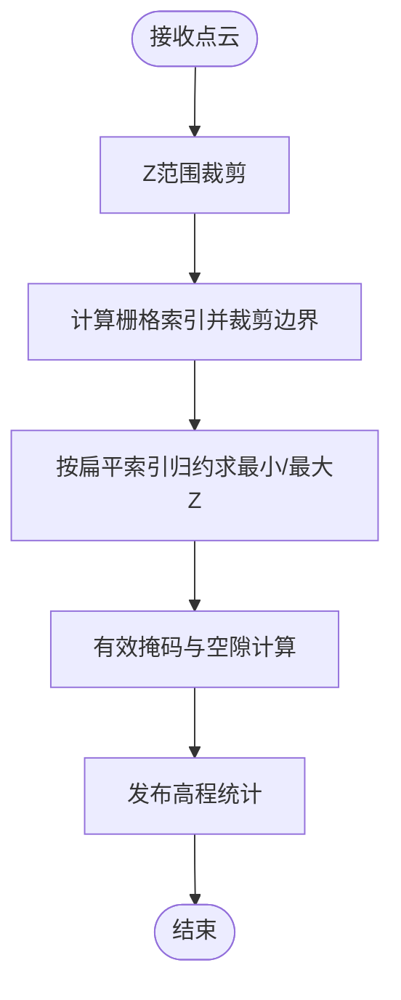
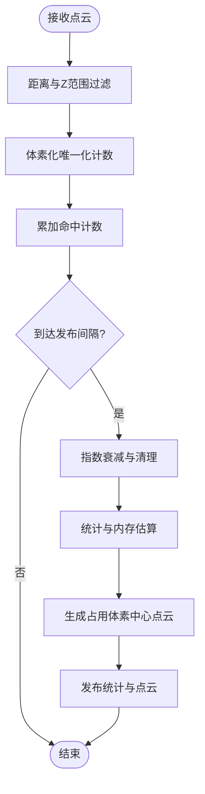
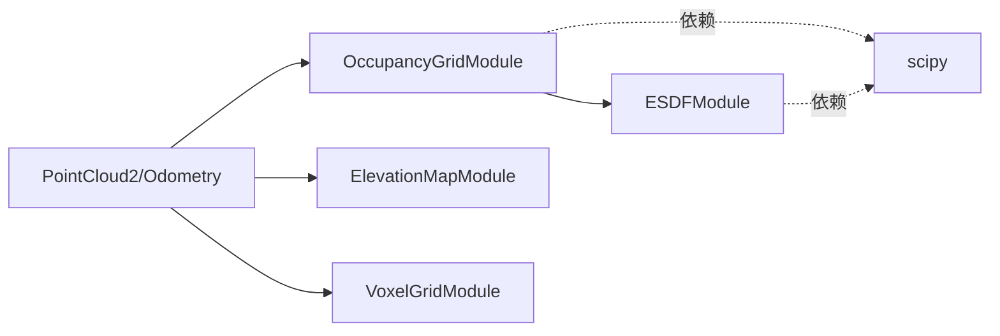

# 地图与定位模块

<cite>
**本文引用的文件**
- [occupancy_grid_module.py](file://src/nav/occupancy_grid_module.py)
- [esdf_module.py](file://src/nav/esdf_module.py)
- [elevation_map_module.py](file://src/nav/elevation_map_module.py)
- [voxel_grid_module.py](file://src/nav/voxel_grid_module.py)
- [test_map_occupancy.py](file://src/core/tests/test_map_occupancy.py)
</cite>

## 目录
1. [简介](#简介)
2. [项目结构](#项目结构)
3. [核心组件](#核心组件)
4. [架构总览](#架构总览)
5. [详细组件分析](#详细组件分析)
6. [依赖关系分析](#依赖关系分析)
7. [性能考量](#性能考量)
8. [故障排查指南](#故障排查指南)
9. [结论](#结论)
10. [附录：参数配置与调优](#附录参数配置与调优)

## 简介
本技术文档聚焦 LingTu 地图与定位模块，系统化梳理以下四类地图的构建与维护机制：
- 占用栅格地图（OccupancyGrid）：基于激光雷达点云的二维占用栅格与代价地图，支持投影模式与射线投射模式。
- ESDF（Euclidean Signed Distance Field）地图：从占用栅格计算的符号距离场及其梯度，用于轨迹优化中的避障代价。
- 高程地图（ElevationMap）：基于激光雷达点云的每栅格最小/最大高度与垂直空隙，支撑地形适应性与越障分析。
- 体素网格地图（VoxelGrid）：三维体素哈希表，带指数衰减遗忘旧观测，输出占用体素中心点云。

文档涵盖数据流、处理逻辑、内存与性能特征、参数配置与调优建议，并提供可视化图示帮助理解。

## 项目结构
与地图与定位直接相关的代码主要位于 src/nav 下的四个模块文件，分别对应上述四种地图类型；同时，核心测试文件对占用栅格构建流程进行了端到端验证。

**图表来源**
- [occupancy_grid_module.py:1-384](file://src/nav/occupancy_grid_module.py#L1-L384)
- [esdf_module.py:1-116](file://src/nav/esdf_module.py#L1-L116)
- [elevation_map_module.py:1-136](file://src/nav/elevation_map_module.py#L1-L136)
- [voxel_grid_module.py:1-241](file://src/nav/voxel_grid_module.py#L1-L241)

**章节来源**
- [occupancy_grid_module.py:1-384](file://src/nav/occupancy_grid_module.py#L1-L384)
- [esdf_module.py:1-116](file://src/nav/esdf_module.py#L1-L116)
- [elevation_map_module.py:1-136](file://src/nav/elevation_map_module.py#L1-L136)
- [voxel_grid_module.py:1-241](file://src/nav/voxel_grid_module.py#L1-L241)

## 核心组件
本节概述四大地图模块的核心职责、输入输出与关键行为。

- 占用栅格地图（OccupancyGrid）
  - 职责：将激光雷达点云投影或射线投射到机器人坐标系局部栅格，生成占用栅格与导航代价地图；同时输出探索用栅格。
  - 模式：投影模式（默认）与射线投射模式（探索所需）。
  - 关键参数：分辨率、半径、Z上下限、膨胀半径、机器人清除半径、发布频率、未知区域是否按障碍处理等。
  - 输出：OccupancyGrid、导航代价字典、探索输入栅格字典。

- ESDF 地图
  - 职责：基于占用栅格计算符号距离场（正为自由空间，负为穿透障碍内部），并计算梯度，供轨迹优化器使用。
  - 关键参数：障碍阈值、发布频率。
  - 输出：包含距离场与梯度的字典。

- 高程地图（ElevationMap）
  - 职责：按XY栅格聚合激光雷达点，统计每栅格最小/最大高度与垂直空隙，提供地形适应性信息。
  - 关键参数：分辨率、半径、Z上下限、发布频率。
  - 输出：包含 min_z、max_z、clearance、valid 的字典。

- 体素网格地图（VoxelGrid）
  - 职责：在三维空间建立体素哈希表，记录命中次数并指数衰减遗忘旧观测，周期性发布占用体素中心点云与统计。
  - 关键参数：体素尺寸、最大探测范围、Z上下限、衰减率、发布间隔。
  - 输出：体素统计字典与占用体素点云。

**章节来源**
- [occupancy_grid_module.py:1-384](file://src/nav/occupancy_grid_module.py#L1-L384)
- [esdf_module.py:1-116](file://src/nav/esdf_module.py#L1-L116)
- [elevation_map_module.py:1-136](file://src/nav/elevation_map_module.py#L1-L136)
- [voxel_grid_module.py:1-241](file://src/nav/voxel_grid_module.py#L1-L241)

## 架构总览
下图展示从传感器输入到各类地图输出的数据流与模块间依赖关系。

**图表来源**
- [occupancy_grid_module.py:113-231](file://src/nav/occupancy_grid_module.py#L113-L231)
- [esdf_module.py:76-93](file://src/nav/esdf_module.py#L76-L93)
- [elevation_map_module.py:74-124](file://src/nav/elevation_map_module.py#L74-L124)
- [voxel_grid_module.py:101-181](file://src/nav/voxel_grid_module.py#L101-L181)

## 详细组件分析

### 占用栅格地图（OccupancyGrid）分析
- 数据结构与复杂度
  - 栅格尺寸由半径与分辨率决定，内存占用近似 O(π·R^2/res^2)，通常为数百×数百规模。
  - 投影模式：对有效点进行整型坐标映射，使用布尔矩阵标记，随后二值膨胀生成代价。
  - 射线投射模式：沿每条扫描射线进行Bresenham遍历，标记自由/未知/占用，支持自由区膨胀。
- 处理逻辑
  - 输入过滤：有限数值检查、Z范围裁剪、机器人足迹剔除。
  - 坐标映射：将世界坐标转换为栅格索引，边界外点丢弃。
  - 膨胀与代价：使用圆形核进行二值膨胀，占用区域赋予最大代价，机器人清除半径内置零代价。
  - 发布：同时输出占用栅格、导航代价、探索栅格，并携带统计信息。
- 内存管理
  - 使用缓存键（栅格尺寸、机器人位置、半径）缓存机器人清除掩码，避免重复计算。
  - 点云下采样控制射线投射阶段的最大点数，降低CPU压力。
- 错误处理
  - 缺少 scipy 时抛出运行时错误，提示安装依赖。
  - 空点云或无有效点直接返回，避免无效计算。
- 性能影响因素
  - 分辨率与半径决定栅格规模；膨胀核大小影响膨胀成本。
  - 发布节流可降低CPU占用；射线投射模式在高密度点云下更重。

**图表来源**
- [occupancy_grid_module.py:113-231](file://src/nav/occupancy_grid_module.py#L113-L231)

**章节来源**
- [occupancy_grid_module.py:113-231](file://src/nav/occupancy_grid_module.py#L113-L231)
- [occupancy_grid_module.py:307-346](file://src/nav/occupancy_grid_module.py#L307-L346)

### ESDF 地图（符号距离场）分析
- 算法原理
  - 对自由掩码与障碍掩码分别执行欧氏距离变换（EDT），相减得到符号距离场。
  - 使用中心差分计算梯度，单位为无量纲（米/米）。
- 实现要点
  - 阈值化障碍：以占用栅格上的代价阈值判定障碍。
  - 单位换算：EDT结果以“栅格单元”为单位，乘以分辨率转换为米。
  - 发布节流：默认约1Hz，避免频繁EDT带来的CPU开销。
- 应用价值
  - 为轨迹优化器（如 MPPI/TEB/CHOMP）提供平滑的碰撞代价梯度，减少重复查询。

**图表来源**
- [esdf_module.py:76-93](file://src/nav/esdf_module.py#L76-L93)

**章节来源**
- [esdf_module.py:76-93](file://src/nav/esdf_module.py#L76-L93)

### 高程地图（ElevationMap）分析
- 统计指标
  - 每个栅格内的最小/最大Z值，以及垂直空隙 clearance = max_z - min_z。
  - valid 掩码指示该栅格是否有观测命中。
- 实现细节
  - 通过直方图归约（最小/最大原子操作）高效统计每个栅格的极值。
  - 仅保留有效栅格的数值，其余填充为 NaN，便于下游可视化与分析。
- 地形适应性
  - clearance 可作为越障与安全步高的依据；min_z 估计地面高程，辅助路径规划中的高度约束。

**图表来源**
- [elevation_map_module.py:74-124](file://src/nav/elevation_map_module.py#L74-L124)

**章节来源**
- [elevation_map_module.py:74-124](file://src/nav/elevation_map_module.py#L74-L124)

### 体素网格地图（VoxelGrid）分析
- 数据结构
  - 三维体素键（ix, iy, iz）映射到浮点命中计数，支持平滑衰减。
  - 使用锁保护并发写入，保证线程安全。
- 更新策略
  - 指数衰减：每次发布周期按因子（1 - 衰减率）衰减，低于阈值的体素被清理。
  - 列车切削：对每个（ix, iy）列维护 min_z/max_z，区分地面与障碍。
- 查询与技能接口
  - 提供查询指定体素是否占用、清空地图、打印统计等技能接口，便于调试与运维。
- 内存与性能
  - 近似每体素占用 3×int64 + float，内存估算为 total_voxels × 64 字节。
  - 发布间隔控制CPU/内存占用平衡。

**图表来源**
- [voxel_grid_module.py:101-181](file://src/nav/voxel_grid_module.py#L101-L181)

**章节来源**
- [voxel_grid_module.py:101-181](file://src/nav/voxel_grid_module.py#L101-L181)
- [voxel_grid_module.py:183-226](file://src/nav/voxel_grid_module.py#L183-L226)

## 依赖关系分析
- 模块耦合
  - ESDF 模块依赖 OccupancyGridModule 的输出；两者在同一层（layer=2）。
  - ElevationMap 与 VoxelGrid 独立于其他地图模块，但共享点云与里程计输入。
- 外部依赖
  - OccupancyGrid 与 ESDF 模块均依赖 scipy（二值膨胀与距离变换）。
  - 测试中 MapManagerModule 的占用栅格构建流程验证了射线投射与投影两种模式的正确性与输出格式一致性。

**图表来源**
- [occupancy_grid_module.py:93-98](file://src/nav/occupancy_grid_module.py#L93-L98)
- [esdf_module.py:66-72](file://src/nav/esdf_module.py#L66-L72)

**章节来源**
- [occupancy_grid_module.py:93-98](file://src/nav/occupancy_grid_module.py#L93-L98)
- [esdf_module.py:66-72](file://src/nav/esdf_module.py#L66-L72)
- [test_map_occupancy.py:122-138](file://src/core/tests/test_map_occupancy.py#L122-L138)

## 性能考量
- 占用栅格（OccupancyGrid）
  - 分辨率与半径：分辨率越小、半径越大，内存与计算开销显著上升。
  - 膨胀核：核半径增大带来更大的卷积窗口，计算成本上升。
  - 发布节流：通过节流策略降低CPU占用，适合低频发布场景。
  - 射线投射：在高密度点云下更重，可通过下采样与最大射线数限制控制。
- ESDF
  - EDT 计算复杂度与栅格规模成正比，建议适当降低分辨率或发布频率。
  - 梯度计算为轻量级操作，但仍需注意分辨率带来的数值尺度。
- 高程地图（ElevationMap）
  - 归约操作为 O(N) 线性复杂度，受点云数量主导；合理设置Z范围可减少无效计算。
- 体素网格（VoxelGrid）
  - 体素数量随时间指数衰减，但峰值可能较高；通过衰减率与发布间隔平衡内存与实时性。
  - 查询接口为 O(1) 哈希表访问，适合快速检测占用状态。

[本节为通用性能讨论，不直接分析具体文件]

## 故障排查指南
- 缺少 scipy 导致模块初始化失败
  - 现象：模块 setup 阶段抛出运行时错误，提示安装 scipy。
  - 处理：安装 scipy 后重启模块。
  - 参考来源：[occupancy_grid_module.py:93-98](file://src/nav/occupancy_grid_module.py#L93-L98)、[esdf_module.py:66-72](file://src/nav/esdf_module.py#L66-L72)
- 空点云或无有效点
  - 现象：模块直接返回，无输出。
  - 处理：检查传感器数据链路与滤波参数。
  - 参考来源：[occupancy_grid_module.py:114-120](file://src/nav/occupancy_grid_module.py#L114-L120)、[elevation_map_module.py:75-82](file://src/nav/elevation_map_module.py#L75-L82)、[voxel_grid_module.py:102-116](file://src/nav/voxel_grid_module.py#L102-L116)
- 射线投射模式边界未知值过多
  - 现象：角落或边界出现大量未知值。
  - 处理：增大半径或调整射线最大数量；确认传感器视野覆盖。
  - 参考来源：[occupancy_grid_module.py:176-189](file://src/nav/occupancy_grid_module.py#L176-L189)
- ESDF 梯度异常
  - 现象：梯度幅值异常或方向不一致。
  - 处理：检查分辨率与障碍阈值；确保占用栅格质量良好。
  - 参考来源：[esdf_module.py:89-91](file://src/nav/esdf_module.py#L89-L91)
- 体素地图内存持续增长
  - 现象：体素数量长期不下降。
  - 处理：检查衰减率与发布间隔；必要时手动清空地图。
  - 参考来源：[voxel_grid_module.py:143-177](file://src/nav/voxel_grid_module.py#L143-L177)、[voxel_grid_module.py:199-207](file://src/nav/voxel_grid_module.py#L199-L207)

**章节来源**
- [occupancy_grid_module.py:93-98](file://src/nav/occupancy_grid_module.py#L93-L98)
- [esdf_module.py:66-72](file://src/nav/esdf_module.py#L66-L72)
- [occupancy_grid_module.py:114-120](file://src/nav/occupancy_grid_module.py#L114-L120)
- [elevation_map_module.py:75-82](file://src/nav/elevation_map_module.py#L75-L82)
- [voxel_grid_module.py:102-116](file://src/nav/voxel_grid_module.py#L102-L116)
- [voxel_grid_module.py:143-177](file://src/nav/voxel_grid_module.py#L143-L177)
- [voxel_grid_module.py:199-207](file://src/nav/voxel_grid_module.py#L199-L207)

## 结论
LingTu 地图与定位模块围绕四类地图提供了完整的数据流：从激光雷达点云出发，经由占用栅格与高程地图生成基础几何与语义信息，再由 ESDF 提供平滑的避障代价，最终以体素网格实现三维空间的压缩表达与查询。模块在设计上兼顾实时性与可维护性，通过参数化与节流策略满足不同硬件平台的需求。建议在部署时结合场景特点调整分辨率、半径与发布频率，并关注 scipy 依赖与内存占用。

[本节为总结性内容，不直接分析具体文件]

## 附录：参数配置与调优
- 占用栅格地图（OccupancyGrid）
  - 关键参数：resolution、map_radius、z_min/z_max、inflation_radius、robot_clear_radius、publish_hz、raycast_free_space、unknown_as_obstacle_for_costmap、raycast_max_rays、raycast_free_inflation_radius。
  - 调优建议：
    - 降低分辨率或半径以提升帧率；在探索场景启用射线投射模式并限制最大射线数。
    - 合理设置机器人清除半径，避免代价地图在机器人周围产生伪障碍。
- ESDF 地图（ESDF）
  - 关键参数：obstacle_threshold、publish_hz。
  - 调优建议：
    - 根据占用栅格的量化特性设置障碍阈值；降低发布频率以节省CPU。
- 高程地图（ElevationMap）
  - 关键参数：resolution、map_radius、z_floor、z_ceil、publish_hz。
  - 调优建议：
    - 严格限定 Z 范围，减少噪声与异常点的影响；提高发布频率以获得更及时的地形信息。
- 体素网格地图（VoxelGrid）
  - 关键参数：voxel_size、max_range、min_z/max_z、decay_rate、publish_interval。
  - 调优建议：
    - 降低体素尺寸会显著增加内存与计算；通过衰减率与发布间隔平衡实时性与内存占用。
    - 在动态环境中适当提高衰减率，避免历史障碍残留。

[本节为通用指导，不直接分析具体文件]