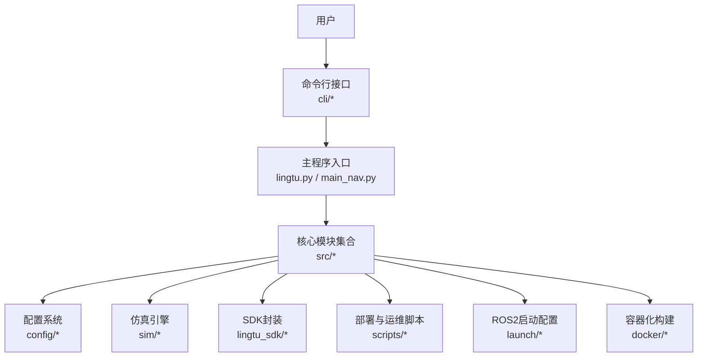
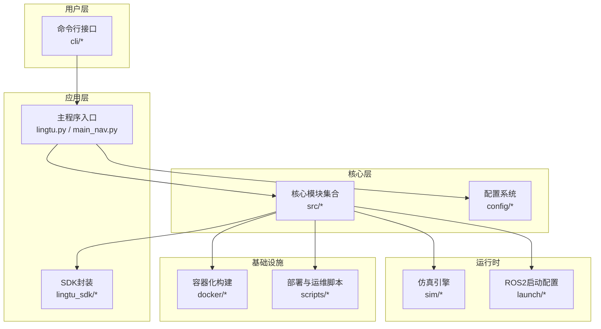
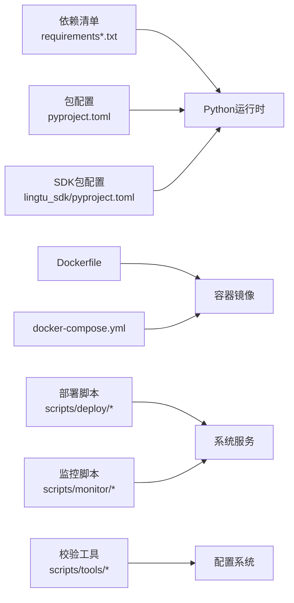

# 快速开始

<cite>
**本文引用的文件**
- [README.md](file://README.md)
- [QUICKSTART.md](file://docs/QUICKSTART.md)
- [BUILD_GUIDE.md](file://docs/01-getting-started/BUILD_GUIDE.md)
- [PARAMETER_TUNING.md](file://docs/03-development/PARAMETER_TUNING.md)
- [TROUBLESHOOTING.md](file://docs/03-development/TROUBLESHOOTING.md)
- [README.md](file://docs/04-deployment/README.md)
- [install.sh](file://docs/04-deployment/services/install.sh)
- [lingtu.service](file://docs/04-deployment/services/lingtu.service)
- [robot-brainstem.service](file://docs/04-deployment/services/robot-brainstem.service)
- [robot-camera.service](file://docs/04-deployment/services/robot-camera.service)
- [robot-fastlio2.service](file://docs/04-deployment/services/robot-fastlio2.service)
- [robot-lidar.service](file://docs/04-deployment/services/robot-lidar.service)
- [robot-localizer.service](file://docs/04-deployment/services/robot-localizer.service)
- [ros2-env.sh](file://docs/04-deployment/services/ros2-env.sh)
- [deploy.sh](file://scripts/deploy/deploy.sh)
- [health_check.sh](file://scripts/deploy/health_check.sh)
- [lingtu.sh](file://scripts/lingtu.sh)
- [requirements.txt](file://requirements.txt)
- [requirements-dev.txt](file://requirements-dev.txt)
- [requirements-agent.txt](file://requirements-agent.txt)
- [pyproject.toml](file://pyproject.toml)
- [pyproject.toml](file://lingtu_sdk/pyproject.toml)
- [docker/Dockerfile](file://docker/Dockerfile)
- [docker/Dockerfile.dev](file://docker/Dockerfile.dev)
- [docker-compose.yml](file://docker-compose.yml)
- [main_nav.py](file://main_nav.py)
- [lingtu.py](file://lingtu.py)
- [lingtu_cli.py](file://lingtu_cli.py)
- [bootstrap.py](file://cli/bootstrap.py)
- [runtime_display.py](file://cli/runtime_display.py)
- [runtime_extra.py](file://cli/runtime_extra.py)
- [run_state.py](file://cli/run_state.py)
- [term.py](file://cli/term.py)
- [ui.py](file://cli/ui.py)
- [profiles_data.py](file://cli/profiles_data.py)
- [devices.yaml](file://config/devices.yaml)
- [robot_config.yaml](file://config/robot_config.yaml)
- [semantic_exploration.yaml](file://config/semantic_exploration.yaml)
- [semantic_perception.yaml](file://config/semantic_perception.yaml)
- [semantic_planner.yaml](file://config/semantic_planner.yaml)
- [semantic_scoring.yaml](file://config/semantic_scoring.yaml)
- [topic_contract.yaml](file://config/topic_contract.yaml)
- [cyclonedds.xml](file://config/cyclonedds.xml)
- [fastdds_no_shm.xml](file://config/fastdds_no_shm.xml)
- [go2rtc.yaml](file://config/go2rtc.yaml)
- [dufomap.toml](file://config/dufomap.toml)
- [pointlio.yaml](file://config/pointlio.yaml)
- [far_planner.yaml](file://config/far_planner.yaml)
- [endpoints.yaml](file://config/endpoints.yaml)
- [sim_full.sh](file://sim/scripts/sim_full.sh)
- [sim.launch.py](file://sim/launch/sim.launch.py)
- [gazebo_simulation.launch.py](file://launch/gazebo_simulation.launch.py)
- [cmu_unity_lingtu_adapter.launch.py](file://launch/profiles/cmu_unity_lingtu_adapter.launch.py)
- [localizer_icp.launch.py](file://launch/profiles/localizer_icp.launch.py)
- [planner_far.launch.py](file://launch/profiles/planner_far.launch.py)
- [planner_pct.launch.py](file://launch/profiles/planner_pct.launch.py)
- [planner_pct_py.launch.py](file://launch/profiles/planner_pct_py.launch.py)
- [slam_fastlio2.launch.py](file://launch/profiles/slam_fastlio2.launch.py)
- [slam_pointlio.launch.py](file://launch_profiles/slam_pointlio.launch.py)
- [slam_stub.launch.py](file://launch/profiles/slam_stub.launch.py)
- [install_deps.sh](file://scripts/deploy/install_deps.sh)
- [setup_network.sh](file://scripts/deploy/setup_network.sh)
- [setup_semantic.sh](file://scripts/deploy/setup_semantic.sh)
- [install_semantic_deps.sh](file://scripts/deploy/install_semantic_deps.sh)
- [scaffold_robot.py](file://scripts/scaffold_robot.py)
- [doctor.py](file://scripts/doctor.py)
- [validate_config.py](file://scripts/tools/validate_config.py)
- [validate_topics.py](file://scripts/tools/validate_topics.py)
- [runtime_contract.py](file://scripts/monitor/runtime_contract.py)
- [manager.py](file://scripts/manager/manager.py)
- [diagnose_thunder.py](file://scripts/tools/diagnose_thunder.py)
- [super_lio_backend.md](file://docs/04-deployment/super_lio_backend.md)
- [lingtu_cli.md](file://docs/04-deployment/lingtu_cli.md)
- [README.md](file://sim/README.md)
- [README.md](file://calibration/README.md)
- [README.md](file://calibration/camera_lidar/README.md)
- [README.md](file://calibration/imu/README.md)
- [README.md](file://calibration/lidar_imu/README.md)
- [README.md](file://research/README.md)
- [README.md](file://docs/archive/09-paper/README.md)
- [README.md](file://docs/archive/presentations/README.md)
- [README.md](file://docs/archive/guides/README.md)
</cite>

## 目录
1. [简介](#简介)
2. [项目结构](#项目结构)
3. [核心组件](#核心组件)
4. [架构总览](#架构总览)
5. [详细组件分析](#详细组件分析)
6. [依赖关系分析](#依赖关系分析)
7. [性能考虑](#性能考虑)
8. [故障排除指南](#故障排除指南)
9. [结论](#结论)
10. [附录](#附录)

## 简介
本快速开始指南面向初学者与开发者，帮助您在本地或机器人平台上完成LingTu系统的安装、配置与启动。文档涵盖以下关键主题：
- 环境准备与依赖安装
- 多种运行模式选择：框架测试模式、开发模式、仿真模式、机器人实机模式
- 启动配置选项：LLM后端选择、守护进程模式等
- 常用生命周期命令：状态查询、日志查看、优雅停止、重启等
- 故障排除与常见问题解决

## 项目结构
LingTu系统采用模块化分层设计，核心目录与职责概览如下：
- docs：官方文档与指南，包含构建、部署、参数调优与故障排除
- config：系统配置文件，涵盖设备、机器人配置、语义感知/规划/探索、DDS/FastDDS、Go2RTC等
- scripts：部署、监控、诊断与运行脚本
- sim：仿真引擎与场景，支持Gazebo/Mujoco/Unity适配器
- src：核心源码，按功能域划分模块（导航、SLAM、语义、网关、内存等）
- cli：命令行界面与运行时管理工具
- docker：容器化构建与开发镜像
- launch：ROS2启动配置与仿真启动脚本
- lingtu_sdk：Python SDK与CLI封装
- examples：示例与演示脚本

**图表来源**
- [lingtu.py](file://lingtu.py)
- [main_nav.py](file://main_nav.py)
- [bootstrap.py](file://cli/bootstrap.py)
- [runtime_display.py](file://cli/runtime_display.py)

**章节来源**
- [README.md](file://README.md)
- [QUICKSTART.md](file://docs/QUICKSTART.md)

## 核心组件
- CLI与运行时管理：提供状态查询、日志查看、运行模式切换、守护进程控制等能力
- 配置系统：集中管理设备、机器人、语义、DDS、FastDDS、Go2RTC等配置
- 仿真引擎：支持Gazebo、Mujoco、Unity等多种仿真平台
- 核心模块：导航、SLAM、语义感知/规划/探索、网关、内存等
- SDK与示例：Python SDK与基础使用示例
- 容器化与部署：Dockerfile与compose定义，服务脚本与健康检查

**章节来源**
- [cli/bootstrap.py](file://cli/bootstrap.py)
- [cli/runtime_display.py](file://cli/runtime_display.py)
- [config/devices.yaml](file://config/devices.yaml)
- [config/robot_config.yaml](file://config/robot_config.yaml)
- [sim/README.md](file://sim/README.md)
- [src/README.md](file://src/README.md)
- [lingtu_sdk/pyproject.toml](file://lingtu_sdk/pyproject.toml)
- [docker/Dockerfile](file://docker/Dockerfile)
- [docker-compose.yml](file://docker-compose.yml)

## 架构总览
LingTu系统采用“配置驱动 + 模块化插件 + 仿真/实机双栈”的架构。下图展示了从CLI到核心模块、配置与仿真/实机的交互关系。

**图表来源**
- [lingtu.py](file://lingtu.py)
- [main_nav.py](file://main_nav.py)
- [src/README.md](file://src/README.md)
- [config/README.md](file://config/README.md)
- [sim/README.md](file://sim/README.md)
- [docker/Dockerfile](file://docker/Dockerfile)
- [docker-compose.yml](file://docker-compose.yml)
- [scripts/deploy/deploy.sh](file://scripts/deploy/deploy.sh)

## 详细组件分析

### 安装与环境准备
- Python环境与依赖
  - 使用根目录的依赖清单进行安装，建议先创建虚拟环境再安装生产与开发依赖
  - SDK独立依赖位于SDK包内
- 构建与打包
  - 参考构建指南，了解编译流程与产物
  - 如需容器化部署，可使用提供的Dockerfile与compose文件
- 系统服务与网络
  - 部署脚本提供服务安装、网络配置与健康检查
  - 服务单元文件定义了各子系统（如机器人脑干、相机、激光雷达、定位、SLAM等）的服务形态

**章节来源**
- [requirements.txt](file://requirements.txt)
- [requirements-dev.txt](file://requirements-dev.txt)
- [requirements-agent.txt](file://requirements-agent.txt)
- [pyproject.toml](file://pyproject.toml)
- [pyproject.toml](file://lingtu_sdk/pyproject.toml)
- [BUILD_GUIDE.md](file://docs/01-getting-started/BUILD_GUIDE.md)
- [docker/Dockerfile](file://docker/Dockerfile)
- [docker/Dockerfile.dev](file://docker/Dockerfile.dev)
- [docker-compose.yml](file://docker-compose.yml)
- [install.sh](file://docs/04-deployment/services/install.sh)
- [install_deps.sh](file://scripts/deploy/install_deps.sh)
- [setup_network.sh](file://scripts/deploy/setup_network.sh)

### 运行模式与启动配置
- 框架测试模式（无需硬件）
  - 通过仿真脚本与启动配置实现纯软件验证
  - 支持Gazebo/Mujoco/Unity适配器的最小化运行链路
- 开发模式
  - 结合CLI与调试工具，便于本地开发与联调
- 仿真模式
  - 使用仿真脚本与launch文件启动完整仿真栈
- 机器人实机模式
  - 通过服务单元与部署脚本在真实机器人上运行
  - 需要正确配置设备与机器人参数

启动配置要点：
- LLM后端选择：通过配置文件或环境变量指定后端类型与参数
- 守护进程模式：使用服务单元或CLI的后台运行选项
- DDS/FastDDS：根据部署环境选择共享内存或禁用共享内存的配置
- Go2RTC：用于音视频流集成

**章节来源**
- [sim_full.sh](file://sim/scripts/sim_full.sh)
- [sim.launch.py](file://sim/launch/sim.launch.py)
- [gazebo_simulation.launch.py](file://launch/gazebo_simulation.launch.py)
- [cmu_unity_lingtu_adapter.launch.py](file://launch/profiles/cmu_unity_lingtu_adapter.launch.py)
- [localizer_icp.launch.py](file://launch/profiles/localizer_icp.launch.py)
- [planner_far.launch.py](file://launch/profiles/planner_far.launch.py)
- [planner_pct.launch.py](file://launch/profiles/planner_pct.launch.py)
- [planner_pct_py.launch.py](file://launch/profiles/planner_pct_py.launch.py)
- [slam_fastlio2.launch.py](file://launch/profiles/slam_fastlio2.launch.py)
- [slam_pointlio.launch.py](file://launch_profiles/slam_pointlio.launch.py)
- [slam_stub.launch.py](file://launch/profiles/slam_stub.launch.py)
- [cyclonedds.xml](file://config/cyclonedds.xml)
- [fastdds_no_shm.xml](file://config/fastdds_no_shm.xml)
- [go2rtc.yaml](file://config/go2rtc.yaml)

### 生命周期命令与CLI
- 状态查询：查看当前运行状态、模块健康度与资源占用
- 日志查看：定位问题与审计运行轨迹
- 优雅停止：确保模块有序退出，避免数据丢失
- 重启：支持单模块或全栈重启
- 运行模式切换：在开发、仿真、实机之间切换
- 守护进程控制：以服务方式运行与管理

CLI能力由运行时显示、额外信息展示、运行状态管理与终端交互等模块协同实现。

**章节来源**
- [runtime_display.py](file://cli/runtime_display.py)
- [runtime_extra.py](file://cli/runtime_extra.py)
- [run_state.py](file://cli/run_state.py)
- [term.py](file://cli/term.py)
- [ui.py](file://cli/ui.py)
- [bootstrap.py](file://cli/bootstrap.py)
- [lingtu_cli.md](file://docs/04-deployment/lingtu_cli.md)

### 配置系统
- 设备配置：传感器、执行器与通信设备的参数
- 机器人配置：运动学、动力学与控制参数
- 语义配置：感知、规划、探索与评分的参数集
- 通信配置：DDS/FastDDS、端点与主题契约
- 其他：Go2RTC、DuFOMap、PointLIO、Far Planner等专项配置

配置校验与主题一致性检查工具可用于部署前验证。

**章节来源**
- [devices.yaml](file://config/devices.yaml)
- [robot_config.yaml](file://config/robot_config.yaml)
- [semantic_exploration.yaml](file://config/semantic_exploration.yaml)
- [semantic_perception.yaml](file://config/semantic_perception.yaml)
- [semantic_planner.yaml](file://config/semantic_planner.yaml)
- [semantic_scoring.yaml](file://config/semantic_scoring.yaml)
- [topic_contract.yaml](file://config/topic_contract.yaml)
- [validate_config.py](file://scripts/tools/validate_config.py)
- [validate_topics.py](file://scripts/tools/validate_topics.py)

### 仿真与实机桥接
- 仿真：提供Gazebo/Mujoco/Unity适配器，支持多场景与任务验证
- 实机：通过服务单元与部署脚本在机器人上运行，结合传感器驱动与控制模块

**章节来源**
- [sim/README.md](file://sim/README.md)
- [robot-brainstem.service](file://docs/04-deployment/services/robot-brainstem.service)
- [robot-camera.service](file://docs/04-deployment/services/robot-camera.service)
- [robot-lidar.service](file://docs/04-deployment/services/robot-lidar.service)
- [robot-localizer.service](file://docs/04-deployment/services/robot-localizer.service)
- [robot-fastlio2.service](file://docs/04-deployment/services/robot-fastlio2.service)

## 依赖关系分析
- 语言与包管理：Python依赖通过requirements与pyproject管理；SDK独立发布
- 构建与容器：Dockerfile与compose用于统一构建与部署
- 运维与监控：部署脚本、健康检查、运行时合约与监控机器人
- 仿真与实机：仿真脚本与launch文件连接核心模块与配置

**图表来源**
- [requirements.txt](file://requirements.txt)
- [requirements-dev.txt](file://requirements-dev.txt)
- [requirements-agent.txt](file://requirements-agent.txt)
- [pyproject.toml](file://pyproject.toml)
- [pyproject.toml](file://lingtu_sdk/pyproject.toml)
- [docker/Dockerfile](file://docker/Dockerfile)
- [docker-compose.yml](file://docker-compose.yml)
- [scripts/deploy/deploy.sh](file://scripts/deploy/deploy.sh)
- [scripts/monitor/runtime_contract.py](file://scripts/monitor/runtime_contract.py)
- [scripts/tools/validate_config.py](file://scripts/tools/validate_config.py)

**章节来源**
- [requirements.txt](file://requirements.txt)
- [requirements-dev.txt](file://requirements-dev.txt)
- [requirements-agent.txt](file://requirements-agent.txt)
- [pyproject.toml](file://pyproject.toml)
- [docker/Dockerfile](file://docker/Dockerfile)
- [docker-compose.yml](file://docker-compose.yml)
- [scripts/deploy/deploy.sh](file://scripts/deploy/deploy.sh)
- [scripts/monitor/runtime_contract.py](file://scripts/monitor/runtime_contract.py)

## 性能考虑
- 仿真性能：合理设置仿真步长、渲染与传感器噪声参数
- 通信开销：根据网络条件选择DDS/FastDDS配置，必要时禁用共享内存
- 资源占用：监控CPU/GPU/内存，按需调整模块并发与缓存大小
- 部署优化：使用容器化统一环境，减少依赖差异导致的性能波动

[本节为通用指导，不直接分析具体文件]

## 故障排除指南
- 部署与健康检查
  - 使用健康检查脚本验证系统关键服务状态
  - 通过服务单元日志定位启动失败原因
- 配置校验
  - 使用配置与主题校验工具提前发现参数错误
- 运行时诊断
  - 利用运行时合约与监控机器人收集证据
  - 使用诊断脚本定位Thunder相关问题
- 常见问题
  - 无法启动：检查服务单元、端口占用与权限
  - 通信异常：核对DDS/FastDDS配置与防火墙
  - 仿真卡顿：降低仿真负载或关闭渲染

**章节来源**
- [health_check.sh](file://scripts/deploy/health_check.sh)
- [validate_config.py](file://scripts/tools/validate_config.py)
- [validate_topics.py](file://scripts/tools/validate_topics.py)
- [runtime_contract.py](file://scripts/monitor/runtime_contract.py)
- [diagnose_thunder.py](file://scripts/tools/diagnose_thunder.py)
- [TROUBLESHOOTING.md](file://docs/03-development/TROUBLESHOOTING.md)

## 结论
通过本快速开始指南，您可以在本地或机器人平台上完成LingTu系统的安装与启动，并掌握不同运行模式与配置选项。建议在开发阶段优先使用仿真模式，在部署阶段配合服务单元与健康检查脚本保障稳定性。遇到问题时，利用配置校验、运行时诊断与监控工具快速定位并解决。

[本节为总结性内容，不直接分析具体文件]

## 附录

### 常用命令速查
- 启动系统：使用主程序入口或CLI命令
- 查看状态：通过CLI运行时显示模块
- 日志查看：查看对应服务单元日志
- 优雅停止：通过CLI或系统服务停止
- 重启：支持全栈或单模块重启
- 参数调优：参考参数调优文档与配置文件

**章节来源**
- [lingtu.py](file://lingtu.py)
- [main_nav.py](file://main_nav.py)
- [runtime_display.py](file://cli/runtime_display.py)
- [PARAMETER_TUNING.md](file://docs/03-development/PARAMETER_TUNING.md)

### 配置文件一览
- 设备与机器人：devices.yaml、robot_config.yaml
- 语义相关：semantic_exploration.yaml、semantic_perception.yaml、semantic_planner.yaml、semantic_scoring.yaml
- 通信与主题：topic_contract.yaml、cyclonedds.xml、fastdds_no_shm.xml、endpoints.yaml
- 其他：go2rtc.yaml、dufomap.toml、pointlio.yaml、far_planner.yaml

**章节来源**
- [devices.yaml](file://config/devices.yaml)
- [robot_config.yaml](file://config/robot_config.yaml)
- [semantic_exploration.yaml](file://config/semantic_exploration.yaml)
- [semantic_perception.yaml](file://config/semantic_perception.yaml)
- [semantic_planner.yaml](file://config/semantic_planner.yaml)
- [semantic_scoring.yaml](file://config/semantic_scoring.yaml)
- [topic_contract.yaml](file://config/topic_contract.yaml)
- [cyclonedds.xml](file://config/cyclonedds.xml)
- [fastdds_no_shm.xml](file://config/fastdds_no_shm.xml)
- [go2rtc.yaml](file://config/go2rtc.yaml)
- [dufomap.toml](file://config/dufomap.toml)
- [pointlio.yaml](file://config/pointlio.yaml)
- [far_planner.yaml](file://config/far_planner.yaml)