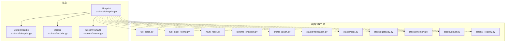
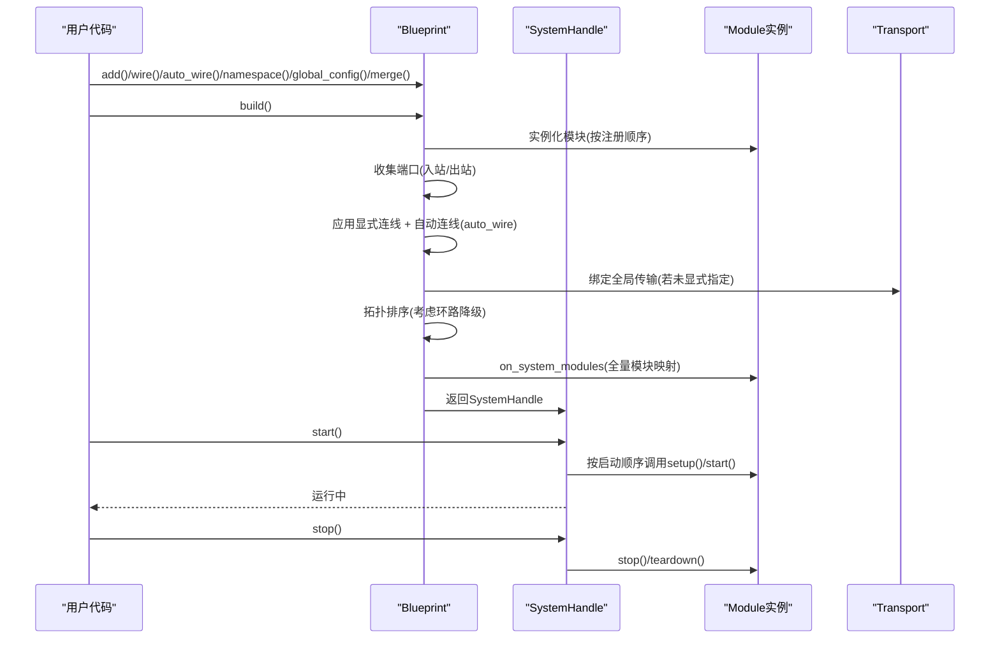
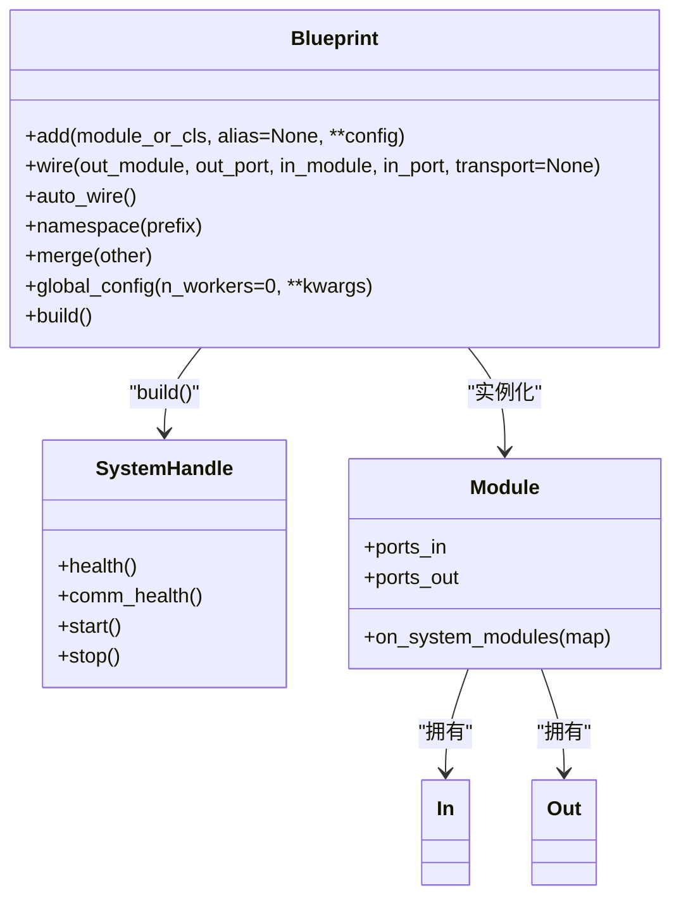
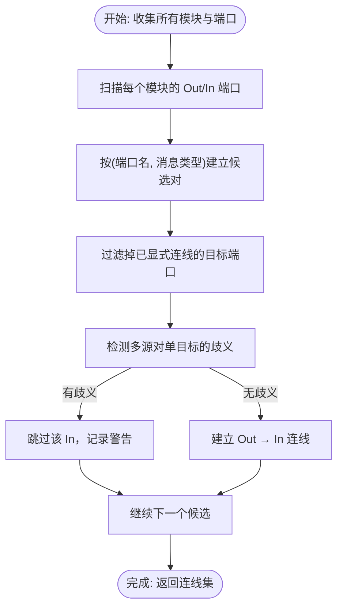
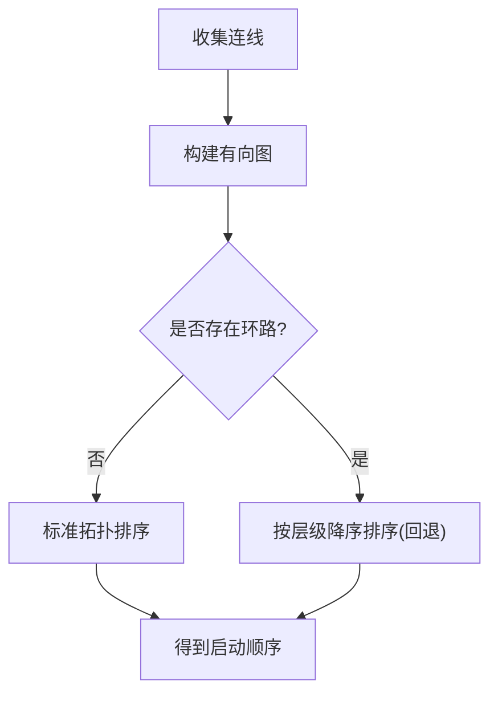
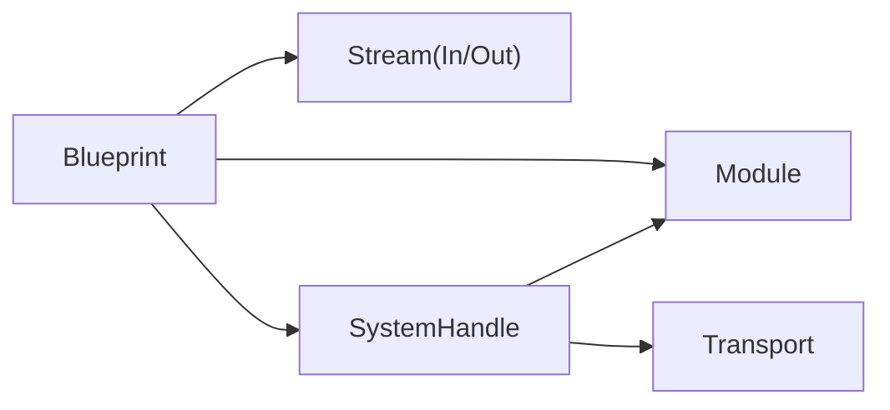

# 蓝图编排系统

<cite>
**本文引用的文件**
- [blueprint.py](file://src/core/blueprint.py)
- [test_core.py](file://src/core/tests/test_core.py)
- [test_perception_module.py](file://src/core/tests/test_perception_module.py)
- [module.py](file://src/core/module.py)
- [stream.py](file://src/core/stream.py)
- [full_stack.py](file://src/core/blueprints/full_stack.py)
- [full_stack_wiring.py](file://src/core/blueprints/full_stack_wiring.py)
- [multi_robot.py](file://src/core/blueprints/multi_robot.py)
- [runtime_endpoint.py](file://src/core/blueprints/runtime_endpoint.py)
- [profile_graph.py](file://src/core/blueprints/profile_graph.py)
- [navigation.py](file://src/core/blueprints/stacks/navigation.py)
- [lidar.py](file://src/core/blueprints/stacks/lidar.py)
- [gateway.py](file://src/core/blueprints/stacks/gateway.py)
- [memory.py](file://src/core/blueprints/stacks/memory.py)
- [driver.py](file://src/core/blueprints/stacks/driver.py)
- [_registry.py](file://src/core/blueprints/stacks/_registry.py)
</cite>

## 目录
1. [简介](#简介)
2. [项目结构](#项目结构)
3. [核心组件](#核心组件)
4. [架构总览](#架构总览)
5. [详细组件分析](#详细组件分析)
6. [依赖关系分析](#依赖关系分析)
7. [性能考量](#性能考量)
8. [故障排查指南](#故障排查指南)
9. [结论](#结论)
10. [附录](#附录)

## 简介
本文件系统性阐述 LingTu 核心蓝图编排系统的设计与实现，围绕 Blueprint 作为组合单元的理念，解释模块的声明式组装、自动连线（auto_wire）机制、显式连线规则，以及蓝图构建的完整流程：模块实例化、端口收集、连线应用、拓扑排序与启动顺序确定。同时覆盖命名空间处理、歧义解决策略、全局配置与工作进程模式、多机器人场景支持、扩展点与自定义选项，并提供从简单到复杂的使用示例。

## 项目结构
蓝图编排系统位于核心模块 src/core 下，关键入口为蓝图构建器 Blueprint；配套测试验证了自动连线、显式连线、合并与命名空间等行为；在 src/core/blueprints 子目录下提供了若干“栈”（stacks）与运行时工具，用于典型场景的快速装配与多机器人支持。

**图表来源**
- [blueprint.py:88-323](file://src/core/blueprint.py#L88-L323)
- [module.py](file://src/core/module.py)
- [stream.py](file://src/core/stream.py)

**章节来源**
- [blueprint.py:1-229](file://src/core/blueprint.py#L1-L229)

## 核心组件
- Blueprint：声明式模块编排构建器，负责注册模块、显式连线、自动连线开关、命名空间、全局配置与合并等。
- SystemHandle：单进程系统运行时句柄，封装模块集合、传输层、连线列表与启动顺序，提供健康状态查询与通信健康统计。
- Module：模块基类，定义端口（In/Out）、生命周期钩子与系统内模块发现回调。
- Stream：输入输出端口抽象，提供发布/订阅与传输绑定能力。

这些组件共同构成蓝图编排的“声明 + 运行时”的双层模型：声明阶段由 Blueprint 收集模块与连线，运行时由 SystemHandle 完成实例化、拓扑排序与启动。

**章节来源**
- [blueprint.py:88-323](file://src/core/blueprint.py#L88-L323)
- [module.py](file://src/core/module.py)
- [stream.py](file://src/core/stream.py)

## 架构总览
蓝图构建与运行时的关键流程如下：

**图表来源**
- [blueprint.py:291-323](file://src/core/blueprint.py#L291-L323)
- [blueprint.py:680-705](file://src/core/blueprint.py#L680-L705)

## 详细组件分析

### Blueprint 设计与方法族
- 注册模块：add(module_or_cls, alias=None, **config)，支持类或已实例化模块；同名冲突将抛出异常，需通过 alias 区分。
- 显式连线：wire(out_module, out_port, in_module, in_port, transport=None)，可为特定连线选择传输策略。
- 自动连线：auto_wire() 开启后，按“端口名+消息类型”进行匹配，跳过已显式连线的目标端口。
- 命名空间：namespace(prefix) 为模块别名与连线中的模块名添加前缀，避免合并蓝图时重名冲突。
- 合并蓝图：merge(other) 将另一个蓝图的所有模块与连线合并到当前蓝图。
- 全局配置：global_config(n_workers=0, ...) 设置工作进程数与其它系统级参数。
- 构建：build() 完成实例化、端口收集、连线应用、传输绑定、拓扑排序与启动顺序确定，返回 SystemHandle。

**图表来源**
- [blueprint.py:88-323](file://src/core/blueprint.py#L88-L323)
- [module.py](file://src/core/module.py)
- [stream.py](file://src/core/stream.py)

**章节来源**
- [blueprint.py:104-220](file://src/core/blueprint.py#L104-L220)
- [blueprint.py:178-192](file://src/core/blueprint.py#L178-L192)
- [blueprint.py:196-220](file://src/core/blueprint.py#L196-L220)
- [blueprint.py:223-229](file://src/core/blueprint.py#L223-L229)
- [blueprint.py:165-176](file://src/core/blueprint.py#L165-L176)
- [blueprint.py:291-323](file://src/core/blueprint.py#L291-L323)

### 自动连线（auto_wire）工作原理
- 规则要点
  - 同名且同消息类型端口优先匹配。
  - 已显式连线的目标端口会被跳过。
  - 单个 Out 可向多个 In 发送（广播）。
  - 若多个 Out 匹配单个 In，产生歧义，自动跳过并记录警告，需通过显式 wire 解决。
  - 不会自连接（同一模块的 Out→In）。
- 匹配策略
  - 基于端口名与消息类型（msg_type）进行精确匹配。
  - 对于多实例或命名空间场景，确保模块名前缀正确以避免误连。
- 测试验证
  - 同名同类型端口自动连通。
  - 多跳流水线中，显式连线解决歧义。
  - 合并蓝图后仍能正确自动连线。

**图表来源**
- [blueprint.py:532-677](file://src/core/blueprint.py#L532-L677)

**章节来源**
- [blueprint.py:178-192](file://src/core/blueprint.py#L178-L192)
- [test_core.py:556-590](file://src/core/tests/test_core.py#L556-L590)
- [test_core.py:591-634](file://src/core/tests/test_core.py#L591-L634)
- [test_core.py:863-893](file://src/core/tests/test_core.py#L863-L893)

### 拓扑排序与启动顺序
- 构建阶段在完成连线后执行拓扑排序，生成模块启动顺序。
- 若存在环路，系统会发出警告并采用按层级降序的回退策略，确保上层编排模块先就绪。
- SystemHandle 在启动时按顺序调用各模块的 setup()/start()。

**图表来源**
- [blueprint.py:666-677](file://src/core/blueprint.py#L666-L677)
- [blueprint.py:297-299](file://src/core/blueprint.py#L297-L299)

**章节来源**
- [blueprint.py:666-677](file://src/core/blueprint.py#L666-L677)
- [blueprint.py:297-299](file://src/core/blueprint.py#L297-L299)

### 命名空间与多实例
- namespace(prefix) 为模块别名与连线中的模块名添加前缀，避免合并蓝图时重名冲突。
- 典型用法：为多机器人场景的蓝图分别设置 robot_0、robot_1 等前缀，再合并。

**章节来源**
- [blueprint.py:196-220](file://src/core/blueprint.py#L196-L220)
- [test_core.py:635-651](file://src/core/tests/test_core.py#L635-L651)

### 全局配置与工作进程模式
- global_config(n_workers=0, ...) 支持设置工作进程数量与其它系统级参数。
- n_workers=0 表示单进程运行；>0 则启用多进程工作模式，由系统根据配置调度模块到不同工作进程。
- 该配置在 build() 阶段生效，影响模块实例化与传输绑定策略。

**章节来源**
- [blueprint.py:165-176](file://src/core/blueprint.py#L165-L176)
- [blueprint.py:291-323](file://src/core/blueprint.py#L291-L323)

### 蓝图栈与典型场景
- full_stack.py / full_stack_wiring.py：提供完整堆栈的蓝图装配与连线策略，适合端到端系统。
- stacks/*：导航、激光雷达、网关、内存、驱动等子栈，便于按功能域组合。
- multi_robot.py：多机器人场景的蓝图合并与命名空间管理。
- runtime_endpoint.py / profile_graph.py：运行时端点与性能画像工具，辅助调试与优化。

**章节来源**
- [full_stack.py](file://src/core/blueprints/full_stack.py)
- [full_stack_wiring.py](file://src/core/blueprints/full_stack_wiring.py)
- [multi_robot.py](file://src/core/blueprints/multi_robot.py)
- [runtime_endpoint.py](file://src/core/blueprints/runtime_endpoint.py)
- [profile_graph.py](file://src/core/blueprints/profile_graph.py)
- [navigation.py](file://src/core/blueprints/stacks/navigation.py)
- [lidar.py](file://src/core/blueprints/stacks/lidar.py)
- [gateway.py](file://src/core/blueprints/stacks/gateway.py)
- [memory.py](file://src/core/blueprints/stacks/memory.py)
- [driver.py](file://src/core/blueprints/stacks/driver.py)
- [_registry.py](file://src/core/blueprints/stacks/_registry.py)

## 依赖关系分析
- Blueprint 依赖 Module 与 Stream 抽象，构建阶段通过端口收集与连线应用完成模块间耦合。
- SystemHandle 依赖 Transport 与模块生命周期接口，负责启动顺序与健康状态聚合。
- 测试覆盖了自动连线、显式连线、合并、命名空间与多跳流水线等关键路径。

**图表来源**
- [blueprint.py:88-323](file://src/core/blueprint.py#L88-L323)
- [module.py](file://src/core/module.py)
- [stream.py](file://src/core/stream.py)

**章节来源**
- [blueprint.py:88-323](file://src/core/blueprint.py#L88-L323)

## 性能考量
- 自动连线的匹配复杂度与模块数量及端口数量成正比，建议在大规模系统中谨慎使用 auto_wire，必要时结合显式连线明确路径。
- 广播（单个 Out → 多个 In）可能带来带宽压力，应评估下游模块数量与数据速率。
- 多进程模式（n_workers>0）可提升吞吐，但需关注跨进程通信开销与同步成本。
- 拓扑排序在存在环路时采用回退策略，避免死锁，但可能影响启动时序，应尽量保持无环的数据流。

## 故障排查指南
- 重复模块名：当同名模块多次添加且未设置 alias 时会抛出异常。请使用 alias 区分。
- 命名空间冲突：合并蓝图前务必为不同组模块设置不同前缀，避免重名。
- 自动连线歧义：出现“多个源匹配单个目标”的情况会跳过自动连线并记录警告。请使用显式 wire 明确路径。
- 环路与启动顺序：若系统提示环路，检查控制回路或反馈链路是否形成闭环；必要时调整模块层级或拆分子系统。
- 健康状态：通过 SystemHandle.health() 与 comm_health() 获取模块与通信健康信息，定位异常模块与丢包问题。

**章节来源**
- [blueprint.py:131-137](file://src/core/blueprint.py#L131-L137)
- [blueprint.py:178-192](file://src/core/blueprint.py#L178-L192)
- [blueprint.py:666-677](file://src/core/blueprint.py#L666-L677)
- [blueprint.py:1004-1033](file://src/core/blueprint.py#L1004-L1033)

## 结论
蓝图编排系统以 Blueprint 为核心，提供声明式模块组装与自动连线能力，辅以显式连线、命名空间与全局配置，满足从简单组合到复杂系统与多机器人场景的多样化需求。通过拓扑排序与启动顺序确定，系统在保证正确性的同时兼顾可维护性与可扩展性。配合栈与工具模块，开发者可以快速搭建端到端系统并进行性能优化与故障排查。

## 附录

### 使用示例索引
- 简单组合：添加两个模块并通过 auto_wire 自动连接同名同类型端口。
- 复杂系统编排：在多模块流水线中，利用显式连线解决歧义，保留 auto_wire 处理无歧义路径。
- 多机器人场景：为每个机器人的蓝图设置独立命名空间，再合并构建。

**章节来源**
- [test_core.py:497-517](file://src/core/tests/test_core.py#L497-L517)
- [test_core.py:518-576](file://src/core/tests/test_core.py#L518-L576)
- [test_core.py:577-590](file://src/core/tests/test_core.py#L577-L590)
- [test_core.py:591-634](file://src/core/tests/test_core.py#L591-L634)
- [test_core.py:863-893](file://src/core/tests/test_core.py#L863-L893)
- [test_perception_module.py:392-429](file://src/core/tests/test_perception_module.py#L392-L429)