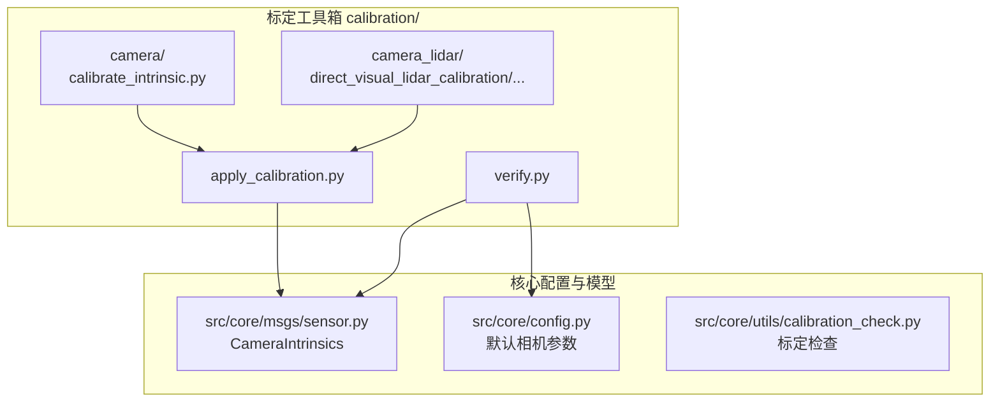
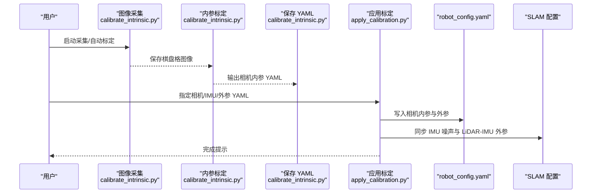
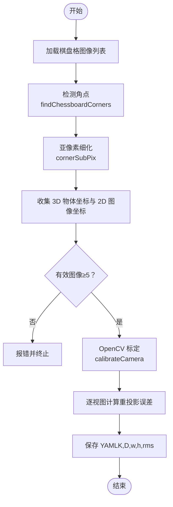
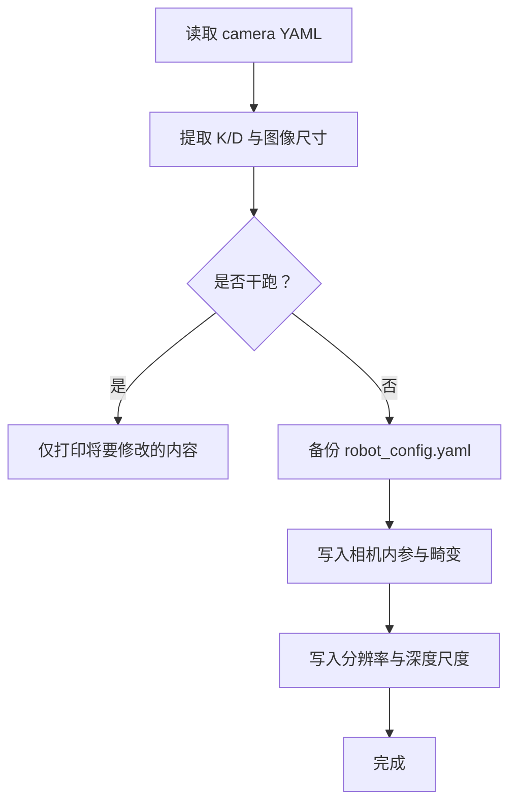
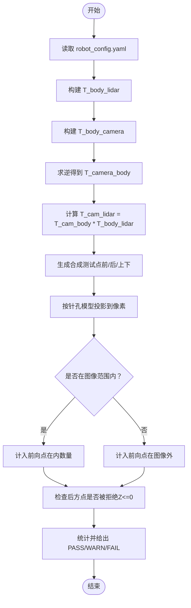
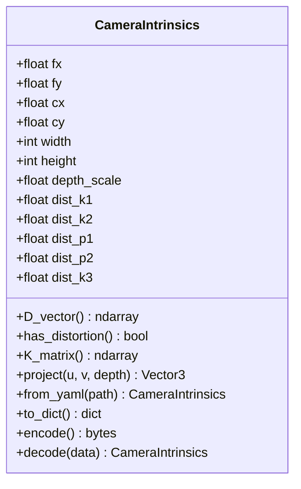
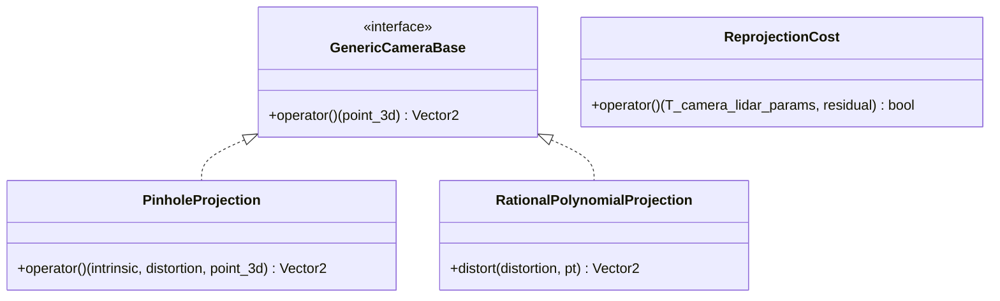
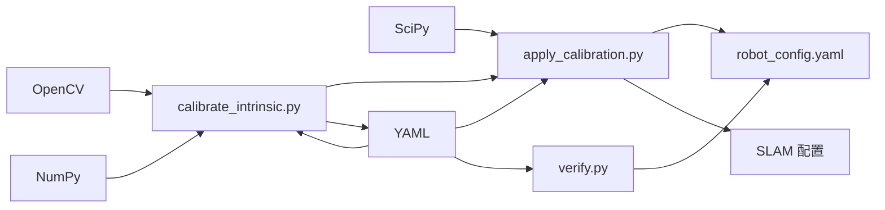

# 相机标定

<cite>
**本文引用的文件**
- [calibrate_intrinsic.py](file://calibration/camera/calibrate_intrinsic.py)
- [apply_calibration.py](file://calibration/apply_calibration.py)
- [verify.py](file://calibration/verify.py)
- [calibration/README.md](file://calibration/README.md)
- [sensor.py](file://src/core/msgs/sensor.py)
- [config.py](file://src/core/config.py)
- [calibration_check.py](file://src/core/utils/calibration_check.py)
- [test_calibration_check.py](file://src/core/tests/test_calibration_check.py)
- [reprojection_cost.hpp](file://calibration/camera_lidar/direct_visual_lidar_calibration/include/vlcal/costs/reprojection_cost.hpp)
- [create_camera.hpp](file://calibration/camera_lidar/direct_visual_lidar_calibration/include/camera/create_camera.hpp)
- [pinhole.hpp](file://calibration/camera_lidar/direct_visual_lidar_calibration/include/camera/pinhole.hpp)
- [rational_polynomial.hpp](file://calibration/camera_lidar/direct_visual_lidar_calibration/include/camera/rational_polynomial.hpp)
</cite>

## 目录
1. [引言](#引言)
2. [项目结构](#项目结构)
3. [核心组件](#核心组件)
4. [架构总览](#架构总览)
5. [详细组件分析](#详细组件分析)
6. [依赖关系分析](#依赖关系分析)
7. [性能考量](#性能考量)
8. [故障排除指南](#故障排除指南)
9. [结论](#结论)
10. [附录](#附录)

## 引言
本文件系统化梳理了仓库中的相机标定模块，重点覆盖相机内参标定（棋盘格）、畸变校正、标定质量评估与验证流程。内容从算法原理、实现细节、参数应用与验证、到最佳实践与故障排除，帮助读者快速获得高质量的相机标定结果。

## 项目结构
相机标定相关代码主要位于 calibration/ 目录，包含：
- camera：基于 OpenCV 的棋盘格内参标定脚本
- apply_calibration.py：将标定结果写入 robot_config.yaml 及 SLAM 配置
- verify.py：一键验证所有传感器标定参数
- camera_lidar：第三方相机-激光雷达外参标定工具链（用于外参标定）
- README.md：标定流程说明与参数落盘位置

图示来源
- [calibrate_intrinsic.py](file://calibration/camera/calibrate_intrinsic.py)
- [apply_calibration.py](file://calibration/apply_calibration.py)
- [verify.py](file://calibration/verify.py)
- [sensor.py](file://src/core/msgs/sensor.py)
- [config.py](file://src/core/config.py)
- [calibration_check.py](file://src/core/utils/calibration_check.py)

章节来源
- [calibration/README.md](file://calibration/README.md)
- [calibrate_intrinsic.py](file://calibration/camera/calibrate_intrinsic.py)
- [apply_calibration.py](file://calibration/apply_calibration.py)
- [verify.py](file://calibration/verify.py)

## 核心组件
- 棋盘格内参标定器：基于 OpenCV 的 findChessboardCorners、cornerSubPix、calibrateCamera 实现，输出 K、D、图像尺寸、RMS 重投影误差等
- 标定结果应用器：将相机内参写入 robot_config.yaml，并同步更新 Fast-LIO2/Point-LIO 配置；支持 LiDAR-IMU、相机-LiDAR 外参写入
- 标定验证器：对 robot_config.yaml 与 SLAM 配置进行一致性与合理性检查，包含焦距、主点、畸变、外参、LiDAR→Camera 投影链等检查
- 相机模型与数据结构：CameraIntrinsics 类封装内参、畸变、投影与 YAML 转换；工厂默认参数与旋转处理

章节来源
- [calibrate_intrinsic.py](file://calibration/camera/calibrate_intrinsic.py)
- [apply_calibration.py](file://calibration/apply_calibration.py)
- [verify.py](file://calibration/verify.py)
- [sensor.py](file://src/core/msgs/sensor.py)
- [config.py](file://src/core/config.py)

## 架构总览
下图展示了从采集棋盘格图像到生成并应用标定结果的端到端流程：

图示来源
- [calibrate_intrinsic.py](file://calibration/camera/calibrate_intrinsic.py)
- [apply_calibration.py](file://calibration/apply_calibration.py)

## 详细组件分析

### 组件一：棋盘格内参标定器（OpenCV）
- 功能要点
  - 棋盘格角点检测：findChessboardCorners + cornerSubPix 提升亚像素精度
  - 内参标定：calibrateCamera 返回 K、D、RMS、每幅图的重投影误差
  - YAML 输出：兼容 OpenCV 格式，含图像宽高、相机矩阵、畸变系数、RMS 等
  - 交互式采集：实时显示角点并按键保存
  - 从 ROS2 bag 提取图像并标定（headless）

- 数学原理与实现映射
  - 相机模型：针孔模型 + Brown-Conrady 畸变（k1,k2,p1,p2,k3）
  - 重投影误差：每视图重投影误差 = ||u_observed − u_projected|| / 角点数
  - RMS：整体标定误差，越小越好

- 关键流程图（标定主流程）

图示来源
- [calibrate_intrinsic.py](file://calibration/camera/calibrate_intrinsic.py)

章节来源
- [calibrate_intrinsic.py](file://calibration/camera/calibrate_intrinsic.py)

### 组件二：标定结果应用器（写入配置）
- 功能要点
  - 读取 YAML，提取相机内参与畸变，写入 robot_config.yaml 的 camera 节
  - 同步更新 Fast-LIO2/Point-LIO 的 IMU 噪声参数
  - 支持 LiDAR-IMU 外参（t_il、r_il、time_offset）写入
  - 支持相机-LiDAR 外参（T_lidar_camera），转换为相机在机器人坐标系的位置与姿态后写入
  - 写入前备份原配置

- 参数落盘位置
  - robot_config.yaml camera：fx、fy、cx、cy、width、height、dist_k1..k3、dist_p1..p2、position_x/y/z、roll/pitch/yaw
  - Fast-LIO2/Point-LIO：na/ng/nba/nbg、r_il、t_il、time_diff_lidar_to_imu

- 关键流程图（相机内参应用）

图示来源
- [apply_calibration.py](file://calibration/apply_calibration.py)

章节来源
- [apply_calibration.py](file://calibration/apply_calibration.py)

### 组件三：标定验证器（一键验证）
- 功能要点
  - 摄像头：检查焦距一致性、主点偏离度、畸变幅度、外参合理性、深度尺度
  - LiDAR：检查偏移幅度与旋转幅度
  - IMU：检查噪声参数范围与重力对齐开关
  - 交叉检查：相机与 LiDAR 外参一致性、LiDAR→Camera 投影链正确性（合成点投影验证）

- 关键流程图（LiDAR→Camera 投影链验证）

图示来源
- [verify.py](file://calibration/verify.py)

章节来源
- [verify.py](file://calibration/verify.py)

### 组件四：相机模型与数据结构（CameraIntrinsics）
- 数据结构
  - 内参：fx、fy、cx、cy、width、height、depth_scale
  - 畸变：dist_k1..k3、dist_p1..p2
  - 工具属性：D_vector、has_distortion、K_matrix、project(u,v,depth)

- YAML 转换
  - from_yaml：从 OpenCV 兼容 YAML 加载
  - to_dict/encode/decode：序列化与二进制编码

- 关键类图

图示来源
- [sensor.py](file://src/core/msgs/sensor.py)

章节来源
- [sensor.py](file://src/core/msgs/sensor.py)

### 组件五：相机-激光雷达外参标定（第三方工具链）
- 工具链特性
  - 支持多种相机模型：plumb_bob、fisheye、atan、omnidir、equirectangular
  - 重投影残差代价函数：ReprojectionCost
  - 相机模型工厂：create_camera，按模型名选择投影/畸变实现

- 关键类图（相机模型与代价函数）

图示来源
- [create_camera.hpp](file://calibration/camera_lidar/direct_visual_lidar_calibration/include/camera/create_camera.hpp)
- [pinhole.hpp](file://calibration/camera_lidar/direct_visual_lidar_calibration/include/camera/pinhole.hpp)
- [rational_polynomial.hpp](file://calibration/camera_lidar/direct_visual_lidar_calibration/include/camera/rational_polynomial.hpp)
- [reprojection_cost.hpp](file://calibration/camera_lidar/direct_visual_lidar_calibration/include/vlcal/costs/reprojection_cost.hpp)

章节来源
- [create_camera.hpp](file://calibration/camera_lidar/direct_visual_lidar_calibration/include/camera/create_camera.hpp)
- [pinhole.hpp](file://calibration/camera_lidar/direct_visual_lidar_calibration/include/camera/pinhole.hpp)
- [rational_polynomial.hpp](file://calibration/camera_lidar/direct_visual_lidar_calibration/include/camera/rational_polynomial.hpp)
- [reprojection_cost.hpp](file://calibration/camera_lidar/direct_visual_lidar_calibration/include/vlcal/costs/reprojection_cost.hpp)

## 依赖关系分析
- 模块耦合
  - calibrate_intrinsic.py 与 OpenCV/NumPy/YAML 紧密耦合，负责数据采集与标定
  - apply_calibration.py 依赖 robot_config.yaml 与 SLAM 配置路径，负责参数落盘
  - verify.py 依赖 robot_config.yaml 与 SLAM 配置，负责一致性与合理性检查
  - sensor.py 中的 CameraIntrinsics 作为跨模块的数据契约，被 apply/verify 使用

- 外部依赖
  - OpenCV：角点检测、亚像素细化、相机标定、畸变校正
  - ROS2：bag 提取、消息反序列化（用于从 bag 标定）
  - NumPy/SciPy：数值计算与四元数转换
  - YAML：配置读写

图示来源
- [calibrate_intrinsic.py](file://calibration/camera/calibrate_intrinsic.py)
- [apply_calibration.py](file://calibration/apply_calibration.py)
- [verify.py](file://calibration/verify.py)

章节来源
- [calibrate_intrinsic.py](file://calibration/camera/calibrate_intrinsic.py)
- [apply_calibration.py](file://calibration/apply_calibration.py)
- [verify.py](file://calibration/verify.py)

## 性能考量
- 角点检测与亚像素细化
  - cornerSubPix 的窗口大小与迭代阈值影响角点精度与耗时，建议在保证精度前提下适度缩小窗口
- 标定样本数量与分布
  - 建议至少 15 张以上，覆盖全视场、不同姿态与光照，避免局部最优
- 重投影误差与收敛
  - RMS 偏大需增加样本或调整棋盘格尺寸；过小可能标注尺寸错误或过度拟合
- 应用与验证
  - apply/verify 为纯 Python，I/O 为主要瓶颈；可批量处理时合并调用以减少重复加载

## 故障排除指南
- 常见问题与诊断
  - 主点偏离中心：主点距离图像中心过大（>15%）需重新标定
  - 畸变系数异常：k1/k2 绝对值过大（>2）或全部为 0 需检查棋盘格覆盖率与样本质量
  - 外参全零：相机位置为 (0,0,0) 表示未标定，需重新进行相机-LiDAR 外参标定
  - LiDAR 偏移过大/过小：幅度异常需检查安装与外参标定
  - IMU 噪声异常：超出 ICM-40609 典型范围需检查录制环境与单位转换
  - LiDAR→Camera 投影链失败：检查相机/激光雷达外参一致性与旋转表示

- 建议修复措施
  - 增加棋盘格样本数量与覆盖范围，确保角点清晰可见
  - 使用 verify.py 进行一键检查，定位具体传感器与参数
  - apply_calibration.py 支持 dry-run 预览修改，确认后再写入
  - 若从 bag 标定，确保采样间隔合理并过滤无效帧

章节来源
- [verify.py](file://calibration/verify.py)
- [apply_calibration.py](file://calibration/apply_calibration.py)
- [calibration_check.py](file://src/core/utils/calibration_check.py)
- [test_calibration_check.py](file://src/core/tests/test_calibration_check.py)

## 结论
本标定模块以 OpenCV 为核心，结合工厂级的参数应用与验证机制，形成“采集—标定—应用—验证”的闭环。通过严格的参数检查与投影链验证，能够显著提升标定质量与系统稳定性。配合第三方相机-LiDAR 外参工具链，可进一步完善多传感器融合的标定体系。

## 附录

### 标定质量评估方法
- 重投影误差
  - RMS：整体标定误差，越小越好
  - 每视图重投影误差：用于识别异常样本
- 畸变校正效果
  - 观察畸变系数幅度与分布，必要时增加样本或调整棋盘格尺寸
- 外参一致性
  - LiDAR→Camera 投影链：合成点投影验证，确保前向点在图像内、后向点被拒绝

章节来源
- [calibrate_intrinsic.py](file://calibration/camera/calibrate_intrinsic.py)
- [verify.py](file://calibration/verify.py)

### 标定参数的应用与验证流程
- 应用流程
  - 生成 camera_calib.yaml → apply_calibration.py → robot_config.yaml 与 SLAM 配置
- 验证流程
  - verify.py 一键检查：焦距、主点、畸变、外参、投影链、IMU 噪声
- 稳定性测试
  - 多次采集与标定，比较 RMS 与参数变化范围；检查不同光照与距离下的重投影误差

章节来源
- [apply_calibration.py](file://calibration/apply_calibration.py)
- [verify.py](file://calibration/verify.py)

### 最佳实践指南
- 环境要求
  - 稳定光源，避免强反射与阴影；棋盘格清晰、对比度高
- 棋盘格制作
  - 推荐 9×6 内角点，方格边长精确测量并输入标定脚本
- 标定步骤
  - 多角度移动棋盘格，覆盖全视场；建议 15–25 张样本
- 参数调整
  - 如 RMS 偏大，增加样本或调整角点检测参数；如主点偏离，检查相机安装与标定板放置
- 结果检查
  - 使用 verify.py 快速定位问题；必要时回看采集图像与角点标注

章节来源
- [calibration/README.md](file://calibration/README.md)
- [calibrate_intrinsic.py](file://calibration/camera/calibrate_intrinsic.py)
- [verify.py](file://calibration/verify.py)