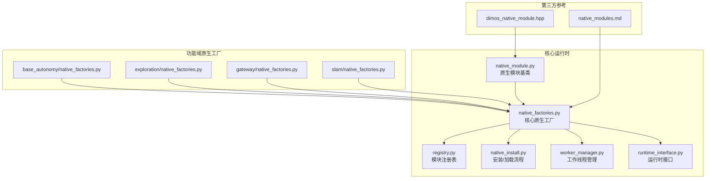
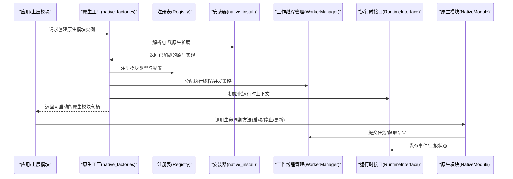
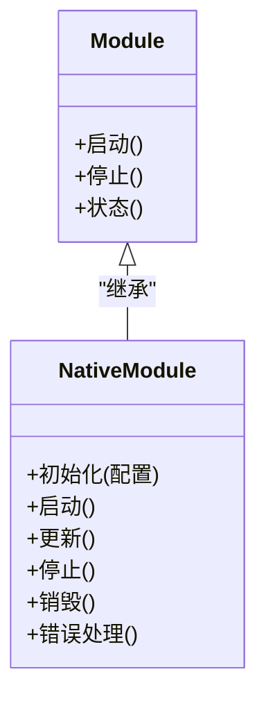
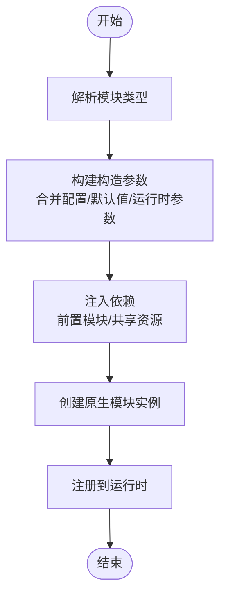
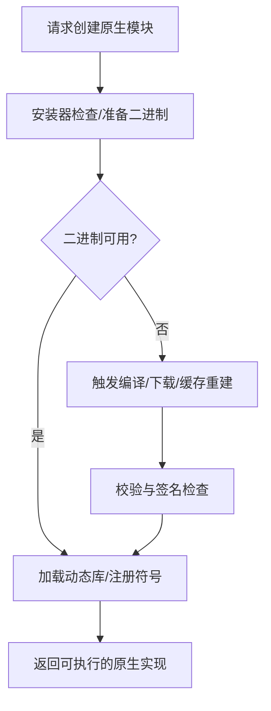
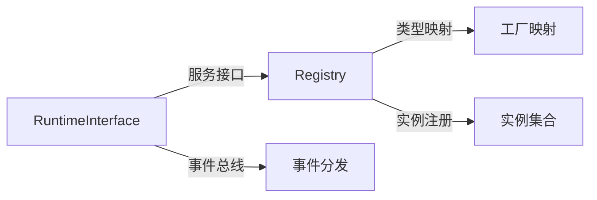
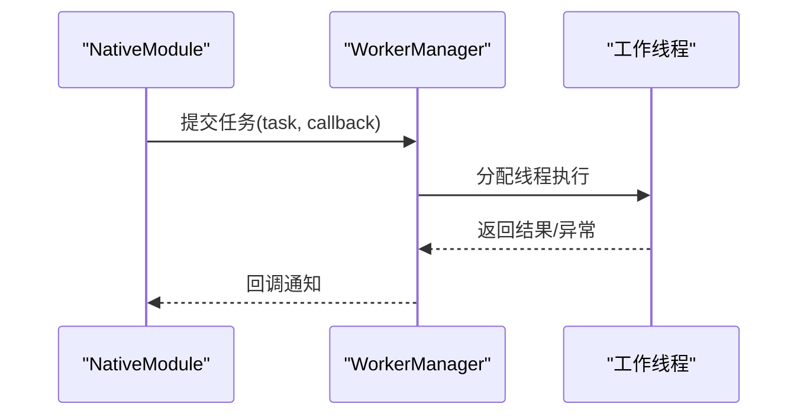
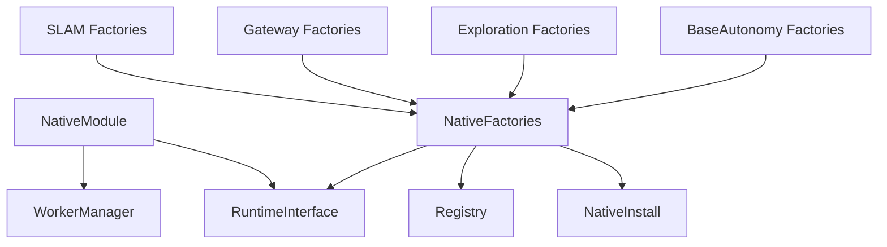

# 原生模块系统

<cite>
**本文引用的文件**
- [native_module.py](file://src/core/native_module.py)
- [native_factories.py](file://src/core/native_factories.py)
- [native_install.py](file://src/core/native_install.py)
- [module.py](file://src/core/module.py)
- [registry.py](file://src/core/registry.py)
- [runtime_interface.py](file://src/core/runtime_interface.py)
- [worker_manager.py](file://src/core/worker_manager.py)
- [test_native_module.py](file://src/core/tests/test_native_module.py)
- [native_factories.py](file://src/base_autonomy/native_factories.py)
- [native_factories.py](file://src/exploration/native_factories.py)
- [native_factories.py](file://src/gateway/native_factories.py)
- [native_factories.py](file://src/slam/native_factories.py)
- [native_module.hpp](file://third_party/dimos/hardware/sensors/lidar/common/dimos_native_module.hpp)
- [native_modules.md](file://third_party/dimos/docs/usage/native_modules.md)
</cite>

## 目录
1. [引言](#引言)
2. [项目结构](#项目结构)
3. [核心组件](#核心组件)
4. [架构总览](#架构总览)
5. [详细组件分析](#详细组件分析)
6. [依赖关系分析](#依赖关系分析)
7. [性能考虑](#性能考虑)
8. [故障排查指南](#故障排查指南)
9. [结论](#结论)
10. [附录](#附录)

## 引言
本文件系统性阐述 LingTu 原生模块系统的设计目标、实现机制与工程化实践，重点覆盖以下主题：
- NativeModule 的设计目的与在 Python 模块系统中的集成方式
- 生命周期管理、性能优化策略与 GIL 处理机制
- NativeModule 与普通 Module 的差异（运行环境、部署方式、通信协议）
- 原生工厂（native_factories）的作用：模块创建、配置注入、依赖管理
- 原生模块开发指南：C++ 代码编写规范、Python 绑定生成、性能调优
- 集成示例与最佳实践

## 项目结构
LingTu 将“原生模块”抽象为可插拔的执行单元，通过统一的工厂接口与运行时框架进行装配与调度。核心位置如下：
- 核心运行时与原生模块基类：src/core/native_module.py、src/core/native_factories.py、src/core/native_install.py
- 模块注册与运行时接口：src/core/registry.py、src/core/runtime_interface.py
- 工作线程与并发模型：src/core/worker_manager.py
- 各功能域原生工厂：src/base_autonomy/native_factories.py、src/exploration/native_factories.py、src/gateway/native_factories.py、src/slam/native_factories.py
- 测试：src/core/tests/test_native_module.py
- 第三方参考实现与文档：third_party/dimos/hardware/sensors/lidar/common/dimos_native_module.hpp、third_party/dimos/docs/usage/native_modules.md

图表来源
- [native_module.py](file://src/core/native_module.py)
- [native_factories.py](file://src/core/native_factories.py)
- [native_install.py](file://src/core/native_install.py)
- [registry.py](file://src/core/registry.py)
- [runtime_interface.py](file://src/core/runtime_interface.py)
- [worker_manager.py](file://src/core/worker_manager.py)
- [native_factories.py](file://src/base_autonomy/native_factories.py)
- [native_factories.py](file://src/exploration/native_factories.py)
- [native_factories.py](file://src/gateway/native_factories.py)
- [native_factories.py](file://src/slam/native_factories.py)
- [native_module.hpp](file://third_party/dimos/hardware/sensors/lidar/common/dimos_native_module.hpp)
- [native_modules.md](file://third_party/dimos/docs/usage/native_modules.md)

章节来源
- [native_module.py](file://src/core/native_module.py)
- [native_factories.py](file://src/core/native_factories.py)
- [native_install.py](file://src/core/native_install.py)
- [registry.py](file://src/core/registry.py)
- [runtime_interface.py](file://src/core/runtime_interface.py)
- [worker_manager.py](file://src/core/worker_manager.py)
- [native_factories.py](file://src/base_autonomy/native_factories.py)
- [native_factories.py](file://src/exploration/native_factories.py)
- [native_factories.py](file://src/gateway/native_factories.py)
- [native_factories.py](file://src/slam/native_factories.py)
- [native_module.hpp](file://third_party/dimos/hardware/sensors/lidar/common/dimos_native_module.hpp)
- [native_modules.md](file://third_party/dimos/docs/usage/native_modules.md)

## 核心组件
- 原生模块基类（NativeModule）：定义原生模块的生命周期钩子、状态管理、错误传播与资源回收等通用能力，作为所有 C++ 扩展模块在 Python 环境中的统一抽象。
- 原生工厂（native_factories）：集中声明各功能域的原生模块类型、构造参数、默认配置与依赖注入策略，屏蔽底层实现细节，向上提供一致的装配接口。
- 安装与加载（native_install）：负责原生二进制的发现、验证、加载与版本兼容性校验，确保模块在运行前具备可用的 C++ 扩展。
- 注册与运行时接口（registry/runtime_interface）：维护模块类型到工厂的映射，提供启动/停止、状态查询、事件分发等运行时服务。
- 工作线程管理（worker_manager）：为 CPU 密集型或需要隔离的原生任务提供线程池与调度策略，避免阻塞主线程与抢占式调度。

章节来源
- [native_module.py](file://src/core/native_module.py)
- [native_factories.py](file://src/core/native_factories.py)
- [native_install.py](file://src/core/native_install.py)
- [registry.py](file://src/core/registry.py)
- [runtime_interface.py](file://src/core/runtime_interface.py)
- [worker_manager.py](file://src/core/worker_manager.py)

## 架构总览
下图展示了从“原生工厂”到“原生模块”的装配链路，以及与运行时框架的交互：

图表来源
- [native_factories.py](file://src/core/native_factories.py)
- [registry.py](file://src/core/registry.py)
- [native_install.py](file://src/core/native_install.py)
- [worker_manager.py](file://src/core/worker_manager.py)
- [runtime_interface.py](file://src/core/runtime_interface.py)
- [native_module.py](file://src/core/native_module.py)

## 详细组件分析

### 原生模块基类（NativeModule）
- 设计目的
  - 在 Python 模块系统中统一承载 C++ 实现，提供生命周期、错误处理、资源管理与运行时交互的抽象。
  - 通过标准化接口屏蔽不同原生实现的差异，便于测试、替换与演进。
- 关键职责
  - 生命周期：初始化、启动、运行周期内的更新、停止与销毁。
  - 状态与事件：内部状态机、事件发布、错误码与异常传播。
  - 资源管理：内存、句柄、线程与外部资源的获取与释放。
- 与普通 Module 的区别
  - 运行环境：NativeModule 通常以 CPython C API 或 Cython 包裹的动态库形式存在，直接调用 C/C++；普通 Module 多为纯 Python 实现。
  - 部署方式：NativeModule 需要编译、打包与版本匹配；普通 Module 可直接以 .py 分发。
  - 通信协议：NativeModule 与 Python 层通过绑定层对接，可能涉及序列化/反序列化与跨语言数据转换；普通 Module 使用 Python 对象直接传递。
  - 性能特征：NativeModule 在计算密集场景具有显著优势，但引入跨语言开销与调试复杂度。

图表来源
- [module.py](file://src/core/module.py)
- [native_module.py](file://src/core/native_module.py)

章节来源
- [native_module.py](file://src/core/native_module.py)
- [module.py](file://src/core/module.py)

### 原生工厂（native_factories）
- 作用
  - 定义“原生模块类型”与“创建器”，封装构造参数、默认配置与依赖注入逻辑。
  - 将具体 C++ 实现与上层业务解耦，支持多实现切换与按需装配。
- 功能要点
  - 模块创建：根据类型名解析到对应工厂函数，传入配置字典完成实例化。
  - 配置注入：合并全局配置、域内配置与运行时参数，形成最终构造参数。
  - 依赖管理：声明前置模块、共享资源与线程/进程隔离策略。
- 典型域工厂
  - base_autonomy、exploration、gateway、slam 等子域均提供各自的 native_factories，遵循统一接口，便于按领域装配。

图表来源
- [native_factories.py](file://src/core/native_factories.py)
- [native_factories.py](file://src/base_autonomy/native_factories.py)
- [native_factories.py](file://src/exploration/native_factories.py)
- [native_factories.py](file://src/gateway/native_factories.py)
- [native_factories.py](file://src/slam/native_factories.py)

章节来源
- [native_factories.py](file://src/core/native_factories.py)
- [native_factories.py](file://src/base_autonomy/native_factories.py)
- [native_factories.py](file://src/exploration/native_factories.py)
- [native_factories.py](file://src/gateway/native_factories.py)
- [native_factories.py](file://src/slam/native_factories.py)

### 安装与加载（native_install）
- 目标
  - 在运行前完成原生扩展的发现、验证与加载，保证模块可用性与一致性。
- 关键流程
  - 版本与平台检测：确认 ABI、架构与依赖版本匹配。
  - 加载策略：优先使用预编译二进制，回退至源码编译或下载缓存。
  - 安全校验：完整性校验与沙箱策略，防止恶意扩展。
- 与工厂协作
  - 工厂在创建阶段调用安装器，确保二进制就绪后再进行实例化。

图表来源
- [native_install.py](file://src/core/native_install.py)
- [native_factories.py](file://src/core/native_factories.py)

章节来源
- [native_install.py](file://src/core/native_install.py)
- [native_factories.py](file://src/core/native_factories.py)

### 注册与运行时接口（registry/runtime_interface）
- 注册表（Registry）
  - 维护“模块类型 → 工厂/实现”的映射，支持动态注册与查询。
  - 保障类型安全与唯一性，避免重复注册与冲突。
- 运行时接口（RuntimeInterface）
  - 提供统一的启动/停止、状态查询、事件订阅/发布、资源访问等能力。
  - 作为 NativeModule 与系统其他部分的通信桥梁。

图表来源
- [registry.py](file://src/core/registry.py)
- [runtime_interface.py](file://src/core/runtime_interface.py)

章节来源
- [registry.py](file://src/core/registry.py)
- [runtime_interface.py](file://src/core/runtime_interface.py)

### 工作线程管理（worker_manager）
- 目标
  - 为原生模块提供线程池与调度策略，隔离 CPU 密集任务，避免阻塞主循环。
- 关键点
  - 任务提交与结果回调：将原生模块的任务提交给工作线程，完成后回调主线程。
  - 并发控制：限制并发度、设置优先级与超时策略。
  - 资源隔离：为每个原生模块分配独立线程或线程组，降低相互影响。

图表来源
- [worker_manager.py](file://src/core/worker_manager.py)
- [native_module.py](file://src/core/native_module.py)

章节来源
- [worker_manager.py](file://src/core/worker_manager.py)
- [native_module.py](file://src/core/native_module.py)

### 第三方参考：Dimos 原生模块
- 参考头文件：third_party/dimos/hardware/sensors/lidar/common/dimos_native_module.hpp
- 文档：third_party/dimos/docs/usage/native_modules.md
- 价值
  - 提供 C++ 原生模块的接口规范与实现范式，便于在 LingTu 中复用与对齐。
  - 作为跨语言绑定与生命周期管理的最佳实践参考。

章节来源
- [native_module.hpp](file://third_party/dimos/hardware/sensors/lidar/common/dimos_native_module.hpp)
- [native_modules.md](file://third_party/dimos/docs/usage/native_modules.md)

## 依赖关系分析
- 组件耦合
  - NativeModule 依赖于运行时接口与工作线程管理，用于事件与任务调度。
  - 原生工厂依赖于安装器与注册表，确保二进制可用与类型注册。
  - 各功能域工厂依赖核心工厂与运行时框架，形成“域内装配 + 核心协调”的分层结构。
- 外部依赖
  - C/C++ 编译链、Python C-API/Cython、动态库加载器与操作系统线程/进程模型。
- 循环依赖风险
  - 通过“工厂 → 安装器 → 注册表 → 运行时接口”的单向依赖链降低循环风险。

图表来源
- [native_module.py](file://src/core/native_module.py)
- [runtime_interface.py](file://src/core/runtime_interface.py)
- [worker_manager.py](file://src/core/worker_manager.py)
- [native_factories.py](file://src/core/native_factories.py)
- [native_install.py](file://src/core/native_install.py)
- [registry.py](file://src/core/registry.py)
- [native_factories.py](file://src/base_autonomy/native_factories.py)
- [native_factories.py](file://src/exploration/native_factories.py)
- [native_factories.py](file://src/gateway/native_factories.py)
- [native_factories.py](file://src/slam/native_factories.py)

章节来源
- [native_module.py](file://src/core/native_module.py)
- [runtime_interface.py](file://src/core/runtime_interface.py)
- [worker_manager.py](file://src/core/worker_manager.py)
- [native_factories.py](file://src/core/native_factories.py)
- [native_install.py](file://src/core/native_install.py)
- [registry.py](file://src/core/registry.py)
- [native_factories.py](file://src/base_autonomy/native_factories.py)
- [native_factories.py](file://src/exploration/native_factories.py)
- [native_factories.py](file://src/gateway/native_factories.py)
- [native_factories.py](file://src/slam/native_factories.py)

## 性能考虑
- 生命周期优化
  - 将昂贵的初始化（如模型加载、硬件探测）延迟到首次使用或显式预热，减少冷启动时间。
  - 在停止阶段进行幂等清理，避免重复释放与泄漏。
- 并发与调度
  - 使用工作线程管理隔离 CPU 密集任务，主线程保持响应性。
  - 采用有界队列与背压策略，防止任务堆积导致内存膨胀。
- 内存与资源
  - 明确所有权与生命周期边界，避免跨语言对象悬空或双重释放。
  - 对大对象采用池化或复用策略，降低频繁分配带来的 GC 压力。
- GIL 处理
  - 在 Python 绑定中谨慎持有与释放 GIL，仅在必要时进入 C/C++ 临界区。
  - 对长时间计算的任务，尽量在 C++ 内部完成，减少 Python 层调用次数。
- 序列化与通信
  - 减少跨语言数据拷贝，优先使用零拷贝或共享内存方案（视平台与协议而定）。
  - 对高频消息采用二进制协议与批量发送，降低协议开销。

## 故障排查指南
- 常见问题
  - 模块无法加载：检查安装器日志与二进制完整性，确认平台与版本匹配。
  - 启动失败：查看工厂配置合并是否正确，前置模块是否已就绪。
  - 运行卡顿：检查工作线程队列长度与任务粒度，评估是否需要拆分或并行化。
  - 跨语言异常：核对 Python 绑定层的异常捕获与转换逻辑，确保错误信息可追踪。
- 排查步骤
  - 启用详细日志：在安装器、工厂与运行时接口处开启调试输出。
  - 单元测试：利用核心测试用例验证生命周期与关键路径。
  - 回归最小化：逐步禁用非关键模块，定位问题范围。
- 参考测试
  - 核心测试文件可用于验证原生模块的生命周期与行为一致性。

章节来源
- [test_native_module.py](file://src/core/tests/test_native_module.py)

## 结论
LingTu 原生模块系统通过“原生模块基类 + 原生工厂 + 安装器 + 注册表 + 运行时接口 + 工作线程管理”的分层架构，实现了 C++ 原生能力与 Python 模块系统的无缝融合。该体系在保证可维护性的同时，兼顾了性能与可扩展性，并提供了清晰的开发与运维路径。建议在实际工程中严格遵循本文的开发规范与最佳实践，以获得稳定、高效且易维护的原生模块生态。

## 附录
- 开发指南（概要）
  - C++ 代码编写规范
    - 明确导出接口与命名空间，避免符号污染。
    - 实现 RAII 资源管理，确保异常安全。
    - 对外暴露稳定的 ABI，避免频繁破坏性变更。
  - Python 绑定生成
    - 使用 Cython 或 Pybind11 生成绑定层，确保类型安全与性能。
    - 在绑定层中妥善处理 GIL 与异常转换。
  - 性能调优
    - 识别热点路径，采用多线程/多进程并行化。
    - 优化数据结构与算法，减少跨语言调用次数。
  - 集成示例与最佳实践
    - 在功能域工厂中声明模块类型与默认配置，确保可装配性。
    - 利用安装器进行版本与平台校验，避免运行期不兼容。
    - 通过测试用例覆盖关键路径，建立回归保障。