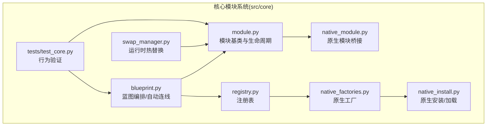
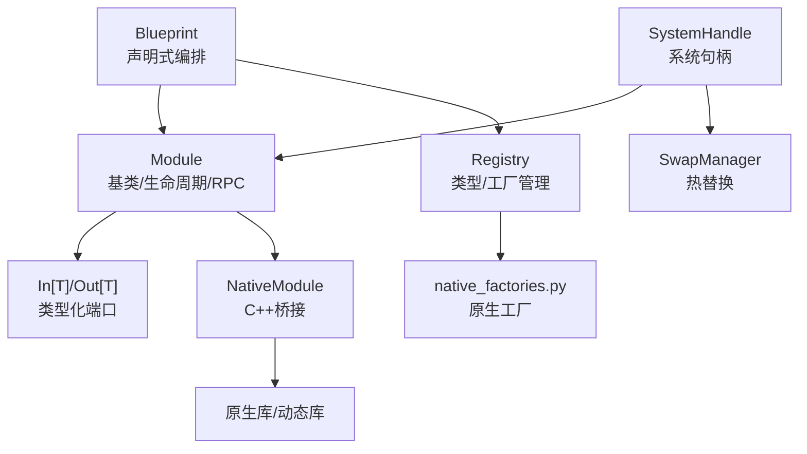
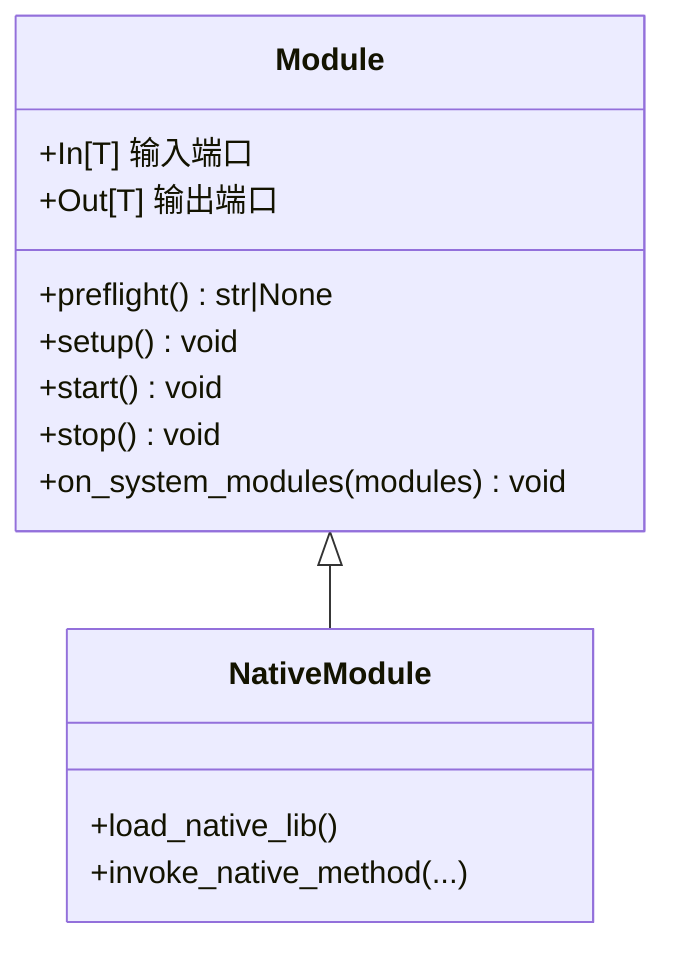
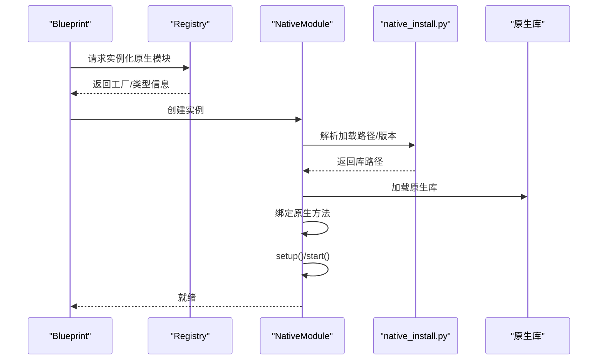
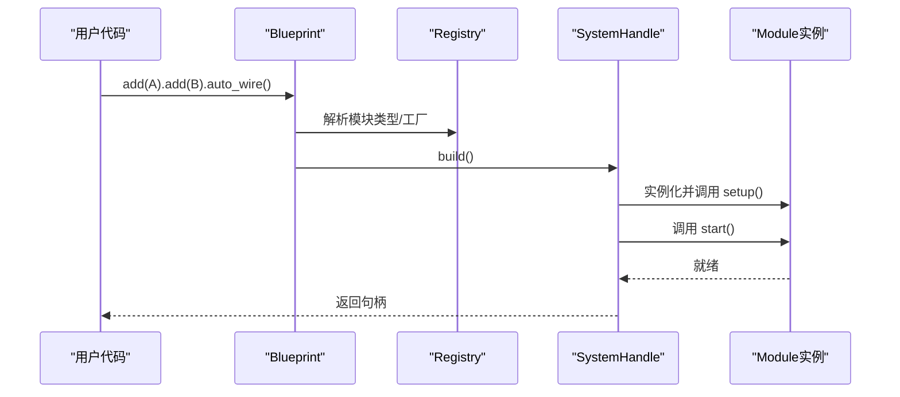
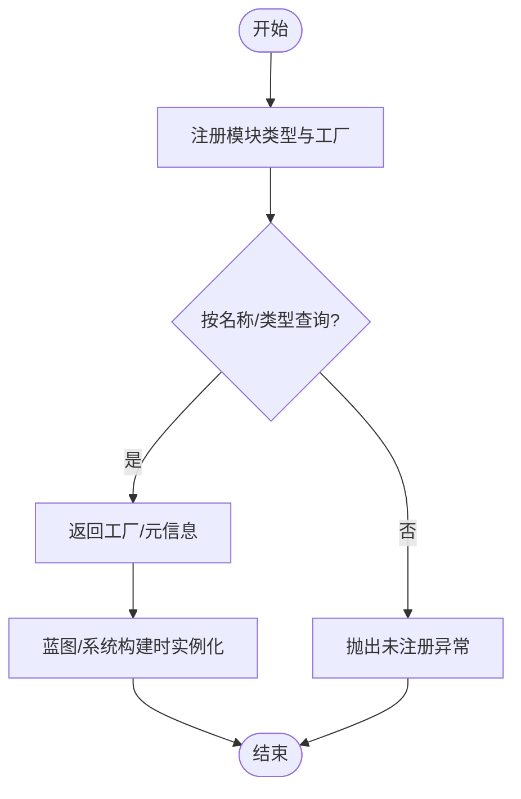
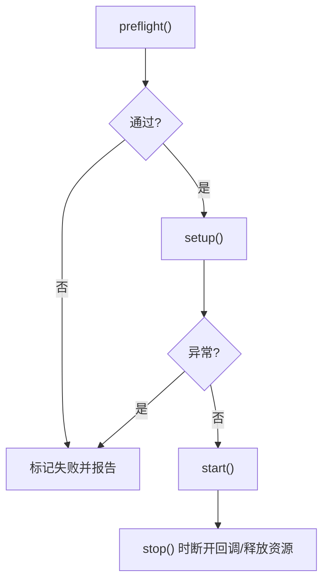
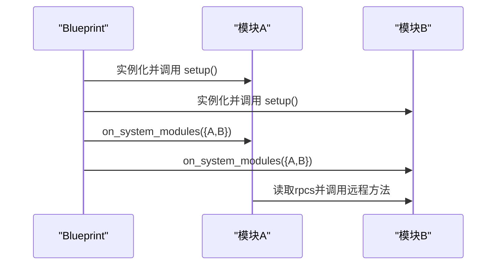
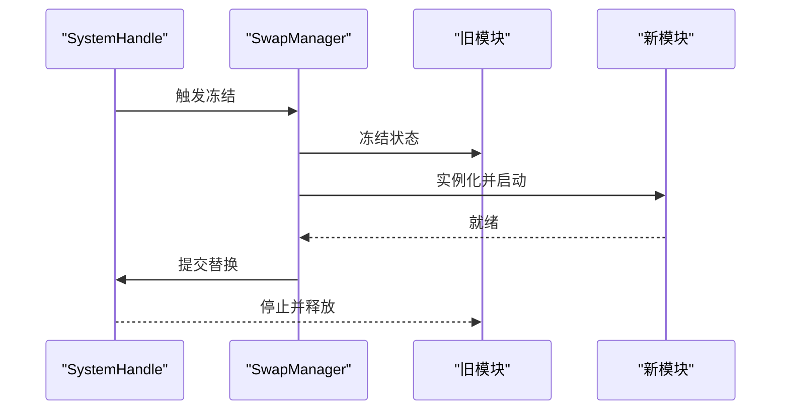
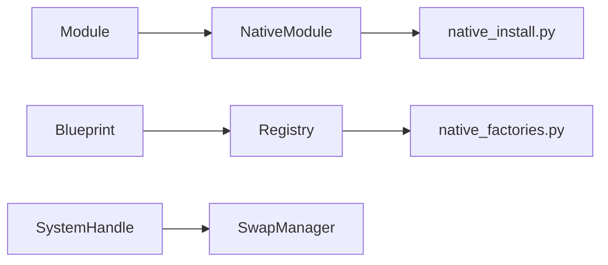

# 核心模块系统

<cite>
**本文引用的文件**
- [module.py](file://src/core/module.py)
- [native_module.py](file://src/core/native_module.py)
- [blueprint.py](file://src/core/blueprint.py)
- [registry.py](file://src/core/registry.py)
- [native_factories.py](file://src/core/native_factories.py)
- [native_install.py](file://src/core/native_install.py)
- [test_core.py](file://src/core/tests/test_core.py)
- [swap_manager.py](file://src/core/swap_manager.py)
</cite>

## 目录
1. [引言](#引言)
2. [项目结构](#项目结构)
3. [核心组件](#核心组件)
4. [架构总览](#架构总览)
5. [详细组件分析](#详细组件分析)
6. [依赖关系分析](#依赖关系分析)
7. [性能考量](#性能考量)
8. [故障排查指南](#故障排查指南)
9. [结论](#结论)
10. [附录](#附录)

## 引言
本文件系统性梳理 LingTu 的核心模块系统，围绕模块接口定义、生命周期管理、注册与发现机制、蓝图编排、以及 Native 模块与 C++ 集成展开。目标是帮助开发者快速理解并高效扩展模块系统。

## 项目结构
核心模块系统主要位于 src/core 目录，关键文件包括：
- 模块基类与生命周期：module.py
- 原生模块桥接：native_module.py
- 蓝图编排与自动连线：blueprint.py
- 注册表与工厂：registry.py、native_factories.py、native_install.py
- 运行时热替换与系统句柄：swap_manager.py
- 单元测试与行为验证：src/core/tests/test_core.py

**图表来源**
- [module.py](file://src/core/module.py)
- [native_module.py](file://src/core/native_module.py)
- [blueprint.py](file://src/core/blueprint.py)
- [registry.py](file://src/core/registry.py)
- [native_factories.py](file://src/core/native_factories.py)
- [native_install.py](file://src/core/native_install.py)
- [swap_manager.py](file://src/core/swap_manager.py)
- [test_core.py](file://src/core/tests/test_core.py)

**章节来源**
- [module.py](file://src/core/module.py)
- [native_module.py](file://src/core/native_module.py)
- [blueprint.py](file://src/core/blueprint.py)
- [registry.py](file://src/core/registry.py)
- [native_factories.py](file://src/core/native_factories.py)
- [native_install.py](file://src/core/native_install.py)
- [swap_manager.py](file://src/core/swap_manager.py)
- [test_core.py](file://src/core/tests/test_core.py)

## 核心组件
- 模块基类 Module：定义 In[T]/Out[T] 类型化端口、生命周期钩子（preflight/setup/start/stop）、RPC 方法装饰器与跨模块发现钩子 on_system_modules。
- 原生模块 NativeModule：桥接 C++/动态库实现，支持从 Python 层调用原生能力。
- 蓝图 Blueprint：声明式构建模块图，支持自动连线与依赖解析。
- 注册表 Registry：集中管理模块类型与工厂，支持按名称检索与实例化。
- 原生工厂与安装：native_factories.py/native_install.py 提供原生模块的注册与加载策略。
- 系统句柄与热替换：swap_manager.py 提供运行时模块替换与状态冻结/解冻。

**章节来源**
- [module.py](file://src/core/module.py)
- [native_module.py](file://src/core/native_module.py)
- [blueprint.py](file://src/core/blueprint.py)
- [registry.py](file://src/core/registry.py)
- [native_factories.py](file://src/core/native_factories.py)
- [native_install.py](file://src/core/native_install.py)
- [swap_manager.py](file://src/core/swap_manager.py)

## 架构总览
模块系统采用“声明式蓝图 + 类型化端口 + 生命周期钩子”的架构。蓝图负责描述模块间的数据流与依赖；模块基类提供统一的生命周期与 RPC 能力；注册表负责类型与工厂管理；原生模块桥接 C++ 实现；系统在运行时通过热替换实现安全的模块更新。

**图表来源**
- [blueprint.py](file://src/core/blueprint.py)
- [module.py](file://src/core/module.py)
- [registry.py](file://src/core/registry.py)
- [native_factories.py](file://src/core/native_factories.py)
- [native_module.py](file://src/core/native_module.py)
- [swap_manager.py](file://src/core/swap_manager.py)

## 详细组件分析

### 模块基类 Module 设计
- 类型化端口
  - In[T]：输入端口，用于接收上游模块输出的数据。
  - Out[T]：输出端口，用于向下游模块发送数据。
  - 端口在蓝图自动连线阶段根据类型匹配进行连接。
- 生命周期
  - preflight：启动前检查，返回 None 表示通过，否则标记为失败。
  - setup：配置阶段，注册订阅者、加载资源等。
  - start：启动模块，设置运行态标志。
  - stop：停止模块，断开回调以避免循环引用，确保 GC 可回收。
- RPC 方法
  - 使用装饰器声明远程可调用方法，蓝图构建后各模块可通过 on_system_modules 获取其他模块的 RPC 列表。
- 跨模块发现
  - on_system_modules(modules)：在蓝图构建完成后被调用，传入全量模块字典，便于模块间相互发现与协作。

**图表来源**
- [module.py](file://src/core/module.py)
- [native_module.py](file://src/core/native_module.py)

**章节来源**
- [module.py](file://src/core/module.py)
- [test_core.py](file://src/core/tests/test_core.py)

### 原生模块 NativeModule 与 C++ 集成
- 设计目标：在 Python 层以统一的 Module 接口调用 C++ 实现，屏蔽底层差异。
- 关键点
  - 通过 native_factories.py 注册原生模块类型与工厂。
  - 通过 native_install.py 控制原生库的加载路径与版本策略。
  - 在模块生命周期中，NativeModule 负责加载原生库并在需要时调用原生方法。
- 典型流程
  - 注册：在 Registry 中登记原生模块类型。
  - 实例化：蓝图构建时按类型创建 NativeModule。
  - 启动：NativeModule 在 setup/start 阶段完成原生库初始化与方法绑定。
  - 停止：释放原生资源，避免泄漏。

**图表来源**
- [blueprint.py](file://src/core/blueprint.py)
- [registry.py](file://src/core/registry.py)
- [native_module.py](file://src/core/native_module.py)
- [native_install.py](file://src/core/native_install.py)

**章节来源**
- [native_module.py](file://src/core/native_module.py)
- [native_factories.py](file://src/core/native_factories.py)
- [native_install.py](file://src/core/native_install.py)

### 蓝图 Blueprint 的模块组合与编排
- 功能
  - add：添加模块类型到蓝图。
  - auto_wire：基于 In[T]/Out[T] 类型自动连线。
  - build：构建系统句柄，实例化模块并建立连接。
  - on_system_modules：在构建完成后触发模块间的跨模块发现。
- 依赖解析与启动顺序
  - 通过拓扑排序保证依赖先行启动。
  - 自动连线阶段仅连接类型匹配的端口，避免手动繁琐配置。
- 配置注入
  - 构建阶段可将外部配置注入模块字段，实现参数化部署。

**图表来源**
- [blueprint.py](file://src/core/blueprint.py)
- [registry.py](file://src/core/registry.py)
- [test_core.py](file://src/core/tests/test_core.py)

**章节来源**
- [blueprint.py](file://src/core/blueprint.py)
- [test_core.py](file://src/core/tests/test_core.py)

### Registry 系统：注册、发现与管理
- 注册
  - 将模块类型与其工厂/元信息注册到 Registry，支持命名空间隔离与版本控制。
- 发现
  - 通过名称或类型查询已注册模块，用于蓝图构建与动态实例化。
- 管理
  - 支持禁用/启用模块、批量替换与回滚策略（结合热替换）。

**图表来源**
- [registry.py](file://src/core/registry.py)
- [blueprint.py](file://src/core/blueprint.py)

**章节来源**
- [registry.py](file://src/core/registry.py)
- [blueprint.py](file://src/core/blueprint.py)

### 生命周期与错误处理
- 生命周期流程
  - preflight：资源可用性检查，失败即标记为失败。
  - setup：订阅/加载资源，异常即失败。
  - start：进入运行态。
  - stop：断开回调，释放资源，确保可回收。
- 错误处理
  - 所有异常均导致模块失败，不影响其他模块启动。
  - 系统在启动阶段聚合失败模块并报告健康状态。

**图表来源**
- [module.py](file://src/core/module.py)

**章节来源**
- [module.py](file://src/core/module.py)

### 跨模块发现与 RPC
- on_system_modules：在蓝图构建完成后调用，传入全量模块字典，模块可在此阶段互相发现并调用 RPC。
- RPC 方法：通过装饰器声明，蓝图构建后模块可通过反射获取 RPC 名称集合，实现松耦合调用。

**图表来源**
- [test_core.py](file://src/core/tests/test_core.py)

**章节来源**
- [test_core.py](file://src/core/tests/test_core.py)

### 运行时热替换与系统句柄
- SwapManager：在不中断系统运行的前提下，替换模块图中的模块，支持冻结/解冻与回滚。
- 适用场景：灰度发布、A/B 测试、在线修复。
- 注意事项：需确保新旧模块接口兼容，避免数据流断裂。

**图表来源**
- [swap_manager.py](file://src/core/swap_manager.py)

**章节来源**
- [swap_manager.py](file://src/core/swap_manager.py)

## 依赖关系分析
- 模块基类 Module 是所有模块的抽象根，NativeModule 继承自 Module，提供原生能力。
- Blueprint 依赖 Registry 完成模块类型解析与实例化。
- 原生模块通过 native_factories 与 native_install 协作，实现库加载与版本管理。
- SwapManager 依赖系统句柄对模块图进行替换与回滚。

**图表来源**
- [module.py](file://src/core/module.py)
- [native_module.py](file://src/core/native_module.py)
- [blueprint.py](file://src/core/blueprint.py)
- [registry.py](file://src/core/registry.py)
- [native_factories.py](file://src/core/native_factories.py)
- [native_install.py](file://src/core/native_install.py)
- [swap_manager.py](file://src/core/swap_manager.py)

**章节来源**
- [module.py](file://src/core/module.py)
- [native_module.py](file://src/core/native_module.py)
- [blueprint.py](file://src/core/blueprint.py)
- [registry.py](file://src/core/registry.py)
- [native_factories.py](file://src/core/native_factories.py)
- [native_install.py](file://src/core/native_install.py)
- [swap_manager.py](file://src/core/swap_manager.py)

## 性能考量
- 自动连线与拓扑排序：减少手工配置，降低错误率，同时保证启动顺序正确。
- 端口类型匹配：避免运行时类型转换开销，提升吞吐。
- 原生模块：将计算密集型任务下沉至 C++，降低 Python GIL 影响。
- 热替换：在不中断服务的情况下进行模块升级，提高可用性。
- 生命周期短路：preflight 快速失败，尽早暴露问题，避免无效资源占用。

## 故障排查指南
- 模块启动失败
  - 检查 preflight 是否返回错误信息。
  - 查看 setup/start 是否抛出异常。
  - 使用系统健康状态接口定位失败模块。
- 端口未自动连线
  - 确认 In[T]/Out[T] 类型是否一致且完整。
  - 检查蓝图是否调用了 auto_wire。
- RPC 调用失败
  - 确认对方模块是否已构建完成并暴露了 RPC。
  - 使用 on_system_modules 验证 RPC 名称列表。
- 原生模块加载失败
  - 检查 native_install 的库路径与版本策略。
  - 确认原生库 ABI 与运行环境匹配。

**章节来源**
- [module.py](file://src/core/module.py)
- [test_core.py](file://src/core/tests/test_core.py)

## 结论
LingTu 的核心模块系统通过模块基类、蓝图编排、注册表与原生桥接，实现了高内聚、低耦合、可热替换的模块化架构。开发者可遵循本文档的最佳实践，在保证类型安全与生命周期可控的前提下，快速扩展与维护模块生态。

## 附录
- 最佳实践
  - 明确模块职责边界，严格使用 In[T]/Out[T] 表达数据契约。
  - 在 preflight 中进行资源与前置条件校验。
  - 使用蓝图的 auto_wire 减少手工连线，保持类型一致性。
  - 对外暴露 RPC 时，明确方法签名与异常语义。
  - 原生模块需提供清晰的加载策略与降级方案。
  - 使用热替换进行灰度与回滚，确保线上稳定。