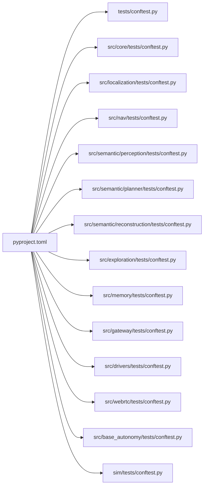

# �元测试

<cite>
**本文引用的文�*
- [pyproject.toml](file://pyproject.toml)
- [tests/conftest.py](file://tests/conftest.py)
- [src/core/tests/conftest.py](file://src/core/tests/conftest.py)
- [src/localization/tests/conftest.py](file://src/localization/tests/conftest.py)
- [src/nav/tests/conftest.py](file://src/nav/tests/conftest.py)
- [src/semantic/perception/tests/conftest.py](file://src/semantic/perception/tests/conftest.py)
- [src/semantic/planner/tests/conftest.py](file://src/semantic/planner/tests/conftest.py)
- [src/semantic/reconstruction/tests/conftest.py](file://src/semantic/reconstruction/tests/conftest.py)
- [src/exploration/tests/conftest.py](file://src/exploration/tests/conftest.py)
- [src/memory/tests/conftest.py](file://src/memory/tests/conftest.py)
- [src/gateway/tests/conftest.py](file://src/gateway/tests/conftest.py)
- [src/drivers/tests/conftest.py](file://src/drivers/tests/conftest.py)
- [src/webrtc/tests/conftest.py](file://src/webrtc/tests/conftest.py)
- [src/base_autonomy/tests/conftest.py](file://src/base_autonomy/tests/conftest.py)
- [sim/tests/conftest.py](file://sim/tests/conftest.py)
- [src/core/tests/test_plan_safety.py](file://src/core/tests/test_plan_safety.py)
- [src/core/tests/test_ros_frame_and_gazebo_contract.py](file://src/core/tests/test_ros_frame_and_gazebo_contract.py)
- [src/core/tests/test_server_sim_closure.py](file://src/core/tests/test_server_sim_closure.py)
- [src/core/tests/test_tare_exploration.py](file://src/core/tests/test_tare_exploration.py)
- [src/nav/tests/test_navigation_module.py](file://src/nav/tests/test_navigation_module.py)
- [src/localization/tests/test_slam_module.py](file://src/localization/tests/test_slam_module.py)
- [src/semantic/perception/tests/test_perception_module.py](file://src/semantic/perception/tests/test_perception_module.py)
- [src/semantic/planner/tests/test_planner_module.py](file://src/semantic/planner/tests/test_planner_module.py)
- [src/semantic/reconstruction/tests/test_reconstruction_module.py](file://src/semantic/reconstruction/tests/test_reconstruction_module.py)
- [src/exploration/tests/test_exploration_module.py](file://src/exploration/tests/test_exploration_module.py)
- [src/memory/tests/test_memory_module.py](file://src/memory/tests/test_memory_module.py)
- [src/gateway/tests/test_gateway_module.py](file://src/gateway/tests/test_gateway_module.py)
- [src/drivers/tests/test_drivers_module.py](file://src/drivers/tests/test_drivers_module.py)
- [src/webrtc/tests/test_webrtc_module.py](file://src/webrtc/tests/test_webrtc_module.py)
- [src/base_autonomy/tests/test_base_autonomy_module.py](file://src/base_autonomy/tests/test_base_autonomy_module.py)
- [sim/tests/test_sim_runtime_compat.py](file://sim/tests/test_sim_runtime_compat.py)
- [sim/tests/test_sim_full_system_validation.py](file://sim/tests/test_sim_full_system_validation.py)
- [tests/integration/test_full_chain.py](file://tests/integration/test_full_chain.py)
- [tests/integration/test_semantic_planner_live.py](file://tests/integration/test_semantic_planner_live.py)
- [tests/benchmark/benchmark_planner_structured.py](file://tests/benchmark/benchmark_planner_structured.py)
</cite>

## 目录
1. [引言](#引言)
2. [项目结�](#项目结�)
3. [核心组件](#核心组件)
4. [��总览](#��总览)
5. [详细组件分�](#详细组件分�)
6. [�赖分�](#�赖分�)
7. [性能考虑](#性能考虑)
8. [故障�查指�](#故障�查指�)
9. [结论](#结论)
10. [附录](#附录)

## 引言
本文件��LingTu�元测试体系，系统性�述测试组织结����方�，覆盖pytest�置��模�测试夹具（conftest.py）的使用�测试数�管�策略�测试用例设计�则�编写规范�模拟对象（mock）�践�测试覆盖�分��报告生�方法，并�供�直��考的测试代�路径�最佳�践建议，帮助开�者编写高质�的�元测试�
## 项目结�
LingTu采用按功能域分层的模�化组织方�，测试�样按模�划分，确�高内���耦�。pytest通过根级�置集中管�测试目录�忽略规则�标记等；�模�在自身tests目录下维护独立的conftest.py以注入路径�事件循�策略�资�清�逻辑�

```mermaid
graph TB
A["根��br/>pyproject.toml"] --> B["核心模�测试<br/>src/core/tests"]
A --> C["导航模�测试<br/>src/nav/tests"]
A --> D["SLAM模�测试<br/>src/localization/tests"]
A --> E["语义感知测试<br/>src/semantic/perception/tests"]
A --> F["语义规划测试<br/>src/semantic/planner/tests"]
A --> G["语义�建测试<br/>src/semantic/reconstruction/tests"]
A --> H["�索模�测试<br/>src/exploration/tests"]
A --> I["记忆模�测试<br/>src/memory/tests"]
A --> J["网关模�测试<br/>src/gateway/tests"]
A --> K["驱动模�测试<br/>src/drivers/tests"]
A --> L["WebRTC模�测试<br/>src/webrtc/tests"]
A --> M["基础自主模�测试<br/>src/base_autonomy/tests"]
A --> N["仿真测试<br/>sim/tests"]
A --> O["根级集�测试<br/>tests/integration"]
A --> P["基准测试<br/>tests/benchmark"]
```

图表��
- [pyproject.toml:118-149](file://pyproject.toml#L118-L149)

章节��
- [pyproject.toml:118-149](file://pyproject.toml#L118-L149)

## 核心组件
- pytest�置��行��  - 测试目录集�：核心�导航�网关�驱动�记忆�仿真�SLAM�语义感知�规划等�  - 忽略目录：第三方��建产物�虚拟�境�制�等，��导入噪声�  - 命�约定：test_*.py�Test*类�test_*函数�  - 标记：ros2�slow�sim，便�选择性执行�并行调度�- 路径注入�事件循�兼�  - �模�conftest统一将仓库根�src加入sys.path，确�模�导入一致性�  - 核心模�conftest设置兼容事件循�策略，��旧�get_event_loop测试在新Python版本�用�- 资�清�
  - 会�结�时释放共享ROS2资��rclpy�例，��残留影��续测试�
章节��
- [pyproject.toml:118-149](file://pyproject.toml#L118-L149)
- [src/core/tests/conftest.py:1-64](file://src/core/tests/conftest.py#L1-L64)
- [tests/conftest.py:1-43](file://tests/conftest.py#L1-L43)

## ��总览
下图展示测试�行的整体�程：pytest根��置扫�测试目录，加载�模�conftest完�路径注入�事件循�策略设置，��执行测试用例并生�结��

```mermaid
sequenceDiagram
participant Py as "pytest"
participant RootC as "tests/conftest.py"
participant CoreC as "src/core/tests/conftest.py"
participant ModC as "模�级conftest.py"
participant Test as "具体测试用例"
participant Res as "测试结�"
Py->>RootC : 加载根级夹具
RootC->>RootC : 注入sys.path<br/>忽略第三�制�目录
Py->>CoreC : 加载核心模�夹具
CoreC->>CoreC : 设置事件循�策略<br/>会�结�清�
Py->>ModC : 加载模�夹具
ModC->>ModC : 注入模�路径
Py->>Test : 执行测试
Test-->>Res : 返�断言结�
```

图表��
- [tests/conftest.py:1-43](file://tests/conftest.py#L1-L43)
- [src/core/tests/conftest.py:1-64](file://src/core/tests/conftest.py#L1-L64)
- [src/localization/tests/conftest.py:1-12](file://src/localization/tests/conftest.py#L1-L12)
- [src/nav/tests/conftest.py:1-12](file://src/nav/tests/conftest.py#L1-L12)

## 详细组件分�

### 核心模�测试（src/core/tests�- 组织结�
  - 测试用例覆盖计划安全�ROS帧�Gazebo契约��务器仿真闭���索任务等�  - 典�用例路径�考：
    - [src/core/tests/test_plan_safety.py](file://src/core/tests/test_plan_safety.py)
    - [src/core/tests/test_ros_frame_and_gazebo_contract.py](file://src/core/tests/test_ros_frame_and_gazebo_contract.py)
    - [src/core/tests/test_server_sim_closure.py](file://src/core/tests/test_server_sim_closure.py)
    - [src/core/tests/test_tare_exploration.py](file://src/core/tests/test_tare_exploration.py)
- 夹具特�  - 事件循�兼容策略，确���测试�格在新Python版本稳定�行�  - 会�结�时关闭共享执行器�rclpy，��资�泄��- 设计�则
  - 断言方法：围绕功能边界�契约进行等价类划分�边界值测试�  - 异常处�：对�满足�置�件或输入�法的场景进行显�断言�  - 测试隔离：通过夹具注入�临时状�清�，确�用例间互�干扰�
章节��
- [src/core/tests/conftest.py:1-64](file://src/core/tests/conftest.py#L1-L64)
- [src/core/tests/test_plan_safety.py](file://src/core/tests/test_plan_safety.py)
- [src/core/tests/test_ros_frame_and_gazebo_contract.py](file://src/core/tests/test_ros_frame_and_gazebo_contract.py)
- [src/core/tests/test_server_sim_closure.py](file://src/core/tests/test_server_sim_closure.py)
- [src/core/tests/test_tare_exploration.py](file://src/core/tests/test_tare_exploration.py)

### 导航模�测试（src/nav/tests�- 组织结�
  - 导航模�测试集中在导航主模��相关�务上，典�用例路径�考：
    - [src/nav/tests/test_navigation_module.py](file://src/nav/tests/test_navigation_module.py)
- 夹具特�  - 将仓库根�src加入sys.path，确�框��模�导入一致�- 设计�则
  - 断言方法：验�路径规划�轨迹跟踪�安全性�等关键输出�  - 异常处�：对无效目标点���达区域等进行断言�  - 测试隔离：通过夹具注入�临时状�清�，��跨用例污染�
章节��
- [src/nav/tests/conftest.py:1-12](file://src/nav/tests/conftest.py#L1-L12)
- [src/nav/tests/test_navigation_module.py](file://src/nav/tests/test_navigation_module.py)

### SLAM模�测试（src/slam/tests�- 组织结�
  - SLAM模�测试覆盖SLAM主模��桥�逻辑，典�用例路径�考：
    - [src/localization/tests/test_slam_module.py](file://src/localization/tests/test_slam_module.py)
- 夹具特�  - 将仓库根�src加入sys.path，确�核心模�导入�- 设计�则
  - 断言方法：验��姿估计�地图更新���检测等关键指标�  - 异常处�：对传感器数�异常��始化失败等进行断言�  - 测试隔离：通过夹具注入�临时状�清�，��跨用例污染�
章节��
- [src/localization/tests/conftest.py:1-12](file://src/localization/tests/conftest.py#L1-L12)
- [src/localization/tests/test_slam_module.py](file://src/localization/tests/test_slam_module.py)

### 语义模�测试（感�规划/�建�- 感知模�测试（src/semantic/perception/tests�  - 夹具：将仓库根�src加入sys.path�  - 典�用例路径�考：[src/semantic/perception/tests/test_perception_module.py](file://src/semantic/perception/tests/test_perception_module.py)
- 规划模�测试（src/semantic/planner/tests�  - 夹具：将仓库根�src加入sys.path�  - 典�用例路径�考：[src/semantic/planner/tests/test_planner_module.py](file://src/semantic/planner/tests/test_planner_module.py)
- �建模�测试（src/semantic/reconstruction/tests�  - 夹具：将仓库根�src加入sys.path�  - 典�用例路径�考：[src/semantic/reconstruction/tests/test_reconstruction_module.py](file://src/semantic/reconstruction/tests/test_reconstruction_module.py)

章节��
- [src/semantic/perception/tests/conftest.py](file://src/semantic/perception/tests/conftest.py)
- [src/semantic/planner/tests/conftest.py](file://src/semantic/planner/tests/conftest.py)
- [src/semantic/reconstruction/tests/conftest.py](file://src/semantic/reconstruction/tests/conftest.py)
- [src/semantic/perception/tests/test_perception_module.py](file://src/semantic/perception/tests/test_perception_module.py)
- [src/semantic/planner/tests/test_planner_module.py](file://src/semantic/planner/tests/test_planner_module.py)
- [src/semantic/reconstruction/tests/test_reconstruction_module.py](file://src/semantic/reconstruction/tests/test_reconstruction_module.py)

### �索�记忆�网关�驱动�WebRTC�基础自主模�测试
- �索模�测试（src/exploration/tests�  - 夹具：将仓库根�src加入sys.path�  - 典�用例路径�考：[src/exploration/tests/test_exploration_module.py](file://src/exploration/tests/test_exploration_module.py)
- 记忆模�测试（src/memory/tests�  - 夹具：将仓库根�src加入sys.path�  - 典�用例路径�考：[src/memory/tests/test_memory_module.py](file://src/memory/tests/test_memory_module.py)
- 网关模�测试（src/gateway/tests�  - 夹具：将仓库根�src加入sys.path�  - 典�用例路径�考：[src/gateway/tests/test_gateway_module.py](file://src/gateway/tests/test_gateway_module.py)
- 驱动模�测试（src/drivers/tests�  - 夹具：将仓库根�src加入sys.path�  - 典�用例路径�考：[src/drivers/tests/test_drivers_module.py](file://src/drivers/tests/test_drivers_module.py)
- WebRTC模�测试（src/webrtc/tests�  - 夹具：将仓库根�src加入sys.path�  - 典�用例路径�考：[src/webrtc/tests/test_webrtc_module.py](file://src/webrtc/tests/test_webrtc_module.py)
- 基础自主模�测试（src/base_autonomy/tests�  - 夹具：将仓库根�src加入sys.path�  - 典�用例路径�考：[src/base_autonomy/tests/test_base_autonomy_module.py](file://src/base_autonomy/tests/test_base_autonomy_module.py)

章节��
- [src/exploration/tests/conftest.py](file://src/exploration/tests/conftest.py)
- [src/memory/tests/conftest.py](file://src/memory/tests/conftest.py)
- [src/gateway/tests/conftest.py](file://src/gateway/tests/conftest.py)
- [src/drivers/tests/conftest.py](file://src/drivers/tests/conftest.py)
- [src/webrtc/tests/conftest.py](file://src/webrtc/tests/conftest.py)
- [src/base_autonomy/tests/conftest.py](file://src/base_autonomy/tests/conftest.py)
- [src/exploration/tests/test_exploration_module.py](file://src/exploration/tests/test_exploration_module.py)
- [src/memory/tests/test_memory_module.py](file://src/memory/tests/test_memory_module.py)
- [src/gateway/tests/test_gateway_module.py](file://src/gateway/tests/test_gateway_module.py)
- [src/drivers/tests/test_drivers_module.py](file://src/drivers/tests/test_drivers_module.py)
- [src/webrtc/tests/test_webrtc_module.py](file://src/webrtc/tests/test_webrtc_module.py)
- [src/base_autonomy/tests/test_base_autonomy_module.py](file://src/base_autonomy/tests/test_base_autonomy_module.py)

### 仿真模�测试（sim/tests�- 组织结�
  - 仿真测试覆盖�行时兼容性�全链路系统验�，典�用例路径�考：
    - [sim/tests/test_sim_runtime_compat.py](file://sim/tests/test_sim_runtime_compat.py)
    - [sim/tests/test_sim_full_system_validation.py](file://sim/tests/test_sim_full_system_validation.py)
- 夹具特�  - 将仓库根�src加入sys.path，确�仿真框��模�导入一致�
章节��
- [sim/tests/conftest.py](file://sim/tests/conftest.py)
- [sim/tests/test_sim_runtime_compat.py](file://sim/tests/test_sim_runtime_compat.py)
- [sim/tests/test_sim_full_system_validation.py](file://sim/tests/test_sim_full_system_validation.py)

### 根级集�测试�基准测�- 根级集�测试（tests/integration�  - 典�用例路径�考：
    - [tests/integration/test_full_chain.py](file://tests/integration/test_full_chain.py)
    - [tests/integration/test_semantic_planner_live.py](file://tests/integration/test_semantic_planner_live.py)
- 基准测试（tests/benchmark�  - 典�用例路径�考：
    - [tests/benchmark/benchmark_planner_structured.py](file://tests/benchmark/benchmark_planner_structured.py)

章节��
- [tests/integration/test_full_chain.py](file://tests/integration/test_full_chain.py)
- [tests/integration/test_semantic_planner_live.py](file://tests/integration/test_semantic_planner_live.py)
- [tests/benchmark/benchmark_planner_structured.py](file://tests/benchmark/benchmark_planner_structured.py)

## �赖分�
- 路径�赖
  - �模�conftest统一将仓库根�src加入sys.path，确�模�导入一致性�- �行时��  - 核心模�conftest设置事件循�策略，兼容旧�get_event_loop调用�  - 会�结�时清�共享执行器�rclpy，��资�泄��- �置�赖
  - 根级pyproject.toml定义测试目录�忽略规则�命�约定�标记，统一测试行为�

图表��
- [pyproject.toml:118-149](file://pyproject.toml#L118-L149)
- [tests/conftest.py:1-43](file://tests/conftest.py#L1-L43)
- [src/core/tests/conftest.py:1-64](file://src/core/tests/conftest.py#L1-L64)
- [src/localization/tests/conftest.py:1-12](file://src/localization/tests/conftest.py#L1-L12)
- [src/nav/tests/conftest.py:1-12](file://src/nav/tests/conftest.py#L1-L12)
- [src/semantic/perception/tests/conftest.py](file://src/semantic/perception/tests/conftest.py)
- [src/semantic/planner/tests/conftest.py](file://src/semantic/planner/tests/conftest.py)
- [src/semantic/reconstruction/tests/conftest.py](file://src/semantic/reconstruction/tests/conftest.py)
- [src/exploration/tests/conftest.py](file://src/exploration/tests/conftest.py)
- [src/memory/tests/conftest.py](file://src/memory/tests/conftest.py)
- [src/gateway/tests/conftest.py](file://src/gateway/tests/conftest.py)
- [src/drivers/tests/conftest.py](file://src/drivers/tests/conftest.py)
- [src/webrtc/tests/conftest.py](file://src/webrtc/tests/conftest.py)
- [src/base_autonomy/tests/conftest.py](file://src/base_autonomy/tests/conftest.py)
- [sim/tests/conftest.py](file://sim/tests/conftest.py)

## 性能考虑
- 测试标记�并行执�  - 使用标记（ros2�slow�sim）对测试进行分类，便�选择性执行�并行调度，�少整体测试时间�- 忽略规则
  - 根级�置忽略第三方��建产物�虚拟�境�制�等目录，��导入噪声�冗余扫��- 事件循�策略
  - 核心模�conftest设置兼容事件循�策略，��因事件循���失败导致的测试中断�
章节��
- [pyproject.toml:118-149](file://pyproject.toml#L118-L149)
- [src/core/tests/conftest.py:23-41](file://src/core/tests/conftest.py#L23-L41)

## 故障�查指�
- 路径导入问题
  - 症状：模�导入失败或找�到包�  - 处�：确认�模�conftest已将仓库根�src加入sys.path；检查路径拼�是�正确�- 事件循�相关错误
  - 症状：在新Python版本中出�“当�无事件循��或事件循���失败�  - 处�：使用核心模�conftest中的兼容事件循�策略，确���测试�格�用�- 资�泄��残�  - 症状：多次�行�出�rclpy或共享执行器残留�  - 处�：利用核心模�conftest的会�结�清�逻辑，确�资�被正确释放�- 第三�制�目录干扰
  - 症状：pytest扫�到无关目录导致导入异常或性能下��  - 处�：确认根级忽略规则已生效，��扫�第三方��建产物�虚拟�境�制�等目录�
章节��
- [tests/conftest.py:19-42](file://tests/conftest.py#L19-L42)
- [src/core/tests/conftest.py:48-64](file://src/core/tests/conftest.py#L48-L64)

## 结论
LingTu�元测试体系通过根级pytest�置�模�级夹具��了统一的路径注入�事件循�兼容�资�清�机制，结��确的命�约定�标记策略，形�了高内���耦���扩展的测试组织方�。�循本文�供的设计�则�最佳�践，�有效��测试质��稳定性�
## 附录
- 测试覆盖�分��报告生�
  - 在根级pyproject.toml中，开��赖包�pytest�pytest-cov，�通过pytest-cov�件生�覆盖�报告。建议在CI中�置覆盖�阈值�报告输出，确�关键模��路径得到充分覆盖�- 测试用例设计�则�编写规�  - 断言方法：围绕功能边界�契约进行等价类划分�边界值测试，优先断言关键输出�异常路径�  - 异常处�：对输入�法��置�件�满足�外部�赖异常等情况进行显�断言�  - 测试隔离：通过夹具注入�临时状�清�，确�用例间互�干扰；必�时使用mock替�外部�赖�- 模拟对象（mock）使用建�  - 对外部系统（如ROS2�网络���文件系统）使用mock进行隔离测试，确�测试稳定性����性�  - 在需�真�行为但�本较高的场景，�使用有�的集�测试补充，�时���元测试的快速�馈�
章节��
- [pyproject.toml:29](file://pyproject.toml#L29)