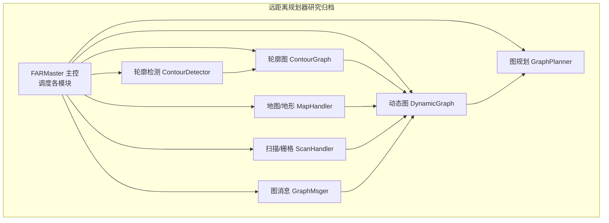
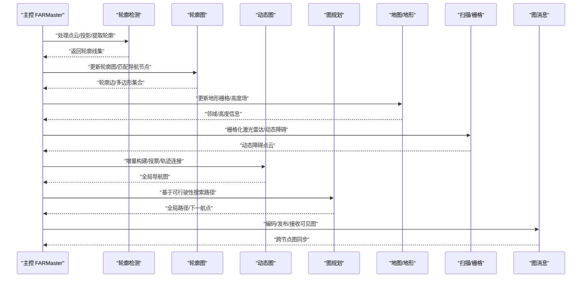
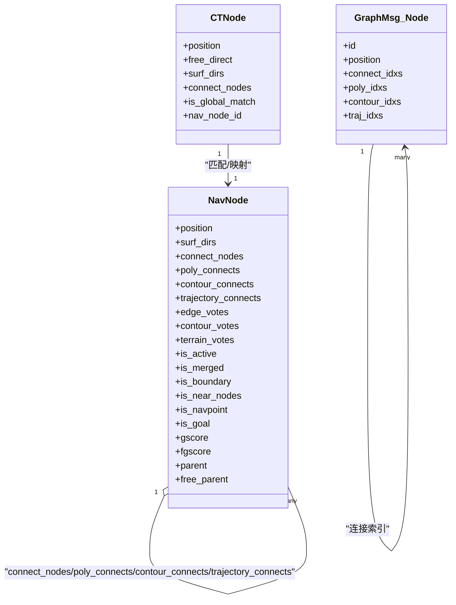
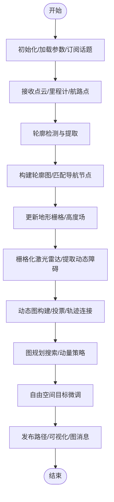
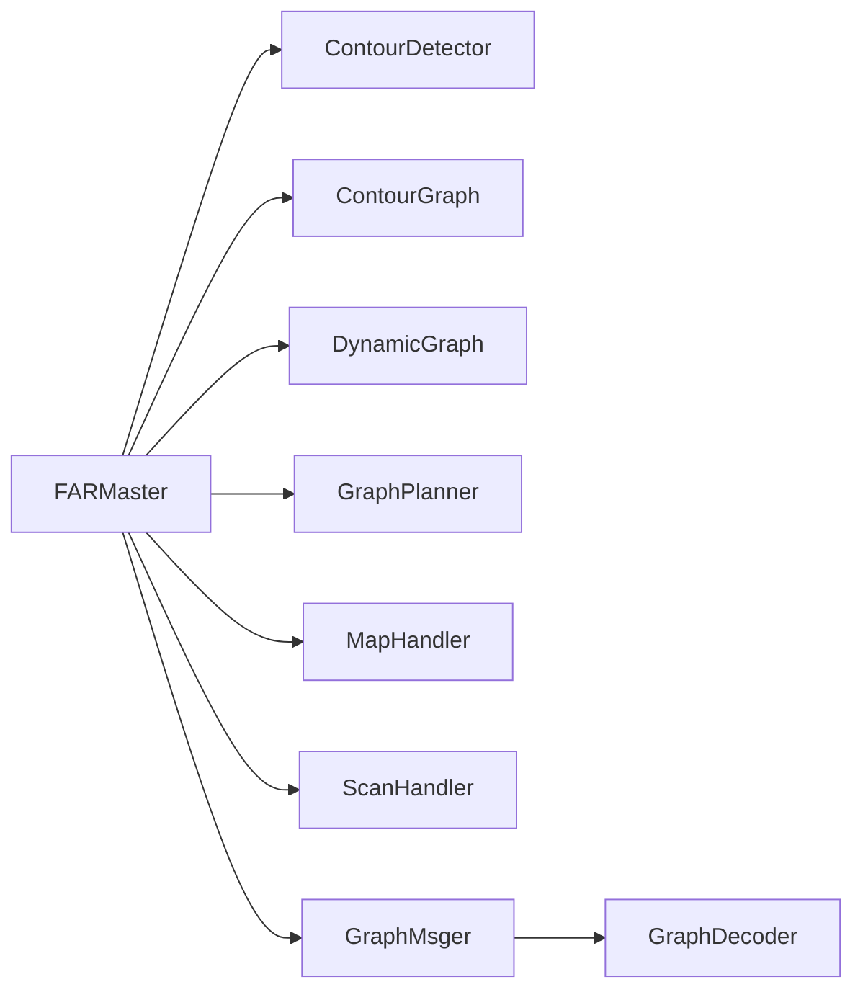

# 远距离规划器

<cite>
**本文引用的文件**
- [config/far_planner.yaml](file://config/far_planner.yaml)
- [research/far_planner_archive/far_planner/include/far_planner/far_planner.h](file://research/far_planner_archive/far_planner/include/far_planner/far_planner.h)
- [research/far_planner_archive/far_planner/include/far_planner/contour_graph.h](file://research/far_planner_archive/far_planner/include/far_planner/contour_graph.h)
- [research/far_planner_archive/far_planner/include/far_planner/dynamic_graph.h](file://research/far_planner_archive/far_planner/include/far_planner/dynamic_graph.h)
- [research/far_planner_archive/far_planner/include/far_planner/graph_planner.h](file://research/far_planner_archive/far_planner/include/far_planner/graph_planner.h)
- [research/far_planner_archive/far_planner/include/far_planner/map_handler.h](file://research/far_planner_archive/far_planner/include/far_planner/map_handler.h)
- [research/far_planner_archive/far_planner/include/far_planner/scan_handler.h](file://research/far_planner_archive/far_planner/include/far_planner/scan_handler.h)
- [research/far_planner_archive/far_planner/src/contour_detector.cpp](file://research/far_planner_archive/far_planner/src/contour_detector.cpp)
- [research/far_planner_archive/far_planner/src/contour_graph.cpp](file://research/far_planner_archive/far_planner/src/contour_graph.cpp)
- [research/far_planner_archive/far_planner/src/graph_msger.cpp](file://research/far_planner_archive/far_planner/src/graph_msger.cpp)
- [research/far_planner_archive/graph_decoder/include/graph_decoder/decoder_node.h](file://research/far_planner_archive/graph_decoder/include/graph_decoder/decoder_node.h)
- [research/far_planner_archive/visibility_graph_msg/msg/Graph.msg](file://research/far_planner_archive/visibility_graph_msg/msg/Graph.msg)
</cite>

## 目录
1. [简介](#简介)
2. [项目结构](#项目结构)
3. [核心组件](#核心组件)
4. [架构总览](#架构总览)
5. [详细组件分析](#详细组件分析)
6. [依赖关系分析](#依赖关系分析)
7. [性能考量](#性能考量)
8. [故障排查指南](#故障排查指南)
9. [结论](#结论)
10. [附录](#附录)

## 简介
本技术文档面向 LingTu 远距离规划器（FAR Planner），系统性阐述其核心算法与实现原理，覆盖以下关键模块：轮廓检测、图提取、动态图构建、地形规划、路径规划与可视化等。文档同时给出数据结构设计（节点、边、图消息格式）、算法流程、配置参数与调优方法、使用示例与集成方式，以及与 SLAM、语义导航等系统的接口关系，并分析性能特点与局限性及优化建议。

## 项目结构
远距离规划器位于研究归档目录中，采用模块化分层设计：主控类负责调度各子模块；轮廓检测与轮廓图模块负责几何拓扑抽象；动态图模块负责节点/边的增量式构建与维护；地形模块负责高度场与可行驶性分析；图规划模块负责全局路径搜索；扫描/地图模块负责点云栅格化与动态障碍处理；图消息模块负责跨节点图交换。

图表来源
- [research/far_planner_archive/far_planner/include/far_planner/far_planner.h:35-139](file://research/far_planner_archive/far_planner/include/far_planner/far_planner.h#L35-L139)
- [research/far_planner_archive/far_planner/include/far_planner/contour_graph.h:43-118](file://research/far_planner_archive/far_planner/include/far_planner/contour_graph.h#L43-L118)
- [research/far_planner_archive/far_planner/include/far_planner/dynamic_graph.h:22-436](file://research/far_planner_archive/far_planner/include/far_planner/dynamic_graph.h#L22-L436)
- [research/far_planner_archive/far_planner/include/far_planner/graph_planner.h:25-145](file://research/far_planner_archive/far_planner/include/far_planner/graph_planner.h#L25-L145)
- [research/far_planner_archive/far_planner/include/far_planner/map_handler.h:23-50](file://research/far_planner_archive/far_planner/include/far_planner/map_handler.h#L23-L50)
- [research/far_planner_archive/far_planner/include/far_planner/scan_handler.h:20-40](file://research/far_planner_archive/far_planner/include/far_planner/scan_handler.h#L20-L40)
- [research/far_planner_archive/far_planner/src/graph_msger.cpp:13-23](file://research/far_planner_archive/far_planner/src/graph_msger.cpp#L13-L23)

章节来源
- [research/far_planner_archive/far_planner/include/far_planner/far_planner.h:35-139](file://research/far_planner_archive/far_planner/include/far_planner/far_planner.h#L35-L139)

## 核心组件
- 主控与参数
  - FARMaster 负责 ROS 初始化、订阅/发布、定时器回调、模块装配与参数加载。
  - 参数集中于配置文件，包含运行频率、体素分辨率、机器人尺寸、传感器范围、地形范围、局部规划范围、可视化比例、多层/静态环境开关、TF 帧等。
- 轮廓检测与轮廓图
  - ContourDetector 将点云投影为二维图像并提取轮廓，输出多段轮廓线。
  - ContourGraph 将轮廓线映射为图节点（CTNode），建立轮廓边连接集合，提供连通性判断与匹配函数。
- 动态图构建
  - DynamicGraph 以轮廓节点为种子，结合地形与扫描信息，增量式生成导航节点与边，维护投票机制与轨迹连接，清理无效节点，维持全局可达性。
- 地形与地图
  - MapHandler 维护世界栅格地图（自由/障碍/高度），提供邻域查询、高度插值、占用分析与清除通道等功能。
- 图规划
  - GraphPlanner 基于动态图的可行驶性状态进行全局路径搜索，支持自由空间目标微调、动量策略与失败重试。
- 扫描/栅格
  - ScanHandler 将激光雷达点云栅格化，提取动态障碍并可视化。
- 图消息
  - GraphMsger 编码/解码可见图消息，支持跨节点广播与接收，用于分布式或回放验证。

章节来源
- [config/far_planner.yaml:9-66](file://config/far_planner.yaml#L9-L66)
- [research/far_planner_archive/far_planner/include/far_planner/far_planner.h:110-139](file://research/far_planner_archive/far_planner/include/far_planner/far_planner.h#L110-L139)
- [research/far_planner_archive/far_planner/include/far_planner/contour_graph.h:43-118](file://research/far_planner_archive/far_planner/include/far_planner/contour_graph.h#L43-L118)
- [research/far_planner_archive/far_planner/include/far_planner/dynamic_graph.h:22-436](file://research/far_planner_archive/far_planner/include/far_planner/dynamic_graph.h#L22-L436)
- [research/far_planner_archive/far_planner/include/far_planner/graph_planner.h:25-145](file://research/far_planner_archive/far_planner/include/far_planner/graph_planner.h#L25-L145)
- [research/far_planner_archive/far_planner/include/far_planner/map_handler.h:23-50](file://research/far_planner_archive/far_planner/include/far_planner/map_handler.h#L23-L50)
- [research/far_planner_archive/far_planner/include/far_planner/scan_handler.h:20-40](file://research/far_planner_archive/far_planner/include/far_planner/scan_handler.h#L20-L40)
- [research/far_planner_archive/far_planner/src/graph_msger.cpp:25-94](file://research/far_planner_archive/far_planner/src/graph_msger.cpp#L25-L94)

## 架构总览
远距离规划器以“感知-抽象-构建-规划-可视化”为主线，形成闭环控制流：主控在固定周期内触发，先进行轮廓检测与地形分析，再增量构建动态图，最后进行全局路径搜索与动量策略，期间通过图消息模块进行跨节点协作。

图表来源
- [research/far_planner_archive/far_planner/include/far_planner/far_planner.h:136-139](file://research/far_planner_archive/far_planner/include/far_planner/far_planner.h#L136-L139)
- [research/far_planner_archive/far_planner/src/contour_detector.cpp:31-34](file://research/far_planner_archive/far_planner/src/contour_detector.cpp#L31-L34)
- [research/far_planner_archive/far_planner/src/contour_graph.cpp:25-35](file://research/far_planner_archive/far_planner/src/contour_graph.cpp#L25-L35)
- [research/far_planner_archive/far_planner/src/graph_msger.cpp:88-94](file://research/far_planner_archive/far_planner/src/graph_msger.cpp#L88-L94)

## 详细组件分析

### 数据结构设计
- 节点与边
  - 导航节点（NavNode）：包含位置、表面方向、连通列表、投票队列、轨迹连接、地形投票、状态标记（激活/合并/边界/近邻/目标等）、代价与父节点等。
  - 轮廓节点（CTNode）：包含位置、自由方向、表面方向、轮廓连接集合、匹配状态等。
  - 边结构：导航节点间存在普通连接、多边形连接、轮廓连接、轨迹连接、地形投票连接等。
- 图消息格式
  - Graph 消息包含 header、robot_id、nodes 数组、size 字段；每个节点包含 id、position、connect_idxs/poly_idxs/contour_idxs/traj_idxs 等索引列表，用于重建图拓扑。

图表来源
- [research/far_planner_archive/far_planner/include/far_planner/dynamic_graph.h:537-581](file://research/far_planner_archive/far_planner/include/far_planner/dynamic_graph.h#L537-L581)
- [research/far_planner_archive/far_planner/include/far_planner/contour_graph.h:43-118](file://research/far_planner_archive/far_planner/include/far_planner/contour_graph.h#L43-L118)
- [research/far_planner_archive/visibility_graph_msg/msg/Graph.msg:1-4](file://research/far_planner_archive/visibility_graph_msg/msg/Graph.msg#L1-L4)

章节来源
- [research/far_planner_archive/far_planner/include/far_planner/dynamic_graph.h:537-581](file://research/far_planner_archive/far_planner/include/far_planner/dynamic_graph.h#L537-L581)
- [research/far_planner_archive/far_planner/include/far_planner/contour_graph.h:43-118](file://research/far_planner_archive/far_planner/include/far_planner/contour_graph.h#L43-L118)
- [research/far_planner_archive/visibility_graph_msg/msg/Graph.msg:1-4](file://research/far_planner_archive/visibility_graph_msg/msg/Graph.msg#L1-L4)

### 算法流程
- 输入数据处理
  - 主控订阅里程计、地形点云、激光雷达点云、航路点等；初始化 TF 监听器；加载参数。
- 轮廓检测与图提取
  - 将周围点云投影为二维图像，提取轮廓线；过滤无效轮廓；建立轮廓多边形集合。
- 动态图构建
  - 以轮廓节点为种子创建导航节点；根据地形与扫描信息评估可行驶性；通过投票机制填充多边形/轮廓/轨迹连接；清理无效节点；维护近邻节点栈。
- 地形规划
  - 更新地形栅格与高度场；对节点进行高度调整；分析可行驶性；提供自由空间网格供目标微调。
- 图规划
  - 基于可行驶性状态进行全局路径搜索；记录动量路径；当接近目标时进行自由空间微调；失败时重试或切换尝试性导航。
- 可视化与消息
  - 发布目标、边界、运行时长、规划耗时、遍历时间、可达性等；编码/发布可见图；接收/解码其他节点的可见图。

图表来源
- [research/far_planner_archive/far_planner/include/far_planner/far_planner.h:136-139](file://research/far_planner_archive/far_planner/include/far_planner/far_planner.h#L136-L139)
- [research/far_planner_archive/far_planner/src/contour_detector.cpp:31-34](file://research/far_planner_archive/far_planner/src/contour_detector.cpp#L31-L34)
- [research/far_planner_archive/far_planner/src/contour_graph.cpp:25-35](file://research/far_planner_archive/far_planner/src/contour_graph.cpp#L25-L35)
- [research/far_planner_archive/far_planner/src/graph_msger.cpp:88-94](file://research/far_planner_archive/far_planner/src/graph_msger.cpp#L88-L94)

章节来源
- [research/far_planner_archive/far_planner/include/far_planner/far_planner.h:136-139](file://research/far_planner_archive/far_planner/include/far_planner/far_planner.h#L136-L139)
- [research/far_planner_archive/far_planner/src/contour_detector.cpp:31-34](file://research/far_planner_archive/far_planner/src/contour_detector.cpp#L31-L34)
- [research/far_planner_archive/far_planner/src/contour_graph.cpp:25-35](file://research/far_planner_archive/far_planner/src/contour_graph.cpp#L25-L35)
- [research/far_planner_archive/far_planner/src/graph_msger.cpp:88-94](file://research/far_planner_archive/far_planner/src/graph_msger.cpp#L88-L94)

### 配置参数与调优
- 核心参数
  - 运行频率、体素分辨率、机器人半径/高度、传感器范围、地形分析范围、局部规划范围、可视化降采样比例、单/多层模式、动态环境开关、自动切换尝试性导航、世界坐标系帧名等。
- 地图/栅格参数
  - 地板高度、网格单元长度、地图最大范围、高度梯度上限等。
- 工具/实用参数
  - 角度噪声、最大对齐角、障碍膨胀格数、新点强度阈值、地形可通过 Z 阈值、动态障碍更新阈值、新点计数、动态障碍/新点衰减时间等。
- 动态图参数
  - 连接投票数、清道夫阈值、节点定稿阈值、滤波池大小等。
- 轮廓检测参数
  - 图像缩放比例、滤波计数值、是否保存图像等。
- 图规划参数
  - 收敛距离、目标调整半径、自由计数阈值、到达目标投票数、路径动量阈值等。
- 调优建议
  - 在复杂地形中提高地形范围与栅格分辨率；在动态环境中降低清道夫阈值以更快清理误检；在户外/平面场景启用单层模式减少高度耦合；合理设置机器人半径与膨胀以平衡安全性与可探索性。

章节来源
- [config/far_planner.yaml:9-66](file://config/far_planner.yaml#L9-L66)

### 使用示例与集成
- 启动与参数
  - 在 launch 中选择远距离规划器配置文件，设置 planner_profile 为 far；确保 TF 帧与世界坐标一致；订阅/发布对应话题。
- 可视化
  - 使用 RViz 加载 Graph 可视化；关注目标点、边界、运行时长、规划耗时、遍历时间等主题。
- 分布式/回放
  - 通过 GraphMsger 编码/发布/订阅可见图消息，配合 graph_decoder 解码显示；支持跨节点图同步与一致性校验。

章节来源
- [research/far_planner_archive/far_planner/src/graph_msger.cpp:88-94](file://research/far_planner_archive/far_planner/src/graph_msger.cpp#L88-L94)
- [research/far_planner_archive/graph_decoder/include/graph_decoder/decoder_node.h:77-98](file://research/far_planner_archive/graph_decoder/include/graph_decoder/decoder_node.h#L77-L98)

### 与其他模块的接口关系
- 与 SLAM
  - 通过里程计与 TF 获取机器人位姿；地形点云由 SLAM 提供；动态障碍由激光雷达扫描数据经 ScanHandler 处理后反馈至动态图。
- 与语义导航
  - 地形高度场与可行驶性分析可与语义层的区域/类别信息融合，提升目标微调与路径鲁棒性。
- 与局部规划
  - 远距离规划输出航路点，局部规划在此基础上进行轨迹跟踪与避障。

章节来源
- [research/far_planner_archive/far_planner/include/far_planner/far_planner.h:148-152](file://research/far_planner_archive/far_planner/include/far_planner/far_planner.h#L148-L152)
- [research/far_planner_archive/far_planner/include/far_planner/scan_handler.h:30-35](file://research/far_planner_archive/far_planner/include/far_planner/scan_handler.h#L30-L35)

## 依赖关系分析
- 组件耦合
  - FARMaster 作为主控，耦合度最高，协调各子模块；DynamicGraph 与 MapHandler、ScanHandler 存在强耦合（可行驶性评估与投票）；GraphMsger 与 GraphDecoder 通过消息格式解耦。
- 外部依赖
  - PCL、OpenCV、ROS2、tf2、Eigen、Grid 栅格库等。
- 潜在环依赖
  - 模块间通过头文件声明与实现分离，未见直接循环包含；GraphMsger 与 GraphDecoder 通过消息类型解耦，避免运行时环。

图表来源
- [research/far_planner_archive/far_planner/include/far_planner/far_planner.h:110-118](file://research/far_planner_archive/far_planner/include/far_planner/far_planner.h#L110-L118)
- [research/far_planner_archive/graph_decoder/include/graph_decoder/decoder_node.h:90-94](file://research/far_planner_archive/graph_decoder/include/graph_decoder/decoder_node.h#L90-L94)

章节来源
- [research/far_planner_archive/far_planner/include/far_planner/far_planner.h:110-118](file://research/far_planner_archive/far_planner/include/far_planner/far_planner.h#L110-L118)
- [research/far_planner_archive/graph_decoder/include/graph_decoder/decoder_node.h:90-94](file://research/far_planner_archive/graph_decoder/include/graph_decoder/decoder_node.h#L90-L94)

## 性能考量
- 时间复杂度
  - 轮廓检测与图像投影近似 O(N)，其中 N 为点云数量；动态图构建涉及投票与连接扩展，整体近似 O(N log N) 到 O(N^2)（取决于连接密度）；图规划使用 A*，复杂度与图规模和启发式相关。
- 空间复杂度
  - 地图栅格与 KD-Tree、投票队列、连接栈等占用内存较大，需按场景调整体素分辨率与网格范围。
- 优化建议
  - 降采样与体素化策略；合理设置投票窗口与阈值；利用局部范围剪枝；缓存地形高度与邻域查询结果；在多核环境下并行化投票与连接评估。

## 故障排查指南
- 常见问题
  - 轮廓检测失败：检查传感器范围与体素分辨率；确认点云质量与 TF 对齐。
  - 动态图不更新：检查动态障碍提取与投票阈值；确认定时器与回调是否触发。
  - 目标不可达：检查地形栅格是否正确更新；查看边界/无效连接标记；确认目标微调是否生效。
  - 图消息不同步：检查消息编码/解码一致性；核对 robot_id 与 frame_id；确认网络/命名空间。
- 定位手段
  - 启用调试输出与可视化；打印关键节点/边的投票状态；对比自由/障碍栅格；检查 TF 变换链。

章节来源
- [research/far_planner_archive/far_planner/include/far_planner/far_planner.h:175-191](file://research/far_planner_archive/far_planner/include/far_planner/far_planner.h#L175-L191)
- [research/far_planner_archive/far_planner/src/graph_msger.cpp:96-115](file://research/far_planner_archive/far_planner/src/graph_msger.cpp#L96-L115)

## 结论
远距离规划器通过“轮廓-图-地形-规划”的流水线实现了远距离、可扩展、可可视化的导航能力。其模块化设计便于与 SLAM、语义导航等系统集成；参数体系支持多场景适配；图消息机制支撑分布式协作。针对复杂动态环境与大规模地图，建议进一步优化投票与连接策略、引入更高效的路径搜索与缓存机制。

## 附录
- 关键流程参考路径
  - 主循环与回调：[research/far_planner_archive/far_planner/include/far_planner/far_planner.h:136-139](file://research/far_planner_archive/far_planner/include/far_planner/far_planner.h#L136-L139)
  - 轮廓检测实现：[research/far_planner_archive/far_planner/src/contour_detector.cpp:31-34](file://research/far_planner_archive/far_planner/src/contour_detector.cpp#L31-L34)
  - 轮廓图更新与匹配：[research/far_planner_archive/far_planner/src/contour_graph.cpp:25-35](file://research/far_planner_archive/far_planner/src/contour_graph.cpp#L25-L35)
  - 动态图构建与投票：[research/far_planner_archive/far_planner/include/far_planner/dynamic_graph.h:436-461](file://research/far_planner_archive/far_planner/include/far_planner/dynamic_graph.h#L436-L461)
  - 地形栅格与高度场：[research/far_planner_archive/far_planner/include/far_planner/map_handler.h:38-84](file://research/far_planner_archive/far_planner/include/far_planner/map_handler.h#L38-L84)
  - 图规划与动量策略：[research/far_planner_archive/far_planner/include/far_planner/graph_planner.h:160-180](file://research/far_planner_archive/far_planner/include/far_planner/graph_planner.h#L160-L180)
  - 图消息编解码与发布：[research/far_planner_archive/far_planner/src/graph_msger.cpp:25-94](file://research/far_planner_archive/far_planner/src/graph_msger.cpp#L25-L94)
  - 图解码器节点：[research/far_planner_archive/graph_decoder/include/graph_decoder/decoder_node.h:77-98](file://research/far_planner_archive/graph_decoder/include/graph_decoder/decoder_node.h#L77-L98)
  - 图消息格式定义：[research/far_planner_archive/visibility_graph_msg/msg/Graph.msg:1-4](file://research/far_planner_archive/visibility_graph_msg/msg/Graph.msg#L1-L4)