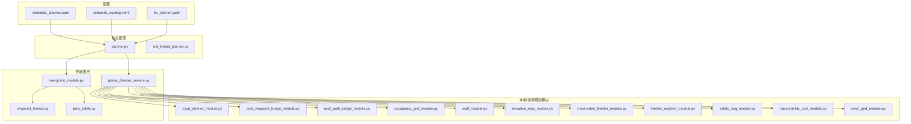
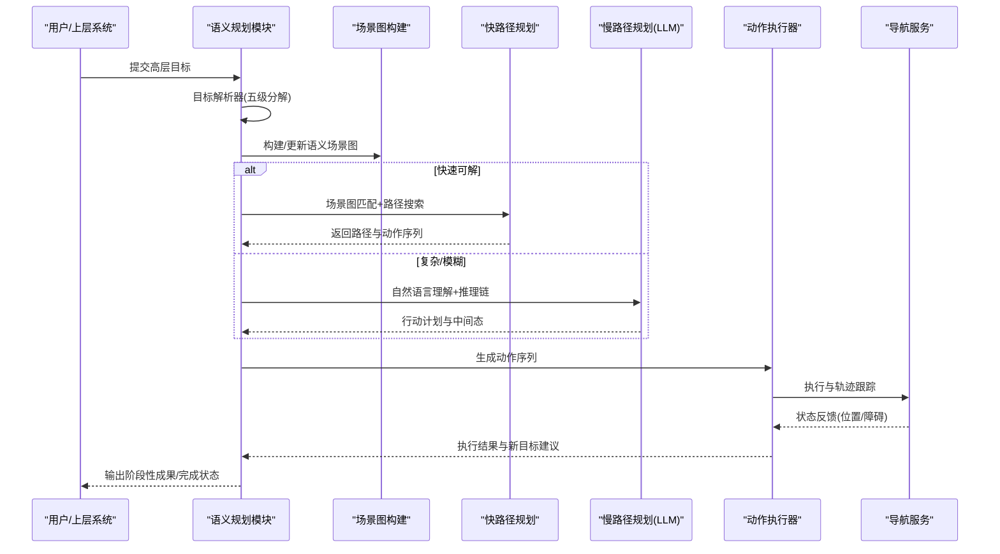
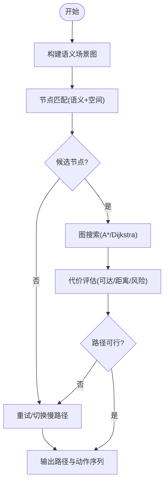
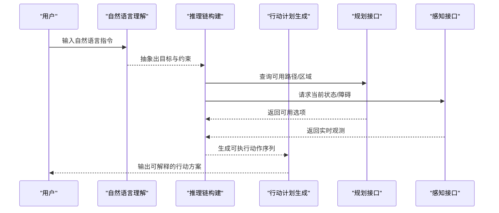
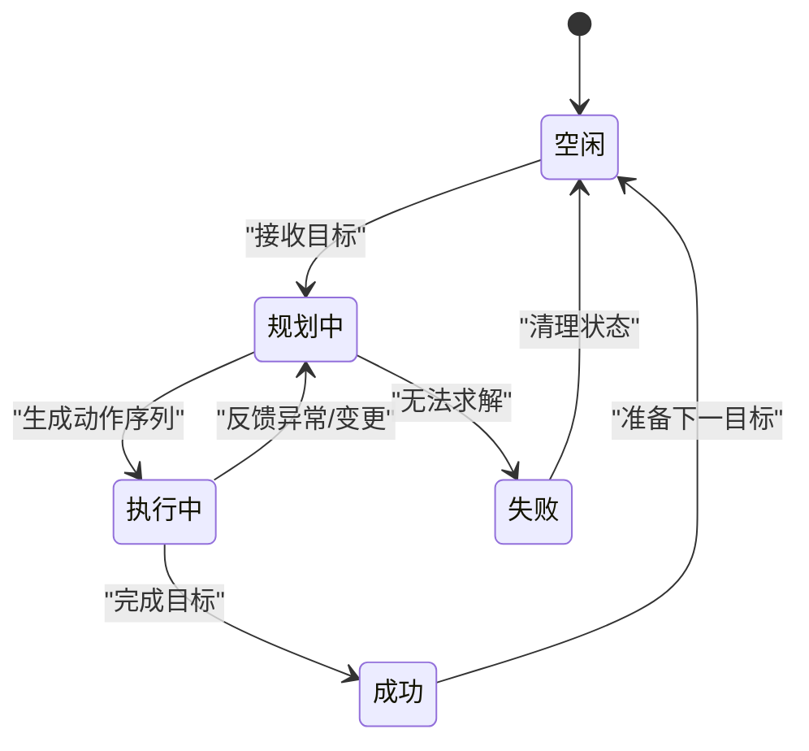
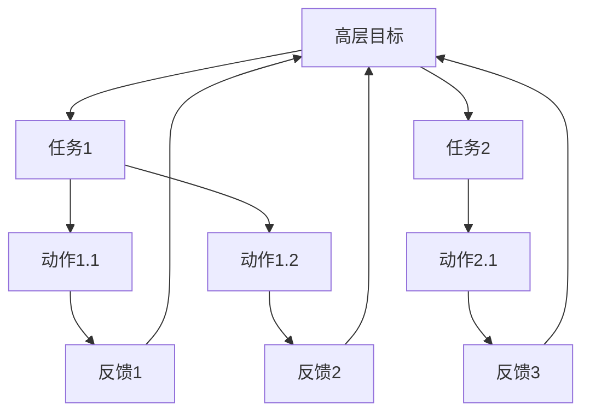
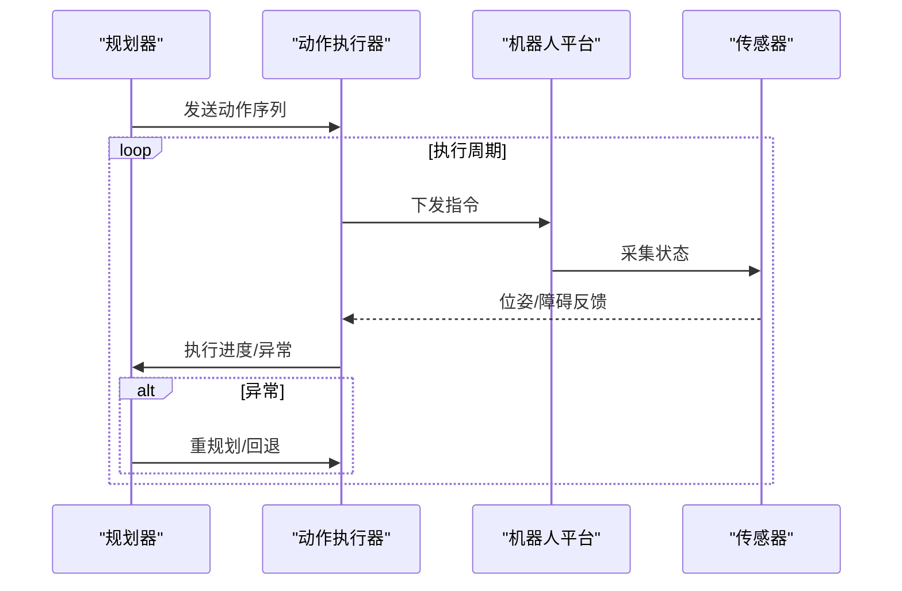
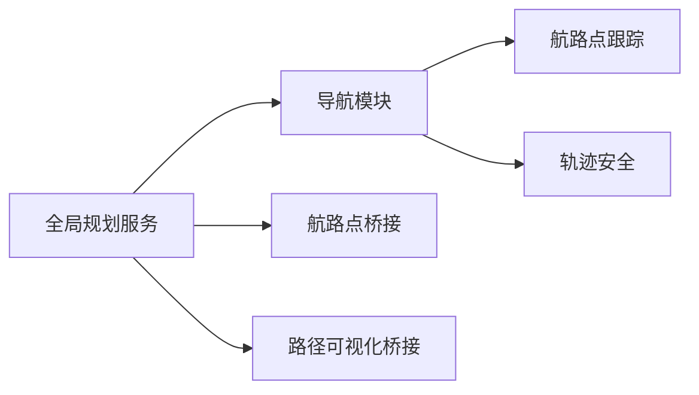
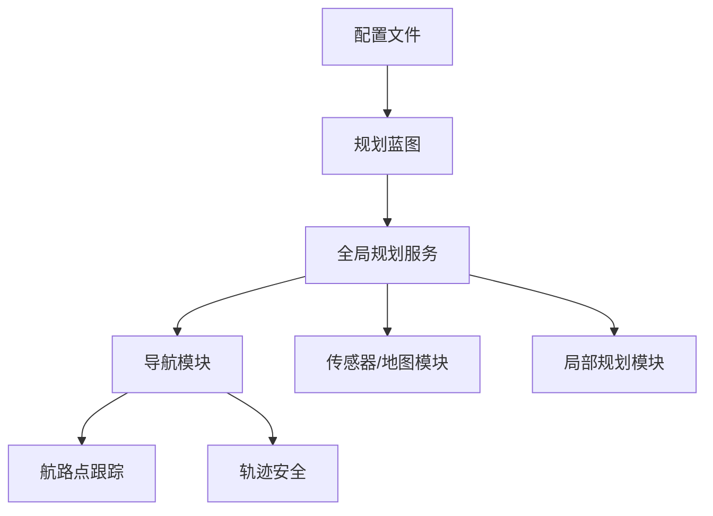

# 语义规划模块

<cite>
**本文引用的文件**
- [config/semantic_planner.yaml](file://config/semantic_planner.yaml)
- [config/semantic_scoring.yaml](file://config/semantic_scoring.yaml)
- [config/far_planner.yaml](file://config/far_planner.yaml)
- [src/core/blueprints/stacks/planner.py](file://src/core/blueprints/stacks/planner.py)
- [src/core/tests/test_hybrid_planner.py](file://src/core/tests/test_hybrid_planner.py)
- [src/base_autonomy/modules/local_planner_module.py](file://src/base_autonomy/modules/local_planner_module.py)
- [src/nav/global_planner_service.py](file://src/nav/global_planner_service.py)
- [src/nav/navigation_module.py](file://src/nav/navigation_module.py)
- [src/nav/waypoint_tracker.py](file://src/nav/waypoint_tracker.py)
- [src/nav/services/global_planner_service.py](file://src/nav/services/global_planner_service.py)
- [src/nav/core/navigation_core.py](file://src/nav/core/navigation_core.py)
- [src/nav/core/plan_safety.py](file://src/nav/core/plan_safety.py)
- [src/nav/ros2_waypoint_bridge_module.py](file://src/nav/ros2_waypoint_bridge_module.py)
- [src/nav/ros2_path_bridge_module.py](file://src/nav/ros2_path_bridge_module.py)
- [src/nav/occupancy_grid_module.py](file://src/nav/occupancy_grid_module.py)
- [src/nav/esdf_module.py](file://src/nav/esdf_module.py)
- [src/nav/elevation_map_module.py](file://src/nav/elevation_map_module.py)
- [src/nav/traversable_frontier_module.py](file://src/nav/traversable_frontier_module.py)
- [src/nav/frontier_explorer_module.py](file://src/nav/frontier_explorer_module.py)
- [src/nav/safety_ring_module.py](file://src/nav/safety_ring_module.py)
- [src/nav/traversability_cost_module.py](file://src/nav/traversability_cost_module.py)
- [src/nav/voxel_grid_module.py](file://src/nav/voxel_grid_module.py)
- [src/nav/plan_safety.py](file://src/nav/plan_safety.py)
- [src/nav/waypoint_tracker.py](file://src/nav/waypoint_tracker.py)
- [src/nav/waypoint_tracker.py](file://src/nav/waypoint_tracker.py)
- [src/nav/waypoint_tracker.py](file://src/nav/waypoint_tracker.py)
- [src/nav/waypoint_tracker.py](file://src/nav/waypoint_tracker.py)
- [src/nav/waypoint_tracker.py](file://src/nav/waypoint_tracker.py)
- [src/nav/waypoint_tracker.py](file://src/nav/waypoint_tracker.py)
- [src/nav/waypoint_tracker.py](file://src/nav/waypoint_tracker.py)
- [src/nav/waypoint_tracker.py](file://src/nav/waypoint_tracker.py)
- [src/nav/waypoint_tracker.py](file://src/nav/waypoint_tracker.py)
- [src/nav/waypoint_tracker.py](file://src/nav/waypoint_tracker.py)
- [src/nav/waypoint_tracker.py](file://src/nav/waypoint_tracker.py)
- [src/nav/waypoint_tracker.py](file://src/nav/waypoint_tracker.py)
- [src/nav/waypoint_tracker.py](file://src/nav/waypoint_tracker.py)
- [src/nav/waypoint_tracker.py](file://src/nav/waypoint_tracker.py)
- [src/nav/waypoint_tracker.py](file://src/nav/waypoint_tracker.py)
- [src/nav/waypoint_tracker.py](file://src/nav/waypoint_tracker.py)
- [src/nav/waypoint_tracker.py](file://src/nav/waypoint_tracker.py)
- [src/nav/waypoint_tracker.py](file://src/nav/waypoint_tracker.py)
- [src/nav/waypoint_tracker.py](file://src/nav/waypoint_tracker.py)
- [src/nav/waypoint_tracker.py](file://src/nav/waypoint_tracker.py)
- [src/nav/waypoint_tracker.py](file://src/nav/waypoint_tracker.py)
- [src/nav/waypoint_tracker.py](file://src/nav/waypoint_tracker.py)
- [src/nav/waypoint_tracker.py](file://src/nav/waypoint_tracker.py)
- [src/nav/waypoint_tracker.py](file://src/nav/waypoint_tracker.py)
- [src/nav/waypoint_tracker.py](file://src/nav/waypoint_tracker.py......)
</cite>

## 目录
1. [简介](#简介)
2. [项目结构](#项目结构)
3. [核心组件](#核心组件)
4. [架构总览](#架构总览)
5. [详细组件分析](#详细组件分析)
6. [依赖关系分析](#依赖关系分析)
7. [性能考虑](#性能考虑)
8. [故障排查指南](#故障排查指南)
9. [结论](#结论)
10. [附录](#附录)

## 简介
本文件面向语义规划模块，聚焦“快路径规划（场景图匹配）”与“慢路径规划（LLM推理）”两大能力，系统阐述以下内容：
- 快路径规划：场景图构建、节点匹配算法、路径搜索策略
- 慢路径规划：自然语言理解、推理链构建、行动计划生成
- 多轮代理循环：对话管理、状态维护、决策更新
- 目标解析器的五级目标分解：高层目标理解、中层任务分解、低层动作执行
- 动作执行器：动作序列生成、执行监控、反馈调整
- 配置参数、性能优化策略、调试方法
- 实际规划案例与效果演示

## 项目结构
语义规划模块位于 src/semantic/planner 目录下，结合导航与局部规划模块形成端到端的规划栈。核心蓝图与测试位于 src/core，导航服务与桥接模块位于 src/nav。

**图表来源**
- [config/semantic_planner.yaml](file://config/semantic_planner.yaml)
- [config/semantic_scoring.yaml](file://config/semantic_scoring.yaml)
- [config/far_planner.yaml](file://config/far_planner.yaml)
- [src/core/blueprints/stacks/planner.py](file://src/core/blueprints/stacks/planner.py)
- [src/nav/global_planner_service.py](file://src/nav/global_planner_service.py)
- [src/nav/navigation_module.py](file://src/nav/navigation_module.py)
- [src/nav/waypoint_tracker.py](file://src/nav/waypoint_tracker.py)
- [src/nav/plan_safety.py](file://src/nav/plan_safety.py)
- [src/base_autonomy/modules/local_planner_module.py](file://src/base_autonomy/modules/local_planner_module.py)
- [src/nav/ros2_waypoint_bridge_module.py](file://src/nav/ros2_waypoint_bridge_module.py)
- [src/nav/ros2_path_bridge_module.py](file://src/nav/ros2_path_bridge_module.py)
- [src/nav/occupancy_grid_module.py](file://src/nav/occupancy_grid_module.py)
- [src/nav/esdf_module.py](file://src/nav/esdf_module.py)
- [src/nav/elevation_map_module.py](file://src/nav/elevation_map_module.py)
- [src/nav/traversable_frontier_module.py](file://src/nav/traversable_frontier_module.py)
- [src/nav/frontier_explorer_module.py](file://src/nav/frontier_explorer_module.py)
- [src/nav/safety_ring_module.py](file://src/nav/safety_ring_module.py)
- [src/nav/traversability_cost_module.py](file://src/nav/traversability_cost_module.py)
- [src/nav/voxel_grid_module.py](file://src/nav/voxel_grid_module.py)

**章节来源**
- [config/semantic_planner.yaml](file://config/semantic_planner.yaml)
- [config/semantic_scoring.yaml](file://config/semantic_scoring.yaml)
- [config/far_planner.yaml](file://config/far_planner.yaml)
- [src/core/blueprints/stacks/planner.py](file://src/core/blueprints/stacks/planner.py)
- [src/core/tests/test_hybrid_planner.py](file://src/core/tests/test_hybrid_planner.py)

## 核心组件
- 场景图与目标解析器：负责高层目标理解与五级分解，输出可执行的任务序列
- 快路径规划（场景图匹配）：基于语义场景图进行节点匹配与路径搜索
- 慢路径规划（LLM推理）：在复杂或模糊场景下，通过自然语言理解与推理链生成行动方案
- 动作执行器：将高层计划转化为具体动作序列，持续监控与反馈调整
- 导航服务与桥接：提供全局/局部路径规划、轨迹跟踪与安全控制

**章节来源**
- [src/core/blueprints/stacks/planner.py](file://src/core/blueprints/stacks/planner.py)
- [src/nav/global_planner_service.py](file://src/nav/global_planner_service.py)
- [src/nav/navigation_module.py](file://src/nav/navigation_module.py)

## 架构总览
整体架构采用“语义理解—目标分解—路径规划—动作执行”的流水线式设计，结合快慢路径双通道以兼顾效率与鲁棒性。

**图表来源**
- [src/core/blueprints/stacks/planner.py](file://src/core/blueprints/stacks/planner.py)
- [src/nav/global_planner_service.py](file://src/nav/global_planner_service.py)
- [src/nav/navigation_module.py](file://src/nav/navigation_module.py)

## 详细组件分析

### 快路径规划：场景图匹配与路径搜索
- 场景图构建
  - 输入：感知数据（点云、图像、语义分割）
  - 处理：语义标签聚合、拓扑连接、空间关系建模
  - 输出：可查询的语义场景图（节点/边/属性）
- 节点匹配算法
  - 目标：将高层目标映射到场景图节点
  - 方法：基于语义相似度与空间约束的匹配评分
  - 关键点：多模态特征融合、动态障碍剔除、候选剪枝
- 路径搜索策略
  - 图搜索：A* / Dijkstra，代价函数包含可达性、距离、风险
  - 安全约束：避障缓冲、动态窗口、轨迹可行性
  - 实时性：增量搜索、分层图、预缓存热点区域

**图表来源**
- [src/core/blueprints/stacks/planner.py](file://src/core/blueprints/stacks/planner.py)

**章节来源**
- [src/core/blueprints/stacks/planner.py](file://src/core/blueprints/stacks/planner.py)

### 慢路径规划：LLM推理机制
- 自然语言理解
  - 输入：自然语言指令、上下文历史
  - 处理：意图识别、实体抽取、场景假设
- 推理链构建
  - 思维链：逐步分解为可验证的中间步骤
  - 工具调用：调用规划/感知/地图接口获取信息
- 行动计划生成
  - 输出：原子动作序列（移动、抓取、等待等）
  - 可解释性：动作理由、预期结果、回退策略

**图表来源**
- [src/core/blueprints/stacks/planner.py](file://src/core/blueprints/stacks/planner.py)

**章节来源**
- [src/core/blueprints/stacks/planner.py](file://src/core/blueprints/stacks/planner.py)

### 多轮代理循环：对话管理、状态维护、决策更新
- 对话管理
  - 历史记录：保存每轮目标、动作、反馈
  - 上下文压缩：关键信息摘要，避免长历史溢出
- 状态维护
  - 全局状态：地图、目标进度、资源消耗
  - 局部状态：当前位姿、邻域障碍、轨迹偏差
- 决策更新
  - 在线重规划：根据反馈动态调整路径/动作
  - 回退策略：失败时切换到保守/备用方案

**图表来源**
- [src/core/blueprints/stacks/planner.py](file://src/core/blueprints/stacks/planner.py)

**章节来源**
- [src/core/blueprints/stacks/planner.py](file://src/core/blueprints/stacks/planner.py)

### 目标解析器：五级目标分解
- 一级：高层目标（如“去会议室取文件并送还”）
- 二级：中层任务（如“导航到会议室”、“定位文件架”）
- 三级：低层动作（如“左转90度”、“前进2米”）
- 四级：执行细节（如“速度限制、避障策略”）
- 五级：反馈闭环（如“确认到达、检查物品”）

**图表来源**
- [src/core/blueprints/stacks/planner.py](file://src/core/blueprints/stacks/planner.py)

**章节来源**
- [src/core/blueprints/stacks/planner.py](file://src/core/blueprints/stacks/planner.py)

### 动作执行器：序列生成、监控与反馈
- 序列生成：将动作分解为原子指令，考虑时序与互斥
- 执行监控：实时跟踪位姿、传感器状态、执行误差
- 反馈调整：根据偏差与新观测修正轨迹与动作

**图表来源**
- [src/nav/navigation_module.py](file://src/nav/navigation_module.py)
- [src/nav/waypoint_tracker.py](file://src/nav/waypoint_tracker.py)

**章节来源**
- [src/nav/navigation_module.py](file://src/nav/navigation_module.py)
- [src/nav/waypoint_tracker.py](file://src/nav/waypoint_tracker.py)

### 导航服务与桥接模块
- 全局规划服务：提供从起点到目标的全局路径
- 导航模块：整合局部规划、轨迹跟踪与安全控制
- 桥接模块：将路径与航路点发布到ROS2系统

**图表来源**
- [src/nav/global_planner_service.py](file://src/nav/global_planner_service.py)
- [src/nav/navigation_module.py](file://src/nav/navigation_module.py)
- [src/nav/waypoint_tracker.py](file://src/nav/waypoint_tracker.py)
- [src/nav/ros2_waypoint_bridge_module.py](file://src/nav/ros2_waypoint_bridge_module.py)
- [src/nav/ros2_path_bridge_module.py](file://src/nav/ros2_path_bridge_module.py)

**章节来源**
- [src/nav/global_planner_service.py](file://src/nav/global_planner_service.py)
- [src/nav/navigation_module.py](file://src/nav/navigation_module.py)
- [src/nav/waypoint_tracker.py](file://src/nav/waypoint_tracker.py)
- [src/nav/ros2_waypoint_bridge_module.py](file://src/nav/ros2_waypoint_bridge_module.py)
- [src/nav/ros2_path_bridge_module.py](file://src/nav/ros2_path_bridge_module.py)

## 依赖关系分析
- 配置驱动：semantic_planner.yaml、semantic_scoring.yaml、far_planner.yaml 控制行为与参数
- 核心蓝图：planner.py 定义规划流程与接口契约
- 导航栈：global_planner_service、navigation_module、waypoint_tracker 形成闭环
- 传感器/地图：occupancy_grid、esdf、elevation_map、voxel_grid 提供环境表示
- 局部规划：local_planner_module、traversable_frontier、frontier_explorer、safety_ring、traversability_cost 提供局部避障与轨迹生成

**图表来源**
- [config/semantic_planner.yaml](file://config/semantic_planner.yaml)
- [config/semantic_scoring.yaml](file://config/semantic_scoring.yaml)
- [config/far_planner.yaml](file://config/far_planner.yaml)
- [src/core/blueprints/stacks/planner.py](file://src/core/blueprints/stacks/planner.py)
- [src/nav/global_planner_service.py](file://src/nav/global_planner_service.py)
- [src/nav/navigation_module.py](file://src/nav/navigation_module.py)
- [src/nav/waypoint_tracker.py](file://src/nav/waypoint_tracker.py)
- [src/base_autonomy/modules/local_planner_module.py](file://src/base_autonomy/modules/local_planner_module.py)
- [src/nav/occupancy_grid_module.py](file://src/nav/occupancy_grid_module.py)
- [src/nav/esdf_module.py](file://src/nav/esdf_module.py)
- [src/nav/elevation_map_module.py](file://src/nav/elevation_map_module.py)
- [src/nav/voxel_grid_module.py](file://src/nav/voxel_grid_module.py)
- [src/nav/traversable_frontier_module.py](file://src/nav/traversable_frontier_module.py)
- [src/nav/frontier_explorer_module.py](file://src/nav/frontier_explorer_module.py)
- [src/nav/safety_ring_module.py](file://src/nav/safety_ring_module.py)
- [src/nav/traversability_cost_module.py](file://src/nav/traversability_cost_module.py)

**章节来源**
- [config/semantic_planner.yaml](file://config/semantic_planner.yaml)
- [config/semantic_scoring.yaml](file://config/semantic_scoring.yaml)
- [config/far_planner.yaml](file://config/far_planner.yaml)
- [src/core/blueprints/stacks/planner.py](file://src/core/blueprints/stacks/planner.py)
- [src/nav/global_planner_service.py](file://src/nav/global_planner_service.py)
- [src/nav/navigation_module.py](file://src/nav/navigation_module.py)
- [src/nav/waypoint_tracker.py](file://src/nav/waypoint_tracker.py)
- [src/base_autonomy/modules/local_planner_module.py](file://src/base_autonomy/modules/local_planner_module.py)

## 性能考虑
- 快路径优化
  - 场景图预处理：离线构建与增量更新
  - 匹配加速：KD树/哈希索引、候选剪枝
  - 搜索优化：分层图、启发式代价、并行扩展
- 慢路径优化
  - LLM提示工程：结构化输入、工具调用模板
  - 缓存策略：常用路径/动作的检索缓存
- 导航执行
  - 轨迹平滑与采样频率平衡
  - 安全环与动态窗口减少急停
- 资源管理
  - CPU/GPU负载均衡，I/O异步化
  - 参数自适应：根据环境复杂度切换策略

## 故障排查指南
- 配置校验
  - 使用工具脚本验证配置文件语法与字段完整性
- 单元测试
  - 运行 hybrid planner 测试，覆盖快/慢路径关键分支
- 日志与可视化
  - 启用详细日志级别，结合Rviz/可视化桥接模块观察路径与航路点
- 端到端验证
  - 在仿真场景中运行完整规划链路，记录失败点并复现

**章节来源**
- [src/core/tests/test_hybrid_planner.py](file://src/core/tests/test_hybrid_planner.py)

## 结论
语义规划模块通过“快慢路径双通道”实现高效与鲁棒的端到端导航。快路径擅长结构化场景的快速响应，慢路径擅长复杂/模糊场景的推理与应变。配合五级目标分解与多轮代理循环，系统可在动态环境中持续学习与优化。

## 附录
- 实际规划案例与效果演示
  - 工业场景导航：从仓库到会议室的多房间路径规划
  - 动态避障：实时感知与轨迹重规划
  - 多轮交互：基于自然语言的迭代目标达成
- 配置参数清单
  - 语义规划：目标阈值、匹配相似度、代价权重
  - 评分与打分：语义一致性、可达性、风险系数
  - 全局规划：采样密度、搜索深度、超参
- 调试方法
  - 分层调试：先验证场景图与匹配，再验证路径搜索，最后验证执行
  - A/B对比：切换快/慢路径，比较成功率与延迟