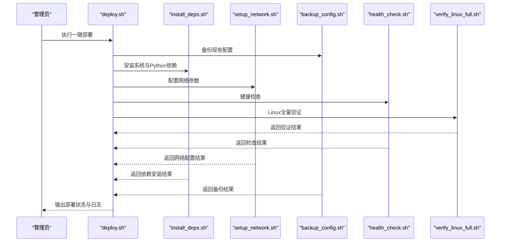
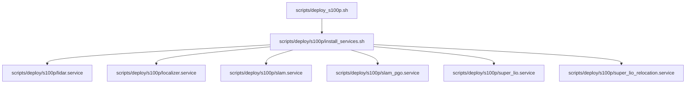
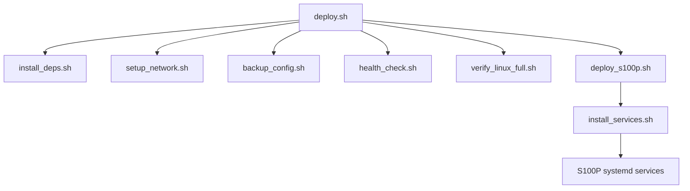

# 部署脚本

<cite>
**本文引用的文件**
- [deploy.sh](file://scripts/deploy/deploy.sh)
- [install_deps.sh](file://scripts/deploy/install_deps.sh)
- [setup_network.sh](file://scripts/deploy/setup_network.sh)
- [backup_config.sh](file://scripts/deploy/backup_config.sh)
- [health_check.sh](file://scripts/deploy/health_check.sh)
- [verify_linux_full.sh](file://scripts/deploy/verify_linux_full.sh)
- [DEPLOYMENT_CHECKLIST.md](file://scripts/deploy/DEPLOYMENT_CHECKLIST.md)
- [deploy_s100p.sh](file://scripts/deploy_s100p.sh)
- [install_services.sh](file://scripts/deploy/s100p/install_services.sh)
- [lidar.service](file://scripts/deploy/s100p/lidar.service)
- [localizer.service](file://scripts/deploy/s1000p/localizer.service)
- [slam.service](file://scripts/deploy/s100p/slam.service)
- [slam_pgo.service](file://scripts/deploy/s100p/slam_pgo.service)
- [super_lio.service](file://scripts/deploy/s100p/super_lio.service)
- [super_lio_relocation.service](file://scripts/deploy/s100p/super_lio_relocation.service)
- [install_gnss.sh](file://scripts/deploy/install_gnss.sh)
- [install_semantic_deps.sh](file://scripts/deploy/install_semantic_deps.sh)
- [setup_semantic.sh](file://scripts/deploy/setup_semantic.sh)
- [setup_server_ros_pct.sh](file://scripts/deploy/setup_server_ros_pct.sh)
- [lingtu.sh](file://scripts/lingtu.sh)
- [start_thunder.sh](file://scripts/deploy/start_thunder.sh)
- [thunder_service.sh](file://scripts/deploy/thunder_service.sh)
- [start_perception_demo.sh](file://scripts/deploy/start_perception_demo.sh)
- [sync_versions.sh](file://scripts/deploy/sync_versions.sh)
- [sync_versions.ps1](file://scripts/deploy/sync_versions.ps1)
- [sync_sunrise.ps1](file://scripts/deploy/sync_sunrise.ps1)
- [migrate_sunrise_layout.sh](file://scripts/deploy/migrate_sunrise_layout.sh)
- [cut_release.sh](file://scripts/deploy/cut_release.sh)
- [lingtu_cli.py](file://lingtu_cli.py)
- [main_nav.py](file://main_nav.py)
- [requirements.txt](file://requirements.txt)
- [requirements-dev.txt](file://requirements-dev.txt)
- [pyproject.toml](file://pyproject.toml)
</cite>

## 目录
1. [简介](#简介)
2. [项目结构](#项目结构)
3. [核心组件](#核心组件)
4. [架构总览](#架构总览)
5. [详细组件分析](#详细组件分析)
6. [依赖关系分析](#依赖关系分析)
7. [性能考虑](#性能考虑)
8. [故障排除指南](#故障排除指南)
9. [结论](#结论)
10. [附录](#附录)

## 简介
本文件面向LingTu部署与运维团队，系统化梳理仓库中的部署脚本体系，覆盖从环境准备、依赖安装、网络配置、服务管理到S100P平台专用适配的全流程。文档重点说明以下脚本的功能与用法：
- 一键部署：deploy.sh
- 依赖安装：install_deps.sh
- 网络配置：setup_network.sh
- 配置备份：backup_config.sh
- 健康检查：health_check.sh
- Linux全量验证：verify_linux_full.sh
- S100P平台部署：deploy_s100p.sh 及其配套服务单元
- 其他专项部署：install_gnss.sh、install_semantic_deps.sh、setup_semantic.sh、setup_server_ros_pct.sh、start_thunder.sh、thunder_service.sh、start_perception_demo.sh、sync_versions.sh、sync_versions.ps1、sync_sunrise.ps1、migrate_sunrise_layout.sh、cut_release.sh
- CLI入口：lingtu.sh
- 运行入口：lingtu_cli.py、main_nav.py
- Python依赖：requirements.txt、requirements-dev.txt、pyproject.toml

## 项目结构
部署相关脚本集中于 scripts/deploy 与 scripts/deploy/s100p，同时提供独立的 S100P 一键部署脚本与若干专项部署脚本。

```mermaid
graph TB
A["scripts/deploy/deploy.sh"] --> B["scripts/deploy/install_deps.sh"]
A --> C["scripts/deploy/setup_network.sh"]
A --> D["scripts/deploy/backup_config.sh"]
A --> E["scripts/deploy/health_check.sh"]
A --> F["scripts/deploy/verify_linux_full.sh"]
A --> G["scripts/deploy_s100p.sh"]
G --> H["scripts/deploy/s100p/install_services.sh"]
H --> I["scripts/deploy/s100p/lidar.service"]
H --> J["scripts/deploy/s100p/localizer.service"]
H --> K["scripts/deploy/s100p/slam.service"]
H --> L["scripts/deploy/s100p/slam_pgo.service"]
H --> M["scripts/deploy/s100p/super_lio.service"]
H --> N["scripts/deploy/s100p/super_lio_relocation.service"]
A --> O["scripts/deploy/install_gnss.sh"]
A --> P["scripts/deploy/install_semantic_deps.sh"]
A --> Q["scripts/deploy/setup_semantic.sh"]
A --> R["scripts/deploy/setup_server_ros_pct.sh"]
A --> S["scripts/deploy/start_thunder.sh"]
A --> T["scripts/deploy/thunder_service.sh"]
A --> U["scripts/deploy/start_perception_demo.sh"]
A --> V["scripts/deploy/sync_versions.sh"]
A --> W["scripts/deploy/sync_versions.ps1"]
A --> X["scripts/deploy/sync_sunrise.ps1"]
A --> Y["scripts/deploy/migrate_sunrise_layout.sh"]
A --> Z["scripts/deploy/cut_release.sh"]
```

**图示来源**
- [deploy.sh](file://scripts/deploy/deploy.sh)
- [install_deps.sh](file://scripts/deploy/install_deps.sh)
- [setup_network.sh](file://scripts/deploy/setup_network.sh)
- [backup_config.sh](file://scripts/deploy/backup_config.sh)
- [health_check.sh](file://scripts/deploy/health_check.sh)
- [verify_linux_full.sh](file://scripts/deploy/verify_linux_full.sh)
- [deploy_s100p.sh](file://scripts/deploy_s100p.sh)
- [install_services.sh](file://scripts/deploy/s100p/install_services.sh)
- [lidar.service](file://scripts/deploy/s100p/lidar.service)
- [localizer.service](file://scripts/deploy/s100p/localizer.service)
- [slam.service](file://scripts/deploy/s100p/slam.service)
- [slam_pgo.service](file://scripts/deploy/s100p/slam_pgo.service)
- [super_lio.service](file://scripts/deploy/s100p/super_lio.service)
- [super_lio_relocation.service](file://scripts/deploy/s100p/super_lio_relocation.service)
- [install_gnss.sh](file://scripts/deploy/install_gnss.sh)
- [install_semantic_deps.sh](file://scripts/deploy/install_semantic_deps.sh)
- [setup_semantic.sh](file://scripts/deploy/setup_semantic.sh)
- [setup_server_ros_pct.sh](file://scripts/deploy/setup_server_ros_pct.sh)
- [start_thunder.sh](file://scripts/deploy/start_thunder.sh)
- [thunder_service.sh](file://scripts/deploy/thunder_service.sh)
- [start_perception_demo.sh](file://scripts/deploy/start_perception_demo.sh)
- [sync_versions.sh](file://scripts/deploy/sync_versions.sh)
- [sync_versions.ps1](file://scripts/deploy/sync_versions.ps1)
- [sync_sunrise.ps1](file://scripts/deploy/sync_sunrise.ps1)
- [migrate_sunrise_layout.sh](file://scripts/deploy/migrate_sunrise_layout.sh)
- [cut_release.sh](file://scripts/deploy/cut_release.sh)

**章节来源**
- [deploy.sh](file://scripts/deploy/deploy.sh)
- [DEPLOYMENT_CHECKLIST.md](file://scripts/deploy/DEPLOYMENT_CHECKLIST.md)

## 核心组件
- 一键部署脚本 deploy.sh：整合环境准备、依赖安装、网络配置、健康检查与Linux全量验证，形成端到端的自动化部署流水线。
- 依赖安装 install_deps.sh：负责系统级与Python依赖的安装与版本校验。
- 网络配置 setup_network.sh：根据目标设备网络环境进行必要的网络参数调整。
- 配置备份 backup_config.sh：在部署或升级前对现有配置进行安全备份。
- 健康检查 health_check.sh：执行基础连通性与服务可用性检查。
- Linux全量验证 verify_linux_full.sh：对Linux平台特性、内核模块、权限等进行全面验证。
- S100P平台部署 deploy_s100p.sh：面向S100P硬件栈的专用部署入口，配合 systemd 服务单元实现各模块的托管与自启。
- 专项部署脚本：如 GNSS 安装、语义感知依赖安装、ROS服务器配置、Thunder服务启动、演示启动脚本、版本同步与发布切割等。

**章节来源**
- [deploy.sh](file://scripts/deploy/deploy.sh)
- [install_deps.sh](file://scripts/deploy/install_deps.sh)
- [setup_network.sh](file://scripts/deploy/setup_network.sh)
- [backup_config.sh](file://scripts/deploy/backup_config.sh)
- [health_check.sh](file://scripts/deploy/health_check.sh)
- [verify_linux_full.sh](file://scripts/deploy/verify_linux_full.sh)
- [deploy_s100p.sh](file://scripts/deploy_s100p.sh)

## 架构总览
下图展示一次典型的一键部署流程，从入口脚本到各子任务的调用关系与数据/控制流。

**图示来源**
- [deploy.sh](file://scripts/deploy/deploy.sh)
- [install_deps.sh](file://scripts/deploy/install_deps.sh)
- [setup_network.sh](file://scripts/deploy/setup_network.sh)
- [backup_config.sh](file://scripts/deploy/backup_config.sh)
- [health_check.sh](file://scripts/deploy/health_check.sh)
- [verify_linux_full.sh](file://scripts/deploy/verify_linux_full.sh)

## 详细组件分析

### 一键部署脚本 deploy.sh
- 功能概述：作为部署入口，按顺序调用依赖安装、网络配置、健康检查与Linux全量验证，并在必要时触发配置备份。
- 关键流程：
  - 调用 backup_config.sh 进行配置备份
  - 调用 install_deps.sh 完成系统与Python依赖安装
  - 调用 setup_network.sh 配置网络
  - 调用 health_check.sh 执行健康检查
  - 调用 verify_linux_full.sh 进行Linux平台验证
- 使用建议：
  - 在生产环境部署前，务必确认网络与权限满足要求
  - 如需保留历史配置，请在执行前了解备份策略与恢复方式

**章节来源**
- [deploy.sh](file://scripts/deploy/deploy.sh)
- [backup_config.sh](file://scripts/deploy/backup_config.sh)
- [install_deps.sh](file://scripts/deploy/install_deps.sh)
- [setup_network.sh](file://scripts/deploy/setup_network.sh)
- [health_check.sh](file://scripts/deploy/health_check.sh)
- [verify_linux_full.sh](file://scripts/deploy/verify_linux_full.sh)

### 依赖安装脚本 install_deps.sh
- 功能概述：负责安装系统级依赖与Python依赖，确保运行环境满足要求。
- 关键点：
  - 检测并安装系统包管理器（如apt/yum）所需的软件源与工具
  - 安装Python虚拟环境与依赖包，参考 requirements.txt、requirements-dev.txt、pyproject.toml
  - 对关键依赖进行版本校验，避免兼容性问题
- 使用建议：
  - 首次部署建议以root或sudo权限执行
  - 若网络受限，可提前准备离线包或镜像源

**章节来源**
- [install_deps.sh](file://scripts/deploy/install_deps.sh)
- [requirements.txt](file://requirements.txt)
- [requirements-dev.txt](file://requirements-dev.txt)
- [pyproject.toml](file://pyproject.toml)

### 网络配置脚本 setup_network.sh
- 功能概述：根据目标设备的网络拓扑与安全策略，调整网络参数（如防火墙、网卡、路由等），确保通信链路畅通。
- 关键点：
  - 识别当前网络接口与IP配置
  - 配置必要的端口放行与路由规则
  - 应用并持久化网络变更
- 使用建议：
  - 在容器或虚拟化环境中，注意网络命名空间与桥接配置
  - 生产环境建议结合防火墙策略统一管理

**章节来源**
- [setup_network.sh](file://scripts/deploy/setup_network.sh)

### 配置备份脚本 backup_config.sh
- 功能概述：在部署或升级前对现有配置进行备份，防止误操作导致的数据丢失。
- 关键点：
  - 识别配置文件位置与目录结构
  - 生成时间戳备份归档
  - 支持增量备份与全量备份策略
- 使用建议：
  - 建议将备份目录纳入版本控制或外部存储
  - 备份后验证归档完整性

**章节来源**
- [backup_config.sh](file://scripts/deploy/backup_config.sh)

### 健康检查脚本 health_check.sh
- 功能概述：对系统关键组件进行连通性与可用性检查，快速定位部署后的问题。
- 关键点：
  - 检查核心服务进程状态
  - 验证端口监听与网络连通
  - 记录检查结果并输出报告
- 使用建议：
  - 结合日志与监控系统进行联动
  - 将检查结果纳入CI/CD质量门禁

**章节来源**
- [health_check.sh](file://scripts/deploy/health_check.sh)

### Linux全量验证脚本 verify_linux_full.sh
- 功能概述：对Linux平台特性进行全面验证，包括内核模块、权限、文件系统、硬件直通等。
- 关键点：
  - 检查内核版本与模块加载情况
  - 验证用户权限与组成员关系
  - 校验硬件直通与设备访问权限
- 使用建议：
  - 在裸金属或宿主机部署场景中尤为重要
  - 建议在变更内核或驱动后重新执行

**章节来源**
- [verify_linux_full.sh](file://scripts/deploy/verify_linux_full.sh)

### S100P平台专用部署
- 一键部署：deploy_s100p.sh
  - 功能概述：面向S100P硬件栈的专用部署入口，集成S100P特有的硬件适配、性能优化与资源分配策略。
  - 关键点：
    - 自动识别S100P硬件平台特征
    - 应用平台专属的性能参数与资源限制
    - 启动并管理S100P相关服务
- 服务单元与安装：
  - install_services.sh：安装并启用S100P相关systemd服务单元
  - lidar.service、localizer.service、slam.service、slam_pgo.service、super_lio.service、super_lio_relocation.service：分别对应激光雷达、定位、SLAM、SLAM+PGO、Super LIO与重定位服务
- 使用建议：
  - 部署前确认硬件驱动与固件版本
  - 结合性能监控工具评估资源占用与延迟

**图示来源**
- [deploy_s100p.sh](file://scripts/deploy_s100p.sh)
- [install_services.sh](file://scripts/deploy/s100p/install_services.sh)
- [lidar.service](file://scripts/deploy/s100p/lidar.service)
- [localizer.service](file://scripts/deploy/s100p/localizer.service)
- [slam.service](file://scripts/deploy/s100p/slam.service)
- [slam_pgo.service](file://scripts/deploy/s100p/slam_pgo.service)
- [super_lio.service](file://scripts/deploy/s100p/super_lio.service)
- [super_lio_relocation.service](file://scripts/deploy/s100p/super_lio_relocation.service)

**章节来源**
- [deploy_s100p.sh](file://scripts/deploy_s100p.sh)
- [install_services.sh](file://scripts/deploy/s100p/install_services.sh)
- [lidar.service](file://scripts/deploy/s100p/lidar.service)
- [localizer.service](file://scripts/deploy/s100p/localizer.service)
- [slam.service](file://scripts/deploy/s100p/slam.service)
- [slam_pgo.service](file://scripts/deploy/s100p/slam_pgo.service)
- [super_lio.service](file://scripts/deploy/s100p/super_lio.service)
- [super_lio_relocation.service](file://scripts/deploy/s100p/super_lio_relocation.service)

### 专项部署脚本
- GNSS安装：install_gnss.sh
  - 作用：安装GNSS相关依赖与驱动，确保高精度定位能力
- 语义感知依赖安装：install_semantic_deps.sh
  - 作用：安装语义感知模块所需依赖
- 语义环境搭建：setup_semantic.sh
  - 作用：初始化语义感知工作环境与配置
- ROS服务器配置：setup_server_ros_pct.sh
  - 作用：配置ROS服务器与PCT相关参数
- Thunder服务启动：start_thunder.sh、thunder_service.sh
  - 作用：启动Thunder服务并注册为systemd服务
- 演示启动：start_perception_demo.sh
  - 作用：启动感知演示流程
- 版本同步：sync_versions.sh、sync_versions.ps1、sync_sunrise.ps1
  - 作用：同步版本信息与布局迁移
- 布局迁移：migrate_sunrise_layout.sh
  - 作用：迁移Sunrise布局至新环境
- 发布切割：cut_release.sh
  - 作用：生成发布包与清单

**章节来源**
- [install_gnss.sh](file://scripts/deploy/install_gnss.sh)
- [install_semantic_deps.sh](file://scripts/deploy/install_semantic_deps.sh)
- [setup_semantic.sh](file://scripts/deploy/setup_semantic.sh)
- [setup_server_ros_pct.sh](file://scripts/deploy/setup_server_ros_pct.sh)
- [start_thunder.sh](file://scripts/deploy/start_thunder.sh)
- [thunder_service.sh](file://scripts/deploy/thunder_service.sh)
- [start_perception_demo.sh](file://scripts/deploy/start_perception_demo.sh)
- [sync_versions.sh](file://scripts/deploy/sync_versions.sh)
- [sync_versions.ps1](file://scripts/deploy/sync_versions.ps1)
- [sync_sunrise.ps1](file://scripts/deploy/sync_sunrise.ps1)
- [migrate_sunrise_layout.sh](file://scripts/deploy/migrate_sunrise_layout.sh)
- [cut_release.sh](file://scripts/deploy/cut_release.sh)

### CLI与运行入口
- CLI入口：lingtu.sh
  - 作用：提供命令行入口，便于快速启动与调试
- 运行入口：lingtu_cli.py、main_nav.py
  - 作用：定义主程序入口与导航逻辑
- 依赖声明：requirements.txt、requirements-dev.txt、pyproject.toml
  - 作用：声明Python运行时依赖与开发依赖

**章节来源**
- [lingtu.sh](file://scripts/lingtu.sh)
- [lingtu_cli.py](file://lingtu_cli.py)
- [main_nav.py](file://main_nav.py)
- [requirements.txt](file://requirements.txt)
- [requirements-dev.txt](file://requirements-dev.txt)
- [pyproject.toml](file://pyproject.toml)

## 依赖关系分析
- 组件耦合：
  - deploy.sh 作为编排器，耦合多个子脚本；通过明确的调用顺序与错误传播机制保证整体可靠性
  - S100P部署通过 install_services.sh 与多套 systemd 单元实现模块化管理
- 外部依赖：
  - Python运行时与第三方库由 requirements*.txt 与 pyproject.toml 管理
  - 系统级依赖通过 install_deps.sh 安装，受操作系统包管理器影响
- 潜在风险：
  - 网络配置与权限变更可能影响系统稳定性，建议在维护窗口执行
  - S100P平台对硬件与驱动敏感，升级前应做好回滚准备

**图示来源**
- [deploy.sh](file://scripts/deploy/deploy.sh)
- [install_deps.sh](file://scripts/deploy/install_deps.sh)
- [setup_network.sh](file://scripts/deploy/setup_network.sh)
- [backup_config.sh](file://scripts/deploy/backup_config.sh)
- [health_check.sh](file://scripts/deploy/health_check.sh)
- [verify_linux_full.sh](file://scripts/deploy/verify_linux_full.sh)
- [deploy_s100p.sh](file://scripts/deploy_s100p.sh)
- [install_services.sh](file://scripts/deploy/s100p/install_services.sh)

**章节来源**
- [deploy.sh](file://scripts/deploy/deploy.sh)
- [deploy_s100p.sh](file://scripts/deploy_s100p.sh)

## 性能考虑
- 依赖安装阶段：
  - 优先使用本地缓存与镜像源，减少网络抖动对安装时长的影响
  - 并行安装非冲突依赖，缩短等待时间
- 网络配置阶段：
  - 避免频繁重启网络服务，尽量一次性完成配置
  - 在容器环境中使用host网络模式降低转发开销
- S100P平台：
  - 合理设置CPU亲和与内存NUMA绑定，提升实时性
  - 为关键服务预留独占CPU核或使用实时调度策略
  - 控制I/O队列深度与缓冲区大小，平衡吞吐与延迟

## 故障排除指南
- 依赖安装失败：
  - 检查网络连通性与代理设置
  - 清理pip缓存并重试
  - 确认Python版本与虚拟环境激活状态
- 网络配置异常：
  - 核对防火墙规则与端口占用
  - 检查网卡状态与IP地址冲突
- 健康检查不通过：
  - 查看服务日志与进程状态
  - 验证端口监听与进程PID
- Linux全量验证失败：
  - 检查内核模块加载与设备权限
  - 确认用户组与sudo权限
- S100P平台问题：
  - 确认硬件驱动与固件版本匹配
  - 检查systemd服务状态与日志
  - 回退到上一个稳定版本并重试

**章节来源**
- [health_check.sh](file://scripts/deploy/health_check.sh)
- [verify_linux_full.sh](file://scripts/deploy/verify_linux_full.sh)
- [install_deps.sh](file://scripts/deploy/install_deps.sh)
- [setup_network.sh](file://scripts/deploy/setup_network.sh)

## 结论
LingTu部署脚本体系提供了从通用到S100P平台的完整自动化部署方案。通过编排式的一键部署脚本与模块化的子脚本，能够高效地完成环境准备、依赖安装、网络配置、健康检查与平台验证。对于S100P平台，配套的服务单元与专用部署脚本进一步提升了硬件适配与资源管理的可控性。建议在生产环境中结合CI/CD与监控体系，持续优化部署流程与性能表现。

## 附录
- 部署前检查清单（摘自DEPLOYMENT_CHECKLIST.md要点）：
  - 确认硬件规格与驱动版本满足要求
  - 准备网络拓扑与防火墙策略
  - 备份现有配置并制定回滚计划
  - 准备Python虚拟环境与依赖缓存
  - 准备systemd服务单元与权限配置
- 部署后验证步骤：
  - 执行健康检查与Linux全量验证
  - 核对服务状态与端口监听
  - 运行最小化功能测试
  - 记录部署日志并归档

**章节来源**
- [DEPLOYMENT_CHECKLIST.md](file://scripts/deploy/DEPLOYMENT_CHECKLIST.md)