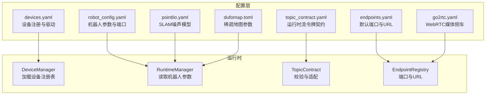
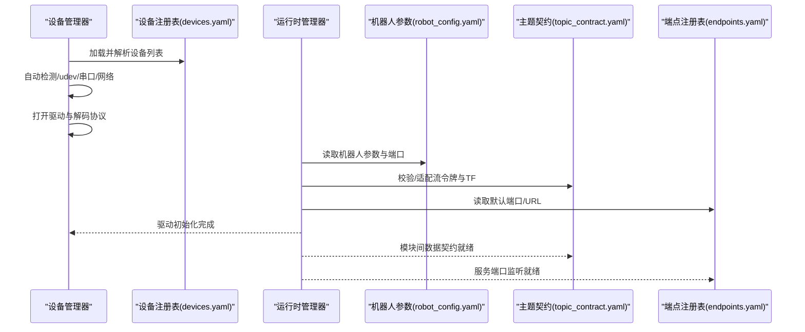
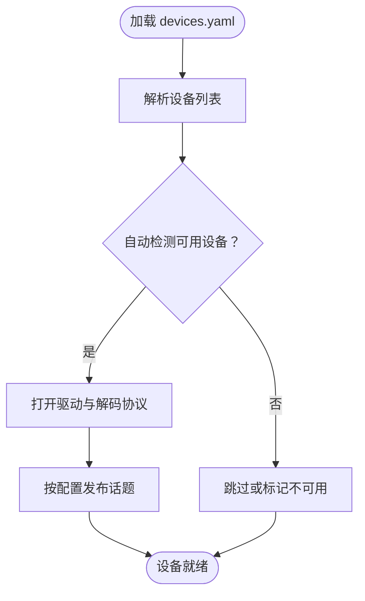
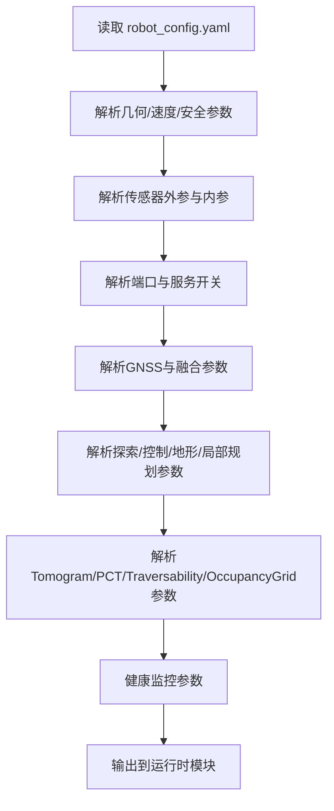
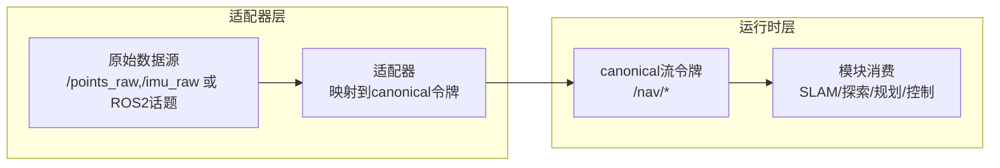
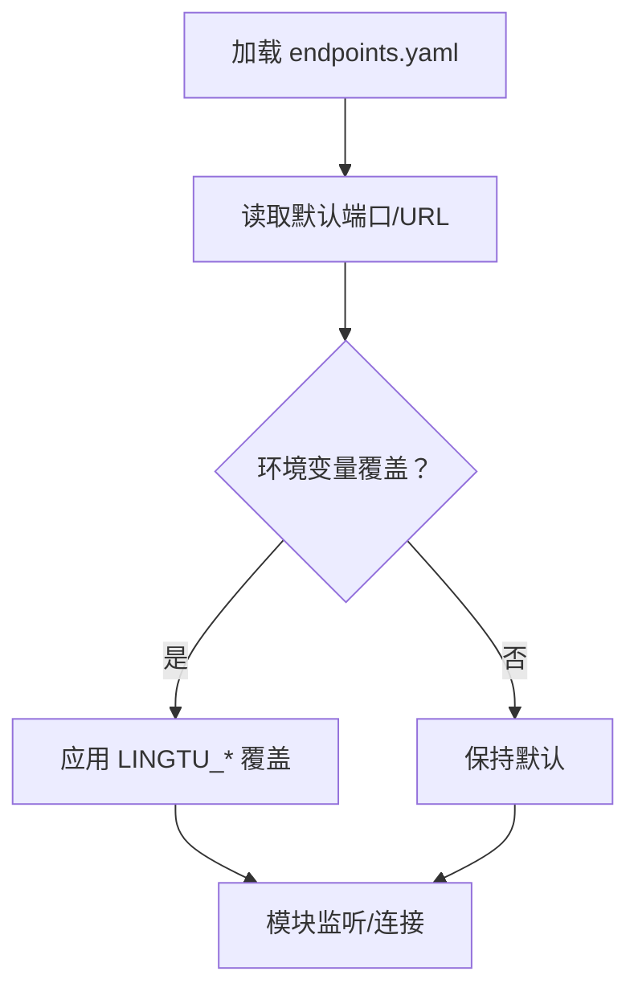
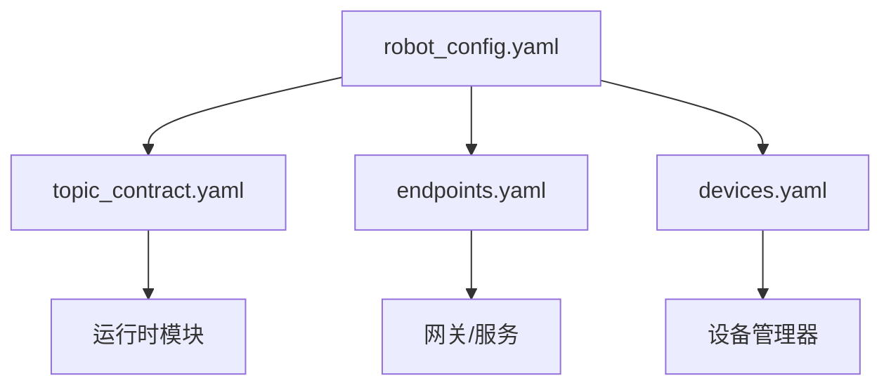

# 系统配置

<cite>
**本文引用的文件**
- [devices.yaml](file://config/devices.yaml)
- [robot_config.yaml](file://config/robot_config.yaml)
- [topic_contract.yaml](file://config/topic_contract.yaml)
- [endpoints.yaml](file://config/endpoints.yaml)
- [README.md](file://config/README.md)
- [pointlio.yaml](file://config/pointlio.yaml)
- [dufomap.toml](file://config/dufomap.toml)
- [go2rtc.yaml](file://config/go2rtc.yaml)
- [ros_frame_contract.md](file://docs/architecture/ros_frame_contract.md)
- [semantic_layer_contract.md](file://docs/architecture/semantic_layer_contract.md)
- [TROUBLESHOOTING.md](file://docs/03-development/TROUBLESHOOTING.md)
- [PARAMETER_TUNING.md](file://docs/03-development/PARAMETER_TUNING.md)
</cite>

## 目录
1. [简介](#简介)
2. [项目结构](#项目结构)
3. [核心组件](#核心组件)
4. [架构总览](#架构总览)
5. [详细组件分析](#详细组件分析)
6. [依赖分析](#依赖分析)
7. [性能考虑](#性能考虑)
8. [故障排查指南](#故障排查指南)
9. [结论](#结论)
10. [附录](#附录)

## 简介
本文件面向LingTu系统的系统级配置，聚焦以下四大配置域：
- 设备配置：devices.yaml，用于统一登记与发现硬件设备，声明驱动、能力与发布的话题。
- 机器人配置：robot_config.yaml，作为机器人参数的单一来源，涵盖几何、运动、安全、传感器外参与端口等。
- 主题契约：topic_contract.yaml，定义运行时“流令牌”（非ROS2话题名）的规范，确保模块间数据契约一致。
- 网络端点：endpoints.yaml，定义所有模块默认监听端口与URL，作为“单一可信源”。

同时，本文提供配置编写规范、最佳实践与常见错误排查方法，帮助在真实机器人、仿真与开发环境中保持一致性。

## 项目结构
LingTu的配置位于config目录，采用“单一可信源”策略，核心文件如下：
- devices.yaml：设备注册表，描述GNSS、LiDAR、相机、电机控制器、CAN总线等。
- robot_config.yaml：机器人参数与端口、传感器外参、导航/探索/地形/局部规划等参数。
- topic_contract.yaml：运行时流令牌契约，定义数据流、TF映射、消息格式与必需话题集合。
- endpoints.yaml：端点与服务默认端口，统一REST/WS/MCP/Brainstem/仿真/可视化等端口。
- 其他辅助配置：pointlio.yaml（SLAM噪声模型）、dufomap.toml（稀疏LiDAR地图）、go2rtc.yaml（WebRTC媒体侧车）。

**图表来源**
- [devices.yaml:1-87](file://config/devices.yaml#L1-L87)
- [robot_config.yaml:1-327](file://config/robot_config.yaml#L1-L327)
- [topic_contract.yaml:1-1044](file://config/topic_contract.yaml#L1-L1044)
- [endpoints.yaml:1-62](file://config/endpoints.yaml#L1-L62)

**章节来源**
- [README.md:1-119](file://config/README.md#L1-L119)

## 核心组件
- 设备注册表（devices.yaml）
  - 统一登记设备ID、类型、启用状态、驱动、能力与发布话题。
  - 支持基于udev匹配、串口、网络端点等识别方式。
- 机器人参数（robot_config.yaml）
  - 机器人标识、几何尺寸、速度/安全参数、驱动端口、传感器外参、GNSS接入与融合参数、探索/控制/地形/局部规划等。
- 主题契约（topic_contract.yaml）
  - 定义canonical运行时流令牌、数据格式、TF映射、必需话题集合、算法接口与数据流阶段。
- 端点注册表（endpoints.yaml）
  - 统一REST/WS/MCP、Brainstem、仿真、可视化、WebRTC等默认端口与URL。

**章节来源**
- [devices.yaml:1-87](file://config/devices.yaml#L1-L87)
- [robot_config.yaml:1-327](file://config/robot_config.yaml#L1-L327)
- [topic_contract.yaml:1-1044](file://config/topic_contract.yaml#L1-L1044)
- [endpoints.yaml:1-62](file://config/endpoints.yaml#L1-L62)

## 架构总览
LingTu通过“配置即契约”的方式，将设备、机器人参数、主题契约与端点统一管理，形成如下交互：
- DeviceManager依据devices.yaml加载设备并自动检测、打开驱动与解码协议。
- RuntimeManager读取robot_config.yaml作为单一来源，覆盖launch参数与默认值。
- TopicContract确保模块间数据契约一致，适配不同适配器（ROS2、仿真、外部网关）。
- EndpointRegistry为所有模块提供默认端口与URL，支持环境变量与运行时覆盖。

**图表来源**
- [devices.yaml:1-87](file://config/devices.yaml#L1-L87)
- [robot_config.yaml:1-327](file://config/robot_config.yaml#L1-L327)
- [topic_contract.yaml:1-1044](file://config/topic_contract.yaml#L1-L1044)
- [endpoints.yaml:1-62](file://config/endpoints.yaml#L1-L62)

## 详细组件分析

### 设备配置（devices.yaml）
- 结构要点
  - 版本号与注释明确单一可信源职责。
  - 每个设备条目包含：id、type、enabled、driver、description、能力列表、发布话题等。
  - 支持udev匹配（vendor_id/product_id/port_path）、串口参数（device/baud）、网络参数（ip/port/host/port）与配置项（如相机分辨率、帧率、旋转角度）。
- 设备类型与典型配置
  - GNSS：NMEA串口驱动，发布定位与状态。
  - LiDAR：Livox SDK2驱动，发布点云与IMU。
  - 相机：Orbbec SDK驱动，发布彩色与深度图像。
  - 电机控制器：Brainstem gRPC驱动，提供步态与姿态控制。
  - CAN总线：PCAN-USB驱动，内部独占使用。
- 话题发布规范
  - 每个发布项包含：name、type、rate_hz，便于速率控制与诊断。

**图表来源**
- [devices.yaml:1-87](file://config/devices.yaml#L1-L87)

**章节来源**
- [devices.yaml:1-87](file://config/devices.yaml#L1-L87)

### 机器人配置（robot_config.yaml）
- 单一可信源
  - 所有机器人特定参数集中于此，launch与网关默认值均从此读取。
  - 支持命令行覆盖（如maxSpeed）。
- 关键分区
  - 机器人标识：id、hw_id、firmware_version。
  - 几何尺寸：vehicle_height/width/length、sensor_offset_x/y。
  - 速度与安全：max_linear/max_angular、stop_distance/slow_distance、tilt_limit_deg、各类超时。
  - 底盘驱动：dog_host/dog_port、control_rate/auto_enable/auto_standup、重连与SLAM重置周期。
  - LiDAR外参：frame_id、publish_freq、offset_x/y/z与roll/pitch/yaw、相机Z偏移。
  - 相机外参与内参：position_x/y/z、roll/pitch/yaw、fx/fy/cx/cy、width/height、depth_scale、rotate、畸变系数。
  - 端口：gateway.port、gateway.mcp_port、brainstem.host/port。
  - GNSS：启用、模型、设备、波特率、天线偏移、话题、地图原点、质量控制、RTCM/NTRIP、融合后端与参数。
  - 探索：backend、tare_scenario、tare_auto_start、tare_config。
  - 控制增益：yaw_rate_gain、max_yaw_rate、max_accel。
  - 自主导航延迟：joy_to_speed_delay、joy_to_check_obstacle_delay。
  - 路径跟随高级：方向切换、坡度/倾斜相关阈值与时间、卡滞检测。
  - 地形分析高级：分位数、坡度/台阶/可站立比例、代价与膨胀、碰撞检查等。
  - 局部规划高级：两向驱动、障碍物检查、路径裁剪与代价权重。
  - 围栏扩展：检查频率、告警/停止边距、开关。
  - Tomogram构建：分辨率、垂直切片、可通行性分析、坡度/台阶/安全边距、膨胀。
  - PCT全局规划：目标高度、路径平滑、质量阈值、发布频率。
  - TraversabilityCost：接近性软代价、最大坡度、发布频率。
  - OccupancyGrid：分辨率、半径、高度过滤、膨胀半径、发布频率。
  - 健康监控：评估频率、速率窗口。
- 与SLAM噪声模型的关系
  - IMU噪声（na/ng/nba/nbg）与LiDAR-IMU外参在pointlio.yaml中配置，需与robot_config.yaml的外参保持一致。

**图表来源**
- [robot_config.yaml:1-327](file://config/robot_config.yaml#L1-L327)
- [pointlio.yaml:1-240](file://config/pointlio.yaml#L1-L240)

**章节来源**
- [robot_config.yaml:1-327](file://config/robot_config.yaml#L1-L327)
- [pointlio.yaml:1-240](file://config/pointlio.yaml#L1-L240)

### 主题契约（topic_contract.yaml）
- 契约设计
  - 将“canonical运行时流令牌”与ROS2话题解耦，模块消费的是流令牌而非具体ROS2话题名。
  - 提供数据格式、TF映射、必需话题集合、算法接口与数据流阶段，确保静态校验与一致性。
- 关键要素
  - 传感器原始与后处理：/points_raw、/imu_raw、/nav/lidar_scan、/nav/imu。
  - SLAM：/nav/odometry、/nav/registered_cloud、/nav/map_cloud、/nav/saved_map_cloud、保存地图服务。
  - 定位：/nav/localization_quality、/nav/localization_health、重定位服务。
  - 探索：/exploration/start、/exploration/stop、/exploration/way_point、/nav/exploration_grid、候选前沿。
  - 规划：/nav/global_path、/nav/local_path、/nav/planner_status、/nav/mission_status。
  - 自动驾驶：/nav/terrain_map、/nav/terrain_map_ext、/nav/local_path、/nav/cmd_vel、/nav/stop、/nav/slow_down、/nav/way_point、/nav/speed。
  - 语义：/nav/semantic/*系列。
  - 重建：/nav/reconstruction/*系列。
  - TF与坐标系：map/odom/body/base_link/lidar_link/camera_link等，含别名与链接。
  - 数据格式：针对不同topic的ROS消息类型与必需字段。
  - 算法接口：fastlio_mapping、exploration_strategy、global_planning、local_planning_and_following等。
  - 数据流阶段：endpoint_adapter、slam_or_relayed_localization_map、map_layers_and_exploration、global_planning、local_planning_and_following、dynamic_obstacle_gate、command_boundary。
- 使用建议
  - 适配器负责将底层数据（ROS2或其他）映射到上述canonical令牌。
  - 不要随意更改既有令牌名，避免破坏模块契约。

**图表来源**
- [topic_contract.yaml:1-1044](file://config/topic_contract.yaml#L1-L1044)
- [ros_frame_contract.md](file://docs/architecture/ros_frame_contract.md)

**章节来源**
- [topic_contract.yaml:1-1044](file://config/topic_contract.yaml#L1-L1044)
- [ros_frame_contract.md](file://docs/architecture/ros_frame_contract.md)

### 网络端点（endpoints.yaml）
- 默认端口与URL
  - 网关：REST/WS/SSE端口、MCP JSON-RPC端口、Teleop端口。
  - Brainstem：gRPC主机与端口（与robot_config.yaml中的dog_host/dog_port对应）。
  - 仿真：ROS2 Master URI。
  - 可视化：Rerun Web端口与gRPC端口。
  - Vision/重建：检测服务端口。
  - WebRTC/go2rtc：API端口、TCP回退端口。
  - LiDAR：Livox默认IP、宿主机IP、SDK命令端口。
  - GNSS NTRIP：默认端口。
  - 设备注册表：默认路径。
- 覆盖机制
  - 运行时可通过环境变量（LINGTU_*）或构造函数参数覆盖默认值。

**图表来源**
- [endpoints.yaml:1-62](file://config/endpoints.yaml#L1-L62)

**章节来源**
- [endpoints.yaml:1-62](file://config/endpoints.yaml#L1-L62)

### 辅助配置
- SLAM噪声模型（pointlio.yaml）
  - 定义Point-LIO的IMU噪声、LiDAR测量噪声、过程噪声、ikd-Tree参数、点云下采样与地图分辨率等。
  - 与robot_config.yaml中的LiDAR-IMU外参保持一致，确保坐标变换正确。
- 稀疏地图（dufomap.toml）
  - 针对Livox Mid-360的稀疏点云优化参数，如体素分辨率、未知膨胀、命中距离、最小/最大距离等。
- WebRTC媒体侧车（go2rtc.yaml）
  - go2rtc的API监听、WebRTC候选、日志级别、流配置（RGB主/低质量流）、录制等。
  - 支持通过环境变量覆盖摄像头设备路径。

**章节来源**
- [pointlio.yaml:1-240](file://config/pointlio.yaml#L1-L240)
- [dufomap.toml:1-44](file://config/dufomap.toml#L1-L44)
- [go2rtc.yaml:1-68](file://config/go2rtc.yaml#L1-L68)

## 依赖分析
- 配置间耦合
  - robot_config.yaml与topic_contract.yaml：机器人参数（如相机/LiDAR外参、端口）需与主题契约中的TF与数据格式一致。
  - robot_config.yaml与devices.yaml：设备驱动与能力需满足模块所需的canonical令牌。
  - endpoints.yaml与robot_config.yaml：端口与Brainstem主机/端口需一致。
- 外部依赖
  - DDS配置（cyclonedds.xml/fastdds_no_shm.xml）仅在跨机或Docker部署时调整。
  - WebRTC依赖go2rtc，端口与候选需与产品部署网络一致。

**图表来源**
- [robot_config.yaml:1-327](file://config/robot_config.yaml#L1-L327)
- [topic_contract.yaml:1-1044](file://config/topic_contract.yaml#L1-L1044)
- [endpoints.yaml:1-62](file://config/endpoints.yaml#L1-L62)
- [devices.yaml:1-87](file://config/devices.yaml#L1-L87)

**章节来源**
- [robot_config.yaml:1-327](file://config/robot_config.yaml#L1-L327)
- [topic_contract.yaml:1-1044](file://config/topic_contract.yaml#L1-L1044)
- [endpoints.yaml:1-62](file://config/endpoints.yaml#L1-L62)
- [devices.yaml:1-87](file://config/devices.yaml#L1-L87)

## 性能考虑
- 话题发布频率与带宽
  - devices.yaml中的rate_hz应结合下游模块处理能力与网络带宽进行权衡。
- 地图与代价融合
  - robot_config.yaml中的分辨率、膨胀半径、发布频率直接影响内存与CPU占用。
- 稀疏LiDAR优化
  - dufomap.toml的体素分辨率与未知膨胀参数需根据场景密度调整，避免过度稀疏导致空洞补全不足。
- WebRTC编码
  - go2rtc.yaml的硬件编码与分辨率/帧率需与网络上行带宽匹配，避免拥塞与抖动。

## 故障排查指南
- 配置自检
  - 修改配置后运行自检脚本以验证语法与一致性。
- 常见问题与解决
  - 设备无法识别：检查udev匹配、串口路径、网络IP/端口是否与devices.yaml一致。
  - 话题缺失：确认topic_contract.yaml中的必需话题已由适配器映射，且发布频率合理。
  - 端口冲突：通过环境变量覆盖endpoints.yaml默认端口，或在部署脚本中指定。
  - TF不一致：核对topic_contract.yaml中的TF链接与robot_config.yaml中的外参，确保坐标变换正确。
  - WebRTC无法播放：检查go2rtc.yaml的监听端口、候选与浏览器可达性，必要时开启CORS或反向代理。
- 参考文档
  - 开发与排错指南、参数调优指南提供了更详细的步骤与建议。

**章节来源**
- [TROUBLESHOOTING.md](file://docs/03-development/TROUBLESHOOTING.md)
- [PARAMETER_TUNING.md](file://docs/03-development/PARAMETER_TUNING.md)

## 结论
LingTu通过devices.yaml、robot_config.yaml、topic_contract.yaml与endpoints.yaml构成系统级配置的“单一可信源”。遵循本文的编写规范与最佳实践，可在真实机器人、仿真与开发环境中保持一致性，并降低集成与运维复杂度。遇到问题时，建议先对照配置契约与自检工具，再逐步定位设备、端口与数据流环节。

## 附录

### 配置编写规范与最佳实践
- 命名规范
  - 设备id：清晰表达用途与型号（如wtrtk980_main、livox_mid360_main）。
  - 话题令牌：使用/前缀与层级命名（/nav/*、/exploration/*、/semantic/*），避免与ROS2话题混淆。
  - 端口键：snake_case，按域分组（gateway、brainstem、sim、vision、rerun、webrtc、lidar、gnss）。
- 数值范围与单位
  - 速度/角速度：m/s与rad/s，注意与模块上限一致。
  - 距离/高度：米；角度：度或弧度，保持内外参一致。
  - 发布频率：Hz，兼顾实时性与资源消耗。
- 依赖关系
  - 外参必须与SLAM噪声模型一致；TF链接需与topic_contract.yaml一致；端口需与endpoints.yaml一致。
- 变更策略
  - topic_contract.yaml与layer_contract.yaml为架构契约，变更前评估影响范围。
  - 标定参数通过自动化脚本写入robot_config.yaml，避免手工修改。

**章节来源**
- [README.md:1-119](file://config/README.md#L1-L119)
- [topic_contract.yaml:1-1044](file://config/topic_contract.yaml#L1-L1044)
- [robot_config.yaml:1-327](file://config/robot_config.yaml#L1-L327)
- [endpoints.yaml:1-62](file://config/endpoints.yaml#L1-L62)