# 快速开始指南

<cite>
**本文档引用的文件**
- [lingtu.py](file://lingtu.py)
- [lingtu_cli.py](file://lingtu_cli.py)
- [pyproject.toml](file://pyproject.toml)
- [requirements.txt](file://requirements.txt)
- [requirements-dev.txt](file://requirements-dev.txt)
- [README.md](file://README.md)
- [docs/QUICKSTART.md](file://docs/QUICKSTART.md)
- [docs/04-deployment/README.md](file://docs/04-deployment/README.md)
- [docs/07-testing/README.md](file://docs/07-testing/README.md)
- [scripts/doctor.py](file://scripts/doctor.py)
- [scripts/lingtu.sh](file://scripts/lingtu.sh)
- [config/robot_config.yaml](file://config/robot_config.yaml)
- [config/devices.yaml](file://config/devices.yaml)
- [config/endpoints.yaml](file://config/endpoints.yaml)
- [web/dashboard.html](file://web/dashboard.html)
- [web/dashboard_server.py](file://web/dashboard_server.py)
</cite>

## 目录
1. [简介](#简介)
2. [项目结构](#项目结构)
3. [核心组件](#核心组件)
4. [架构概览](#架构概览)
5. [详细组件分析](#详细组件分析)
6. [依赖分析](#依赖分析)
7. [性能考虑](#性能考虑)
8. [故障排除指南](#故障排除指南)
9. [结论](#结论)
10. [附录](#附录)

## 简介

LingTu四足机器人导航系统是一个基于ROS2的先进机器人平台，专为复杂环境下的自主导航而设计。该系统集成了SLAM、路径规划、语义感知和实时控制等多个子系统，支持多种机器人配置和运行模式。

本快速开始指南旨在帮助用户从零开始完成LingTu系统的完整部署和运行流程，包括环境准备、依赖安装、基本配置以及系统测试等关键步骤。

## 项目结构

LingTu项目的整体架构采用模块化设计，主要包含以下核心目录：

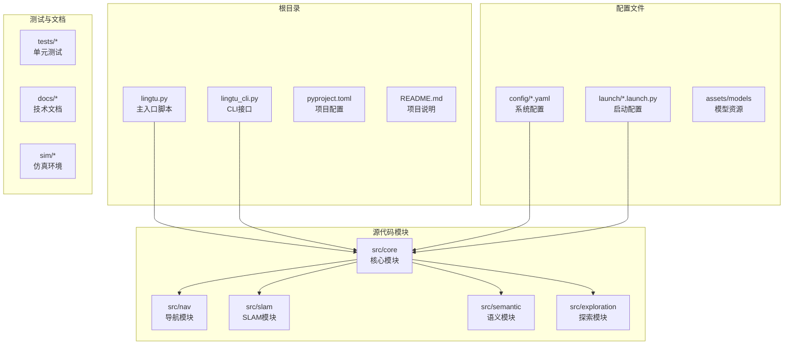

**图表来源**
- [lingtu.py](file://lingtu.py)
- [src/core/__init__.py](file://src/core/__init__.py)
- [src/nav/__init__.py](file://src/nav/__init__.py)

**章节来源**
- [README.md](file://README.md)
- [pyproject.toml](file://pyproject.toml)

## 核心组件

### 主要入口点

系统提供了多个入口点来满足不同的使用场景：

1. **lingtu.py**: 主要的命令行接口，支持多种运行模式
2. **lingtu_cli.py**: 高级CLI功能，提供完整的系统控制能力
3. **scripts/lingtu.sh**: 系统服务管理脚本

### 运行配置

系统支持多种预定义的运行配置文件，每种配置针对特定的应用场景：

| 配置文件 | 用途 | 特点 |
|---------|------|------|
| stub | 模拟器模式 | 无硬件依赖，适合开发测试 |
| dev | 开发调试模式 | 包含详细日志和调试信息 |
| sim | 仿真模式 | 支持Gazebo/Mujoco仿真环境 |
| map | 地图构建模式 | 专注于SLAM和地图生成 |
| nav | 导航模式 | 自主导航和路径跟踪 |
| explore | 探索模式 | 自动环境探索和建图 |

**章节来源**
- [lingtu.py](file://lingtu.py)
- [lingtu_cli.py](file://lingtu_cli.py)
- [launch/profiles/](file://launch/profiles/)

## 架构概览

LingTu系统的整体架构采用分层设计，各模块之间通过标准接口进行通信：

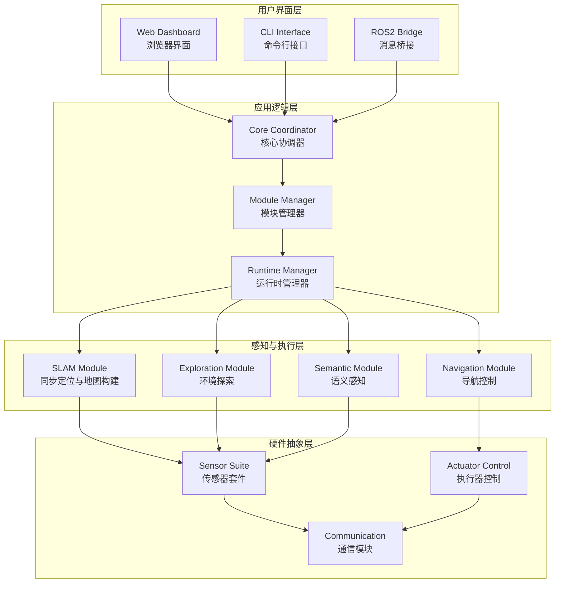

**图表来源**
- [src/core/coordinator.py](file://src/core/coordinator.py)
- [src/core/module.py](file://src/core/module.py)
- [src/drivers/sensor_suite.py](file://src/drivers/sensor_suite.py)

## 详细组件分析

### 环境准备与依赖安装

#### Python环境配置

系统要求Python 3.8+版本，并提供了完整的依赖管理方案：

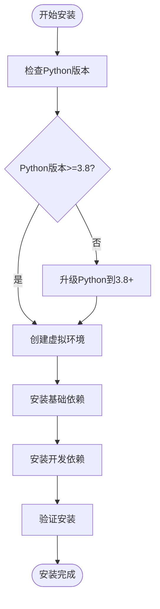

**图表来源**
- [requirements.txt](file://requirements.txt)
- [requirements-dev.txt](file://requirements-dev.txt)
- [pyproject.toml](file://pyproject.toml)

#### 基础依赖安装

推荐使用以下命令进行基础依赖安装：

```bash
# 安装基础依赖
pip install -r requirements.txt

# 安装开发依赖（可选）
pip install -r requirements-dev.txt

# 验证安装
python -c "import lingtu; print('LingTu安装成功')"
```

**章节来源**
- [requirements.txt](file://requirements.txt)
- [requirements-dev.txt](file://requirements-dev.txt)
- [pyproject.toml](file://pyproject.toml)

### 基本配置

#### 系统配置文件

系统使用YAML格式的配置文件进行参数管理：

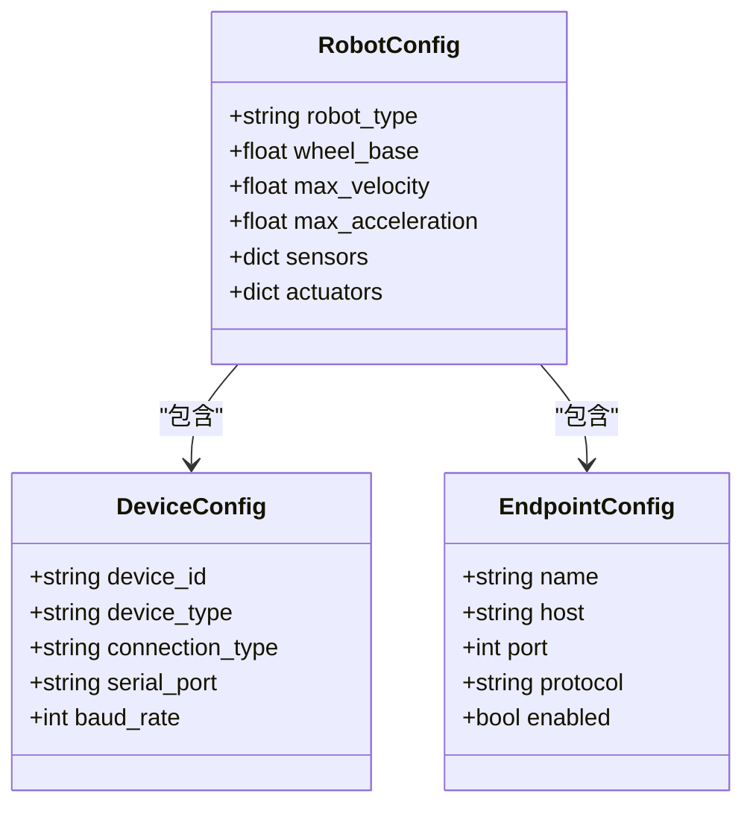

**图表来源**
- [config/robot_config.yaml](file://config/robot_config.yaml)
- [config/devices.yaml](file://config/devices.yaml)
- [config/endpoints.yaml](file://config/endpoints.yaml)

#### 配置文件位置

系统配置文件位于以下路径：
- `config/robot_config.yaml`: 机器人基本信息配置
- `config/devices.yaml`: 设备连接配置
- `config/endpoints.yaml`: 网络端点配置

**章节来源**
- [config/robot_config.yaml](file://config/robot_config.yaml)
- [config/devices.yaml](file://config/devices.yaml)
- [config/endpoints.yaml](file://config/endpoints.yaml)

### 框架测试命令

#### 单元测试运行

系统提供了完整的测试框架，支持多种测试场景：

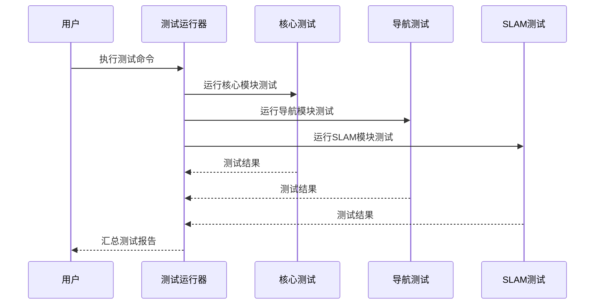

**图表来源**
- [src/core/tests/](file://src/core/tests/)
- [src/nav/tests/](file://src/nav/tests/)
- [src/slam/tests/](file://src/slam/tests/)

#### 测试命令示例

```bash
# 运行核心模块测试
python -m pytest src/core/tests/ -q

# 运行所有测试
python -m pytest tests/ -v

# 运行特定模块测试
python -m pytest src/exploration/tests/ -v --tb=short

# 生成测试覆盖率报告
python -m pytest src/core/tests/ --cov=src/core --cov-report=html
```

**章节来源**
- [docs/07-testing/README.md](file://docs/07-testing/README.md)

### 无硬件测试方法

#### Stub模式运行

系统提供了专门的stub模式用于无硬件测试：

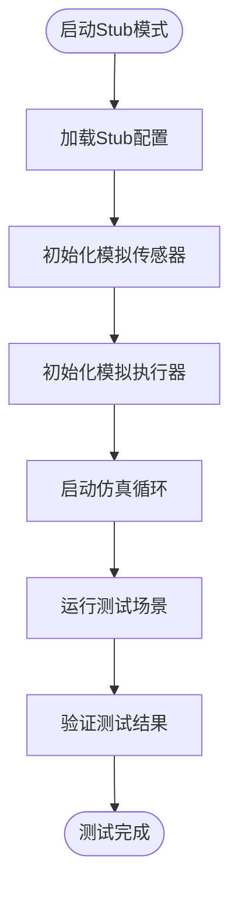

**图表来源**
- [launch/profiles/planner_stub.launch.py](file://launch/profiles/planner_stub.launch.py)
- [src/drivers/sim/](file://src/drivers/sim/)

#### Stub模式优势

- **无需真实硬件**: 完全基于软件仿真
- **快速迭代**: 测试执行速度快
- **稳定可靠**: 环境可控，结果可重复
- **成本低廉**: 无需额外硬件投入

**章节来源**
- [launch/profiles/planner_stub.launch.py](file://launch/profiles/planner_stub.launch.py)

### 机器人运行命令

#### 基本运行命令

系统支持多种运行模式，每种模式都有特定的用途：

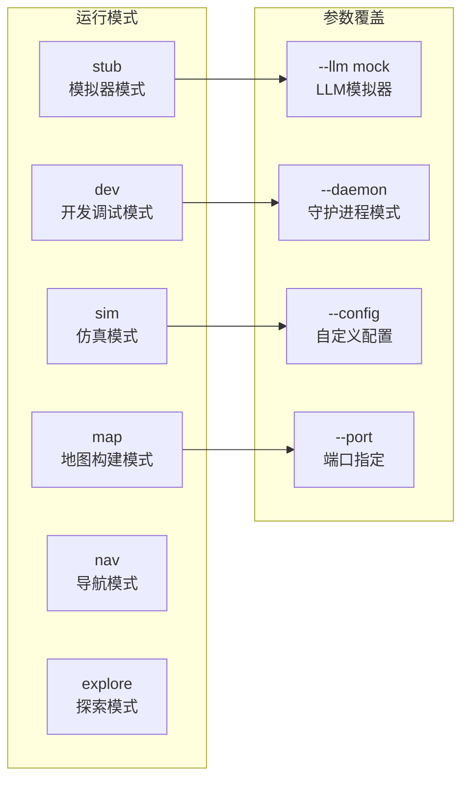

**图表来源**
- [lingtu.py](file://lingtu.py)
- [lingtu_cli.py](file://lingtu_cli.py)

#### 常用运行命令

```bash
# 基本运行命令
python lingtu.py [profile] [options]

# 示例命令
python lingtu.py stub
python lingtu.py sim --llm mock
python lingtu.py nav --daemon
python lingtu.py map --config custom.yaml

# 查看帮助信息
python lingtu.py --help
python lingtu.py [profile] --help
```

**章节来源**
- [lingtu.py](file://lingtu.py)
- [lingtu_cli.py](file://lingtu_cli.py)

### 生命周期命令

#### 系统状态管理

系统提供了完整的生命周期管理命令：

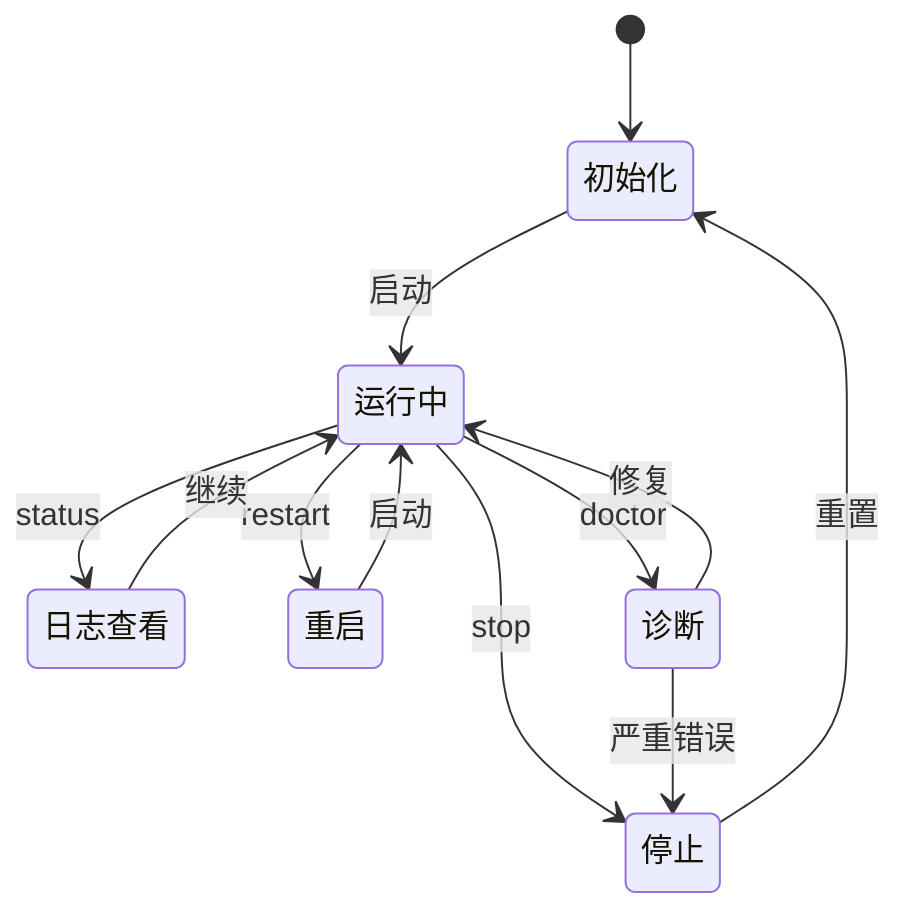

**图表来源**
- [scripts/doctor.py](file://scripts/doctor.py)
- [lingtu_cli.py](file://lingtu_cli.py)

#### 命令详解

| 命令 | 功能 | 语法 | 示例 |
|------|------|------|------|
| status | 查看系统状态 | `python lingtu.py status` | 查看当前运行状态 |
| log | 查看运行日志 | `python lingtu.py log` | 实时查看日志输出 |
| stop | 停止系统运行 | `python lingtu.py stop` | 正常停止系统 |
| restart | 重启系统 | `python lingtu.py restart` | 重启所有模块 |
| doctor | 系统诊断 | `python lingtu.py doctor` | 运行健康检查 |

**章节来源**
- [scripts/doctor.py](file://scripts/doctor.py)
- [lingtu_cli.py](file://lingtu_cli.py)

### SSH隧道配置

#### 网络访问设置

系统支持通过SSH隧道进行安全访问：

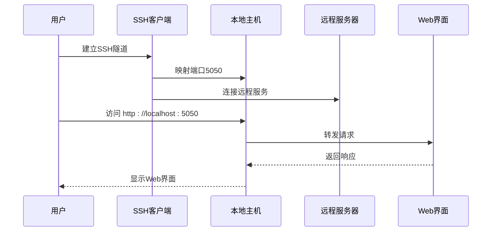

**图表来源**
- [web/dashboard.html](file://web/dashboard.html)
- [web/dashboard_server.py](file://web/dashboard_server.py)

#### SSH隧道命令

```bash
# 建立SSH隧道
ssh -L 5050:localhost:5050 username@remote-server

# 在新终端中访问Web界面
open http://localhost:5050
```

**章节来源**
- [web/dashboard.html](file://web/dashboard.html)
- [web/dashboard_server.py](file://web/dashboard_server.py)

## 依赖分析

### Python包依赖关系

系统采用分层依赖管理策略：

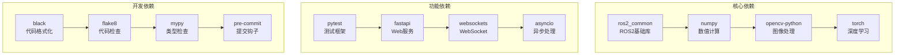

**图表来源**
- [requirements.txt](file://requirements.txt)
- [requirements-dev.txt](file://requirements-dev.txt)
- [pyproject.toml](file://pyproject.toml)

### 外部系统集成

系统需要与多个外部系统进行集成：

| 系统 | 用途 | 版本要求 | 配置要点 |
|------|------|----------|----------|
| ROS2 | 机器人操作系统 | Humble/Iron/Jazzy | 环境变量配置 |
| CUDA | GPU加速 | 11.0+ | 驱动程序兼容性 |
| cuDNN | 深度学习库 | 8.0+ | 与CUDA版本匹配 |
| OpenCV | 图像处理 | 4.5+ | 编译选项优化 |

**章节来源**
- [requirements.txt](file://requirements.txt)
- [pyproject.toml](file://pyproject.toml)

## 性能考虑

### 内存管理

系统在内存使用方面采用了多项优化策略：

- **模块化加载**: 按需加载模块，减少内存占用
- **缓存机制**: 智能缓存常用数据，提高访问速度
- **垃圾回收**: 定期清理无用对象，防止内存泄漏

### 并发处理

系统支持多线程和异步处理：

- **异步I/O**: 非阻塞网络通信
- **多线程处理**: 并行处理多个传感器数据
- **任务调度**: 动态任务分配和优先级管理

## 故障排除指南

### 常见问题诊断

#### 系统启动失败

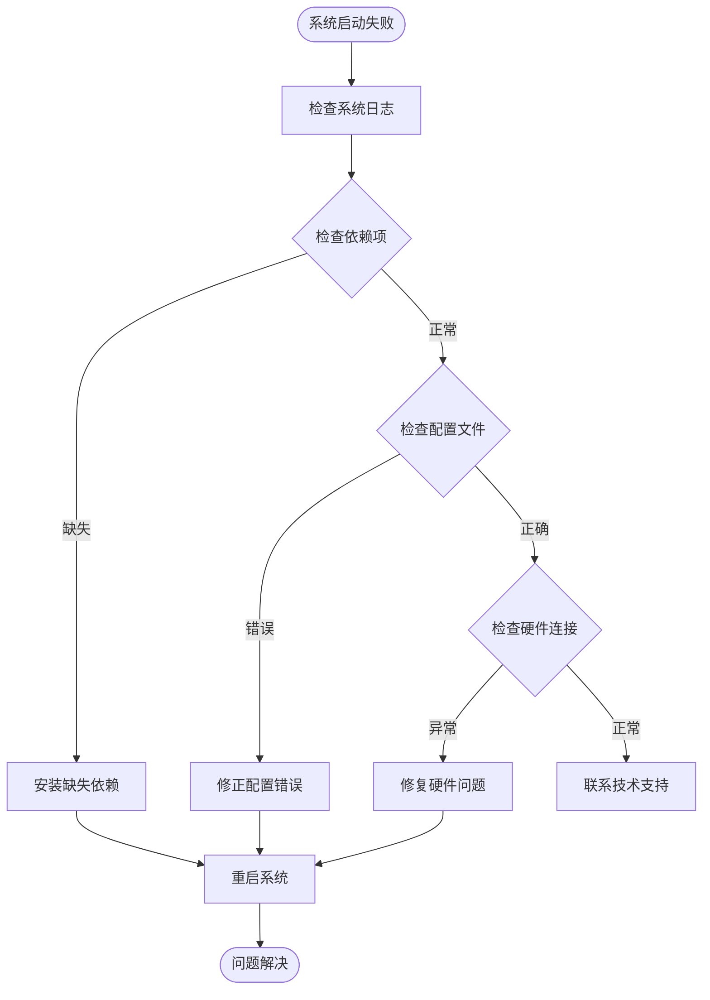

**图表来源**
- [scripts/doctor.py](file://scripts/doctor.py)
- [lingtu_cli.py](file://lingtu_cli.py)

#### 诊断命令

```bash
# 运行系统诊断
python lingtu.py doctor

# 查看详细日志
python lingtu.py log --level debug

# 检查网络连接
python -c "import socket; socket.socket(socket.AF_INET, socket.SOCK_STREAM).connect(('localhost', 5050))"

# 验证配置文件
python -c "import yaml; yaml.safe_load(open('config/robot_config.yaml'))"
```

**章节来源**
- [scripts/doctor.py](file://scripts/doctor.py)

### 硬件连接问题

#### 传感器连接故障

常见传感器连接问题及解决方案：

| 传感器类型 | 常见问题 | 解决方案 |
|------------|----------|----------|
| LiDAR | 设备未检测到 | 检查USB连接和权限 |
| 摄像头 | 无法打开设备 | 验证设备ID和驱动程序 |
| IMU | 数据读取错误 | 校准传感器并检查连接 |
| GNSS | 定位精度低 | 清理遮挡物并重新校准 |

#### 网络连接问题

```bash
# 检查网络连通性
ping localhost
telnet localhost 5050

# 查看端口占用情况
netstat -tulpn | grep 5050
lsof -i :5050

# 重启网络服务
sudo systemctl restart networking
```

**章节来源**
- [config/devices.yaml](file://config/devices.yaml)
- [config/endpoints.yaml](file://config/endpoints.yaml)

## 结论

LingTu四足机器人导航系统提供了完整的从零开始的部署和运行解决方案。通过本指南，用户可以：

1. **快速完成环境搭建**: 包括Python环境、依赖库和系统配置
2. **掌握系统运行**: 理解不同运行模式和参数配置
3. **有效进行测试**: 使用stub模式进行无硬件测试
4. **管理生命周期**: 掌握状态监控和故障排除技巧
5. **安全访问系统**: 通过SSH隧道安全访问Web界面

建议用户在首次部署时按照本指南的顺序逐步执行，并在遇到问题时参考故障排除部分。随着对系统的深入了解，用户可以根据具体需求调整配置参数和运行模式。

## 附录

### 快速参考表

#### 基础命令速查

| 功能 | 命令 | 说明 |
|------|------|------|
| 启动系统 | `python lingtu.py [profile]` | 启动指定配置的系统 |
| 查看状态 | `python lingtu.py status` | 显示系统当前状态 |
| 查看日志 | `python lingtu.py log` | 实时显示系统日志 |
| 停止系统 | `python lingtu.py stop` | 正常停止系统运行 |
| 重启系统 | `python lingtu.py restart` | 重启所有系统模块 |
| 系统诊断 | `python lingtu.py doctor` | 运行全面健康检查 |

#### 配置文件位置

- **机器人配置**: `config/robot_config.yaml`
- **设备配置**: `config/devices.yaml`
- **端点配置**: `config/endpoints.yaml`
- **主题契约**: `config/topic_contract.yaml`

#### 测试相关

- **核心测试**: `python -m pytest src/core/tests/ -q`
- **导航测试**: `python -m pytest src/nav/tests/ -v`
- **SLAM测试**: `python -m pytest src/slam/tests/ -v`
- **探索测试**: `python -m pytest src/exploration/tests/ -v`