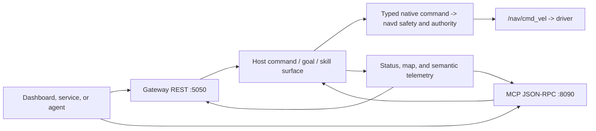

# 集成

请围绕 LingTu 的公开进程边界构建客户端：应用控制和状态使用 Gateway
REST，实时视图使用 Gateway 流，工具导向的智能体使用 MCP。这些接口向
Module 图提交意图；它们不能取代规划器、安全栈或原生现场命令所有者。

> **Status:** 当前集成指南；路由和工具可用性仍取决于运行时<br>
> **Audience:** 仪表盘开发者、服务集成者、自动化作者和 MCP 客户端作者<br>
> **Runs on:** 能访问当前 LingTu profile 所选 Gateway/MCP 端点的主机；现场命令要求处于获授权的运行环境

> **安全边界：** 来自可信客户端的 HTTP `POST` 或 MCP 工具调用并不会自动
> 安全。只读、改状态和可运动操作的前提各不相同。在向用户界面或智能体暴露
> 任何控制能力前，先完成发现和无运动规划；请参阅
> [安全与控制边界](../10-safety/README.md)。

## 该用什么



| 需求 | 首选接口 | 原因 | 影响类别 |
| --- | --- | --- | --- |
| 渲染健康、就绪度、会话、地图、路径或遥测 | Gateway REST、SSE 或只读 WebSocket | 无需选择机器人动作，即可获得类型化 HTTP 契约和实时状态。 | 只读 |
| 验证已保存地图上的路线 | Gateway 地图 `validate_plan` 路由 | 原生地图/规划边界评估活动地图、位姿和目标；通用 navigation preview 不可用时会明确拒绝。 | 无实体运动 |
| 发送经人工批准的坐标、语义或速度命令 | Gateway REST 或遥操作 WebSocket | 这些控制面受运行时租约、安全、就绪度和命令边界保护。 | 可能驱动硬件 |
| 向智能体提供动态发现的能力集合 | MCP `tools/list`，再调用 `tools/call` | 工具从已加载 Module 的 `@skill` 方法收集；当前 profile 决定哪些工具存在。 | 取决于工具 |
| 构建进程内 Python 客户端 | 源码检出的 `lingtu.sdk` | 同步客户端仅使用标准库；类型化响应辅助器可减少重复的请求解析。 | 取决于方法 |

不要编写自行计算机器人路径、绕过原生命令边界发布，或把缓存的仪表盘状态
当作命令授权的客户端。Gateway 是产品边界，不是第二套导航栈。

## 权威来源

本页提供实用的契约地图，而非复制一份静态端点清单。当字段、响应模型或工具
名称至关重要时，请使用下列所有者来源。

| 问题 | 权威来源 |
| --- | --- |
| 当前 REST 路径、请求模型和响应模型 | [Gateway REST 清单](../api/gateway_rest.md) 与 [Gateway 路由注册](../../src/gateway/routes/README.md) |
| 运行中 Gateway 提供的实时 REST schema | `GET /openapi.json`，或公开的 FastAPI 页面 `/docs` 与 `/redoc` |
| 鉴权行为 | [API-key 中间件](../../src/gateway/auth.py) 与 [鉴权路由](../../src/gateway/routes/auth.py) |
| Python 同步/异步/MCP 辅助器行为 | [SDK 包](../../src/lingtu/sdk/) |
| MCP 传输、工具发现和服务端强制约束 | [MCPServerModule](../../src/gateway/mcp_server.py) 与 [MCP 工具清单](../api/mcp_tools.md) |
| Product、端点和能力选择 | [Runtime Graph](../../config/runtime_graph/) 与 [Product assembly](../../src/lingtu/assembly/) |
| 客户端动作安全性 | [安全与控制边界](../10-safety/README.md)、[任务指南](../05-guides/README.md) 与 [运维](../06-operations/README.md) |

生成的 API 清单描述仓库中的路由/工具定义。针对某一台机器人，运行中的服务仍是
权威：当 Module 不在当前图中时，路由可能返回不可用，工具也可能根本不存在。

## 1. 建立只读连接

### 前提条件

- 你知道目标环境已批准的 Gateway 基础 URL。可移植配置请使用
  `http://<robot>:5050` 这样的占位符；不要把现场机器人地址硬编码进客户端或文档。
- 你知道目标是本地 Profile、`env=sim` 还是物理 `env=real` Product。端点只命名
  连接或通信契约，例如 Gateway URL 或 DDS/native-service 边界；它不命名部署身份。
- 对物理目标，负责的操作员和本地紧急处置流程已经就位。TCP 连接成功并不代表
  已具备现场运行条件。

### 只读发现顺序

```bash
export LINGTU_GATEWAY='http://<robot>:5050'

# This route is intentionally public. It only says whether this Gateway
# currently requires an API key.
curl -fsS "$LINGTU_GATEWAY/api/v1/auth/check"

# When authentication is enabled, provide the key from a protected local
# secret source. Do not place secrets in source code, a URL, or shell history.
curl -fsS \
  -H "X-API-Key: $LINGTU_API_KEY" \
  "$LINGTU_GATEWAY/api/v1/app/capabilities"

curl -fsS \
  -H "X-API-Key: $LINGTU_API_KEY" \
  "$LINGTU_GATEWAY/api/v1/readiness"
```

**预期结果：** `auth/check` 返回是否要求鉴权。能力和就绪度响应描述当前应用
公开的能力，以及它是否已为所请求的工作类别做好准备。一个就绪的 HTTP 服务仍
可能报告导航阻塞因素。

**停止条件：**

- `401` 或 `403`：停止并修复凭据或目标选择。不要为了让集成工作而退回到 URL
  凭据，或关闭鉴权。
- `422`：停止，并从运行中的 OpenAPI 文档或生成的 API 清单获取请求 schema。不要
  根据旧 UI 猜测字段名。
- 缺少能力、遥测陈旧、存在就绪度阻塞，或 profile/端点意外：让客户端继续保持
  观察模式。

**下一步：** 使用无运动预览；若集成仅观察状态，则继续阅读下方 Python/MCP 部分。

### 鉴权与传输规则

Gateway 鉴权由 `LINGTU_API_KEY` 或运行时配置中的 `gateway.api_key` 配置。未配置
key 时，Gateway 中间件默认放行请求以支持开发/测试。公开路径包括 `/`、`/docs`、
`/redoc`、`/openapi.json`、`/api/v1/auth/login` 和 `/api/v1/auth/check`；配置 key 后，
受保护的 API 和 WebSocket 路径会被检查。

经鉴权的客户端请使用 `X-API-Key`。中间件也实现了查询字符串和 cookie 形式，以
方便浏览器/WebSocket，但其自身安全指南警告这些形式可能经由 referrer、历史记录和
日志泄露。不要围绕 `?api_key=...` 设计新的生产客户端。

仓库中的 SDK 与 MCP URL 使用 `http://`；TLS 监听器不属于此源码契约。请把这些
接口保留在可信网络中，或置于由部署层管理的 TLS 和访问控制之后。绝不能因为存在
API key 就把机器人控制端口直接暴露到公网。

## 2. 按影响而非 HTTP 动词使用 Gateway REST

`POST` 不等于会运动，`GET` 也不会让陈旧数据变安全。请按一个集成动作可能造成的
变化分类。

| 类别 | 代表性接口 | 客户端必须做到 |
| --- | --- | --- |
| **只读** | `GET /api/v1/app/capabilities`、`/api/v1/readiness`、`/api/v1/health`、`/api/v1/state`、`/api/v1/session`、`/api/v1/navigation/status`、`/api/v1/path`、`/api/v1/slam/maps`；`GET /api/v1/events` | 展示时间戳和阻塞因素；可由 SSE 提供更新时，避免高频轮询。 |
| **无实体运动** | `POST /api/v1/navigation/plan`、`POST /api/v1/navigation/goal_candidate`、`POST /api/v1/maps/{name}/validate_plan` | 将可行性、坐标系、地图身份和路径安全输出视为门槛。预览不是运动授权。 |
| **不含目标/速度请求的状态变更** | 租约 acquire/renew/release；地图 import/crop/build/activate/restore；会话 start/end；SLAM/重定位；driver/backend/runtime 切换；录制控制 | 要求明确的操作员意图、静止机器人，以及变更后的能力/就绪度检查。这些操作可改变持久数据、进程所有权或上下文。 |
| **可运动** | `/ws/teleop` 物理速度消息、`POST /api/v1/goal`、`/api/v1/navigate/click`、`/api/v1/instruction`、非 stop 的 `/api/v1/visual_servo`，以及探索启动 | 调用前设置明确的人类/自动化授权门；整个生命周期内始终可见 `/api/v1/stop`、cancel 和 status。 |
| **停止或恢复控制** | `POST /api/v1/stop`、`/api/v1/navigation/cancel`、`/api/v1/estop/reset`、`/api/v1/navigation/resume`、会话结束、visual-servo stop | 这些会改变控制状态；它们不能证明物理危险、传感器故障或定位故障已解决。 |

### 安全的路线预览示例

下列请求是规划预览：其路由处理器调用导航预览服务，且**不会**发布目标。若机器人
缺少里程计、地图制品、就绪度或可用规划器，它仍可能返回不可行。

```bash
curl -fsS -X POST \
  -H 'Content-Type: application/json' \
  -H "X-API-Key: $LINGTU_API_KEY" \
  "$LINGTU_GATEWAY/api/v1/navigation/plan" \
  --data '{"x":0.0,"y":0.0,"z":0.0,"client_id":"dashboard-preview"}'
```

**预期结果：** 返回结构化预览，其中包含可行性信号、原因、起点/目标坐标系信息，
以及在可用时提供的路径和规划器详情。

**停止条件：** 任一 `feasible: false`、路径安全拒绝、地图/坐标系不匹配、缺少里程计
或就绪度阻塞都会结束流程。保留结果以便诊断；不要带着同样的假设通过 `/goal` 重试。

**下一步：** 如需经人工批准的现场动作，请遵循
[安全与控制边界](../10-safety/README.md) 中的完整门禁。已保存地图的流程请使用
[任务指南](../05-guides/README.md)。

### REST 可靠性细节

- Gateway 目标命令会在发布前接受安全门禁。命令路径检查控制所有权、活动安全停止、
  导航就绪度、可选请求地图身份、规划可行性和拒绝性的路径安全结果。客户端仍须完成
  自己的预检并呈现拒绝结果。
- 请求体支持 `client_id`，许多控制模型支持 `request_id`。Gateway 命令记录会在内存
  中有限时间内保留幂等条目。若集成需要跨网络故障的安全重试，请使用原始 REST
  schema 和稳定的 `request_id`，并检查返回的命令回执。不要认为网络超时意味着命令
  未被接受。
- 完全相同的请求字段由 [`gateway/schemas.py`](../../src/gateway/schemas.py) 中的
  Pydantic 模型定义。不要把示例坐标复制到不同地图坐标系或 profile 中。
- 将 `2xx` 响应视为服务端回执，而非机器人已经运动、保持安全或到达目标的证据。继续
  监测状态、定位、安全性和当前命令源。

## 3. 从源码检出使用 Python SDK

### 支持边界

SDK 源码位于 [`src/lingtu/sdk`](../../src/lingtu/sdk/)。仓库声明了 `lingtu` 项目、
`lingtu-sdk` 控制台入口及 [`pyproject.toml`](../../pyproject.toml) 中的 SDK extras。
本次文档修订尚未验证包安装是否可作为独立发布制品使用，因此本指南有意不提供包索引
或 `pip install` 命令。

**已支持的文档路径：** 使用源码检出，并将 `src` 放到 Python import path 中。这样
可以避免声称特定 wheel、索引或 lock 状态已经发布且可安装。

```powershell
# From the repository root. This only proves that the synchronous SDK imports;
# it does not contact or control a robot.
$env:PYTHONPATH = (Join-Path (Get-Location) 'src')
python -c "from lingtu.sdk import LingTuClient; print(LingTuClient().base_url)"
```

同步 `LingTuClient` 仅使用 Python 标准库。其构造器接受 `host`、`port`、可选
`api_key` 和 `timeout`；默认目标是默认 Gateway 端口上的本地 loopback Gateway。

### 只读 SDK 启动

```python
import os

from lingtu.sdk import LingTuClient

with LingTuClient(
    host="<robot>",
    port=5050,
    api_key=os.environ.get("LINGTU_API_KEY"),
) as robot:
    print(robot.auth_check())
    print(robot.capabilities())
    print(robot.readiness())
    print(robot.health())
    print(robot.navigation_status())
```

SDK 提供 `Position`、`HealthStatus`、`NavigationStatus`、`MapList`、`SessionInfo`、
`RobotState`、`Pose2D` 和 `CommandResult` 等类型化辅助器。`state()`、`health()`、`maps()`、
`navigation_status()`、`path()`、`capabilities()` 和 `readiness()` 等方法属于观察方法；
其结果仍需经过新鲜度和能力检查。

只读辅助器在目标不可达时抛出 `ConnectionError`，不会把未知位姿或健康状态填成零值。
命令辅助器返回 `CommandResult`；请同时检查 `CommandResult.ok` **和**
`CommandResult.raw`，绝不可把传输失败变成自动运动重试。

### 定位 SDK

定位命令统一位于 `client.localization` 领域 facade 下，不向调用方暴露当前使用的
matcher 名称：

```python
from lingtu.sdk import LingTuClient, Pose2D

with LingTuClient(host="<robot>", port=5050) as robot:
    seeded = robot.localization.relocalize(
        "warehouse",
        initial_pose=Pose2D(x=1.0, y=2.0, yaw=0.5),
    )
    global_result = robot.localization.global_relocalize("warehouse")
    tracking = robot.localization.start_map_tracking("warehouse")
```

这些方法分别调用 `POST /api/v1/localization/relocalizations` 的 `seeded`/`global`
模式，以及 `POST /api/v1/localization/map-tracking`。旧的扁平
`slam_relocalize` 方法和旧 `/api/v1/slam/*relocalize*` 路由不保留长期兼容层。

三个方法的 `map_name` 都必须等于当前 Product 的 active map。这不是任选地图文件的
参数：SLAM target、mapd live map 和规划器共享同一不可变 `MapIdentity`。不一致的请求
会被拒绝；需要切地图时，使用 `scripts/lingtu` 或 `python -m lingtu.control` 进入新的
ProductControl transaction，再对新的 active map 调用定位 API。

### SDK 动作地图

| SDK 接口 | 影响 | 说明 |
| --- | --- | --- |
| `state`、`health`、`position`、`session`、`navigation_status`、`path`、`maps`、`scene`、`locations`、`capabilities`、`bootstrap`、`devices`、`readiness`、`runtime_contract`、`auth_check` | 只读 | 用于观察和 UI 状态，不能单独用作运动授权。 |
| `save_map`、`rename_map`、`reset_map_cloud`、`tag_location`、`delete_location`、`localization.relocalize`、`localization.global_relocalize`、`localization.start_map_tracking` 和租约方法 | 状态变更或无运动诊断 | 这些方法可能改变地图数据或控制所有权。`session` 仅用于读取当前 Product 运行投影；地图选择和 Product 生命周期必须通过 `scripts/lingtu` 或 `python -m lingtu.control`，Gateway 不提供独立 session、地图激活、backend 或 SLAM profile 热切换入口。 |
| `go`、`go_to`、`navigate_click`、`drive`、`explore_start` | 可运动 | 不要从无人值守循环、后台重试或初始连通性测试中调用。 |
| `stop`、`cancel`、`explore_stop` | 控制状态 | `stop` 在 REST 边界具有紧急停止语义；`cancel` 是平缓的任务取消。恢复语义请参阅安全文档。 |

### 异步和 MCP 辅助器

`AsyncLingTuClient` 是同步客户端的轻量异步适配器。它通过
`asyncio.to_thread` 调用同一套请求和解析逻辑，不需要另一套 HTTP 依赖或配置。
同步与异步客户端都接受 `timeout` 构造器参数（默认 10 秒）。

```python
from lingtu.sdk import AsyncLingTuClient

async with AsyncLingTuClient(host="<robot>", port=5050) as robot:
    readiness = await robot.readiness()
    status = await robot.navigation_status()
```

`LingTuMCP` 使用标准库发送普通 HTTP 请求，没有
API-key/header 参数。因此它当前并非受支持的已鉴权 MCP 客户端：除非已验证并实现
鉴权路径，否则不要用它连接 API-key 保护的远程 MCP 服务。请改用可提供所需
`X-API-Key` header 的 MCP/JSON-RPC 客户端。

## 4. 将 MCP 作为能力发现协议集成

MCP 是 `POST http://<robot>:8090/mcp` 上的 JSON-RPC 2.0。`MCPServerModule` 在构建时
从实际加载的 Modules 中发现 `@skill` 方法，并根据其签名/docstrings 创建输入 schema。
来自不同 profile 的静态列表不构成权限授予。

### 先发现

```bash
export LINGTU_MCP='http://<robot>:8090/mcp'

curl -fsS -X POST \
  -H 'Content-Type: application/json' \
  -H "X-API-Key: $LINGTU_API_KEY" \
  "$LINGTU_MCP" \
  --data '{"jsonrpc":"2.0","id":"discover-1","method":"tools/list"}'
```

**预期结果：** 返回 JSON-RPC 结果，其中包含具有 `name`、`description` 和
`inputSchema` 的工具。只在当前连接期间缓存；profile/runtime 变化后请重新加载。

**停止条件：** 工具缺失、鉴权错误、能力变更，或无法确定影响类别的工具。不要根据
以前的地图/profile 猜测工具名或参数。

### MCP 服务端鉴权边界

`MCPServerModule` 默认将全部接口绑定在默认 MCP 端口上。除非另有明确配置，当其 host
不是 loopback 地址时会设置 `require_key=True`。这意味着远程默认 MCP 服务在未配置
API key 时会以 fail closed 方式失败。这比 Gateway 方便开发的默认策略更严格，且是
有意为之。

| 工具组 | 典型示例 | 客户端规则 |
| --- | --- | --- |
| 观察 | health、Module/configuration、map/scene/memory/status 查询 | 使用结果前读取遥测新鲜度和 profile 能力。 |
| 状态变更 | tag/save/use map、backend 配置、teleop release、map-memory 变更 | 要求明确意图、适用时处于空闲/稳定状态，并执行后续读取。 |
| 可运动 | navigation、语义 instruction、patrol、visual follow、exploration | 与 Gateway 运动命令完全相同对待：操作员授权、主动监控和停止路径。 |
| 停止/恢复 | emergency stop、cancel/stop navigation、servo stop | 它们是控制操作，而非危险已经消除的证据。 |

MCP 智能体可以调用已暴露的工具，但不能绕过 Host 命令面、原生现场命令边界、
`navd` 最终安全或控制权。不要给智能体提供一个对失败运动工具进行笼统重试的
循环；错误/拒绝本身就是需要检查的运行证据。

## 5. 流、仪表盘 UI 与遥操作

- `GET /api/v1/events` 是 Gateway 事件的 server-sent-event 流。构建实时运维视图时，
  在可行情况下优先使用它而非激进轮询。
- `/ws/camera`、`/ws/cloud` 与 `/ws/scan` 是可观测性流。视频或点云可见并不能证明
  地图身份、定位、规划或安全性有效。
- `/ws/teleop` 是可运动控制面。一个显式连接的浏览器拥有连接级控制会话，直到其
  断开；这不是带超时的 Web Lease。只有带 `deadman: true` 的 `type: "velocity"`
  消息才会驱动，`deadman: false` 表示保持；`vx_mps`、`vy_mps`、`yaw_rps` 分别使用
  `m/s`、`m/s`、`rad/s`。Safety STOP 活动时拒绝速度命令。闲置浏览器不发送
  heartbeat；原生 Lease、CLAIM、source epoch 和序列只存在于 Gateway 与 `navd`
  之间，过期后由下一条新速度自动恢复。断开会执行零速屏障并释放原生控制权。
  详见[安全与控制边界](../10-safety/README.md)的细节和停止语义。

为保持仪表盘清晰，请让 UI 状态机可见：

```text
Disconnected -> authenticated -> observing -> previewed -> explicitly authorized -> controlling
                                      |                 |                           |
                                      +---- blocked -----+----------- stop/hold -----+
```

在把运动操作放到触手可及的位置前，UI 必须清楚显示当前 profile/端点、活动地图、
就绪度阻塞、安全状态、命令源和控制所有者。

## 集成评审清单

合并集成前，请确认下列全部项目：

- [ ] 在暴露控制能力前，先发现鉴权、实时能力和就绪度。
- [ ] 对观察、状态变更和可运动操作有独立的代码/UI 路径。
- [ ] 使用服务端规划器预览，而不是在本地计算/发布路径。
- [ ] 不隐藏 `401`、`403`、`409`、`422`、就绪度阻塞、地图不匹配、安全停止或原生命令
  拒绝响应。
- [ ] 使用稳定的 `client_id`；原始 REST 控制客户端还应使用稳定的 `request_id` 来处理
  安全重试。
- [ ] 超时或收到拒绝回执后，不自动重试目标、速度、语义 instruction 或 MCP 运动工具。
- [ ] 不把 secret 写进 URL、客户端日志、截图或源代码。
- [ ] 在源码不匹配得到解决并经测试前，将 SDK 包安装、SDK login 和已鉴权 SDK MCP
  使用视为未验证。

## 接下来

要了解完整运动门禁、停止/恢复语义、控制权和软件限制，请阅读
[安全与控制边界](../10-safety/README.md)。要了解地图/导航流程和现场证据，请继续阅读
[任务指南](../05-guides/README.md) 与 [运维](../06-operations/README.md)。
