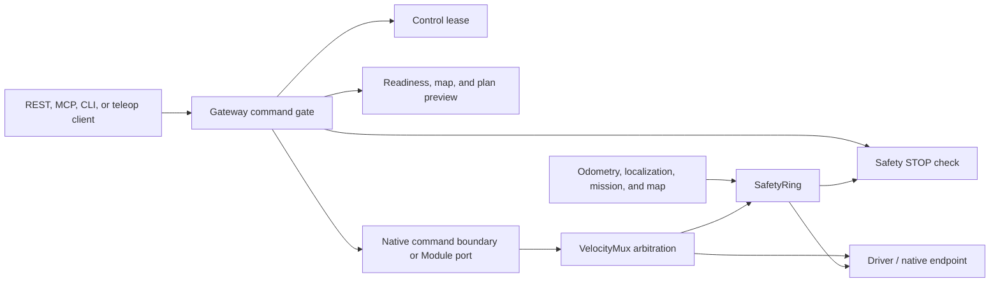

# 安全与控制边界

LingTu 的安全设计是一条运行时控制边界：外部客户端只提交意图，是否以及如何将其送达原生命令所有者或驱动，由 Module 图决定。本页说明这些软件控制措施，以及集成方必须遵循的运行行为。

> **Status:** 当前的软件控制与集成安全指南<br>
> **Audience:** 机器人操作员、现场集成方、自动化脚本作者、仪表盘开发者和 MCP 客户端作者<br>
> **Runs on:** 加载相关 Module 的所有 LingTu 配置；涉及实体运动的规则对现场端点尤为重要

> **这不是安全认证：** 本文档描述的是仓库行为，不是现场风险评估、硬件急停系统，也不构成操作实体机器人的授权。出现即时危险时，必须遵循现场应急流程，并按要求采用物理隔离或硬件机制。软件的停止/取消接口属于控制链路的一部分；它们并不证明危险已经消失。

## 控制链路



该图并不表示每个配置都包含每个方块。Module 是否可用以及进程边界取决于当前配置与端点。架构不变式是：外部客户端不能绕开安全/控制图直接抵达执行端。

## 事实来源与适用范围

| 问题 | 首先查看 |
| --- | --- |
| REST 命令检查与拒绝详情 | [ControlCommandService](../../src/gateway/services/control_commands.py) 和 [command routes](../../src/gateway/routes/commands.py) |
| 原生 stop、estop、reset 与 resume 语义 | [native control boundary](../../src/gateway/services/native_control.py) |
| 安全状态与陈旧数据反射动作 | [SafetyRing](../../src/nav/services/safety/safety_ring.py) |
| 速度优先级与可选碰撞监控 | [VelocityMux](../../src/nav/services/safety/velocity_mux.py) |
| 显式 Blueprint 安全连线 | [safety wiring](../../src/lingtu/assembly/wires/safety.py) |
| Teleop 租约、deadman 与断连行为 | [realtime routes](../../src/gateway/routes/realtime.py) |
| 现场命令与无运动证据门槛 | [运维](../06-operations/README.md) 和 [`scripts/lingtu`](../../scripts/lingtu) |
| 精确 API 模型与名称 | [Gateway REST API](../api/gateway_rest.md) 和运行中的 `/openapi.json` |

使用[集成](../09-integrations/README.md)选择客户端接入面；地图与导航流程请参阅[任务指南](../05-guides/README.md)。

## 1. 在暴露接口前先对每个动作分类

一个动作即使不会使机器人运动，也可能因改变地图、会话、后端、进程或控制所有权而带来风险。不要把模型简化成“安全的 GET”与“不安全的 POST”。

| 类别 | 含义 | 示例 | 客户端必须遵循的行为 |
| --- | --- | --- | --- |
| **只读** | 不主动改变会话、持久地图或机器人控制状态。 | health/readiness/state/path/session/map 查询、capabilities、SSE、相机/点云视图 | 展示数据新鲜度、活动 profile/map 和阻塞项。不得把陈旧或不完整的响应升级为授权决策依据。 |
| **无实体运动** | 不发布导航目标或速度。可能会执行规划器，或报告失败。 | 导航 plan preview、目标候选构造、已保存地图校验、`doctor --non-motion`、未带 `--allow-motion` 的路线/系统验收 | 将其作为运动决策的前置条件；把失败保留为证据。 |
| **改变状态** | 改变持久数据、运行时模式/所有权、SLAM/会话、活动地图、服务/后端或命令租约。 | map save/activate/restore/build、session start/end、重定位、driver/backend 切换、lease acquire/release | 先让机器人停止，明确操作员意图，理解回滚路径，再重新读取 readiness。 |
| **可能运动** | 可能产生速度、目标、跟踪或自主任务。 | 直接 `cmd_vel`、目标/click/instruction、visual servo、teleop、exploration | 要求新鲜的预检、明确授权、持续监督，以及可立即触达的 stop/cancel 控制。 |
| **停止/恢复控制** | 改变控制权或任务状态。 | emergency stop、graceful cancel、estop reset、autonomy resume、teleop release | 使用下述精确语义；绝不假设其已修复根本原因。 |

## 2. Gateway 实际执行哪些检查

### 运动命令

Gateway 的受保护运动路径会在接受目标、点击导航请求、直接速度命令、语义指令或非 stop 的 visual-servo 请求前，依次评估以下条件：

1. **控制租约：** 如果其他客户端持有未过期租约，请求会以 `control_lease` 被拒绝。
2. **Safety STOP：** Gateway 观察到活动 Safety STOP 状态时，拒绝运动。
3. **导航目标：** 检查导航 readiness 和 odometry。
4. **提供了地图元数据时：** 请求的地图必须与活动导航地图一致。
5. **导航目标：** 服务端执行 plan preview。不可行的 preview，或拒绝该路径的 path-safety 结果，都会拒绝目标而非发布它。
6. **原生命令交付：** 启用原生命令边界时，原生确认被拒会成为命令拒绝，而不是静默的本地成功。

这是纵深防御，不是客户端跳过预检的许可。一个运动动作可能先被接受，随后因遥测或安全状态变化而中断；现场也可能已经不安全，只是当前软件状态尚未观察到。

### 租约语义用于协调，不是安全证明

`ControlLease` 是一个受互斥锁保护的内存中持有者/过期记录。当不存在活动持有者，或调用方匹配当前持有者时，运动请求通过租约检查。租约一旦取得即具有**排他性**，但未持有或已过期的租约本身不会独立拒绝所有命令。

每个具备控制能力的集成都应使用明确的 `client_id`。在受监督交互期间获取并续租，完成时释放；出现冲突时应呈现冲突，而不是与其他操作员竞争。这能防止客户端相互竞态，但不会验证定位、地图有效性、物理净空或人工授权。

REST `LeaseRequest` 校验正数 TTL，最大为 3600 秒；默认值为 30 秒。Teleop WebSocket 使用独立的短期（一秒）租约续期行为。不要把任一过期机制当作受控链路之外的实体 deadman 系统。

### 命令回执不是现场证据

Gateway 命令可包含 `client_id` 和 `request_id`。对于相同的命令/请求 ID，命令日志可以重放保留的响应，这有助于构建可安全重试的集成。回执只说明 Gateway 接受或拒绝了什么；它不能证明机器人抵达目标、实体停止，或始终处于安全区域。

对于任何可能运动的动作，持续监控：

- 当前 mission/navigation 状态；
- 定位质量和 map-frame 可信度；
- 安全状态与活动速度来源；
- path/readiness 阻塞项；以及
- 可用时的原生命令确认/错误详情。

## 3. SafetyRing 与速度控制权

### SafetyRing 反射动作

`SafetyRing` 位于第 0 层，发布 `stop_cmd`：`0`（clear）、`1`（soft）或 `2`（hard），并发布可观测的安全状态。其当前默认检查包括：

| 观测到的条件 | 默认 SafetyRing 结果 |
| --- | --- |
| odometry 无效，或 command-velocity 值无效 | `STOP` |
| odometry 缺失超过默认 500 ms 超时 | `STOP` |
| localization 报告 `LOST` | `STOP` |
| 存在运动意图时 command velocity 已陈旧 | `WARN` |
| localization 报告 `DEGRADED` | `WARN` |

500 ms odometry 与 300 ms command-velocity 是构造函数默认值，不是全局保证；profile/blueprint 可以修改它们。该 Module 还发布执行评估（on-track、drifting、stalled 或 regressing）和面向操作员的 dialogue 状态。警告不是可以忽略的命令：它意味着应暂停并复核，而不是继续提交更多目标。

安全停止连线通向导航和选定的 driver。安全状态、执行评估与 dialogue 状态会回接到 Gateway 和 MCP，供其可见。因此，外部客户端应使用公开状态，而不是另行发明一套平行的安全评分。

### VelocityMux 是唯一的仲裁点

标准速度优先级如下：

| 来源 | 优先级 | 默认活动超时 | 目的 |
| --- | ---: | ---:| --- |
| Teleop | 100 | 0.5 s | 人工操纵杆覆盖 |
| Visual servo | 80 | 0.5 s | 近距离 PD 跟踪 |
| Recovery | 60 | 0.5 s | 导航恢复行为 |
| Path follower | 40 | 0.5 s | 常规自主跟随 |

只有最近处于活动状态且优先级最高的来源能到达 `driver_cmd_vel`。这对客户端意味着：

- 导航请求可能在 teleop 当前为活动速度来源时被接受；UI 必须展示这一冲突，不能承诺机器人会运动。
- 客户端绝不能绕开 mux 发布第二条速度路径来“让命令生效”。这会破坏仲裁和可观测性。
- 速度来源意外变化是暂停条件。停止提交新目标，并检查 lease、teleop、servo、recovery 与安全状态。

`VelocityMux` 中的投影碰撞监控是**可选的**，默认禁用。启用后，它使用 costmap/odometry 投影评估速度，并可通过、减速或停止；投影不可用或无效时，会对该投影采取保守失败策略。代码支持并不表示每个 LingTu profile 都启用了碰撞监控。

## 4. Stop、cancel、reset 与 resume 是不同操作

| 操作 | 运行时行为 | **不**代表什么 | 安全的下一步 |
| --- | --- | --- | --- |
| `POST /api/v1/stop` | Gateway emergency-stop 路由。存在原生边界时请求原生软件 estop；否则发布 hard stop 与本地零速度兼容信号。 | 不是诊断，不证明物理净空，也不是自动恢复。 | 保持停止，检查危险、传感器、定位和控制状态。 |
| `POST /api/v1/navigation/cancel` | 通过原生客户端或 Module cancel port，以受控方式取消当前导航 mission。 | 不是 emergency-stop 闭锁，也不会清除软件 estop。 | 观察 mission 到达受控终态；提交新目标前调查原因。 |
| `POST /api/v1/estop/reset` | 明确清除原生软件 estop 闭锁。该路由不会恢复运动。 | 不是继续运行的许可，也不会重启旧路径。 | 重新建立 readiness、所有权、定位/地图可信度；仅在安全时提交新的已批准动作。 |
| `POST /api/v1/navigation/resume` | 为当前 lease 持有者解除原生 manual-takeover 状态。响应要求新的目标/路径。 | 不会重放旧 mission，也不会绕过 safety stop。 | 重新执行无运动门槛；仅在授权后提交新目标。 |
| `POST /api/v1/mode` with `estop` | 可能时闭锁原生软件 estop，并改变报告的 mode。 | 不取代物理应急响应。 | 使用同样的保持/诊断/reset 顺序。 |
| Teleop WebSocket `stop` | 以 teleop 静止屏障请求非闭锁的原生 `stop` 控制调用；仅在该边界允许时才本地回退。 | 与 REST emergency-stop 端点并不相同。 | 决定是否适合恢复前，确认 source/mission/safety 状态。 |

如果原生命令边界拒绝 stop、cancel、reset 或 resume 请求，响应即为控制边界失败。不要用直接速度命令或进程重启替代已确认的 stop；应遵循现场应急流程并保留拒绝证据。

## 5. Teleoperation 合约

`/ws/teleop` 不是通用实时输入通道。该路由会：

1. 为连接的操作员创建短期控制租约；
2. 在转发命令前，要求操纵杆 JSON 消息带有 `type: "joy"` 和 `deadman: true`；
3. 在接受到操纵杆流量时续租；
4. deadman 未被保持或连接关闭时，释放控制权并发送零速度；以及
5. Safety STOP 活动或原生命令交付不可用时，拒绝操纵杆运动。

Teleop UI 应设计为受监督的“按住才运行”操作。将清晰、可立即触达的 stop 控制与普通导航 cancel 分开。不要从无法观察租约丢失、确认被拒或 socket 断连的后台循环中持续发送非零操纵杆消息。

## 6. 客户端必须具备的安全状态机

每个能够访问可能运动接口的集成，都应实现与下列等价的状态机：

```text
Observe
  -> verify authentication, capability, readiness, map, localization, safety, and control source
  -> preview (no physical motion)
  -> await explicit authorized decision
  -> acquire/confirm control ownership
  -> submit one controlled action
  -> monitor mission + safety + localization + command source
  -> stop/cancel/hold on anomaly
  -> diagnose and re-validate before a fresh action
```

### 发出可能运动调用前的预检清单

- [ ] endpoint/profile 是预期环境，而不是名称相近的 simulator 或 replay endpoint。
- [ ] 活动 map 与 localization pose 在同一 planning frame 中可信。
- [ ] Gateway capability/readiness 未报告与当前动作相关的 blocker。
- [ ] 安全状态不是 STOP/ESTOP，且活动 command source 符合预期。
- [ ] 没有意外的 teleop client、visual-servo 活动、recovery 行为或 lease holder 正在控制机器人。
- [ ] 精确目标已通过无运动 plan/route preview，且 path-safety 结果可接受。
- [ ] 责任操作员能按现场流程停止机器人，并已针对该动作评估周边区域。
- [ ] 客户端有可见的 stop/cancel 动作，并记录 request、response、timestamps、profile、endpoint、map 和 `client_id`。

### 必须停止并调查的条件

若存在以下任一情况，均不得推进或重试运动动作：

- Safety 报告 `STOP`/`ESTOP`，localization 为 `LOST` 或意外 `DEGRADED`，或 odometry/command 数据无效、陈旧。
- plan preview 不可行、path safety 拒绝、请求目标被调整/无法到达，或 map/frame 身份与活动会话不一致。
- Gateway 报告 lease conflict、readiness blocker、native command rejection，或所需 Module 不可用。
- 活动 velocity source/teleop owner 意外变化。
- UI/client 失去读取监督先前运动命令所需状态的能力。
- 已发送 stop/cancel 命令，但尚未理解潜在危险或根本原因。

通常正确的响应是**保持停止、采集证据、检查最窄受影响边界，并重新执行无运动门槛**。不应改为提交不同目标、提高命令频率、绕过 `CmdVelMux`，或盲目重启整个机器人栈。

## 7. 无运动的现场证据

机器人侧运维 CLI 特意提供了无运动检查。在经授权的机器人侧 shell 中，以下代表性命令可建立证据，且不会请求目标或速度：

```bash
bash scripts/lingtu status
bash scripts/lingtu health
bash scripts/lingtu doctor --non-motion --json --strict
bash scripts/lingtu plan-preview --internal-only --strict
```

对于特定地图/目标，已文档化的系统验收流程在显式提供 `--allow-motion` 前始终不产生运动。运动 smoke test 也要求明确的 `--allow-motion`。这些标志是刻意显式的复核点，不是在诊断失败门槛时为了方便而附加的选项。

**预期结果：** 证据指向有效的控制/数据流状态，或明确的阻塞项。**停止条件：** 门槛失败、证据陈旧、地图 artifact 问题、定位不匹配，或安全/控制含糊。**下一步：** 按照[运维](../06-operations/README.md)隔离并恢复最窄组件，然后重新执行同一门槛。

## 8. 安全控制也必须是安全的

未经授权或身份不明确的客户端属于控制危险。请遵循以下规则：

- 为非开发 Gateway 使用配置并保护 `LINGTU_API_KEY`（或等效运行时配置）。优先使用 `X-API-Key`；不要将凭据放入 URL、浏览器历史、截图、源代码或遥测日志。
- 远程 MCP 在绑定非 loopback host 时默认 fail closed，但当前 Python `LingTuMCP` helper 不会发送 API key。在该接口得到修正并验证前，应将其视为不适用于已认证远程 MCP。
- 仓库未定义 Gateway/MCP TLS listeners。控制流量必须留在可信网络中，或使用部署侧管理的 TLS/访问控制。
- FastAPI schema pages 在 middleware 中有意保持公开。schema 可见不构成公开暴露控制平面的理由。

## 下一步

使用[集成](../09-integrations/README.md)在这些边界内实现 REST、SDK、MCP、SSE 和 teleop 客户端。运行中的机器人如需诊断、恢复或采集证据，请参阅[运维](../06-operations/README.md)；地图/导航工作流请参阅[任务指南](../05-guides/README.md)。
