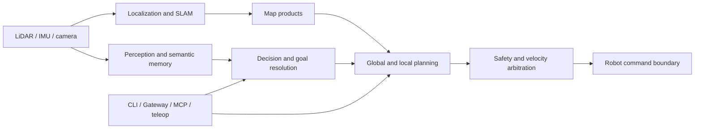

# LingTu Documentation

LingTu is a Product-defined autonomous navigation system with a native field
runtime and a composable Python Host for quadruped robots in outdoor and
off-road environments. This documentation is organized around the
job you want to complete first; deeper contracts and dated validation evidence
remain available when you need them.

## Browse these docs on the Web

After the `web/` application is built, the same curated Markdown is available
at `/guide/`: a static reading surface with task navigation, local full-text
search, page outlines, code-copy controls, and explicit execution boundaries.
It makes no Gateway/robot-control calls. `/docs` remains reserved for FastAPI's
live OpenAPI UI; do not use it as the public product-documentation route.

> **Status:** Current navigation entry point 
> **Audience:** Developers, integrators, and robot operators 
> **Runs on:** Local development hosts, simulation, and supported field robots

## What LingTu is

LingTu assembles robot hardware, localization, map products, perception,
semantic decision making, planning, safety, and operator interfaces into one
runtime. Its primary design rule is **scoped orchestration**:

- `Module` is the Python runtime unit.
- `lingtu.assembly` declares the product Module graph.
- `Blueprint` materializes one application graph; optional Python workers stay
  under the same Blueprint lifecycle.
- Compiled `Product` owns the Host Blueprint declaration and the
  endpoint-resolved process declaration; `ProductControl` owns product
  operations and invokes one internal systemd runner for process effects.
- Typed ports and explicit wires are the Host-internal boundary. Native typed
  DDS is the field cross-process data boundary.
- DDS, shared memory, simulators, and ROS 2 compatibility components are
  transports or adapters, not the business API.

The product uses the same logical contract in three environments, but the
execution boundary is different in each one:

| Environment | Primary use | What it proves | What it does not prove |
| --- | --- | --- | --- |
| Local | Framework, unit tests, and integration development | Module composition and offline behavior | Simulator or robot behavior |
| Simulation | Mission, planning, dataflow, and integration checks | The selected simulation gate | Field hardware readiness |
| Field robot | Mapping, localization, navigation, and supervised operation | Evidence collected on the selected target | Behavior on every target or future deployment |

## System at a glance

For the physical robot, high-rate sensor, SLAM, realtime maps, navigation, and
final command paths use native C++ processes and typed DDS at explicit process
boundaries. The Python Host owns Gateway, Agent, MCP, semantic behavior, and
selected low-rate adapters; Blueprint only materializes that Host graph. The
current command chain is `navd -> rt/nav/cmd_vel -> driver -> Brainstem`.
Read [System design](./architecture/SYSTEM_DESIGN.md) for the complete layer
and ownership model.

## Start with your goal

| I want to... | Start here |
| --- | --- |
| Understand the inspection product and operator acceptance model | [Product definition](./product/README.md) |
| Run LingTu locally or choose a profile | [Get started](./01-getting-started/README.md) |
| Learn the Product, Host, Blueprint, Module, and DDS vocabulary | [Core concepts](./02-concepts/README.md) |
| Understand control ownership, stop/recovery, and motion boundaries | [Safety and control boundaries](./10-safety/README.md) |
| Change or extend the codebase | [Develop LingTu](./03-development/README.md) |
| Build a REST, SDK, MCP, SSE, or teleoperation client | [Integrations](./09-integrations/README.md) |
| Build a map, navigate, use semantic goals, or explore | [Task guides](./05-guides/README.md) |
| Monitor, diagnose, or safely operate a running robot | [Operations](./06-operations/README.md) |
| Prepare a field target without exposing target-specific details | [Field deployment](./04-deployment/WEB_GUIDE.md) |
| Run tests, simulation gates, or no-motion field validation | [Testing and validation](./07-testing/WEB_GUIDE.md) |
| Find the CLI, REST, MCP, configuration, or contract reference | [Reference](./08-reference/README.md) |

## How to read this documentation

| Documentation kind | Purpose | Where it belongs |
| --- | --- | --- |
| Product definition | Defines users, operating outcomes, evidence, and acceptance semantics without claiming implementation completion. | `product/` |
| Task guide | Helps a reader reach an outcome with prerequisites, checks, and safe next steps. | `01-getting-started/`, `03-development/`, `05-guides/`, `06-operations/`, `09-integrations/`, `10-safety/` |
| Contract | Defines a current architecture or runtime boundary precisely. | `architecture/` |
| Reference | Lists stable commands, schemas, APIs, configuration, or generated inventories. | `08-reference/`, `api/`, package READMEs |
| Validation evidence | Records what a named test, simulation gate, or field run demonstrated. | `07-testing/` and `07-testing/field-runs/` |
| Active plan | Describes intended work, not shipped behavior. | `plans/current-roadmap.md` |
| Research note | Records an upstream evaluation or algorithm investigation; it is not acceptance evidence. | `research/` |

Every current task page identifies its audience and environment. A command or
claim that only applies to simulation must say so. A procedure that can create
robot motion must keep its no-motion inspection and route-preview steps
separate from the final motion action.

## Recommended reading paths

### First local or simulation run

1. [Choose a path and run a safe first profile](./01-getting-started/README.md).
2. Read the detailed [Quick Start](./QUICKSTART.md) when you need profile,
   lifecycle, or command details.
3. Continue with the relevant [task guide](./05-guides/README.md).

### Build a LingTu system

1. Read the [core concepts](./02-concepts/README.md).
2. Follow the [runtime bus contract](./architecture/LINGTU_RUNTIME_BUS_DECISION.md).
3. Use [Blueprint-DDS integration](./architecture/blueprint_dds_integration.md)
   and [module/service boundaries](./architecture/MODULE_SERVICE_BOUNDARY.md)
   as implementation references.

### Field deployment and operation

1. Read [Safety and control boundaries](./10-safety/README.md) before exposing
   or using any motion-capable surface.
2. Read the [Field Deployment Guide](./04-deployment/WEB_GUIDE.md).
3. Use the [robot operations CLI reference](./04-deployment/lingtu_cli.md).
4. Complete the applicable [validation gate](./07-testing/WEB_GUIDE.md) before
   making a product or field-readiness claim.

## What is authoritative

The documentation home is a curated navigation layer, not a second architecture
contract. Use [`CURRENT.md`](./CURRENT.md) to identify the current source of
truth for a specific subject. [Architecture contracts](./architecture/README.md)
define shipped boundaries; [plans](./plans/README.md) are forward-looking; and
dated test reports or field runs are evidence rather than product behavior.

Retired plans and duplicate snapshots are deleted rather than kept beside
current contracts; Git history is the archive. Cleanup decisions and the
deletion ledger live in [`DOCS_TRIAGE.md`](./DOCS_TRIAGE.md), while external
algorithm notes live in the [research index](./research/README.md).

## Safety and claim boundaries

- A green local test does not demonstrate simulator behavior.
- A green simulation or endpoint check does not demonstrate field readiness.
- A running process is not automatically navigation-ready: localization,
  active map artifacts, route safety, and the selected readiness gate still
  matter.
- A goal is not a motor command. It must travel through the appropriate
  planning, safety, and velocity-arbitration boundaries.

The current known product gaps and non-goals are tracked in
[Known gaps](./known_gaps.md). When a source conflicts with a current contract,
use the contract and update or demote the stale page.

## Documentation rules

- Write task pages for an explicit audience and environment: local,
  simulation, or field robot.
- Keep commands that can move hardware separate from no-motion inspection and
  route-preview steps.
- Link to contracts and generated references instead of duplicating their
  detailed tables.
- Mark plans and dated evidence clearly; do not present either as current
  product behavior.
- Treat ROS 2 as a compatibility boundary unless a page explicitly documents a
  compatibility workflow.
