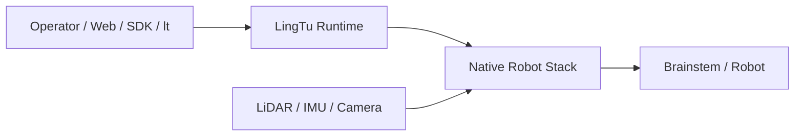

# LingTu Product Runtime Architecture

Status: current system design
Audience: all architecture, runtime, product, and field-readiness contributors
Replaced by: not replaced

## Abstract

LingTu is an autonomous navigation runtime for outdoor quadruped robots. A
`Product` declares an env-independent operating mode: logical native process
roles and the scoped Host graph. `ProductControl` is fixed to `env=real` or
`env=sim`, resolves that Product once into one immutable `RunPlan`, stages one
transient session, and applies the plan through its internal systemd runner.
The Host reads that exact RunPlan and uses Blueprint to materialize typed
Modules and explicit in-process wires. Blueprint never owns
systemd or native-process lifecycle. The product data boundary is native
typed CycloneDDS. ROS 2, LCM, shared memory, and simulator bridges are
compatibility or optimization adapters rather than the application contract.

This document records the current architecture, the reason for the main
boundaries, and the validation surface that prevents navigation internals from
leaking into drivers, gateway, or UI code.

## 1. Problem Statement

The system must keep the same navigation product contract across three
environments:

1. endpoint or hardware operation when explicitly scheduled;
2. desktop or server simulation;
3. developer and UI integration workflows.

The hard part is not only path planning. The hard part is keeping hardware
drivers, SLAM, maps, global planning, local planning, safety, and UI telemetry
replaceable without turning every module into a ROS/DDS/topic-specific client.

## 2. Design Principles

| Principle | Meaning |
| --- | --- |
| One resolved decision | ProductControl resolves Product + env once into a RunPlan; its internal systemd runner and Host use that exact artifact instead of resolving configuration again. |
| Host graph | Blueprint constructs and wires typed Modules inside the Host process. It does not own Product switching, systemd, native endpoints, or DDS topology. |
| Product assembly | `lingtu.assembly` resolves env-independent Product data against one env without side effects. |
| RunPlan scope | The env maps logical Product roles to concrete targets; RunPlan is the resolved Host/process/startup/check input shared by one run. |
| systemd scope | `lingtu.real.systemd.SystemdRunner` is an internal ProductControl implementation detail. It applies already-resolved processes and does not resolve Products or expose a second control plane. |
| Product control | `lingtu.control.ProductControl` exposes switch, status, and stop; it owns rollback, session staging, and current-run commit inside its fixed env. |
| Contract before backend | Navigation depends on `GlobalPlanRequest` and `GlobalPlanResult`, not OctoPlanner3D internals. |
| Adapter isolation | Native DDS, ROS 2, LCM, simulators, and hardware SDKs stay at explicit adapter boundaries. Product native DDS is typed and schema-owned; ROS/LCM are opt-in compatibility only. |
| Safety as a first-class layer | Stop signals, geofence checks, local planner stops, and velocity mux arbitration remain outside planner internals. |
| Evidence over claims | Simulation, endpoint communication, and hardware readiness are separate validation claims. |

## 3. Runtime Model

```text
env + Product definition
  -> ProductControl.switch(Product)
       -> RunPlan
       -> internal SystemdRunner -> native/systemd processes
       -> Host -> Blueprint -> Gateway / Agent / MCP / adapters
```

### 3.1 Product-facing Runtime Boundary

The product presents one top-level runtime, not ProductControl, RunPlan,
systemd, and RecordingManager as four peer concepts:



`LingTu Runtime` is a product-facing interface and vocabulary boundary. It is
not a new universal daemon or a second source of truth. It exposes four
resources: `Product`, `Task`, `Evidence`, and read-only `Status`. Internally the
ownership remains deliberately separate:

| Resource | Authority | Hidden implementation detail |
| --- | --- | --- |
| Product | `ProductControl` | `RunPlan` is its immutable execution artifact; `SystemdRunner` is its private process adapter. |
| Task | The owning domain runtime; field navigation is authoritative in native `nav`. | Gateway validates and projects commands and facts but never invents a task result. |
| Evidence | `RecordingManager` | Recorder workers write DDS, camera, index, and verification artifacts without deciding task outcome. |
| Status | No new authority; it is a freshness-labelled read projection. | It joins committed Product, native Task, map/localization/safety, and Evidence snapshots. |

One user entry therefore does not mean one failure domain. Recording failure
must not turn navigation success into failure; Product switching must not own
pause, recovery, or task completion; a status projection must expose stale or
unavailable sources instead of guessing.

`compile_run_plan()` produces a RunPlan without starting it. The
plan decides which managed processes run in that env and which Module graph
the Host materializes. ProductControl is the only Product operation API. Its
internal systemd runner and Host consume the same resolved decision and never
resolve a second one. `Wire` decides which output feeds
which input. `Transport`
decides how bytes or objects move between endpoints. Acceptance endpoints may
delegate lifecycle ownership to one bounded acceptance runner; they do not
publish ProductControl-managed process specs.

`RunPlan` is the immutable JSON execution input written by ProductControl. It
is not a service, scheduler, data bus, runtime state, or user-authored format.
It has only four top-level sections: `identity`, `launch`, `host`, and
`checks`. It exists because systemd and Host must execute the same resolved
Product. No point cloud, map, planner state, or algorithm runs inside it.

The mutable run files are deliberately separate and ephemeral:

```text
/run/lingtu/plan-<product-session-id>.json  immutable RunPlan
/run/lingtu/session.env        current process parameters
/run/lingtu/current.json       committed current-run pointer
```

systemd-tmpfiles recreates `/run/lingtu` at boot. A reboot therefore cannot
silently restore an old Product mode. Every mode-owned unit requires a valid
`session.env` and fails before `ExecStart` when the Product, env, Product session ID
ID, or RunPlan path is absent or malformed.

The map Host camera path is explicit: `lt-camera.service` owns the
device and publishes RGB-D frames through POSIX SHM, the private `camera`
adapter exposes typed Host ports, and `camera.color_image` feeds
`CameraJpegRelayModule.color_image`. The camera source is critical; the JPEG
relay remains a degradable fallback because WHEP/go2rtc is the primary video
path.

```text
Port:      Module declares In[T] / Out[T].
Wire:      Blueprint declares A.out -> B.in.
Transport: Local, native typed DDS, shared memory, replay, or explicit ROS/LCM compatibility adapter.
```

For Module-to-Module traffic this is not automatically DDS: local callbacks are
the default. For product cross-process field traffic, DDS is the typed endpoint
transport and must use LingTu IDL/message contracts rather than generic Python
payloads.

### 3.2 Actual Field Motion Path

ProductControl starts the Product; it does not route commands or
participate in the control loop. Blueprint only wires the Host-side Gateway,
Agent, MCP, and command/status adapters.

Names in architecture diagrams follow one rule: Product process roles use
lowercase identifiers (`slam`, `maps`, `traversability`, `nav`, `driver`,
`host`); C++ components inside one process use PascalCase. systemd unit and
binary names belong only in deployment tables.

The cross-process field path is:

```text
LiDAR / IMU -> slam
slam -- atomic MapObservation ---------------------------> maps (mapd)
slam -- odometry + TF + registered cloud (current path) -> traversability
maps -- scene / occupancy / elevation / ESDF -----------> Host / Web
traversability -- typed 0..100 risk grid ---------------> nav
host -- typed task command ------------------------------> nav
nav -- final velocity -----------------------------------> driver -> Brainstem -> robot
```

`nav` is the only field motion role and the only `/nav/cmd_vel` writer.
`driver` is the only actuator role. `maps` owns live/persistent map data and
scene output; it does not replace the standalone `traversability` control-risk
producer.

`mapd` consumes an atomic `MapObservation` carrying the scan, `map <- sensor`
pose, sensor origin, pose health, sequence, timestamp, and `reset_epoch`. It
maintains a voxel layer, rolling occupancy, and bounded accumulated blocks;
ray insertion, column clearing, and decay produce `/maps/scene`, occupancy,
lowest-observed elevation (`minZ`), and ESDF. These are scene and map facts,
not the final walking-risk authority.

Native `traversability` is the control-risk producer. Its fast path marks
observed free space, fail-closed unknown space, and raw height-obstacle cells.
Its slower terrain path adds raw height, slope, step, and roughness risk cells.
The output is a typed `lingtu.dds.OccupancyGrid` with inclusive `uint8` values
from `0` (low risk) through `100` (blocked/unknown under the fail-closed policy).
It is not robot-footprint inflated; native motion consumers apply their padded
rectangular footprint exactly once.

The current implementation has one P0 provenance gap: `mapd` receives one
atomic `MapObservation`, while traversability currently associates odometry,
TF, and registered cloud independently. Its output also lacks the producer
boot/reset epoch/generation identity needed to prove that the risk grid belongs
to the current localization epoch. Until that contract is added, freshness and
same-epoch validation must be treated as incomplete rather than inferred.

This is related to, but not the same as, Nav2's environment model. Nav2 uses a
layered 2D `Costmap2D` whose cells represent travel cost from `0` through `254`;
its default layers are static, obstacle, and inflation, with voxel and other
plugins available. Global and local planner/controller servers consume those
costmaps. LingTu adopts the useful ideas of a rolling control grid, obstacle
clearing, footprint-aware collision checks, and fail-safe unknown handling, but its ownership and
terrain semantics differ:

| Concern | Nav2 | LingTu |
| --- | --- | --- |
| Scene/map owner | Static map plus Costmap2D layers. | `mapd` owns atomic observations, live scene, map layers, and artifacts. |
| Control grid | Layered 2D cost, normally `0..254`. | Native walking-risk grid `0..100`. |
| Terrain meaning | Plugin-dependent; core costmap is a 2D collision/cost substrate. | Raw height, slope, step, roughness, obstacle, and unknown risk are explicit; body clearance is checked by native motion consumers. |
| Runtime boundary | ROS 2 lifecycle servers, topics, and plugins. | Native typed DDS process boundaries and direct calls inside C++ services. |

The comparison is based on the official [Nav2 Costmap2D
configuration](https://docs.nav2.org/configuration/packages/configuring-costmaps.html)
and [mapping/localization guide](https://docs.nav2.org/setup_guides/sensors/mapping_localization.html).
It is a design reference, not a reason to introduce a ROS or plugin dependency.

The internal `nav` chain depends on the selected control path:

```text
autonomy goal: CommandIngress -> GlobalPlanner -> LocalPlanner -> PathFollower -> CommandSafety
external path: PathIngress ---------------------> LocalPlanner -> PathFollower -> CommandSafety
teleop_avoid:  OperatorIntent ------------------> LocalPlanner -> PathFollower -> CommandSafety
teleop:        OperatorCommand -----------------------------------------------> CommandSafety
```

These C++ components share one process. Only the process boundary uses DDS;
the arrows inside each control path are direct calls and in-memory values.

`/api/v1/runtime/dataflow` is a read-only Gateway observability endpoint kept
for the dashboard. It does not describe startup ownership and does not
orchestrate this motion path.

### 3.3 Supported Entry Points

```text
operator: scripts/lingtu -> ProductControl -> RunPlan -> real/sim processes
service:  lt-host        -> python -m lingtu.real.host -> Blueprint.build() -> Host Modules
```

`scripts/lingtu` is the field-operation adapter. The managed Host runs
`python -m lingtu.real.host` and builds only the already published RunPlan; it
does not resolve or orchestrate another Product.

Read-only state uses the same ProductControl entry instead of a second
explanation subsystem:

```text
python -m lingtu.control status --robot unitree/go2 --env real --json
  -> current Product state

python -m lingtu.control switch nav --robot unitree/go2 --env real --dry-run --json
  -> planned target without runtime mutation
```

The shell does not parse or reconstruct Product data.

### 3.4 Product Switch Transaction

There is one field mode-switch implementation:

```text
operator CLI or Gateway
  -> python -m lingtu.control switch
  -> ProductControl
       1. compile and validate the target Product once
       2. atomically publish the immutable RunPlan under /run/lingtu
       3. stop motion and the old session
       4. ask MapService to stage a typed map activation token when required
       5. atomically publish one /run/lingtu/session.env
       6. clear stale navigation and SLAM evidence
       7. apply exactly that RunPlan through the internal systemd runner
       8. require fresh native navigation, SLAM, map, and Gateway readiness
       9. commit the map token and /run/lingtu/current.json
```

Any failure after mutation quiesces conflicting Product processes, rolls back
the staged map token and session file, and removes the uncommitted RunPlan. It
does not enable or disable Product units. An incomplete switch is never
committed as the current run. Gateway starts the same `lingtu.control` module in an
independent systemd scope because replacing the Host would otherwise kill the
caller. `scripts/lingtu switch` is only a command-line adapter.

The base `lt-host.service` unit depends only on network readiness. Product
process ordering belongs to ProductControl and must not be duplicated with systemd
`Wants=` or `After=` relationships on the Host unit.

Legacy ROS/systemd unit names remain conflict-detection inputs in the Thunder
service catalog. They are not Product operations and must not add lifecycle
methods back beside ProductControl.

### 3.5 Task Identity and Public Lifecycle

Every finite task execution has one stable execution identity. For navigation
and inspection this is `task_id`; a composite task gives each child navigation
execution its own `task_id` and records `parent_task_id`. Pause, resume, and
recovery keep the same ID. An explicit application-level retry creates a new
`task_id` and records `retry_of_task_id`; transport re-delivery uses the same
`request_id` and must not create another task.

The only public Task lifecycle states are:

```text
PLANNING
EXECUTING
PAUSED
RECOVERING
SUCCESS
FAILED
CANCELLED
```

Planner, controller, inspection, exploration, and recovery details remain in
`phase`, `reason_code`, and progress fields. They must never introduce an
eighth public state. `IDLE` describes a runtime with no active task, not a
Task. `pause_requested`, `resume_requested`, and `cancel_requested` are command
acknowledgements, not state transitions. For motion tasks, `SUCCESS`, `FAILED`,
and `CANCELLED` may be published only after the native authority has closed the
path and confirmed bounded stop evidence. HTTP, SSE, CLI, Web, TaskLedger, and
MCAP projections must preserve the same task identity and lifecycle meaning.

## 4. Layered System

```text
L0 Safety        native command safety, geofence, E-stop, control authority
L1 Hardware      real/sim drivers, camera, LiDAR, GNSS, SLAM/localization
L2 Environment   mapd occupancy/voxel/ESDF/elevation plus standalone native traversability risk
L3 Perception    detection, tracking, reconstruction, semantic mapping
L4 Decision      semantic planner, LLM, visual servo, goal resolution
L5 Planning      native navd global/local planning, Executor, Follower
L6 Interface     Gateway, MCP, REST/SSE/WS, teleop, optional WebRTC/Rerun
```

Dependencies point downward or toward shared runtime contracts. `gateway/` must
not import `nav/`; `nav/` must not import drivers or gateway. Cross-layer data
flows through ports, runtime messages, and adapter contracts.

## 5. Navigation Method

Navigation is split into five responsibilities:

1. mission state and recovery;
2. global planning;
3. map and traversability safety checks;
4. local trajectory generation;
5. velocity arbitration.

The current global planner contract is defined in
`GLOBAL_PLANNING_CONTRACT.md`. Its public wire result is:

```text
GlobalPlanRequest:
  start: [x, y, z]
  goal: [x, y, z]
  safe_goal_tolerance
  frame_id
  request_id
  map_content_epoch

GlobalPlanResult:
  path: [[x, y, z], ...]
  plan_ms
  reached_goal
  adjusted_goal
  diagnostics
  report
```

OctoPlanner3D is the default map-backed algorithm backend. FAR is the explicit
2-D occupancy alternative; no Host planner substitutes for either backend.

The legacy ROS2 PGO and HBA trees are removed; neither is a runtime process or
planner backend. The ROS-free `lt_pgo` command and Rust `pose_graph_opt` kernel
serve one bounded save-time role. `SaveMap` invokes the command during
`OPTIMIZE_SOURCE`. Fast-LIO2 supplies a frozen map, poses, body-local patches,
and manifest; automatic assembly measures the complete adjacent chain, derives
information from point-to-plane `J^T J / sigma^2`, and merges verified loops.
Optimization runs only with all `N-1` adjacent factors and at least one trusted
loop; otherwise SaveMap preserves the raw source and records the precise skip
code. `pose_graph.constraints` is an optimizer-private temporary input and is
not published. `lt_pgo` ships in the native release but is not a resident
service. Field loop quality and S100P performance remain unverified.

## 6. Mapping and Planning Artifacts

Saved maps are treated as product artifacts, not planner scratch files. The map
lifecycle is:

```text
sensor streams -> SLAM/map manager -> saved map artifacts
                -> planner map input -> global path
                -> local planner/path follower
```

Planning code consumes occupancy, voxel, or OctoPlanner3D-native artifacts
through the planner service boundary. Conversion and validation belong to map
lifecycle or planner setup, not every planning tick.

Native C++ `MapStore` owns saved-map identity as `map_id` plus a positive
numeric `content_epoch`. A successful save may replace the contents of the same
map directory; the epoch comes from native content state and changes with that
content. These remain separate fields. Both `map:v123` and `map:e123` are
invalid map IDs rather than encoded identities; `map:e...` was never a repository
protocol. There is no version-directory resource, `current_version.txt`, or
version rollback. Python and Gateway only transport the numeric epoch supplied
by C++.

## 7. Transport Strategy

Default module traffic is in-process. Cross-process and cross-language paths
must declare transport explicitly.

| Transport | Current role | Constraint |
| --- | --- | --- |
| local port | default module graph | Python object boundary only. |
| DDS | product cross-process field boundary | Native CycloneDDS C API with LingTu IDL-generated types. |
| LCM | replay/debug compatibility | Not a product data plane and not selected by field Products. |
| shared memory | high-volume same-host payloads, especially camera frames | Needs DDS/status metadata and explicit readiness gates. |
| ROS 2 | compatibility adapter | Not allowed as normal module business logic. |

## 8. UI and SDK Surface

The UI should consume stable JSON contracts from Gateway and runtime status, not
planner internals. For global planning, the UI-facing payload is
`lingtu.global_plan.v1`. It is produced by Navigation and preview flows and can
be mapped into Dart, Rust, or TypeScript without depending on Python classes.

The operator view must keep unlike layers separate:

| View | Authority and content | Control semantics |
| --- | --- | --- |
| Scene | `mapd /maps/scene`: live/voxel/accumulated observations, occupancy, elevation, and ESDF. | Read-only map facts. |
| Lowest observed elevation | `mapd` elevation `minZ`. | A geometric preview, not walking risk. |
| Walking risk | Native `/nav/traversability`, `0..100`, with source epoch and freshness once available. | Read-only diagnostic projection of the grid consumed by `nav`; Web never recomputes authority. |
| Path and tracking | Goal, global path, local path, current tracking point, deviation, and remaining distance from `nav`. | Explains what motion is being attempted. |
| Motion and stop evidence | Requested/final `cmd_vel`, safety holds, zero-output ticket, and driver acknowledgement. | Explains whether a terminal state is physically credible. |
| Task timeline | One execution ID, the seven lifecycle states, commands, reasons, map identity, and linked evidence session. | The user-facing audit trail. |

Today the Web already separates mapd lowest-observed elevation, Python fused
planning cost, and a sparse sample of native local risk. It does not yet expose
the full typed native traversability grid. The product completion path is a
latest-only, rate-limited, read-only Gateway projection labelled with producer
identity and freshness; it must not relabel Python fused cost or elevation as
native walking risk.

## 9. Validation

The minimum validation surface is:

```bash
python -m pytest src/runtime/tests/ -q
python -m pytest src/nav/tests/ -q
python -m pytest src/gateway/tests/ -q
```

Focused checks for this architecture:

```bash
python -m pytest src/runtime/tests/test_stack_registry_resolution.py -q
python -m pytest src/runtime/tests/test_runtime_binding_policy.py -q
python -m pytest src/runtime/tests/test_nav_chain_efficiency.py -q
python -m pytest src/nav/tests/test_global_planner_contracts.py -q
```

Current validation is server/simulation/endpoint evidence unless a hardware
campaign is explicitly named. Simulation or endpoint communication evidence
does not equal real-hardware readiness. Hardware readiness requires
calibration, localization health, map artifact checks, safety ring, and command
mux validation on the selected target.

## 10. Current Limitations

- Some historical docs still describe ROS 2 as the primary runtime model.
- Some simulation evidence documents are valid as simulation evidence only.
- DDS product topics now use typed LingTu IDL; remaining generic DDS/LCM
  adapters are compatibility or diagnostics surfaces.
- UI contracts are being normalized; planner internals should not be exposed
  directly to frontend code.
- Native traversability is not yet bound to the same atomic observation and
  reset-epoch identity as mapd.
- The full typed native walking-risk grid is not yet available in the Web;
  current native risk display is a sparse diagnostic sample.
- The field Host now configures a durable Navigation TaskLedger and Gateway
  falls back to its retained native goal status after a cache restart; a
  record without native status is still reported as unavailable rather than
  inferred. Path/command/stop/evidence correlation remains a follow-up gate.

## 11. Roadmap

1. Finish the seven-state public Task projection for navigation, inspection,
   exploration, CLI, Web, TaskLedger, and replay without changing internal
   domain phases.
2. Give native traversability an identity-bearing typed grid contract tied to
   the accepted SLAM/map observation epoch; reject stale or cross-epoch risk.
3. Make Task lookup durable across Gateway restart and preserve one execution
   ID across DDS, path, command, stop, Evidence, and replay facts.
4. Add the latest-only read-only native walking-risk projection to Gateway/Web,
   explicitly separate from mapd elevation and Python fused planning cost.
5. Complete typed planner/map/status contracts for UI and SDK consumption and
   make transport selection visible in profile resolution.
6. Keep ROS 2 and LCM compatibility only at explicit adapters; keep camera bulk
   payloads on the SHM-backed native path with typed DDS metadata/status.
7. Move stale design notes into `archive/` once a current replacement exists.
