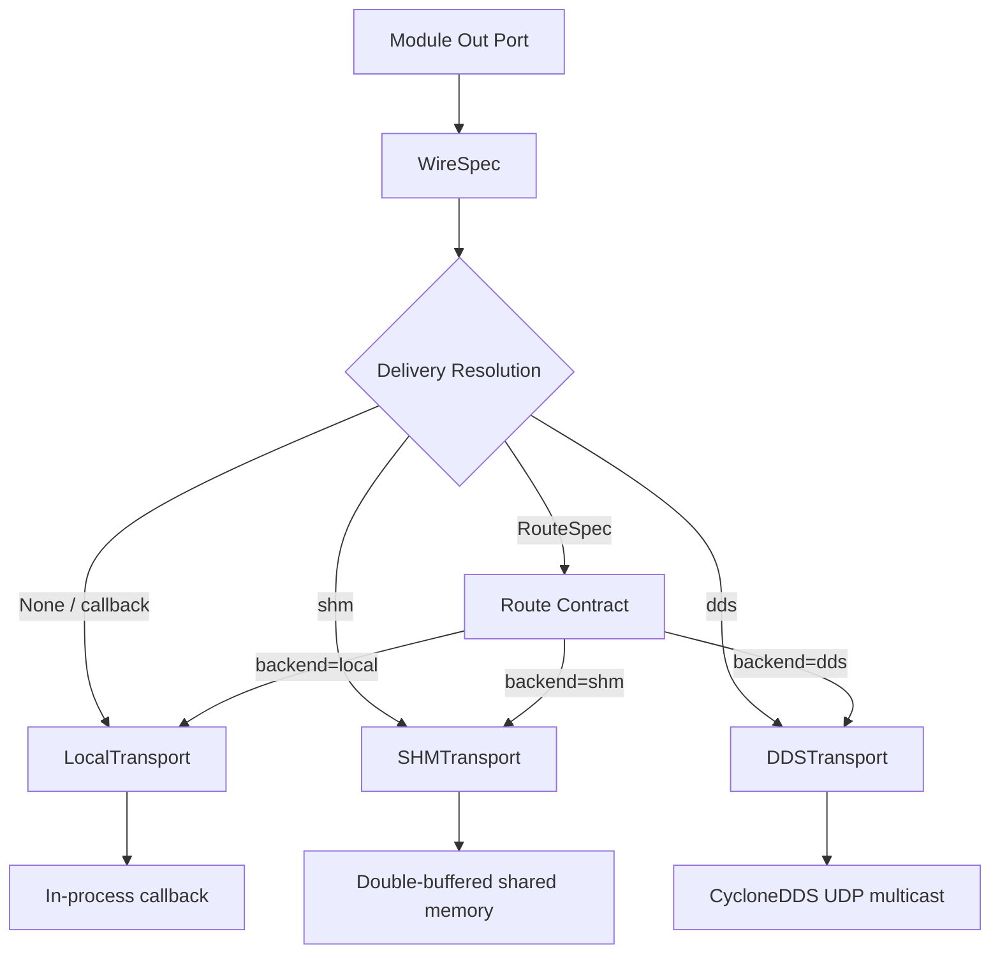
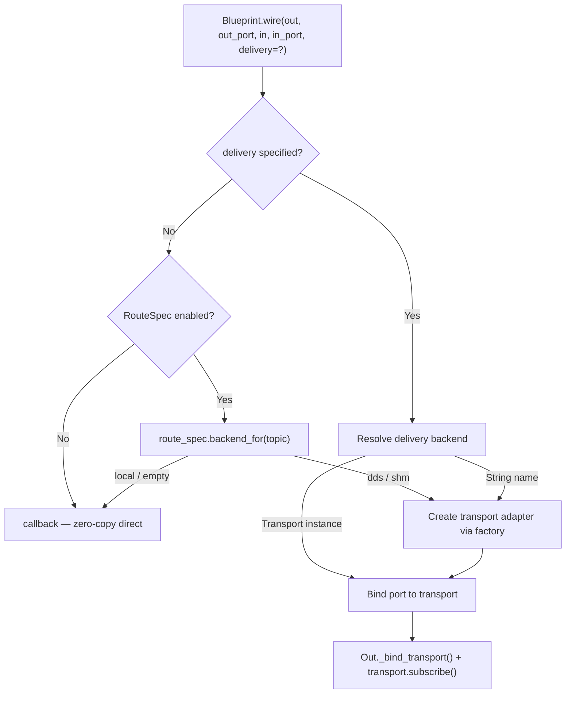

# Blueprint–DDS Integration Architecture

Status: current for Module/Blueprint transport mechanics; field product DDS uses native typed endpoint contracts
Audience: runtime/Blueprint maintainers
Replaced by: not replaced

This document describes how LingTu's Blueprint orchestration system and DDS
transport layer work together as a unified communication fabric.

## 1. Overview

Blueprint and DDS are **not** two separate systems — they are two layers of the
same module communication architecture:

- **Blueprint** (`src/runtime/blueprint.py`) is the *orchestration* layer.
  It declares which modules exist, how their ports connect, and which transport
  backend carries each connection.
- **DDS** (CycloneDDS) is one of several *transport backends* that Blueprint
  can select for a given wire. It is used when data must cross process or
  machine boundaries.

The transport abstraction ensures that **module code never imports DDS, SHM,
or any IPC library directly**. A module publishes to an `Out[T]` port; the
Blueprint wires that port to one or more `In[T]` ports through a chosen
backend. Swapping backends (e.g. from local callback to DDS) is a
configuration change, not a code change.

### Design Philosophy

| Principle | Description |
| --- | --- |
| Transport neutrality | Module code depends only on `In[T]` / `Out[T]` ports. |
| Opt-in complexity | Default is in-process callback; SHM/DDS are explicit opt-in. |
| Graceful degradation | Missing CycloneDDS or SHM falls back to local callback. |
| Single source of truth | QoS profiles live in `config/qos_profiles.yaml`; domain IDs come from `LINGTU_DDS_DOMAIN_ID`. |
| Route-driven selection | `RouteSpec` presets (`robot`, `replay`, `sim`) decide per-topic backends. |

---

## 2. Architecture

### Layer Hierarchy



### Blueprint.wire() Transport Selection Flow



---

## 3. Transport Backends

| Backend | Enum | Latency | Scope | Use Case |
| --- | --- | --- | --- | --- |
| **LOCAL** | `TransportStrategy.LOCAL` | ~0 μs | In-process | Default for all intra-process wires. Zero-copy callback. |
| **SHM** | `TransportStrategy.SHM` | ~200 μs | Same host | Double-buffered shared memory for large payloads (point clouds, images). |
| **DDS** | `TransportStrategy.DDS` | ~1–5 ms | Cross-host | CycloneDDS UDP multicast. Required for cross-machine and robot-side native services. |
| **AUTO** | `TransportStrategy.AUTO` | varies | Auto | Tries SHM first; falls back to DDS (if `ros_node` given) or LOCAL. |

### Backend Resolution in Factory

`src/runtime/transport/factory.py` provides three factory functions:

- `create_transport(strategy)` — raw transport instance.
- `create_transport_adapter(strategy)` — wraps transport with codec (JSON for
  SHM, IDL-typed for DDS).
- `create_route_transport_adapter(strategy)` — route-validated variant; allows
  registered product topics on DDS (the legacy adapter blocks them).

### Lazy Loading

Optional backends (SHM, DDS) are loaded lazily via `__getattr__` in
`src/runtime/transport/__init__.py`. Profiles that do not need DDS never
import CycloneDDS.

---

## 4. QoS Configuration

QoS profiles are declared in a single YAML file and consumed by the DDS
transport at wire-build time.

### config/qos_profiles.yaml

Defines named profiles, each listing:
- **topics** — which topic names this profile applies to.
- **qos** — reliability, durability, history/depth, deadline, lifespan.
- **rationale** — engineering justification.

Current profiles:

| Profile | Reliability | Durability | Depth | Typical Topics |
| --- | --- | --- | ---: | --- |
| `lidar_pointcloud` | BEST_EFFORT | VOLATILE | 2 | `/slam/registered_cloud`, `/nav/terrain_map` |
| `high_freq_state` | BEST_EFFORT | VOLATILE | 5 | `/slam/odometry`, `/imu/raw` |
| `localization_health` | RELIABLE | VOLATILE | 10 | `/slam/localization_health` |
| `final_velocity_command` | RELIABLE | VOLATILE | 1 | `/nav/cmd_vel` |
| `control_commands` | RELIABLE | VOLATILE | 1 | `/nav/stop`, `/nav/way_point`, `/nav/teleop_cmd_vel` |
| `navigation_command_request` | RELIABLE | VOLATILE | 32 | `/nav/command/request`, `/nav/exploration/command`, `/nav/inspection/task/request` |
| `navigation_command_ack` | RELIABLE | TRANSIENT_LOCAL | 64 | `/nav/command/ack`, `/nav/exploration/ack`, `/nav/inspection/task/ack` |
| `inspection_status` | RELIABLE | TRANSIENT_LOCAL | 1 | `/nav/inspection/status` |
| `global_path` | RELIABLE | TRANSIENT_LOCAL | 1 | `/nav/global_path`, `/nav/local_path` |
| `map_grid` | RELIABLE | TRANSIENT_LOCAL | 1 | `/nav/traversability`, `/nav/exploration_grid` |
| `system_status` | RELIABLE | TRANSIENT_LOCAL | 1 | `/robot_state`, `/gnss/status`, `/driver/control_state` |
| `geofence_events` | RELIABLE | TRANSIENT_LOCAL | 1 | `/nav/goal_pose` |
| `semantic_scene_graph` | RELIABLE | TRANSIENT_LOCAL | 2 | `/nav/semantic/scene_graph` |
| `semantic_detections` | BEST_EFFORT | VOLATILE | 2 | `/nav/semantic/detections_3d` |
| `semantic_nav_events` | RELIABLE | TRANSIENT_LOCAL | 1 | `/nav/semantic/instruction`, `/nav/semantic/status` |
| `sensor_stream` | BEST_EFFORT | VOLATILE | 256 | `/lidar/raw_frame`, `/imu/raw`, `/slam/odom_prior` |
| `camera_stream` | BEST_EFFORT | VOLATILE | 1 | `/camera/color/image_raw`, `/camera/depth/image_raw` |
| `camera_info` | RELIABLE | TRANSIENT_LOCAL | 1 | `/camera/color/camera_info` |
| `tf` | (ROS 2 defaults) | — | — | `/tf`, `/tf_static` (do not override) |

### src/runtime/transport/qos.py — QoS Loader

The loader:
1. Reads `config/qos_profiles.yaml` on first access (cached per process).
2. Builds a reverse mapping: `topic → profile name`.
3. Translates ROS 2-style QoS fields into CycloneDDS `Qos` / `Policy` objects.
4. Exposes two public functions:
   - `qos_for_profile(name)` — look up by profile name.
   - `qos_for_topic(topic)` — look up by topic name.
5. Returns `None` on any failure so callers keep their defaults (graceful
   degradation).

### TopicConfig.qos_profile Integration

`TopicConfig` (`src/runtime/transport/abc.py`) carries an optional
`qos_profile: str | None` field. When set, the DDS backend calls
`qos_for_profile()` to obtain the CycloneDDS `Qos` object and applies it to
the publisher/subscriber. When `None`, the existing `qos_depth` / `reliable`
fields are used as before (full backward compatibility).

### Domain ID Centralization

All DDS domain ID resolution goes through `qos.resolve_domain_id()`:

```
LINGTU_DDS_DOMAIN_ID  (env var, default "0")
        ↓
  resolve_domain_id(explicit=None) → int
```

Explicit arguments always win; the environment variable is the process-wide
default.

---

## 5. Worker Cross-Host Deployment

### WorkerDeployment

`src/runtime/worker_config.py` provides `WorkerDeployment`, a per-module
deployment descriptor:

```python
from runtime.worker_config import WorkerDeployment

dep = WorkerDeployment(
    module_name="PerceptionModule",
    host="192.0.2.20",         # example remote host -> DDS auto-selected
    transport="auto",          # "shm" | "dds" | "auto" | None
    domain_id=42,              # DDS domain override
    qos_profile="sensor_stream",
)
```

**Transport resolution rules:**

| `transport` | `host` | Result |
| --- | --- | --- |
| `"shm"` | any | Always SHM |
| `"dds"` | any | Always DDS |
| `"auto"` / `None` | `"localhost"` | SHM |
| `"auto"` / `None` | remote address | DDS |

### WorkerDeploymentRegistry

Blueprint collects `WorkerDeployment` entries via the `.worker()` builder
method and stores them in a `WorkerDeploymentRegistry`. During
`_build_worker_mode()`, the registry resolves transports for cross-boundary
wires:

```python
system = (
    Blueprint()
    .add(PerceptionModule)
    .add(NavigationModule)
    .worker("PerceptionModule", host="192.0.2.20", transport="dds", domain_id=42)
    .build(n_workers=2)
)
```

### DomainRouter — Multi-Domain Routing

`src/runtime/transport/domain_router.py` routes topics to different DDS
domain participants based on `fnmatch` pattern rules:

```python
from runtime.transport.domain_router import DomainRouter, set_global_router

router = DomainRouter({
    "/slam/*":        {"domain_id": 42, "host": "192.0.2.10"},
    "/perception/*":  {"domain_id": 0},
    "*":              {"domain_id": 0},
})
set_global_router(router)

# Resolve a topic
route = router.resolve("/slam/map_cloud")
# route == DomainRoute(domain_id=42, host="192.0.2.10")
```

The `192.0.2.0/24` addresses above are RFC 5737 documentation examples, not
LingTu field robot addresses.

Key API:
- `DomainRouter.resolve(topic) → DomainRoute` — first-match pattern routing.
- `resolve_domain_for_topic(topic)` — module-level shortcut using the global
  router singleton.
- `DomainRoute.is_remote` — `True` when the host is not localhost.

---

## 6. Observability

### DDSMetrics

`src/runtime/transport/dds_metrics.py` provides lightweight per-topic metrics
with **zero overhead when disabled**.

### Enabling Metrics

Set the environment variable:

```bash
export LINGTU_DDS_METRICS=1   # or "true", "yes", "on"
```

When not set (the default), all `record_publish` / `record_receive` calls
return immediately — no lock contention, no allocation.

### Collected Metrics (per topic)

| Metric | Type | Description |
| --- | --- | --- |
| `msg_count` | int | Total messages (pub + recv) |
| `publish_count` | int | Published message count |
| `receive_count` | int | Received message count |
| `msg_rate_hz` | float | Receive rate (sliding window, 200 samples) |
| `last_latency_ms` | float | End-to-end latency from publish timestamp |
| `bytes_total` | int | Total bytes transferred |
| `publish_bytes` | int | Published bytes |
| `receive_bytes` | int | Received bytes |
| `drop_count` | int | Detected sequence-number gaps |

### Collection Points

```python
from runtime.transport.dds_metrics import record_publish, record_receive

# In the DDS publish path:
record_publish("/slam/odometry", size_bytes=200)

# In the DDS receive path:
record_receive("/slam/odometry", msg, size_bytes=200)
```

Timestamp extraction is best-effort via `extract_timestamp(msg)`, which
handles `.timestamp`, `.header.stamp`, `.ts`, and dict keys.

### Accessing Metrics

```python
from runtime.transport.dds_metrics import get_global_metrics

snapshot = get_global_metrics().snapshot()
# {"topic_name": {"msg_count": ..., "msg_rate_hz": ..., ...}, ...}
```

Gateway or other modules can expose the snapshot over REST/SSE.

---

## 7. Data Flow Integration Guide

Adding a new data flow to the LingTu blueprint follows a 5-step process.
Reference template: `src/lingtu/assembly/wires/template.py`.

### Step 1 — Define Producer and Consumer Modules

```python
from runtime.module import Module
from runtime.stream import In, Out

class MySensorModule(Module):
    sensor_data: Out[SensorMsg] = Out(SensorMsg)

class MyConsumerModule(Module):
    sensor_data: In[SensorMsg] = In(SensorMsg)
```

Both modules must be registered via `@register(category, name)`.

### Step 2 — Create WireSpec Entries

Copy `template_specs` from the template, rename, and adjust:

```python
from lingtu.assembly.wires.types import WireSpec

MY_SENSOR_TOPIC = "/my/sensor_data"

def my_sensor_specs(ctx: WiringContext) -> tuple[WireSpec, ...]:
    if "MySensorModule" not in ctx.names:
        return ()
    return (
        WireSpec(
            out_module="MySensorModule",
            out_port="sensor_data",
            in_module="MyConsumerModule",
            in_port="sensor_data",
            delivery="dds",
            topic=MY_SENSOR_TOPIC,
        ),
    )
```

### Step 3 — Register in Full-Stack Wiring

Import and call the new specs function from
`src/lingtu/assembly/full_stack_wiring.py`:

```python
from lingtu.assembly.wires.my_flow import my_sensor_specs
...
specs.extend(my_sensor_specs(ctx))
```

### Step 4 — Register Route Contract (if cross-machine)

If the flow must cross machine boundaries, register the topic in
`src/runtime/route_contract/routes.py` under `_ROBOT_DDS_QOS` so the DDS
backend picks the correct QoS profile:

```python
_ROBOT_DDS_QOS = {
    ...
    "/my/sensor_data": {"qos": "sensor"},
}
```

### Step 5 — Write Tests

Write a unit test in `src/runtime/tests/` following the pattern in
`test_dds_dataflow_template.py`.

### WireSpec Field Reference

| Field | Type | Description |
| --- | --- | --- |
| `out_module` | `str` | Source module name (class name or alias) |
| `out_port` | `str` | Source `Out[T]` port attribute name |
| `in_module` | `str` | Destination module name |
| `in_port` | `str` | Destination `In[T]` port attribute name |
| `delivery` | `str \| None` | `"dds"`, `"shm"`, `"local"`, `None` (callback) |
| `topic` | `str \| None` | Stable topic name; auto-generated as `/<out_module>/<out_port>` when `None` |

---

## 8. IDL Code Generation

### Overview

`scripts/codegen/idl_to_python.py` parses CycloneDDS-style IDL files and
generates Python `@dataclass` type definitions. No external dependencies are
required.

### Usage

```bash
# Direct invocation
python scripts/codegen/idl_to_python.py \
    src/message/idl/lingtu_slam.idl \
    --output src/message/dds_types_generated/

# Via Makefile
make codegen-idl
```

### Generated Output

- **Location**: `src/message/dds_types_generated/`
- **Format**: One Python file per IDL module, containing `@dataclass` classes
  with type annotations matching the IDL struct definitions.
- **Naming**: Follows the IDL module path (e.g. `lingtu::dds::Time` →
  `lingtu.dds.Time`).

### IDL Field Mapping

| IDL Type | Python Type |
| --- | --- |
| `int32`, `uint32` | `int` |
| `float`, `double` | `float` |
| `string` | `str` |
| `sequence<T>` | `List[T]` |
| `T[N]` (fixed array) | `List[T]` with size hint |
| Nested struct | Generated dataclass reference |

---

## 9. Route Contract & Routed Delivery

### Route Presets

`src/runtime/route_contract/routes.py` defines three built-in presets:

| Preset | Default Backend | Description |
| --- | --- | --- |
| `robot()` | LOCAL (per-topic DDS overrides) | Physical robot. Native service boundaries use typed DDS with QoS bindings from `_ROBOT_DDS_QOS`. |
| `replay()` | LOCAL (per-topic LCM overrides) | Replay/development. Canonical topics use typed LCM bindings where available. |
| `sim()` | LOCAL | In-process simulation. All ports use local callback unless explicitly overridden. |

### RouteSpec Model

```python
@dataclass(frozen=True)
class RouteSpec:
    name: str
    default: str = "local"
    routes: Mapping[str, str]     # topic → backend
    bindings: Mapping[str, ...]   # backend → topic → binding config

    def backend_for(self, topic: str) -> str:
        return self.routes.get(topic, self.default)
```

### Routed Delivery Mechanism

When `Blueprint.routed_delivery("robot")` is called:

1. The route contract is attached to the Blueprint.
2. During `_do_wire()`, if a wire has no explicit `delivery`, the route
   contract is consulted: `route_spec.backend_for(topic)`.
3. If the backend is `"dds"` or `"shm"`, a route-validated transport adapter
   is created via `create_route_transport_adapter()`.
4. If the backend is `"local"` or empty, the wire uses in-process callback.

This allows switching the entire system's transport backend per-topic by
changing a single route preset name, without modifying any wire declarations.

### Topic Contract

`src/runtime/route_contract/model.py` defines `TopicContract` (role, schema,
frame, producer, consumers, port bindings) and `RouteContract` (topics +
selected route). These are used for introspection, validation, and manifest
generation — not for runtime data flow.

---

## 10. Key File Index

| File | Role |
| --- | --- |
| `src/runtime/blueprint.py` | Blueprint orchestration: `add()`, `wire()`, `worker()`, `route_contract()`, `routed_delivery()`, `build()` |
| `src/runtime/module.py` | Module base class with lifecycle hooks |
| `src/runtime/stream.py` | `In[T]` / `Out[T]` port definitions and backpressure policies |
| `src/runtime/wiring.py` | `WireSpec` data class and delivery resolution helpers |
| `src/runtime/transport/abc.py` | `TransportStrategy` enum, `TopicConfig` (with `qos_profile` field) |
| `src/runtime/transport/local.py` | `LocalTransport` — in-process callback backend |
| `src/runtime/transport/shm.py` | `SHMTransport` — double-buffered shared memory |
| `src/runtime/transport/dds.py` | `DDSTransport` — CycloneDDS backend |
| `src/runtime/transport/factory.py` | Transport factory: `create_transport()`, `create_transport_adapter()`, `create_route_transport_adapter()` |
| `src/runtime/transport/adapter.py` | `TransportAdapter` — codec wrapping for SHM/DDS |
| `src/runtime/transport/qos.py` | QoS profile loader and domain ID resolution |
| `src/runtime/transport/dds_metrics.py` | Per-topic DDS observability metrics |
| `src/runtime/transport/domain_router.py` | `DomainRouter` — fnmatch-based multi-domain routing |
| `src/runtime/worker_config.py` | `WorkerDeployment` and `WorkerDeploymentRegistry` |
| `src/runtime/route_contract/model.py` | `RouteSpec`, `RouteBackend`, `TopicContract`, `RouteContract` |
| `src/runtime/route_contract/routes.py` | Built-in presets: `robot()`, `replay()`, `sim()` |
| `src/runtime/route_contract/loader.py` | Route contract YAML loader |
| `src/runtime/route_contract/validator.py` | Route contract validation |
| `src/lingtu/assembly/wires/template.py` | WireSpec template for new data-flow integration |
| `src/lingtu/assembly/profile_builder.py` | Profile-driven full-stack assembly |
| `src/lingtu/assembly/full_stack_wiring.py` | Critical explicit wires for the full stack |
| `config/qos_profiles.yaml` | QoS profile definitions (single source of truth) |
| `scripts/codegen/idl_to_python.py` | IDL → Python dataclass code generator |
