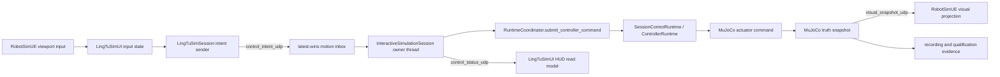

# UE5 Playable Vertical Slice Execution Plan

Status: implementation and native Automation complete; fresh live acceptance pending
as of 2026-08-12

Product mode: local single-player RobotSimUE simulation

Runtime boundary: one resolved `thunderv4_factory_park_hf` SessionBundle containing
`thunderv4@1.0.1`, one owned RobotSimUE process, one owned MuJoCo process, the declared
`thunderv4_locomotion@1.0.0` controller, and the exact ThunderV4 navigation
five-stream sensor rig

Top-level acceptance seam: `lingtu.sim.ue5-playable-vertical-slice.v1`

This document turns
[`docs/product/simulation-studio-product.md`](../product/simulation-studio-product.md)
into an executable implementation sequence. Component tests are necessary, but no
component test, scripted motion run, screenshot, or sensor run independently qualifies
the product.

## Outcome

The first slice is complete only when a person, or Windows input automation acting on
the foreground RobotSimUE viewport, drives the black `thunder_01` in FactoryPark with
keyboard or gamepad input and one fresh run proves this chain:

```text
physical/OS input event in RobotSimUE
  -> UE operator intent
  -> LingTu Control admission
  -> declared ThunderV4 controller
  -> MuJoCo actuator command and truth
  -> UE truth projection and truthful HUD
  -> exact five sensor streams
  -> one committed recording and qualification verdict
```

MuJoCo remains the only clock, dynamics, contact, ray-cast, and robot-state authority.
No UI, camera, input, or evidence code may call `SetActorTransform`, write MuJoCo
stdin, or publish a final actuator command directly.

## Fixed Product Decisions

### Product surfaces

- RobotSimUE Runtime is the playable product surface.
- RobotSimUE Create is the later immersive 3D authoring surface.
- SimStudio Web remains package, session, run, recording, replay, and evidence
  management. It is not a substitute for a UE game viewport.
- Blender remains an offline deterministic DCC/asset-conditioning tool, not a
  runtime or control surface.

### First-slice UI and input technology

The first slice extends the existing asset-free C++ Slate module and its one runtime UI
state machine. It does **not** introduce a parallel Blueprint state machine.

The production input seam for this slice is the existing viewport-scoped
`IInputProcessor`, extended with key-up, analog, focus, and tick handling. This is an
explicit short-term decision:

- It exercises real RobotSimUE viewport events and supports dependency-free Windows
  `SendInput` acceptance.
- It avoids adding unreviewed Input Action assets while the control transport and
  lifecycle are still changing.
- It must be restricted to exactly one foreground game viewport and one local player;
  multiple eligible PIE/game worlds fail closed.
- Enhanced Input becomes the next migration after the input/control/evidence seam is
  stable. UMG/Common UI follows the same rule for presentation.

The HUD remains quiet and game-like, but truthful. It must never infer acceptance or
motion from a locally held key.

### Controls

Keyboard:

| Input | Meaning |
| --- | --- |
| `Left Shift` | hold-to-drive control claim/deadman |
| `W` / `S` | forward / backward |
| `A` / `D` | body-left / body-right |
| `Q` / `E` | turn left / turn right |
| mouse or arrow keys | camera look only |
| `C` | cycle follow / inspection / free camera |
| `Tab` | enter/leave Tactical; leaving Drive releases control and sends zero |
| `Escape` | open/close Menu; opening Menu releases control and requests pause |
| `R` | request recording start/stop |
| `B` | read-only Build preview; entering it releases control and sends zero |

Gamepad:

- Left shoulder is the deadman.
- Left stick is body-forward/body-left translation.
- Triggers are left/right yaw.
- Right stick is camera look only.
- Face/menu buttons map to camera, Tactical, Menu, and recording actions.

Robot and camera axes never share one value. Keyboard axes are digital; gamepad axes
use a `0.15` radial dead zone and are clamped to `[-1, 1]`.

The server, not UE, owns speed scales:

- maximum translation command: `0.10 m/s` per body axis;
- maximum yaw command: `0.35 rad/s`;
- simultaneous translation is length-clamped before scaling;
- the controller's existing stale-command fuse remains active.

These are command values. The HUD and evidence must report measured response
separately.

## Runtime Data Flow



The UDP receiver thread only validates and deposits messages. Only the serialized
`InteractiveSimulationSession` owner thread may turn an input sample into a
generation-stamped `ControllerCommand`, process runtime requests, advance MuJoCo, and
commit accepted/truth correlation evidence.

## Run Allocation and Launch Contract

Every playable run allocates distinct loopback ports:

```json
{
  "ports": {
    "visual_snapshot_udp": 25123,
    "control_intent_udp": 25124,
    "control_status_udp": 25125
  }
}
```

The actual ports are allocation-owned and may differ. `UnrealProcess` passes:

```text
-LingTuControlIntentPort=<allocation port>
-LingTuControlStatusPort=<allocation port>
-LingTuControlSourceId=robotsimue.local_player.0
-LingTuHudScreenshot=<exact run log path>
```

The existing allocation argument, run ID, boot ID, session digest, model generation,
reset generation, and log directory remain the identity source of truth. UE must
cross-check the command-line values against `run-allocation.json` and reject missing,
relative, mismatched, reparse-point, or out-of-run paths.

No default control port is allowed. A visual run without the two control ports may
still be a viewer, but it cannot advertise or qualify as playable.

## Wire Contracts

All UDP is IPv4 loopback-only. Receivers reject non-loopback sources, packets over
`4096` bytes, invalid UTF-8, duplicate JSON keys, unknown fields, non-finite numbers,
unsafe strings, wrong identity/generation, and non-monotonic source sequence.

### Motion sample

Schema: `lingtu.sim.ue-control-intent.v1`

```json
{
  "schema": "lingtu.sim.ue-control-intent.v1",
  "run_id": "run-id",
  "session_id": "playable-demo",
  "boot_id": "allocation boot id",
  "model_generation": 0,
  "reset_generation": 0,
  "source_id": "robotsimue.local_player.0",
  "source_epoch": 1,
  "source_sequence": 42,
  "event_id": "<boot_id>:1:42",
  "input_mode": "drive",
  "input_device": "keyboard",
  "viewport_focused": true,
  "deadman": true,
  "axes": {
    "forward": 1.0,
    "left": 0.0,
    "yaw_left": 0.0
  },
  "active_controls": ["keyboard.left_shift", "keyboard.w"],
  "source_monotonic_ns": 123456789
}
```

UE sends at `30 Hz` while focused and sends immediately on state changes. UE never
sends authoritative simulation time, actuator values, or trusted SI-unit speed limits.
The Python owner uses arrival monotonic time for freshness and current MuJoCo truth for
`apply_time_ns` and generation.

### Runtime request

Schema: `lingtu.sim.ue-runtime-request.v1`

Required identity/source fields match the motion sample. `request` is one of:

```text
control_claim, control_release, pause, resume,
record_start, record_stop_commit, safe_stop, exit
```

Motion is latest-wins. Runtime requests enter a bounded FIFO of `32`, are deduplicated
by `event_id`, and receive an explicit accepted/rejected/confirmed status. Queue full
fails closed; it never silently drops a lifecycle request.

### Status

Schema: `lingtu.sim.ue-control-status.v1`

Status is sent at `10 Hz` and immediately on state change. It contains:

- run/session/boot identity and current model/reset generation;
- server status sequence and correlated UE event/source sequence;
- `pending`, `accepted`, `rejected`, `released`, `timeout_zero`, or `confirmed`;
- exact reason when not accepted;
- runtime state, control owner, deadman, sample age, and safe-stop state;
- requested normalized axes and server-admitted SI-unit base twist;
- current truth-observed linear/angular velocity and snapshot sequence/time;
- Physics/Control/Visual/Sensors readiness;
- exact five sensor stream IDs, states, sample counts, and blockers;
- recording state, elapsed simulation time, and committed artifact identity;
- current UI/camera mode echoed from the latest accepted UE state.

The HUD may display local key highlights as `requested`, but may display `accepted`,
`moving`, `ready`, `recording`, or `paused` only from this status or current-generation
public runtime state.

## Safety and Lifecycle

- A sample is fresh for at most `100 ms` of server monotonic time.
- On focus loss, deadman release, leaving Drive, Menu open, Build/Tactical entry,
  sender destruction, UE exit, or timeout, UE emits zero/release and Python submits a
  fresh zero `base_twist` once per transition.
- Controller stale-command handling remains a second fuse.
- Pause clears/holds the latest Python controller command. Resume cannot revive a
  pre-pause command; it requires a new claim and a new current-generation sample.
- Reset clears inboxes, source ordering, controller command state, observed status,
  and evidence correlation, then requires the new reset generation.
- Stop/exit commits or rejects recording, emits zero, stops advancing, and closes UE,
  UDP, sensors, controller, and MuJoCo in the existing owned cleanup order.
- Any identity, generation, sequence, thread, sensor, recording, screenshot, or
  process-ownership failure makes the final verdict `EVIDENCE_REJECTED`.

## One HUD View Model

Replace repeated ad-hoc reads with one per-frame immutable
`FRuntimeUIStatusSnapshot`. It is the sole view model used by the HUD and UI evidence.
It contains:

- availability/error and one coherent read timestamp;
- run ID, session digest, model/reset generation;
- world and robot identity;
- runtime state and four required binding facets;
- control owner, pending action, deadman, safe-stop reason;
- requested axes, admitted twist, observed truth velocity;
- simulation time, truth sequence, snapshot age;
- exact five sensor stream states/counts/blockers;
- recording state/time/artifact identity;
- UI mode and camera mode.

The snapshot is unavailable if Session, Visual, or status data disagree on digest or
generation. It must show the blocker rather than mixing generations. The HUD is
captured only after a fresh coherent snapshot reports Visual active and all required
facets active.

First-slice layout:

- compact top strip: product/run identity and four readiness facets;
- lower-left: control owner, deadman, requested/admitted/observed motion;
- lower-right: five sensor counts and recording state;
- center: only safety/pause/error prompts, no persistent telemetry wall;
- bottom: context-sensitive controls for Drive, Tactical, and Menu;
- Build: explicitly `READ-ONLY PREVIEW`, never an editor claim.

## Production Class and File Boundaries

### Python

New module `sim/runtime/coordinator/control_intent_udp.py`:

- `OperatorIntentIdentity`
- `OperatorMotionIntent`
- `OperatorRuntimeRequest`
- `ControlIntentValidationError`
- `LatestOperatorIntentInbox`
- `BoundedRuntimeRequestInbox`
- `UdpLoopbackOperatorIntentReceiver`
- `UdpLoopbackControlStatusPublisher`
- `PlayableControlPump`
- `PlayableControlEvidenceWriter`

Changes:

- `sim/runtime/coordinator/interactive_session.py`
  - optional playable control pump;
  - process motion/runtime requests on the owner thread before each advance;
  - keep processing resume/exit requests while paused;
  - clear command/inbox state on pause/reset/stop.
- `sim/runtime/coordinator/session_host.py`
  - narrow `submit_controller_command` forwarding seam;
  - expose same-generation readiness/sensor summary without giving a socket thread the
    coordinator.
- `sim/runtime/control/session.py` and `sim/runtime/control/runtime.py`
  - explicit hold/clear-latest-command operation used by pause/stop;
  - no change to controller or physics authority.
- `sim/runtime/coordinator/unreal_process.py`
  - strict control intent/status arguments and HUD screenshot argument.
- `tools/simstudio/service/runtime_factory.py`
  - extract a reusable production visual-session assembly function; SimStudio and the
    playable runner consume the same function.
- New `sim/runtime/coordinator/playable_vertical_slice.py`
  - the only qualification runner and CLI, invoked with
    `python -m sim.runtime.coordinator.playable_vertical_slice`.

The existing `motion_recording.py` remains a controller/motion qualification utility.
Its truth-derived maneuver evaluator and media helpers may be extracted into shared
pure functions. The playable runner must not call its scripted command loop.

### UE C++

`LingTuSimSession` owns networking and allocation identity:

- new `FLingTuSimOperatorIntentSender`;
- new nonblocking `FLingTuSimControlStatusReceiver`;
- `FSessionService` exposes narrow publish/read-status calls;
- UE-written `ue-control-origin.jsonl` is appended only after a successful send and
  only inside the allocation log directory.

`LingTuSimUI` owns local input, mode, and display:

- extend `FLingTuSimRuntimeUIInputProcessor` with key-up, analog, focus, repeat guard,
  and fixed-rate sampling;
- add pure `FRobotDriveInputState` and mapping policy;
- keep `FRuntimeUIModeController` as the one mode state machine;
- replace status fields with one `FRuntimeUIStatusSnapshot` read per frame;
- extend `ULingTuSimRuntimeUIWorldSubsystem` to enforce one eligible viewport/player,
  emit release on teardown, and request a fresh HUD-inclusive screenshot;
- update `SLingTuSimRuntimeHUD` to render the truthful compact layout.

`LingTuSimVisual` exposes a read-only copy of the last successfully applied truth
snapshot/base-body velocity. UI cannot consume or steal the transport mailbox.

The first slice does not add a custom Pawn and never possesses the visual robot Actor.
The camera remains an observer of a truth-projected robot.

## Evidence Bundle

The new run directory is empty at start and owned by one runner. It contains:

```text
run-allocation.json
session.runtime.json
logs/Unreal.log
logs/ue-control-origin.jsonl
control-intent-accepted.jsonl
control-truth-correlation.jsonl
motion-trajectory.jsonl
sensor-stream-summary.json
recording/recording.manifest.json
recording/recording.timeline.jsonl
frames/frame_*.png
screenshots/hud-drive.png
screenshots/hud-tactical.png
screenshots/hud-menu-recording.png
videos/playable-raw.mp4
videos/playable-labeled.mp4
episode_result.json
playable-qualification.json
```

`playable-qualification.json` is the only product verdict. It hashes every required
artifact and verifies exact equality of `run_id`, `session_id`, `boot_id`, model
generation, and reset generation. Each accepted maneuver joins:

```text
UE event_id/source sequence
  = UE successful-send raw datagram SHA-256
  = receiver raw datagram SHA-256 and intent identity
  = accepted ControllerCommand sequence/apply_time
  = before/after MuJoCo truth interval
  = mapped UE frame interval
```

A declared `source_id` alone is not proof of UE origin. Qualification requires the
fresh UE-owned origin line, the Python-owned accepted line, and MuJoCo truth in the
same PID-owned run.

## Single Runner and Real Input Automation

CLI:

```text
python -m sim.runtime.coordinator.playable_vertical_slice <resolved-bundle>
```

The runner:

1. refuses a non-empty/stale run directory and resolves the fixed bundle exactly once;
2. assembles the same production visual runtime used by SimStudio;
3. starts owned MuJoCo and RobotSimUE and waits for all four binding facets;
4. finds the top-level RobotSimUE window belonging to the owned PID, brings it to the
   foreground, and verifies foreground ownership;
5. uses dependency-free Windows `user32.SendInput` for actual key down/hold/key up;
6. holds deadman and drives W, S, A, D, Q, E in order, with neutral transitions;
7. uses new UE input evidence, not the automation schedule, as the source record;
8. records raw no-HUD frames and separate HUD-inclusive screenshots;
9. commits recording, performs safe stop, closes the runtime naturally, then encodes
   labelled media;
10. rescans artifacts only after owned runtime close and writes one atomic verdict.

The intended acceptance schedule is four translation segments of about `3 s`, two
turn segments long enough to exceed `0.35 rad` observed yaw, and `0.5 s` neutral
transitions. The total run must remain at least `20 s`. Exact duration is evidence
driven; the runner does not weaken the motion thresholds to fit a preset duration.

Gamepad qualification uses the same production input state in UE Automation first.
Physical XInput hardware is a separate manual evidence run and is not required for
the first automated Windows gate.

## TDD Implementation Sequence

### Slice 1 — wire contract and inbox

RED tests:

- valid exact motion/request documents;
- duplicate keys, unknown fields, bad UTF-8, oversize, non-loopback, NaN/Inf;
- wrong run/digest/boot/generation/source;
- duplicate/out-of-order sequence and epoch transition;
- latest-wins motion and bounded non-dropping request FIFO.

GREEN implementation: pure parser/contracts, inboxes, loopback receiver, no
Coordinator calls.

### Slice 2 — owner-thread control and safety

RED tests:

- only the interactive owner thread can submit;
- server-owned speed scaling and current truth apply time/generation;
- intent before advance, accepted result after submit, truth after advance;
- 100 ms timeout zero;
- focus/deadman/mode release zero;
- pause/resume cannot revive an old command;
- reset rejects old generation and clears ordering/evidence state.

GREEN implementation: control pump, explicit hold/clear, accepted/status evidence.

### Slice 3 — production assembly and five sensors

RED tests:

- allocation has three distinct run-local ports;
- production controller and exact five sensor streams are assembled once;
- camera SHM names match allocation;
- missing/extra/zero/stale stream fails;
- no truth-odom-only restriction in the playable runner;
- SimStudio and playable runner share the production assembly.

GREEN implementation: extracted production visual assembly and playable launch.
The canonical SensorPlan, not copied frequency constants, supplies the expected IMU
rate (`200 Hz` in the current package).

### Slice 4 — Unreal launch and C++ protocol

RED tests:

- no implicit ports or paths;
- exact allocation identity and loopback destination;
- C++ JSON serialization/status parsing rejects malformed identity and generation;
- origin evidence is written only after successful send;
- sender teardown emits release/zero and cannot overwrite an old artifact.

GREEN implementation: `LingTuSimSession` sender/receiver and launch arguments.

### Slice 5 — UE input and mode lifecycle

RED C++ Automation:

- W/S/A/D/Q/E mapping and opposing-key cancellation;
- keyboard repeat ignored;
- gamepad analog dead zone/clamp and separate camera axes;
- motion only in Drive with deadman and foreground viewport;
- key-up, deadman release, focus loss, Tactical, Build, Menu, and teardown release;
- multiple eligible viewport/player contexts fail closed.

GREEN implementation: input state and viewport-scoped processor.

### Slice 6 — coherent HUD and HUD evidence

RED C++ Automation:

- exact run/generation/readiness/control/sensor/recording fields;
- requested, accepted, and observed never collapse into one value;
- mixed generation or missing status shows blocker;
- Drive, Tactical, Menu, and recording-active snapshots;
- screenshot request uses `bShowUI=true`, is fresh, nonempty, and 1920x1080.

GREEN implementation: immutable view model and compact Slate HUD.

### Slice 7 — single runner and adversarial qualification

RED Python tests:

- SendInput targets only the owned foreground PID/window;
- direct Python command submission cannot satisfy UE-origin proof;
- stale/pre-existing files fail;
- any missing join, mismatched identity/generation/sequence, missing frame, black frame,
  decode error, zero sensor sample, or process leak fails;
- clean shutdown emits final zero and scans the post-close frame set.

GREEN implementation: runner, media, and atomic qualification writer.

### Slice 8 — native build and real acceptance

1. Confirm no owned or foreign UBT/UAT/UnrealEditor/MuJoCo build/run conflict.
2. Build only through `sim/tools/toolchains/ue_build.py` with `-WaitMutex` ownership.
3. Run all `LingTuSim.UI`, Session, Visual, Sensors, Scenario, and new Control
   Automation tests.
4. Launch the fixed FactoryPark bundle through the single playable runner.
5. Independently validate the final evidence and visually inspect the three HUD states
   plus raw/labeled video.

Current dated status:

- Steps 1-3 are complete on 2026-08-12. The camera Automation report is `11/11` and
  the complete `LingTuSim` report is `86/86`, with zero failed or not-run tests.
- The latest pre-acceptance live run failed before `RUNNING` on the former one-second
  cold camera readback deadline. The replacement stage-specific startup deadline is
  in the newly built DLL and the Automation reports, but has not yet passed a live
  camera startup.
- Steps 4-5 remain pending. A new live run must start from a clean process table and
  stable provenance-bound bundle. A failure in the 12-second gate consumes that run
  and forbids the 60-second/input/qualification phases.

Shipping Cook is not part of this first playable gate. The current distribution Cook
has a separate Zen oplog/store failure and must not be conflated with Editor-runtime
playability.

## Final PASS Conditions

One fresh run must prove all of the following:

- exact FactoryPark world, black/graphite `thunder_01`, declared production controller;
- Physics, Control, Visual, and Sensors all current-generation ACTIVE;
- exact RGB, depth, IMU, Mid360, and truth odom streams with positive samples;
- six UE-origin maneuvers with complete three-way evidence;
- forward/backward/left/right each at least `0.08 m` in the signed body direction;
- left/right turn each at least `0.35 rad` command-aligned unwrapped yaw;
- each turn horizontal drift at most `0.10 m`;
- at least `20 s` of raw and labelled 1920x1080 video;
- at least `600` mapped frames for each required 30 Hz render stream;
- fresh HUD-inclusive Drive, Tactical, and Menu/recording screenshots;
- no black-frame event, decode error, stale identity, partial evidence, or fallback;
- episode `SUCCEEDED`, final zero command, clean natural shutdown, and zero owned
  RobotSimUE/MuJoCo process leak;
- one independently revalidated `playable-qualification.json` with `result=PASS`.

Anything less remains a component capability, not a playable product qualification.
