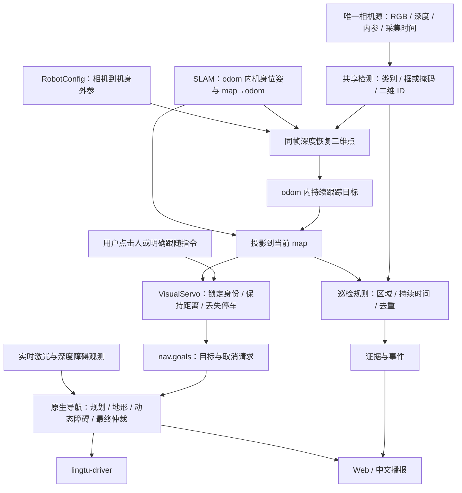

# 端侧语音、人员跟随与巡检融合

状态：源码核对后的实施方案；候选模型尚未安装，本文件不表示实机验收完成。
核对日期：2026-09-19。当前 Go2/NX 与产品目标 S100P/RDK X5 必须分别验证。

本文件是[巡检任务与运动规划计划书](inspection_motion_plan.md)的感知、复核与语音支撑方案。
项目主线是路线规划、运动执行、到点查看与跟随；下述迁移阶段不是整个巡检项目的实施顺序。

## 结论与已有能力

中文讲解的演示音频由开发电脑上的 Windows `System.Speech` / Microsoft
Huihui Desktop 合成。讲解内容由助手依据画面和状态编写；它不是机器人上的
场景模型输出，也不证明机器人已具备离线语音对话。

LingTu 已有 RGB-D 投影、人员跟踪和视觉目标到原生导航的链路，应在现有边界内
补齐模型和验收。巡检项目应贡献检测模型及业务规则，不接管相机、SLAM 或运动。

| 核对对象 | 当前实际情况 | 实施含义 |
| --- | --- | --- |
| `config/runtime_graph/products/tracking.yaml` | 有 `PerceptionModule`、`VisualServoModule`、相机和原生导航；需要已存地图；禁止 `SemanticPlannerModule` | 使用 tracking 的明确选人入口；语音意图接入必须显式配置，不能假定 nav 已有全部语义能力 |
| `src/perception/frames.py` | RGB/深度时间匹配、内参检查、邻近时刻里程计和 map→odom 组合已有实现 | 保留同步入口；尚不能把“邻近采样”写成“位姿插值” |
| `src/perception/backends.py` | 已有注册式 detector provider、RGB-D 投影；BPU 可接二维跟踪器 | 扩展现有 provider，避免独立巡检相机循环 |
| `src/perception/tracking/bpu_tracker.py` | 有 BoT-SORT/ByteTrack 接口和依赖较少的本地实现；BoT-SORT 配置关闭 ReID | 二维 track ID 不等于可靠的跨遮挡人员身份 |
| `src/decision/vision/person.py` | 有距离保持、运动预测、OSNet/CLIP 重识别接口 | 正常装配未找到为跟随模块注入 OSNet/CLIP 的调用；要补模型装配和健康状态 |
| `src/decision/vision/reid.py` | BPU 分支使用 `bpu_infer`，开发分支使用 torchreid | 与检测器的 `hbm_runtime` 不是同一个后端；需核对板端实际 SDK，不能声称 HBM 已可运行 |
| `src/decision/modules/visual_servo.py` | 默认距离 1.5 m、目标更新上限基线 2.5 Hz、位移死区 0.25 m；有丢失取消与原生任务反馈 | 参数是当前默认值，不是实机性能指标；保留原生规划及停车链路 |
| `src/perception/inspection/bridge_module.py` | 已有证据采集、存储与 DDS 回复；垃圾桶满溢、车牌分析仍标 unavailable | 保存图片成功不等于巡检模型判断成功 |
| `sim/scripts/mujoco/rgbd_follow_worker.py` | 从渲染 RGB 中识别特定衣服颜色，再使用深度；不是学习式人员检测器 | 可验证特定场景的几何与控制，不能代替真实检测、多人身份验收 |

本次运行 `test_person_tracker.py`、`test_follow_person_selection.py`、
`test_visual_servo_semantic_integration.py`，Windows 本地结果 **75 passed**。
这些测试覆盖选人、身份关联、目标丢失、停止及任务反馈，不证明 NX/S100 跟人安全。

## 端侧模型分工

| 能力 | 首选实施方向 | 边界 |
| --- | --- | --- |
| 找到人 | S100 上先对比官方 YOLO11n/s 与巡检项目六分类模型；使用对应 BPU 产物 | NX 需要匹配自身 SDK 的模型后端；S100 HBM、X5 产物及 NX 产物不能互换 |
| 连续跟踪同一个人 | 复用当前二维跟踪 + 三维关联；在跨 ID 恢复时接 OSNet 外观特征 | 先实现“用户选中的这个人”；重识别不是实名人脸识别 |
| 中文语音识别 | sherpa-onnx + SenseVoiceSmall，配合 VAD 做分句识别 | SenseVoiceSmall 是非流式识别模型，不称为逐字流式；板端并发延迟待测 |
| 中文播报 | sherpa-onnx 中文 VITS 或 Kokoro-82M 中文 ONNX/INT8 作为候选 | 先测试短句首音延迟、发音和 CPU；停止/目标丢失等固定提示可预生成 |
| 场景问答、垃圾桶状态复核 | Qwen3-VL-2B-Instruct 作为低频候选，与已有业务样本对比 | 尚未验证 S100 BPU 转换或 NX 内存/SDK 适配；不放入避障和速度输出回路 |

CPU/BPU/GPU 的选择由实际板卡、SDK、模型输入输出与测量结果决定。候选模型的
公开可下载性不等于板端就绪。新增依赖、权重及部署需要在实施时明确选择。
音频输入输出也要确认真实设备：优先使用已验证的麦克风/扬声器接口，未验证前
不假定 NX 可以直接访问 Go2 的所有内置音频设备。

语音链路：麦克风 → VAD/ASR → 明确的意图（选人、停止、询问状态）→ 既有任务入口；
任务事实/观测结果 → 简短中文说明 → TTS → 扬声器。
先支持按键说话，播放时避免把机器人自己的播报当成新命令；全双工再验证回声消除。
“已停止”必须取自原生停止反馈；“前方有人”可以取自有效检测；“道路可通行”必须
来自导航判定。视觉模型描述和距离测量分别保留来源及时间，不能混成无依据的结论。

## 核心需求：运动中持续检测与多模态复核

机器人运动时持续处理相机新画面是基础能力，到点巡检是附加任务，不应把所有
检测都限制到停稳之后。持续处理采用最新帧策略，不要求推理每个相机帧，也不能
通过排队处理旧图像制造“始终在检测”的假象。

当前源码已有 PerceptionModule 最新帧工作线程，但标准 nav 的 camera 变体主要
提供画面预览，没有声明 semantic 能力；tracking/inspection 才声明相关能力。
现有 VLM 选人、目标验证和语义目标慢路径，不等于通用“低检测置信度 → 图像 API
复核”。目前尚未接通后一链路。感知还会丢弃模糊图像，并依赖 RGB-D/位姿同步；
持续二维识别与可选三维投影需要按前述方案拆清。

实施目标是两条并行路径：

- 新相机帧 → 本地检测/跟踪 → 当前观测和事件；与导航同时运行。
- 值得复核的候选 → 异步多模态 API → 关联原观测的语义结论与证据。

复核触发包括持续低置信度、跨帧类别冲突、任务要求的复杂判断；此外，按任务
预算对代表性全景帧做低频复核，可覆盖本地模型完全漏检的情形。不能只等到
本地检测框出现才允许所有语义分析。阈值按类别和实测样本确定，不统一套一个
未经验证的分数，也不将检测分数理解成校准后的正确概率。

候选需在检测阈值过滤前保留适用的复核信息；图像模糊时先等待近期清晰帧，
不要将每一张模糊帧都上传。请求保留原图/区域、采集时间、跟踪 ID 和任务上下文；
合并同一目标重复请求，限制并发与频率。API 返回确认、否定或无法确定，过期
结果可留作历史证据，但不能当成目标当前位置。API 不替代深度测量和外参转换。
网络失败时标记复核不可用，本地检测和原生避障继续运行。

首先验证运动中识别结果和新鲜度持续更新，再用低置信度、完全漏检、延迟回复和
断网回放验证复核。API 复核慢或失败不能阻塞相机、SLAM、导航或停车；云端“不是
障碍物”的语义结论不能直接清除几何障碍。以上是待实现及验收的流程，不是上线声明。

## 谁决定调用哪一种检测

首期采用“模型理解意图、显式策略调度、模型产生观测、状态机形成事件”。不额外
训练一个调度模型，也不让视觉大模型逐帧决定是否运行基础感知。

原巡检项目 `UnifiedInference` 每个新帧先调用一次 HBM，随后解码分类结果，
`PatrolFrameProcessor` 再把结果分发给业务规则。因此车辆、人员、明火不是三个
必须轮流加载的检测模型。关闭某一类业务规则主要省去后处理，不会省掉已经执行
的共享 HBM 推理；实际可调的是附加模型调用、图像处理频率和复核任务。

| 决定 | 负责方式 | 触发依据 |
| --- | --- | --- |
| 用户要检查垃圾桶、跟人还是去某处 | 按钮/结构化任务直接采用；自由语言复用现有语义规划入口 | 用户意图转换为已支持的任务，不自行编造新能力 |
| 是否启用夜间规则、当前禁停区域、持续时间和冷却 | 配置及显式状态机 | 时段、点位、导航到点/停稳反馈、观测时间 |
| 跟谁、是否需要重识别 | 用户目标 ID + 跟踪状态；外观模型辅助恢复 | 短遮挡、ID 变化、候选歧义；不按最近目标静默替换 |
| 何时运行垃圾桶复核或其他昂贵模型 | 按巡检点任务请求，选取合格图像后异步运行 | 到点停稳、数据就绪、一次任务/去重状态 |
| 复杂画面如何解释 | 按需调用视觉语言模型 | 保留不确定结果与数据时间，不把模型输出当作运动就绪 |
| 碰撞风险和最终速度 | 现有原生导航与 driver 边界 | 独立于语义模型调度，不因当前任务在查垃圾桶而暂停 |

时序状态可用“等待 → 采样 → 分析 → 已完成/不可用”，报警规则使用各自已有的
持续确认和冷却状态。实现中正常使用条件判断，但集中在所属规则内；首期无需
通用工作流引擎、模型市场或另一套 Product 生命周期。Host 在已声明能力内按任务
运行分析，新增原生进程仍由 ProductControl 管理。

例如“去门口检查垃圾桶”：语义入口解析点位及检查任务；原生导航到点并确认
停稳；共享相机选帧；调用垃圾桶分析；证据模块保存图片和结论；Web/TTS 报告。
导航避障及已启用的持续监测继续运行，图像模型的超时不会阻塞运动停止。

模型路由器只有在异构模型明显增多、固定策略出现可测量的资源/准确率瓶颈，且
已有任务样本和调用收益数据时再评估。届时它可建议模型和复核方式，执行层仍
核对实际能力、当前任务和资源限额。现有 `decision/goals/router.py` 与 `slow.py`
已提供语义目标的快慢路径；它们不是巡检检测器调度器，不应仅凭名称视为已接通。

## 定位与检测的融合流

以下是目标设计，当前三维观测/人员速度主要在 map 系中处理；odom 连续跟踪及
地图校正处理尚需实现和回放验证。

1. 在采集时刻 t，使用相机内参反投影：`p_camera = depth × K⁻¹[u,v,1]`。
   深度须已对齐对应 RGB，处理畸变与缩放。优先采样人体掩码或框内稳定区域，检查
   有效像素和离散程度；无可靠深度保留二维“有人”，不伪造三维运动目标。
2. 使用已验证外参：`p_odom(t) = T_odom_body(t) × T_body_camera × p_camera(t)`。
   跟踪使用采集时间而不是推理完成时间，并补偿机器狗自身移动。
3. 目标速度和短时连续性在 odom 中维护，再以当前 `T_map_odom` 投影供导航使用。
   闭环/重定位更正地图时，更新目标投影并作废旧目标；不能把坐标更正解释成人突然跑动。
   odom 自身重置时清空相关历史并重新锁定。先以可复现校正回放验证这一修改。
4. 保持可配置距离，把目标落到有支撑、可到达的地面候选位置。人体胸口的三维点
   不能直接当作机器狗落脚位置。首期同层跟随；楼梯不由设置人的 z 值自动解决。
5. 相机丢帧、深度无效、遮挡和多人交叉必须区分。可以保留身份等待重识别，但不能
   因为还记得身份就持续追旧目标。目标不确定时取消自有运动任务，不改跟最近的人。
6. 所有人及普通障碍物都进入几何避障。语义跟踪不是碰撞检测器；外观识别成功也不
   证明路径可走。决策只输出目标，不发送最终速度，不绕过原生安全仲裁。

每个观测至少保留采集时间、frame、类别、目标 ID、检测得分、位置及深度有效性；
在现有消息契约中补齐缺项。同一批观测与机器人位姿保持对应，地图身份沿用项目
已有契约。Web 展示“看见 / 测距有效 / 已锁定 / 正在跟随 / 被阻挡 / 丢失”的实际状态。

## rdk-s100-patrol 的迁移位置

核对版本：[353e88ca](https://github.com/steven-bi/rdk-s100-patrol/tree/353e88ca94af55b0f2b2817c95f10a2d883bb8df)。
其 [NavigationBridge](https://github.com/steven-bi/rdk-s100-patrol/blob/353e88ca94af55b0f2b2817c95f10a2d883bb8df/src/rdk_patrol/navigation/bridge.py)
只有 arrive/pause/resume/leave 钩子，不驱动机器人；
[ClassAwareTracker](https://github.com/steven-bi/rdk-s100-patrol/blob/353e88ca94af55b0f2b2817c95f10a2d883bb8df/src/rdk_patrol/inference/tracker.py)
使用同类别框的贪心 IoU/中心距离匹配，不提供外观重识别。

默认 `factory.py` 只创建 NavigationBridge，`application.py` 只保存它；源码中
未找到将该桥订阅到业务规则的调用。因此四种事件不仅需要从 LingTu 转译，还要
真正连接停留采样与离点清理，不能按文档中的接口示例宣称联动已完成。

| 原项目内容 | LingTu 归属与处理 |
| --- | --- |
| `inference/backend.py`、`preprocess.py`、`decoder.py`、专用 HBM | 扩展 `src/perception/detection/`，由 `backends.py` 注册和现有 PerceptionModule 调用；模型相关变换作为该 detector 的具体实现 |
| GS130W 取流、双目校正 | `src/drivers/real/` 的具体相机后端；标定留在 `config/robots/` 与设备配置；当前 D435i 继续用自己的对齐深度和外参 |
| AprilTag、巡检点识别、ROI 投影 | 标签观测属于 `src/perception/`；地图关联位置由 mapd/现有 places 接口管理；巡检规则消费区域观测，不据此覆盖 SLAM 位姿 |
| 违停、夜间人员/人群、明火的时序规则 | 建议在 `src/decision/patrol/` 保留纯规则，由一个 `src/decision/modules/patrol.py` 组装；这些是拟新增位置。通过消息消费感知，不在 perception 内导入 decision |
| 垃圾桶最佳帧选择与 MiniMax 复核 | 选帧/证据沿用 `src/perception/inspection/`；业务判断通过决策层模型接口返回 verdict。离线时不能假报判断完成；本地 VLM 替换需带标注样本评测 |
| 告警图片、事件、持久化 | 复用 `src/runtime/contracts/inspection_evidence.py` 的证据语义及现有 Gateway 报告；连续告警增加明确事件契约，不伪造路线点请求 |
| 巡检路线到点/停留/继续 | `src/nav/inspection/` 的 C++ 状态机；经现有 DDS 证据请求/结果对接，Python 规则不管理导航生命周期 |
| 原项目独立 Web、systemd、ROS2 取图入口 | 产品运行使用 LingTu Gateway、Host、原生传输和 ProductControl；不要把另一套进程启动与相机所有权一起复制进来 |

必须处理两个真实接口差异：

- 专用模型的 [system.yaml](https://github.com/steven-bi/rdk-s100-patrol/blob/353e88ca94af55b0f2b2817c95f10a2d883bb8df/configs/system.yaml)
  声明 H=640、W=320、`rgb_i8_centered`、六类标签；现有 BPU detector 主要围绕
  640×640 NV12 模型。需要成对迁移预处理、反 letterbox、输出解码和类别，不能只改路径。
  该配置还抑制了 trash_bin/garbage/smoke 输出，垃圾桶判断依赖云复核；不能把六类
  模型文件存在解释为六项离线功能全开。
- 模型元数据声明 `target: rdk_s100p`、`march: nash-m`，并明确标记原始 `.pt` 和
  `.onnx` 为未随仓库提供的外部产物。板端先核对编译目标与实际运行时；若要在 NX
  或桌面仿真复用同一模型，需要取得这两类产物及准确的预处理/导出说明。通用
  YOLO 人员模型可以推进人员检测，但不能冒充原巡检六分类模型的迁移验收。
- 当前 PerceptionModule 公开三维检测，没有独立二维检测输出。巡检中的明火/人员
  提示不应因为深度或定位暂缺而全部消失。应在现有流水线先产生共享二维观测，再做
  可用的同步三维投影；添加所需的 typed 输出和 Blueprint 连线，不再启动一套推理。

## 实施顺序与通过条件

按用户最新要求，先把持续感知和复核做成完整可操作流程，再接实机和运动任务。

| 阶段 | 用户实际能看到的交付 | 如何决定可以继续 |
| --- | --- | --- |
| 1：本地完整流程 | 在已有 Web/回放能力中播放输入，显示检测框、数据年龄、候选事件、待复核/确认/无法确定、证据；模型或 API 为模拟时清楚标注 | 使用可替换客户端验证最新帧、持续确认/冷却、重复请求合并、慢回复不阻塞本地、过期回复不更新当前位置、断网/无配置仍有本地观测；补 typed 消息、Module/Blueprint 连线与证据路径，不止 helper 测试 |
| 2：实时持续感知 | 唯一真实相机和对应板端模型接入，静止及运动中持续显示检测框、ID、可用距离、结果来源；按配置接真实异步 API | 先测外参与已知距离，再测运动中端到端延迟；无深度/定位仍有二维观测，坏深度不生成三维目标；API 超时不拖慢 SLAM/nav/停车；同一批画面不被两条语义路径重复推理 |
| 3：任务串联 | 巡检到点自动取证、点选人员后保持身份跟随、中文播报实际事件；用一条任务时间线呈现进度 | 真实检测后端的回放和 MuJoCo 先通过，再做有监督短距实测；多人交叉不静默换人、目标丢失取消、障碍停车、地图校正不误当人移动；NX 和 S100 分别留证据 |

阶段一由独立任务“巡检检测与多模态复核独立开发”推进，任务 ID
`01a0b818-aa2b-7fc1-8422-36caa1d27e19`，工作目录
`C:/Users/99563/.codex/worktrees/7ce2/lingtu`。第一批二维 worker、复核协调器及窄测试
已由该任务报告完成；不能因此宣称 Product、网页或实机已接通。下一交付是阶段一
的实际连线与页面。当前任务维护整合计划；独立任务修改实现与测试，避免相互覆盖。

功能衔接遵循以下明确行为：

- 同一个目标与事件保持身份连续；同一事件只更新原卡片，不反复弹出新告警。
- 本地检测不稳定时先积累连续观测、选择清晰帧，再复核；未知结果保留为未知。
- 到点、停稳、采样、复核、完成由对应状态的拥有者报告，不用定时猜测完成。
- 用户取消或改任务后，旧复核可以保存为历史证据，但不能恢复旧任务或覆盖新目标。
- 相机新鲜度、检测与复核来源可查看；主界面突出当前任务、目标和下一步操作。
- 固定中文播报由事件触发并去重，自由问答低频运行；播报不等待或阻塞运动循环。

阶段一默认不调用外部 API，不需要机器人；真实权重、API 配置和实机网络只阻碍
各自的后续验收，不应阻止本地完整流程。实习生 HBM 缺原始权重的限制仍单独保留。

性能记录使用端到端采集→检测→三维→目标→原生执行的 p95 延迟，并记录 CPU、
内存、BPU/GPU 占用和检测丢帧。固定播报不等大模型；低频问答不占用运动回调。
没有实测前不承诺 15/30 FPS、某个模型已适合 S100，或已经实现可靠长距离跟随。

## 一手参考

- [D-Robotics Model Zoo：板卡与运行时区别](https://developer.d-robotics.cc/model_zoo_doc/en/model_zoo_intro)
- [RDK S 系列 YOLO11 示例](https://d-robotics.github.io/rdk_doc/en/Algorithm_Application/model_zoo/rdk_s_guide/)
- [ByteTrack 原项目](https://github.com/FoundationVision/ByteTrack)
- [OSNet / deep-person-reid 原项目](https://github.com/KaiyangZhou/deep-person-reid)
- [sherpa-onnx：离线语音与 ARM/C++ 支持](https://github.com/k2-fsa/sherpa-onnx)
- [SenseVoiceSmall](https://github.com/QwenAudio/SenseVoice)
- [Kokoro 中文 ONNX 模型及 INT8 选项](https://k2-fsa.github.io/sherpa/onnx/tts/pretrained_models/kokoro.html)
- [Qwen3-VL 模型系列](https://github.com/QwenLM/Qwen3-VL)
