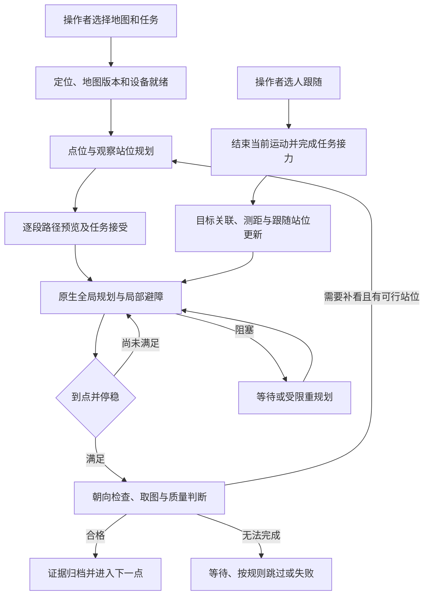

# LingTu 巡检任务与运动规划项目计划书

版本：0.1｜日期：2026-09-19｜状态：实施与验收目标草案。

**项目主线：让机器人理解要查看哪些点位，规划路线，可靠地行走、避障、到点查看，
并在明确指定目标后完成跟随。** 检测、深度测距、多模态复核和语音为这条任务链提供信息。

本文依据当前源码制定计划，包含尚未开发和尚未实机验证的能力。下文新增数值均为
拟定验收目标，不代表当前性能。现有工作区还有未提交修改，不能把源码状态视为已安装版本。
Go2/NX 用于当前调试；S100P/RDK X5 的设备组合、模型和性能需要单独验收。

## 1. 做成什么

操作者选择地图和巡检点，预览路线后开始任务。机器人依次前往各点，根据通行情况
减速、绕行或等待；到点后调整观察朝向，停稳并取得合格画面，再继续下一点。
需要跟人时，操作者在画面中明确选人，机器人保持距离并通过原生导航持续跟随。
操作界面能说明当前在做什么、为何停下、接下来如何处理。

“完成巡检”必须同时满足：必检点按规则完成、观察证据合格、任务结果可追溯、终止后停稳。
只走到一个坐标、保存一张图片，或页面显示成功，均不能单独代表任务完成。

| 目标 | 交付能力 | 验收入口 |
| --- | --- | --- |
| G1 任务与路线规划 | 点位选择、固定顺序执行、逐段预览；再增加允许重排点位的路线优化 | T1、T2、T3 |
| G2 运动规划与恢复 | 全局路线、局部避障、减速停车、受限重规划与明确失败原因 | M1—M5 |
| G3 到点查看 | 区分被查看对象与机器人站位，满足观察方向、距离、可见性及证据要求 | V1—V3 |
| G4 目标跟随 | 选定身份、持续定位、保持距离、动态绕障、丢失处理 | F1—F3 |
| G5 易用操作 | 巡检、查看、跟随共用清楚的任务状态；暂停、继续、取消含义一致 | U1、U2 |
| G6 可复现实证 | 同一任务的图像、位姿、路径、命令和结果能关联、录制和回放 | R1、R2、P1—P3 |

### 首期运行范围

- 已建图、已核对地面支撑及定位的同一楼层办公室、厂房或走廊。
- 具备有效标定的 RGB-D、LiDAR、里程计和原生运动链路。
- 巡检对象先选固定设备、柜体、标记区域；首个观察动作使用已有 `capture:overview`。
- 跟随对象由操作者明确选定，先验证单人，再验证多人交叉及遮挡。
- 0.50 m/s 是用户期望的巡航速度上限；接近目标、转弯、拥堵时允许主动降速。
- 没有互联网时，使用已安装端侧模型完成本地感知和导航；云复核显示不可用并按任务策略处理。

楼梯、多楼层、自动寻找任意人物、无人值守长时运行暂不作为首期交付。
三维地图、三维目标数据结构本身不能证明机器人具备上下楼梯能力。

## 2. 当前基础与缺口

| 领域 | 已有基础 | 本项目还要完成 |
| --- | --- | --- |
| 巡检任务 | C++ 路线、点序、循环、失败策略、点位 action；路线绑定地图 ID 与内容版本 | 以完整 Product 验证路线执行、暂停恢复、异常和取证闭环 |
| 点位来源 | 语义 places 使用 mapd POI；巡检页面仍读取另一套 `/locations` 并复制坐标 | 统一为地图绑定的点位身份，消除同名点位置漂移，发布路线时冻结快照 |
| 点位参数 | `Point` 包含 map 坐标 xyz、可选 yaw、容差、停留与 action | 明确对象位置、观察站位、视野和质量要求，避免把对象中心当成站位 |
| 运动执行 | 巡检复用已有单目标全局规划、局部规划和最终运动仲裁 | 量化启动停顿、动态障碍响应、阻塞恢复和终点稳定性 |
| 到点取证 | 停稳检查、证据请求/回复、图片保存、任务报告 | 补观察质量与分析结果；不把 `unavailable` 当作通过 |
| 视觉跟随 | RGB-D 投影、目标 ID、跟随目标刷新、丢失取消、原生任务反馈 | 实际检测/ReID 装配、校准验证、跨定位修正的一致性及多人实测 |
| 模式协作 | inspection 的 Host 装配可包含语义感知和 VisualServo；tracking 也有专用声明 | 核验实际运行图；完成巡检与跟随的互斥接力，不能仅凭模块存在声称已串通 |
| Web | 点位表单、任务操作、取证图和报告；另有单目标预览能力 | 地图上编辑观察站位、逐段预览、分层展示及当前阻塞原因 |
| 仿真验收 | inspection 有路线/图片/录制的组件契约；RGB-D 跟随有颜色目标场景 | 扩展完整生命周期与故障场景；另验真实人员模型，不能用衣服颜色替代 |

现有巡检点默认位置容差为 **0.35 m**，朝向容差为 **0.35 rad（约 20°）**，停留默认 0。
这些是代码默认值，不是统一验收指标，更不是相机一定能看清对象的保证。

优先解决的实际风险是：同名点位不一致、规划存在但控制未执行、动态障碍响应不明、
点位到了但没有看清、跟随目标身份或坐标跳变。它们分别由下面的工作包和验收项覆盖。

## 3. 一条明确的工作流程



上图是业务流程，不新增另一套通用状态机。巡检状态落在现有原生巡检执行器，
跟随状态落在现有 VisualServo，运动状态以原生导航反馈为准。

### 3.1 点位与路线怎么规划

**先把固定路线走可靠，再优化路线顺序。** 首个交付是三点巡检：每个点有明确站位、
朝向和查看动作，每段都预览。首先统一当前两套点位来源：以 mapd POI 为权威，
UI、语义名称与路线引用同一稳定点位身份。处理现有 locations 时明确其地图归属和重名冲突，
不能静默把未绑定点位挂到当前地图。

编辑时引用同一来源，发布路线时冻结所选点位坐标、朝向、路线修订号和地图版本。
点位或地图更新后标为需要重新预览/发布，不在任务执行中悄悄替换站位。

观察对象的位置和机器人的站位分别存储。选择站位时，先满足地面支撑、机身净空、
可到达性、相机距离/视野要求，再比较通行代价、转向量和观察质量。
首期从人工确认站位与少量周边候选中选择，不建设任意空间视点搜索框架。

当点位允许自由排序时，再使用实际可达路径长度与预计查看时间优化顺序；有先后关系的
点位必须保留约束。首版复用现有路径查询和简单启发式，只有基准证明不足才引入新求解器。
硬性不可通行条件不能被一个“综合得分”抵消。

### 3.2 机器人怎么走、怎么脱困

- 全局规划负责到观察站位的路径；局部规划根据实时障碍和地形决定当下可执行运动。
- 动态障碍检测、清除与地图静态结构分开；未知地面不能仅因画面好看就标成可通行。
- 临时横穿优先减速或等待；确认原路堵塞时，从实际当前位姿重新查询绕行路径。
- 脱困动作必须经过与正常运动相同的可通行与碰撞检查。存在几何路径不等于当前可执行。
- 为每次等待或重试记录原因和持续时间；重试有界，不能重复报错、无限旋转或反复触发。
- 将停顿拆成任务接受、规划、转向、控制门控、加速、真实起步六段计时，定位瓶颈后再调参。

需要改进的重点是“什么情况下该走、该等、该重新规划”，不能把所有卡顿归因于加速度。

### 3.3 到点后怎么确认“看到了”

到点判断包含位置、必要朝向及新鲜里程计证明的停稳。此后才取与本次点位 action
关联的图像，检查对象是否进入视野、遮挡情况与图像质量。

质量不足时，先补拍；仍不足且存在已验证观察站位时，再做一次有界的站位调整。
首期默认最多补拍 2 次、调整站位 1 次；具体点位可按检查动作配置。
这些是拟定策略，尚未表示现有字段已经支持。

“已拍照”“图像质量合格”“检查结果正常/异常/无法判断”分别显示。
必检项无法判断时不能汇总成全部完成；可选项按明确策略标为跳过或待复核。

### 3.4 怎么跟随与接回巡检

操作者点选目标后，先建立身份关联，再使用有效 RGB-D 和对应时刻位姿恢复空间位置。
初始跟随距离采用现有 1.5 m 基线，在相机视场和停车距离验证后确定可用距离带。
只向原生导航提交可行地面的跟随站位，不向人体中心或悬空深度点发运动目标。

沿目标运动方向做短时预测，在保持身份与距离的前提下，比较前后、侧向候选跟随站位。
目标更新需要限频和滞回，避免每帧抖动触发重规划。人被遮挡或身份不确定时应停止跟随
运动并标明等待，不以最近的人替换原目标。

定位修正时不能把 map 坐标跳变当成人快速移动。优先在连续 odom 坐标中维护短时轨迹，
再按当前变换生成地图目标；若现有消息不足，先补明确的时间和坐标契约，再扩展行为。

任务接力按顺序处理：暂停巡检并保留点位进度 → 取消当前运动且收到终止反馈 →
接受跟随 → 跟随结束并停稳 → 显示“可继续巡检”。默认由操作者点击继续，
从当前真实位置重新规划到未完成点；不自动重放旧路径或已完成取证。
同一 Product 内复用已有模块，只有能力确实不足时才由 ProductControl 切换 Product。

### 3.5 模型和规则分别做什么

| 问题 | 负责方式 |
| --- | --- |
| 看见了什么、目标在哪里 | 端侧检测/跟踪、深度投影和定位变换 |
| 用户想查看哪些点、想跟谁 | 明确 UI 输入优先；语言模型可解析成受支持的任务意图 |
| 低置信度、类别冲突或复杂画面 | 异步多模态复核；保留原图时间和不确定状态 |
| 下一点、重试、等待、跳过与结束 | 现有任务状态及明确策略；模型不能自行改变已授权任务范围 |
| 当前速度、碰撞判定、停车 | 原生导航与驱动链路 |

巡检检测独立任务继续开发共享视觉与复核链路，作为支撑工作包并行推进。
运动期间持续消费最新相机帧，多个检测任务共享观测，避免各开一个取流和推理循环。
二维检测不因深度暂时缺失而全部停用；生成空间运动目标时则必须有有效深度和位姿。
云复核异步限频，结果保留原观测时间，过期结果仅进入历史证据；断网时必检复核项目按
有界等待/待复核策略处理，不能无限堵住运动链路，也不能算作检查通过。
详细模型迁移见[端侧融合方案](edge_follow_patrol_integration.md)，不把检测模块扩成第二套导航。

## 4. 技术创新点：要能做对照实验

以下是拟实现的工程创新，不宣称学术首创，也不把接入一个模型本身称为核心创新。

| 方向 | 相对简单基线的改进 | 如何证明有用 |
| --- | --- | --- |
| 面向查看任务的点位规划 | 从“固定 xyz 到点”扩展为“观察对象—可达站位—视野质量”联合选择；复用真实路径代价 | 同一批对象比较固定站位与候选站位：首次合格取证率、补看次数、总任务耗时 |
| 任务进度驱动的分层恢复 | 将路段受阻、到点偏差和观察失败分开处理；可等待、绕行、补看或明确失败 | 固定重试与分类型恢复对比：完成率、无效重复动作、恢复耗时、碰撞/越界事件 |
| 身份连续的跟随站位规划 | 结合身份确认、连续坐标轨迹、预测和可行站位，不只追逐每帧目标坐标 | 关闭/启用预测与站位选择分别回放：距离误差、目标跳变、重规划频率、误跟次数 |
| 任务与运动结果一致的闭环 | 以原生到点、停稳和观测事实推进任务，支持巡检与跟随交接；UI 展示同一事实 | 注入延迟、取消和失联：检查是否错误成功、重复取证、旧目标复活或双源运动 |

对照实验冻结地图、场景、速度上限、输入记录和板卡；报告失败案例。
能力有效的判据是完成率或效率改善且安全门槛不退步，不能只展示更好看的路径截图。

## 5. 工程分工与实施顺序

| 工作包 | 主要改动位置与职责 | 完成产物 |
| --- | --- | --- |
| WP1 巡检与点位 | `src/nav/inspection/`、mapd 点位、既有 Gateway 和 InspectionWorkbench；统一点位来源并复用单目标预览 | 三点任务、发布快照、逐段预览、到点取证、任务时间线 |
| WP2 运动与恢复 | `src/nav/cpp/` 全局/局部规划、执行器与最终仲裁 | 启动延迟分解、动态避障、有限恢复、终止归零证据 |
| WP3 查看与感知 | `src/perception/`、检查证据桥、共享 runtime 消息、`src/decision/patrol/` 独立工作分支 | 共享观测、查看质量、证据结果与异步复核 |
| WP4 跟随与接力 | `src/decision/modules/visual_servo.py`、目标关联、已有任务/运动消息与 Host 装配 | 跟随站位更新、失目标处理、巡检暂停/恢复 |
| WP5 验收与操作 | `config/acceptance/`、`sim/`、相关测试、现有 Web | 固定场景集、可关联录制回放、平台验收报告和精简操作入口 |

C++ 继续拥有现场规划和运动热路径；Python 拥有 Host、语义和 API。
跨进程用已有 typed DDS，进程生命周期归 ProductControl，Host 装配归 Blueprint。
决策与感知通过共享消息协作，不互相导入私有实现。只有 `lingtu-driver` 向机器人
转发经过检查的命令。本计划不引入新依赖；若实测需要模型运行库或求解器，另行明确选择。
S100P 没有 CUDA，不能把 NX 上可运行的模型直接视为 S100P 可部署；板端模型格式、
运行库和可用权重需在 S0 单独核实。

### 里程碑与先后依赖

| 阶段 | 本阶段只承诺什么 | 退出条件 |
| --- | --- | --- |
| S0 固定基线 | 固定地图、路线、板卡/机器人配置与当前版本；核对点位双源冲突并记录现有问题 | 找得到每条路径对应的图像、位姿、命令和终点事实；不再凭页面判断通过 |
| S1 三点巡检贯通 | 固定三点路线、逐段预览、到点停稳、overview 取证、暂停/取消 | Windows 原生 MuJoCo 完成 T1、T2、V1、R1；Product 事务和终止归零单独通过 |
| S2 运动鲁棒性 | 静态堵路、动态横穿、定位/传感器中断、受限恢复 | 仿真 M1—M5 通过，硬件无运动故障检查通过，再进行监督下短路线运动 |
| S3 观察站位优化 | 明确对象与站位，检查朝向/可见性，质量不足补看 | 固定对象集通过 V1—V3，并完成第一项创新的对照实验 |
| S4 跟随与任务接力 | 真实模型选人、距离保持、遮挡/多人处理、恢复巡检 | F1—F3 与任务交接通过；颜色目标仿真单独标记 |
| S5 产品验收 | 实际板卡性能、断网运行、地图质量、Web 操作及录制回放 | 分平台完成下述目标；遗留项明示，不以仿真结果替代实机结论 |

WP3 当前的独立检测任务可与 S0/S1 并行，不阻塞 overview 基础巡检。
跟随可先离线开发，但现场运动依赖 S2 的通行与停车证据。
先按退出条件推进；完成 S0 后依据真实吞吐、模型可用性和现场配合时间给出日历排期。

## 6. 验收指标与测量方法

### 6.1 验收的共同规则

新增数值是本轮提出的目标。S0 可以依据基线和场地调整，但必须在正式验收前冻结，
不能测试失败后改阈值宣称通过。每项记为 PASS / FAIL / BLOCKED / NOT TESTED。
场景不在支持范围内应提前声明；范围内的失败不能从成功率分母中删除。

分清四层证据：本地契约测试、原生 MuJoCo、目标硬件无运动、现场监督运动。
Windows 与 Linux 原生仿真分别报告；NX、S100P 和 RDK X5 的结果不能互相借用。
完整 Product 验收还需同一 ProductControl 会话、RunPlan、生命周期、停止与清理证据。

### 6.2 任务、规划与观察

| 编号 | 拟定目标 | 如何测量、需要哪些样本 |
| --- | --- | --- |
| T1 完整任务 | 支持范围内任务完成率 ≥95%；必检点遗漏、错误报成功、重复执行均为 0 | 正式候选版本至少 20 次任务，覆盖 ≥3 条路线；每条含 ≥3 个点。完成要求运动和全部必检证据通过；前期先各跑 3 次用于找问题 |
| T2 任务控制 | 暂停、继续、取消、重复请求及跟随交接不串任务；取消后无旧目标复活 | 每类至少 5 次仿真注入；现场每类至少 1 次。核对任务/请求身份、最终命令、驱动确认和里程计 |
| T3 顺序优化 | 不违反点位顺序约束；可重排路线总长度不劣于固定顺序；在专门存在绕行冗余的基准中争取降低 ≥10% | 同图同点至少 10 组查询，使用实际可达路径长度；没有优化空间的路线单独报告，不能强求改善 |
| M1 可执行路径 | 路径满足已知地形/机身约束；不可达返回明确原因；无穿墙、跨未知支撑或空中攀升 | 至少 10 个固定起终点对，包含窄道、转角、死胡同、地面空洞；用独立场景几何复核路径 |
| M2 动态避障 | 规定场景中无接触；能够减速、停车或绕行，不因云调用失去响应 | 横穿、迎面、突然占据路段各至少 5 次仿真；监督实机先用软质障碍物验证，记录最近距离与停车距离 |
| M3 阻塞恢复 | 明确可绕行场景中 ≥9/10 次完成；不可绕行时有界结束或等待，不无限重试 | 同一堵路场景重复 10 次，另设完全封闭场景；首轮预算建议最多 2 次恢复尝试、30 s 后给出明确状态 |
| M4 起步延迟 | 在定位/控制许可有效、路径可行、无需等待障碍的场景，任务接受至实际起步 P95 ≤1.0 s | ≥30 次，额外记录规划、门控、转向和加速耗时；实际起步用有效里程计连续变化判定，原地转向与直行分别统计 |
| M5 停止与退化 | 感知/定位失效、人工停止、任务取消后按已冻结停车预算归零并停稳；不能只发布“停止中” | 各类断流/取消至少 5 次仿真与无运动注入，现场再测实际减速；预算方法见 6.4 |
| V1 到点与朝向 | 首期标准观察点：独立测量的位置误差 ≤0.20 m、朝向误差 ≤10°，且停稳后才取证 | 至少 30 次到点，记录 P95 与最大值；使用仿真真值或实测标记，不能用同一估计位姿自证精度。特殊点按镜头需求单列 |
| V2 看清对象 | 首次合格取证率 ≥90%，有界补看后 ≥95%；无法查看时不得报正常 | ≥30 次观察，含侧面、局部遮挡与差光照；预先标注对象应可见区域及质量标准，人工独立核验 |
| V3 检查结果 | 证据与任务/点位完全对应；截图、质量判断、业务结论分开，延迟结果不改写当前动作 | 回放正常、缺图、过期图、复核超时及无检测能力输入。具体缺陷识别另设标注集和 precision/recall 指标，不拿截图成功率替代 |

V1 比现有默认容差更严格，是拟定产品目标；若受硬件定位精度限制，要在 S0 说明并
调整观察站位与镜头距离，不能只把配置收紧后宣布精度提升。
T1 的 20 次是首轮产品验收样本，不足以证明长期无人值守可靠性。

### 6.3 跟随、性能、交互与记录

| 编号 | 拟定目标 | 如何测量、需要哪些样本 |
| --- | --- | --- |
| F1 跟随距离 | 预先指定的可跟随路段内，1.5 m 基线的绝对距离误差 P95 ≤0.40 m；不得进入冻结的最小安全距离 | ≥10 条各 ≥20 m 路线，含直线/转弯/停走；首期人物速度不超过已验证机器人跟随能力。测试前冻结统计路段；拥堵停车计入任务可用性并单列时长，不能事后剔除。所有路段的最小距离越界都计入 |
| F2 身份与丢失 | 多人交叉不静默换人；短时遮挡处理可解释，无法确认身份时停车等待 | ≥20 次身份挑战，包含相似服装、交叉、遮挡；目标身份人工标注，错误切换为 0。失目标取消时限在 S0 按总停车预算冻结 |
| F3 巡检接力 | 暂停巡检→跟随→停止→继续巡检全过程只有一个运动来源；已完成点不重做 | ≥10 次仿真、≥3 次现场监督交接；逐次查终止反馈、实际速度和恢复点位 |
| P1 路径响应 | 基准地图上 ≤50 m 的单段查询，预览 P95 ≤2.0 s；路线预览展示正在处理的段数 | ≥30 组查询，报告地图分辨率/体素数量、障碍密度、成功与失败耗时；NX/S100P 各自记录 |
| P2 观测与跟随新鲜度 | 本地 RGB 采集→可用检测 P95 ≤300 ms；有效目标观测→提交更新目标 P95 ≤500 ms | 每板卡 ≥10 min 同步录制，以预先固定频率、人工标注目标的采样时刻为分母，同时报告有效输出率、漏检/丢帧/超龄率；无输出记缺测，不得从报告消失。记录实际观测年龄和队列，超龄输入不生成运动目标 |
| P3 资源与连续运行 | 队列有界、无 OOM、无崩溃；感知高负载不使导航超出运行图声明周期 | S0 记录导航独立基线，并冻结各板卡 RSS 上限及稳态增长预算；CPU/RSS/加速器/DDS 量按 1 s 采样。先 30 min 集成，再 2 h 混合任务；热身 10 min 后用第 20—30 min 与最后 10 min 的 RSS 中位数差判断是否超预算，固定地图/任务及记录写盘条件 |
| U1 操作与状态 | 操作者在一个现场页完成选路线/选人、开始、暂停、继续、取消；不会把预览当运动 | 至少 5 个操作场景；新操作者无需终端完成任务。状态源为实际任务事实，检查 UI 无闪动、矛盾成功或遮挡主要视图 |
| U2 离线与断联 | 互联网断开不阻塞本地导航；控制端断联按任务策略执行，重连不重复发目标 | 分别断互联网、Web 连接、相机和定位。直接遥控失联停车；巡检默认暂停停车，只有显式配置离线自主任务才继续；断网复核显示待处理 |
| R1 证据关联 | 验收任务关联地图版本、产品会话、路线、点位、图像、路径、最终命令、里程计和终止事实 | 随机抽查 ≥10 次任务，身份/时间/坐标一致；跨设备时间误差也要记录。缺核心证据的任务不计通过 |
| R2 回放复现 | 回放能重现阻塞、取证、目标丢失和任务终止原因；不向实机发送命令 | ≥5 个固定成功/失败记录；需相机内外参、深度编码与单位、坐标变换。IMU/关节按各机器人消息录制，缺通道如实标缺失 |

P1/P2 是工程目标，不承诺当前板卡已达标。S0 若证明模型或硬件达不到，应调整模型、
频率或运行范围并更新计划；不要通过缓存旧结果伪装实时。

### 6.4 运动安全预算怎样确定

停车阈值必须通过真实链路测量，不能照抄一个“安全距离”。

记录障碍进入传感器有效区域到最终停车的完整时间：传感器采样、传输、局部规划、
最终仲裁、驱动接收与机械减速。用实测最差延迟、保守可用减速度、位姿/测距误差
建立停车距离预算，并用实际停止距离复核；运动障碍还要计入相对接近速度。

首轮以 `d ≈ v × 延迟 + v² / (2 × 减速度) + 不确定性余量` 做静态障碍预算初值，
它不是实机保证，也不代替动态横穿测试。开始 0.50 m/s 验收前，必须验证探测范围、
跟随最小距离与该速度的停车预算相容。现场速度逐级提高，保留当场停车能力。

已声明场景中的接触、未授权运动、错误身份切换、失效后继续用旧目标等为不通过项，
不能以更高平均完成率抵消。

## 7. 地图、定位与可视化前置要求

巡检不是重新实现一套 SLAM，但地图和定位质量直接决定任务能否成立。

### 7.1 建图到导航的实施前核对（2026-09-19）

以下保留开始修改前的审查基线；本次已实施内容和剩余验收见 7.6。

| 操作 | 当前源码实际行为 | 需要完成的产品流程 |
| --- | --- | --- |
| 开始建图 | Web 没有 Product 切换请求；session 接口只读，建图由 ProductControl 在机器人端启动 | 增加明显的“开始建图”入口，转交唯一的 ProductControl；展示启动中、首帧就绪或失败原因 |
| 边走边看已扫描区域 | 建图默认 `global`；“视图 → 整图”请求原生累计预览，“视图 → 全图”调整相机覆盖范围 | 把累计图与当前扫描的区别放在主操作区，缩短入口；给出配准拒绝、后台处理和缺数据状态 |
| 建完后预览 | “保存地图”等待保存操作真正完成后打开独立整图快照；也可从“已存地图”选择地图 | 明确显示保存结果和整图，支持检查后继续补扫；保存失败保留失败原因，不宣称已完成 |
| 使用保存地图导航 | MapView 的“选目标”只在后台已经是正确地图、定位就绪的导航会话时出现；点击它不启动导航 | 增加“使用此地图导航”，经 ProductControl 切换；定位和导航输入就绪后才开放目标执行 |

因此实施前缺的是从 Web 发起模式切换的完整操作链，而不是没有整图数据或没有 PCD 预览器。
`?observe=1` 还会隐藏控制和保存操作；它不能用作操作者控制页。
本轮浏览器桥不可用，本机旧 15052 端口也未发现监听，未核验当前实机页面版本。

模式切换是实际进程切换，不承诺按键后零耗时。按钮立即反馈已受理，后续以真实 readiness
确认完成；如果当前有未保存建图，必须提供保存再切换的路径，避免悄悄丢失本轮数据。
生命周期请求必须在 Host 重启后仍有结果可查；Web/Gateway 不另写启动顺序或重新解析 Product。
具体传输适配需落在 ProductControl 的生命周期边界，不能在将要重启的 Host 中挂一个无人管理的命令。

当前已有的机器人端入口如下。这是操作说明，本轮没有执行切换：

```bash
bash /opt/lingtu/current/scripts/lingtu --robot unitree/go2 --env real switch map
bash /opt/lingtu/current/scripts/lingtu --robot unitree/go2 --env real switch nav --map MAP_NAME
```

第二条命令须使用本次成功保存的地图名，并在实际定位成功后再选目标；保存/预览地图不会自行发起行走。

### 7.2 我们的图为什么不够干净，与已有项目差在哪里

不能用宣传截图比较算法精度。需要对同一份原始扫描、同一轨迹和相近显示采样做比较。
本轮核实了以下具体差距，而不只是“点太小、颜色不好看”：

| 原因 | 证据与界限 | 对应处理 |
| --- | --- | --- |
| 展示经过采样 | 在线后端默认 0.12 m 预览体素、最多 200000 点；Web 累计图请求最多 120000 点。它不是保存点云的原始密度 | 对照完整 PCD 与预览；允许查看密度调整，但不能把显示变密当成补到了真实地面 |
| 在线历史残影没有清除 | `OnlineMapping::snapshot` 累加历史帧再采样，没有多帧自由空间清理。2026-09-17 有同步射线支持的残影记录 | 用回放验证在线残影处理，保留墙面/地面；保存时已有的 prune 不等于在线预览已经清理 |
| 部分帧没有独立配准通过 | 既有 278 帧离线回放中 235 帧入图，43 帧配准拒绝；后者仍按前一锚点修正显示，不能称为全部优化 | 区分原始/待验证与校正几何，解决配准覆盖缺口；不能删除拒绝帧假装地图干净 |
| 地面缺失可能来自原始观测 | 需分开检查当前扫描、原始 patches、保存 PCD 与预览；当前画面不足以判断缺在哪一层 | 原始数据有点则修转换/采样；原始就没扫到则需要调整采集路线/视角或经标定融合传感器 |

外部参考中，[FAST_LIO_SLAM](https://github.com/gisbi-kim/FAST_LIO_SLAM) 将 Fast-LIO2
里程计与 Scan Context 闭环、GTSAM 位姿图后端分开，并用优化位姿重建地图；
[GLIM](https://github.com/koide3/glim) 提供多扫描配准优化及交互校正。
LingTu 已有自己的在线后端、累计重建与保存清理，但配准覆盖、实时处理性能、校正保存重载、
交互质量检查还未完成同等范围的实证。上述项目的存在也不证明它们在我们的这份数据上自动更好。

### 7.3 地图是否足够用于导航

**目前不能对整张地图作“已足够可靠”的结论。** 地图非空、PCD/OctoMap 齐全和
少量路线走通过，分别只证明有限条件；它们不证明整个场地及动态障碍场景可用。

- 同一任务锁定地图 ID 与内容版本，路线和点位同图；更新地图后重新核对可达性。
- 保存、加载、重定位后用独立标记核对位置与高度；检查地面支撑缺失、杂点残影和墙面厚度。
- 点云颜色说明高度；地形/可通行性、实时障碍、候选路径、实际执行路径分层显示。
  彩色点不能直接解释成障碍，静态绿色也不等于实时允许运动。
- 整图用于路线和覆盖查看，局部图用于当前避障；界面始终说明查看的是哪一种。
- RGB-D 外参、时间同步和投影误差要静止与运动分别验证；单次约 1 m 测距不能完成全部标定验收。

不满足这些条件时显示具体原因，保留查看/回放能力；不以隐藏坏点、放大容差或取消
运动检查来掩盖建图问题。地图后端工作继续按其已有计划推进，与本计划通过地图质量门槛衔接。

一次地图验收至少需要：保存产物完整 → 重载后定位正确 → 核对测试路段地面与障碍 →
代表性起终点路径预览 → 现场监督下走行与停车。只批准已核对的测试区域，
不因某条 2 m 路线通过就扩大到全场地或 0.50 m/s 动态避障。

### 7.4 导航时的局部避障和脱困

当前 `nav` Product 声明 OctoPlanner3D 全局规划、SCAN 局部规划、通行代价和原生最终
运动仲裁。执行器接实时障碍/碰撞图；陈旧或缺失的观测有明确阻止原因。
因此局部避障在导航链路中，不要求为了启用避障额外打开 Web 点云层。
但本轮没有实时传感器、最终命令或驱动证据，不能声称当前机器人实际避障已通过。
相机画面已显示也不证明深度点已接入原生避障。

脱困已有平移与旋转候选、机身碰撞检查、输入时效检查、里程计进度和有界重试。
`nav` 配置默认先平移再旋转、阻塞间隔 2 s、最多 3 次尝试，平移限速 0.15 m/s。
这是源码配置，不是本轮读取到的已部署调参。

脱困尚不能称为完善。既有 MuJoCo 4998 控制器记录显示低速侧移可能几乎不产生位移，
因此找到几何脱困路径仍可能无法执行；这是特定仿真控制器证据，不能直接认定 Go2 同样如此。
需要对窄道、墙边、动态堵路分别记录候选、选中动作、最终命令、实测进度和重试原因，
按 M2/M3/M5 验收；不能仅提高速度绕过碰撞与停车检查。

### 7.5 本轮验证与下一步优先级

本轮 Windows 本地针对性检查：地图操作/就绪判定与 PCD 整图范围采样 **21 项通过**，
Gateway 累计快照、会话隔离和新旧 revision **4 项通过**。
其中部分 Web 检查是源码契约检查，不是浏览器交互验收；这些结果不覆盖完整保存重载、
实机部署、动态避障或脱困。

按用户要求逐项推进：先补 Web 开始建图入口及可追踪的切换事务；接着验收累计整图和
保存后快照；然后补“用此地图导航”及定位状态；在同一份已核对地图上分别验收局部避障与脱困。
这批工作应排在三点巡检正式运动验收前，不能用继续堆叠语义功能代替基础流程交付。

### 7.6 本次实施计划与进度（2026-09-19）

本轮先把“开始建图 → 看累计图 → 保存并检查 → 加载定位 → 选目标”接通。
以下依次执行，每一项单独交付和验收；没有完成实机验收的项不能标成产品通过。
第 6 节仍是完整巡检的拟定指标，此表补充基础操作链的具体工作。

| 顺序 | 交付内容及位置 | 完成判据 | 当前进度 |
| --- | --- | --- | --- |
| A1 模式操作闭环 | 现场页“开始建图”、已存地图页“使用此地图导航”；独立 ProductControl 传输接入唯一生命周期入口 | 重复提交只执行一次；Host 重启后同一编号可查询；失败/中断不报成功；过期页面不切换新会话；观察页不发请求 | 本地实现及契约测试已完成，未安装到机器人 |
| A2 累计整图与保存预览 | 主工具栏直接进入累计地图和适应全图；继续使用保存完成后独立 PCD 预览；补地图新鲜度、处理状态及完整范围核对 | 走过两个区域都出现在整图；局部窗口离开区域不导致整图消失；保存失败不弹成功，保存快照对应本次版本；刷新可重开同一地图 | 显式入口已实现；真实扫描、保存产物与页面对照未验收 |
| A3 地图质量与定位 | 对照原始扫描、累计结果、保存 PCD、OctoMap；核对地面支撑、墙面残影、闭环结果；保存→重载→定位 | 回到独立标记核对误差；完成 M1 的 10 对路径预览；拒绝原因能指向缺支撑/障碍/定位，不以“地图非空”通过 | 待固定一份实测数据并输出逐阶段对照，缺失观测不能靠插值宣称已扫到 |
| A4 导航动态避障 | 验证传感器→局部障碍→SCAN→最终命令→驱动→实测速度；先回放和仿真，再现场软障碍 | 按 M2/M5：横穿、迎面、突然堵路、断流有可解释减速/停车/绕行；显示点云开关不改变避障是否工作 | 2026-09-21 正反两个方向的物理横穿组件场景通过：零接触、等待后恢复、到点并确认停车，输入就绪均 100%；新原生程序已部署 NX .36。迎面、突然堵路、断流组合与 Go2 0.50 m/s 实机运动仍待验收 |
| A5 脱困与失败反馈 | 核对候选方向、机身碰撞、执行能力、实测进度、重试与退出；失败返回具体原因 | 按 M3：可绕行场景 ≥9/10 次；封闭场景有界结束；候选存在但实际不动必须被识别 | 恢复预算和不可重试失败交接已部署；原生回归通过，恢复超时的仿真失败轮次确认清除路径并收到驱动停车确认。最终正反横穿均实际恢复到达。封闭场景与多次脱困成功率尚未完成 |
| A6 联合交付 | 安装到目标板卡；随行 Windows 网线直连；断互联网建图/查看/保存；再重复 A1–A5 | 每阶段记录版本、产品会话、地图版本、原始观测与终止事实；按 Go2/NX 与 S100P 分平台出报告 | NX 根文件系统已离线修复，.36 已安装并通过 map.camera 静止启动；保留地图、配置与 .35 回退版本。实机运动和 S100P 仍需分别验收 |

**本次已写入的第一批代码：**

- `src/lingtu/control_server.py` 提供环回 HTTP 服务和最近 32 个请求结果；
  `ProductControl.switch` 在原有事务锁下核对当前产品会话，然后调用原有 real/sim 切换。
  它不重新实现进程顺序、地图激活或回滚。
- `src/gateway/routes/product_control.py` 只转发请求；`lt-control.service` 独立于 Host。
  首次启用需要部署新版并配置固定机器人，详见 [操作说明](../../docs/operations.md#web-mapping-and-navigation-switches)。
- Web 增加开始建图、累计地图、适应全图和使用此地图导航；刷新/断线继续查原请求。
  保存地图和独立 PCD 预览复用已有实现。导航仍要求匹配地图、定位与运动许可，切换成功不发送目标。
- 加载导航地图前明确提醒先保存最新补扫；本批尚未实现“保存并切换”一键串联。
  若独立切换服务重启，未完成请求标记中断、不自动重放；如果 Host 无法恢复，须从机器人端查结果。

**验证边界：** 新增 13 项 Python 测试覆盖重复请求、Gateway 重建、服务重启、失败、
过期会话、记录写入失败、重复服务占用端口，以及固定 robot/env 的 CLI 调用。
3 项原有状态/CLI 测试因新增会话字段和 serve 动作更新后通过；其余已运行的相关检查未失败。
Web 地图/采样/切换共 26 项本地测试通过，含新增 5 项；其中 UI 入口是源码契约检查，
不是浏览器点击验收。TypeScript 和生产构建已通过，修改文件的 Ruff/ESLint 与架构边界检查已通过。
构建仍提示 Three.js 分包超过 500 kB；本批没有把包体积提示当成导航能力问题处理。
这次没有部署、没有切换实机模式，也没有发送任何实机运动目标。

**A4/A5 补充核对：当前避障输入与外部参考（2026-09-19）**

- 默认 `nav` 是 SCAN。`MotionLayer` 已有动态聚类、帧间匹配、速度估计和 1 s 匀速预测；
  复核发现旧的 `predicted_obstacles` 点列表被默认 SCAN 跳过。2026-09-20 本地修改改用独立的
  `PredictionView`：确认运动的点簇生成未来 1 s 扫掠体，复制进异步 SCAN 输入，同时用于
  搜索、样条碰撞、恢复候选和最终指令制动检查。测量占据图仍由 mapd 唯一管理。
- A4/A5 新增动态冲突处理：先等待 1 s，再请求绕行；连续 0.3 s 新鲜观测无冲突后解除等待；
  预测过期时保持停车，连续 10 s 无至少 0.1 m 实测位移或单次冲突持续 30 s 则终止，
  禁止借全局重规划重置该预算。
  该模型保守地避开预测扫掠范围，不是完整时空优化，不具备语义认人保证。
  `nav.camera` 仍只增加相机预览，不能视为已融合深度避障。
- 验收新增只读工具 `tools/diagnostics/navigation_motion_evidence.py`，记录动态决策、
  最终指令及输出序号、驱动 ACK、里程计；分别统计指令、确认、实测运动，禁止混作同一事实。
  新实现需完成本地回归、原生仿真和各板卡实机验收；尚不能承诺实机 0.50 m/s 动态避障通过。
- 脱困已搜索平移方向及正反旋转，按里程计核对进度；1.5 s/2.5 s 是无进展超时，
  不是整个恢复阶段的总预算。A5 仍需验证全局退出预算及阻塞原因到 UI 的一致性。
- 本轮复核官方来源：[SCAN-Planner](https://github.com/wuyi2121/SCAN-Planner) 是已有移植；
  [Nav2 Collision Monitor](https://docs.nav2.org/rolling/configuration_and_development/configuration_guide/core_servers/collision_monitor/configuring_collision_monitor_node/)
  用于对照末端停车/减速及输入超时；[Nav2 恢复树](https://github.com/ros-navigation/navigation2/blob/main/nav2_bt_navigator/behavior_trees/navigate_to_pose_w_replanning_and_recovery.xml)
  用于对照等待、恢复与重规划次序；[STVL](https://github.com/SteveMacenski/spatio_temporal_voxel_layer)
  用于对照动态占据的时间与可见性处理。后三者是研究参考，尚未引入 LingTu，不能记作已移植功能。

### 7.7 静止实机与动态横穿复核（2026-09-20 夜间至 09-21）

用户休息期间仅对 Go2/NX 做连接、备份、构建、传感器和静止状态检查；没有发送实机目标、
遥控或运动租约。通过 ProductControl 加载旧地图和 `nav.camera` 后，系统报告定位就绪，
RGB/深度约 29 FPS。60 秒采样的 195 个导航状态均无非零最终命令，但旧版控制循环健康比例
仅 3.1%，不能把“进程已就绪”写成运动验收通过。定位还需现场独立核对朝向。

本轮确定并修改了五类问题：

1. 独立仿真未向 SCAN 传机身碰撞尺寸，且 Thunder 站立高度与全局支撑高度不符；
   统一显式几何配置并纠正组件场景支撑高度，不修改 Go2 外参。
2. 状态回调用墙钟清理传感器时钟的动态轨迹；半速仿真会被误清空。轨迹只随已接收扫描更新。
3. 每个小体素都要求多次空闲射线证据，稀疏扫描中几乎没有候选。改为物体聚类和连续运动确认，
   并跨帧累计该物体的空闲转占据证据；仍拒绝无空闲证据的墙面可见区域变化。
4. 自主 SCAN 必须有新鲜点云；避让后清空预测只允许重新规划，不能清除失败预算。
   需要里程计确认恢复移动，否则有界终止并返回恢复超时原因。
5. 物理仿真发现执行器归零并报超时后，外部目标仍活动；补上不可重试失败的明确终止信号，
   接入现有停车确认和终态发布事务。Windows/ARM 测试覆盖先停车确认、再清除目标、
   仅一次失败发布、旧任务失败不影响当前任务。修改后物理场景没有再次触发超时，
   该分支尚缺物理链路证据。

原生 Windows MuJoCo 的物理横穿场景，修改前发生行人接触且预测始终为零；稀疏聚类修复后，
触发等待与绕行请求、整场无行人接触，但部分轮次仍因起点附近占据而无法恢复到达。
最终横穿轮次恢复行走，距目标约 0.214 m，8517 个物理步骤无接触；
输入就绪比例 76.8%，终点朝向对齐未结束，完整验收依旧失败。
另一个行人停在路线上的诊断变体成功绕行，但同样未确认到达。
驱动在测试清理时确认归零，不等于目标到达或动态超时任务终止。
这是 Thunder 真值定位的组件场景，不覆盖 Fast-LIO2、Go2/NX 运动或 S100P。
没有通过全部判据，因此没有部署候选版本。

NX 的 ext4 错误计数已到 52。已下载 8 份地图及配置的完整压缩备份，约 368 MB；
文件系统修复需离线进行。USB 无线网卡仍没有可用接口，继续沿用笔记本网线链路。
本轮日志、地图备份和前后仿真录像保存在
`build/go2-night-validation-20260920/`，该目录不作为可公开发布的资料。

### 7.8 仿真修复与 NX 安装结果（2026-09-21）

这是上一节失败记录之后的继续处理结果，原失败记录保留用于对照。

- 独立组件测试现在与正式导航一致，关闭 Mapd 的扩展展示层构建，保持实时碰撞层。
  之前的输入就绪比例 76.8% 提升到两个最终横穿场景均 100%。
- 自由空间射线更新默认由 160 条 / 0.33 s 调整为最多 512 条 / 0.10 s，
  保留连续运动、跨帧空闲证据和墙面保护。修复 Unix 时间戳精度导致的漏更新。
  用复用数组去重射线格，减少哈希节点分配和聚类的重复查询。
- 到点验收现在等待导航自己的停车确认；不能以清理阶段的驱动停止代替到点终态。
- Thunder 真值定位、合成地面支撑、实际射线雷达的 MuJoCo 组件测试中，
  左向右横穿的 3823 个物理步骤、右向左横穿的 3858 个物理步骤均无实体接触；
  两轮均恢复行走、确认到达并停车，平面终点误差分别约 0.188 m 和 0.214 m。
  这不是 Fast-LIO2 或 Go2 实机运动证明，也不是完整行人避障基准。
- NX 在根分区挂载前运行一次 `e2fsck -f -p`，修复后状态为 `clean`，
  自动恢复原启动配置并成功启动。保留原地图、机器标定和配置备份。
- 通过现有版本安装器安装 `v2.3.0-go2.20260921.36`，包含新原生导航程序；
  其余运行组件继承 `.35`。通过 ProductControl 启动 `map.camera`，
  本次未发送实机目标、遥控输入或运动租约。导航 Product 的 100 Hz 与现场制动距离仍须单独验收。

原始结果位于 `build/go2-repair-20260921/`。170 项 Python 验收测试及 ARM 原生的
运动层、输入投影、配置、自动导航控制和目标终止协调测试通过。
`native_dds_sensors.py` 的 11 项 Ruff 既有诊断与 HEAD 相同；本次修改没有新增诊断。

### 7.9 预测扫掠覆盖起点的时间语义修复（2026-09-21）

- SCAN 样条验收、细化验收、执行前瞻和最终制动按相同时刻比较机器人与预测障碍，
  纳入观测年龄及反应/减速时间；低速起点使用实际机身朝向。实测占据图和安全尺寸保持不变。
  几何搜索仍用保守扫掠体，不是完整时空优化。当前安全包络确实重叠时仍保持停车。
- 失败快照补全预测时刻、预测体和机身半径。新版捕获到的一次起点阻塞中，当前圆柱中心距离
  0.752 m，小于 0.768 m 合并半径；该阻塞不能按未来扫掠误判放行。
- Windows 原生 SCAN 79 项、Executor 101 项通过；NX ARM 的 SCAN 79 项和
  Executor Dynamic/Scan 48 项通过，输入投影及状态输出测试均通过。
- 正向物理横穿组件验收通过：3566 步零实体接触、等待后恢复、到达并确认停车。
  反向运动达到目标且零接触，但首轮终止握手失败；修复仿真适配器的在途命令取消处理后，
  128 项 Python 回归通过。随后两次完整复测因本机控制循环超时未进入运动，完整反向验收保留待验证。
- `.37` 已经通过原安装器及 ProductControl 安装到 NX 的 `map.camera`；
  已核对运行进程指向新版。无实机运动目标、遥控输入或运动租约。
  约 20 秒静止采样中，40/40 次控制循环健康、SLAM 跟踪且地图就绪，新增点云 180 帧；
  最终命令全零。这是建图模式的 20 Hz 静止证据，不是导航 100 Hz 或实机运动证据。
  证据位于 `build/go2-timed-prediction-20260921/`。不据此宣布 Go2 实机动态避障或导航 Product 完整通过。

## 8. 交付物与开始执行的顺序

最终交付：一套可编辑和预览的巡检路线、原生运动与恢复行为、观察站位及证据闭环、
明确选人的跟随能力、精简现场操作页，以及按平台分开的验收记录与问题清单。

下一轮具体从以下工作开始：

1. 固定一份地图和三个对象，登记观察站位/朝向；核对并统一点位来源，记录当前巡检 Product 实际装配与模型能力。
2. 用现有单目标路径查询串成路线预览，在现有 InspectionWorkbench 上显示当前段和三点进度。
3. 跑通原生 MuJoCo 的“到点—停稳—拍照—下一点”，同时记录启动延迟分段数据。
4. 加入堵路、动态横穿、取消和数据中断场景，确认恢复与停止事实。
5. 独立检测任务提供共享观测及复核结果后，接入查看质量；再进入真实人员跟随与接力验收。

本节定义计划目标；已实施的工作和验证边界见第 7 节，不以尚未完成的测试宣布功能成熟。

## 9. 源码与验收依据

- [原生巡检说明](../../src/nav/inspection/README.md)、[Point/Route 定义](../../src/nav/inspection/inspection.hpp)、[执行状态机](../../src/nav/inspection/inspection.cpp)。
- [inspection Product](../../config/runtime_graph/products/inspection.yaml)、[tracking Product](../../config/runtime_graph/products/tracking.yaml)、[Host 组成](../../src/lingtu/assembly/stacks/composition.py)。
- [VisualServo](../../src/decision/modules/visual_servo.py)、[人员目标处理](../../src/decision/vision/person.py)、[RGB-D 时间与坐标处理](../../src/perception/frames.py)。
- [检查证据桥](../../src/perception/inspection/bridge_module.py)、[证据动作契约](../../src/runtime/contracts/inspection_evidence.py)。
- [巡检界面](../../web/src/components/InspectionWorkbench.tsx)、[现有地图/路径 API](../../src/gateway/maps/routes.py)。
- [mapd 点位入口](../../src/gateway/maps/places.py)、[另一套 locations 入口](../../src/gateway/maps/locations.py)、[路线提交](../../src/gateway/routes/inspection.py)。
- [巡检仿真验收范围](../../config/acceptance/mujoco/inspection.json)、[RGB-D 跟随场景](../../config/acceptance/mujoco/rgbd_follow.json)、[跟随仿真检测器](../../sim/scripts/mujoco/rgbd_follow_worker.py)。
- [验证层级](../../docs/testing.md)、[当前路线图](../../docs/roadmap.md)、[全局建图后端计划](../../src/localization/opt/NEXT_STEPS.md)。
