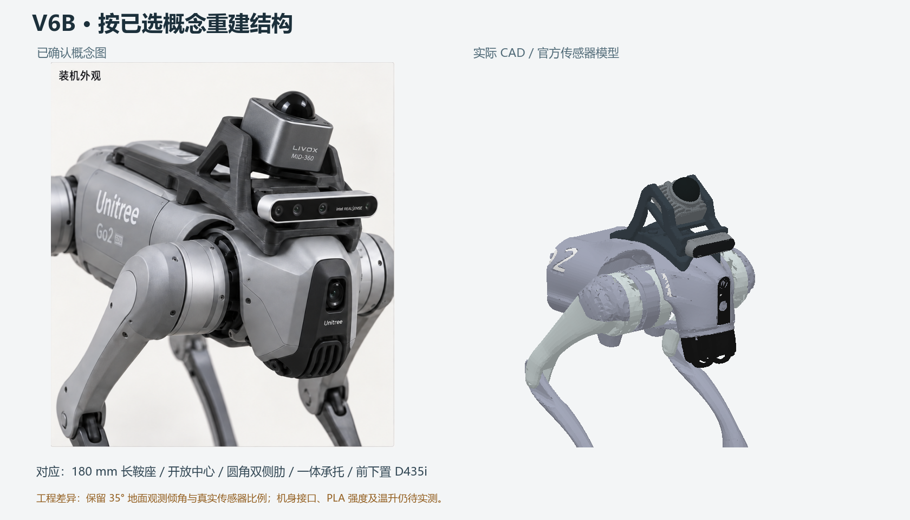

# Go2 EDU · V6B 按概念重建的全 PLA 双传感器支架原型

本版落实已选概念布局：180 mm 长曲面双鞍座、开放中心、连续圆角侧肋、78×88×8 mm 一体雷达承托面和下置 D435i。所有自制结构件均使用 PLA，包括配合垫及承压垫片；标准螺钉仍是采购紧固件，不是打印件。取消 V5 的铝板、G10 垫柱及钢套筒。

[试打与贴合说明](PRINT_FIRST.md) · [Isaac MID-360 仿真调研](ISAAC_MID360.md)



本轮已取消旧版矩形大底板和开窗箱壁，主体按概念重新生成，而非只更换材料。概念图没有尺寸约束；真实传感器比例、35°雷达倾角、官方安装孔位优先保留，因此不是像素级复刻。长鞍座新增向后伸出的支撑面积，但没有虚构额外的机身固定孔。后端是否占用实机扩展坞空间仍需实物确认。

## 孔位与官方模型

| 接口 | 实际传感器接口 | 支架设计 | 依据 |
|---|---|---|---|
| MID-360 底面 | 4×M3，48×36 mm | 四个 Ø3.4 通孔，一体承托厚 8 mm | 官方 STEP 与用户手册 |
| D435i 背面 | 2×M3，45 mm 孔距 | 两个名义 Ø3.6 通孔，后侧 Ø7.6 沉孔，剩余厚度 4 mm | 官方 D435i SolidWorks 实体及数据手册 |
| Go2 头部 | 两孔横向 58.5 mm，暂定 M3 | Ø3.4 通孔，180 mm 曲面支撑轮廓 | 社区支架；不是官方安装认证 |

传感器外观采用官方 CAD 转换的网格，原始 STEP/SLDPRT 保留在本地，GitHub 版本提供官方获取链接与已配准网格，见 `reference/README.md`。显示网格按 0.25 mm 网格量化以控制机器内存，单顶点最大位移约 0.217 mm；它不用于提取精密孔径。精确孔位和坐标转换另存 `reference/mount_interfaces.json`，D435i 圆柱面数据存 `reference/d435i_cylinders_m.json`。MID-360 的原始 Y 为高度方向、连接器朝原始 +X，已转换到雷达连接器朝 −X 的坐标。

MID-360 官方手册限制螺钉入设备不超过 5 mm；8 mm 板配 M3×12 的名义入深为 4 mm，使用垫片时重新计算。D435i 背部入深不超过 3 mm；4 mm 夹持厚度配 M3×6 名义入深 2 mm。实际打印厚度、螺钉头型与沉孔必须试配。雷达四颗 M3 螺钉从主架开放中心的下方穿过一体承托面安装；先安装雷达、再将整架固定到机身，避免机身阻挡工具入口。已取消分体托板及其六个 M4 连接点。机身螺钉长度不能在缺少实机螺纹深度时指定。

## 文件与打印

- `print/head_hole_gauge.stl`：2 mm 薄孔距试片，先验证机身 58.5 mm 孔距；它不检验曲面或承载能力。
- `print/pla_cradle.stl`：主架，已侧放，让主要 XZ 承力路径尽量处于层内。
- `print/left_pad.stl`、`right_pad.stl`：刚性曲面配合垫，按实际贴合修配；曲面下表面需要支撑。
- `print/load_washer_left.stl`、`load_washer_right.stl`：Ø14、厚3 mm PLA 承压垫片。
- `cad/`：毫米单位装配坐标 STL、孔位 DXF 与生成的 OpenSCAD 装配。
- `web/public/assets/robots/go2/urdf/go2_mid360_ground_mount.urdf`：独立整机 URDF；视觉使用官方传感器形状，碰撞和惯量使用简化包络。

切片起点：0.4 mm 喷嘴、0.16–0.20 mm 层高、6–8 道壁、8 层顶底、50–60% 填充，孔周、侧肋根部及相机根部局部实心。按耗材厂商配置保证层间结合，曲面和侧放件需要支撑。隐式主架网格分辨率 0.8 mm，不等于孔加工精度；打印后用实际螺钉试配、必要时修孔，不能强拧撑裂 PLA。

## 安装和强度的实际边界

Go2 的孔位 X/Z 注册仍为模型假设 `[0.19,0,0.101] m`，头壳轮廓来自仓库网格，尚未测得实机硬承载面、螺纹深度或壳体承载能力。曲面配合预留 2 mm 修配量，数字模型没有接触，不可称为已经贴合或保证可直接安装。必须先用小样确认孔距与曲面，再定稿打印。刚性 PLA 配合垫不能像橡胶自动填平误差。

全 PLA 取消金属限压套后，螺钉预紧力会直接压在塑料上；存在压溃、蠕变及松动风险。本版通过厚壁、圆角和长支撑改善承力路径，但没有实测层间强度、有限元或动态疲劳证据，不能给出安全承载公斤数。应先做静态配合、拉扭载荷与低速振动试验，再决定能否用于运动。

MID-360 官方手册推荐金属散热安装面；全 PLA 不满足该推荐。8 mm PLA 承托板不是散热板。长时间温升及热蠕变必须实际测量，当前只交付全 PLA 结构原型，不宣称适合连续户外运行。

雷达目标前倾35°，D435i 前倾10°、位于前下方。检查新增几何与最低 −7° 扫描锥、前方0.5–2 m地面采样及相机视场。相机 USB 线需约束在检查的预留体积内；雷达线缆走向仍需实物验证。35°前倾会改变后方/上方覆盖。URDF 相机光学帧使用厂商名义左目位置（相对背面中心 `[20.75,17.5,0] mm`），不替代设备标定；原有实机 RobotConfig、SLAM 外参均未修改。

## 重新生成

在已有 numpy/scipy/scikit-image 的 Python 环境运行：

```powershell
$env:OMP_NUM_THREADS='1'
$env:OPENBLAS_NUM_THREADS='1'
C:/Users/99563/miniconda3/python.exe tools/robot/go2_mid360_ground_mount/generate.py
C:/Users/99563/miniconda3/python.exe tools/robot/go2_mid360_ground_mount/test_design.py
C:/Users/99563/miniconda3/python.exe tools/robot/go2_mid360_ground_mount/preview.py
C:/Users/99563/miniconda3/python.exe tools/robot/go2_mid360_ground_mount/scan_preview.py
```

串行运行避免内存高峰；预览为离线渲染，无常驻浏览器或渲染服务。`design_values.json` 的质量按实心 PLA 1240 kg/m³估算，传感器质量假设另计；不等同实际切片重量。

## 来源

- [Livox 官方下载页](https://www.livoxtech.com/mid-360/downloads)，MID-360 3D Model（2023-01-10）及用户手册。
- [RealSense 官方 CAD](https://dev.realsenseai.com/docs/cad-files/)，D400 包中的 D435i_Solid.SLDPRT。
- [RealSense D400 数据手册](https://www.realsenseai.com/wp-content/uploads/2023/03/Intel-RealSense-D400-Series-Datasheet-March-2023.pdf)，D435/D435i housing drawing。
- [RealSense 名义相机坐标](https://github.com/realsenseai/realsense-ros/blob/ros2-development/realsense2_description/urdf/_d435.urdf.xacro)。
- [Go2 社区支架](https://github.com/AlanZhu2006/Go2-Jetson-MID360-Mount)，58.5 mm 为模型孔中心距，55.10 mm 不是孔中心距。

官方 CAD 及衍生传感器形状的权利属于各厂商；本地用于配合验证，未确认再分发许可，不将其视为本仓库原创或已获开源授权。

## 本轮本地验证结果

13 项几何测试通过，ruff 通过。覆盖原机 URDF 保留、传感器孔位注册、通孔、网格闭合/绕序/单位、主架连通、打印朝向、扫描锥与视场。官方 D435i 显示网格最低扫描锥间隙 10.52 mm，USB 预留体 9.92 mm；显示量化误差尚未从此数值扣除。机身表面采样最小间隙约 0.34 mm，这证明采样点未穿入，不证明实际接触稳定。未包含全部螺钉头、工具和最终线缆的完整干涉仿真。

支架实心质量估算 362 g；含传感器的重力俯仰力矩约 0.208 N·m。这是载荷需求，不是强度或安全系数。SolidWorks 转换实例均已退出，未留下渲染服务。
